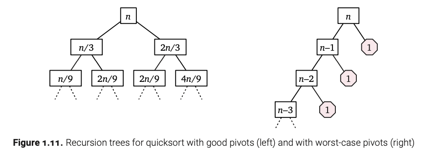

# 1. 递归问题

## 1.1 规约和规约

规约是设计算法中使用的最常见技术。将一个问题 $X$ 规约为另一个问题 $Y$ 意味着编写一个用于 $X$ 的算法，该算法将用于 $Y$ 的算法作为一个黑箱或子程序来使用。关键是，所得算法的正确性不能以任何方式依赖于 $Y$ 的算法是如何工作的。我们唯一能假设的是黑箱能正确解决 $Y$ 问题。黑箱的内部工作完全不关我们的事；那是别人的问题。通常最好直接把黑箱看作是纯粹通过魔法运作的。

例如，前一章描述的农夫乘法算法将两个任意正整数相乘的问题规约为三个更简单的问题：加法、平分（取半）和奇偶校验。该算法依赖于支持这三个操作的抽象“正整数”数据类型，但乘法算法的正确性不依赖于这些操作的具体数据表示（计数标记、泥板、巴比伦六十进制、结绳、算筹、罗马数字、手指位置、奥格里姆石、戈巴数字、二进制、负二进制、格雷码、平衡三进制、黄金分割数、虚四进制……）或这些操作的具体实现方式。当然，乘法算法的运行时间取决于加法、平分和奇偶操作的运行时间，但这是与正确性无关的单独问题。最重要的是，我们可以通过切换到更高效的数表示（例如，从计数标记到位值符号）来创建一个更高效的乘法算法。

类似地，亨廷顿-希尔算法将国会分配问题规约为维护一个支持插入和最大值提取操作的优先队列的问题。抽象数据类型“优先队列”是一个黑箱；分配算法的正确性不依赖于任何特定的优先队列数据结构。当然，分配算法的运行时间取决于插入和最大值提取算法的运行时间，但这是与算法正确性无关的单独问题。规约的妙处在于我们可以通过简单替换一个新的优先队列数据结构来创建一个更高效的分配算法。此外，该数据结构的设计者不需要知道或关心它将用于分配国会席位。

在设计算法时，我们可能不知道所使用的基本构件是如何实现的，或者我们的算法将如何被用作构件来解决更大的问题。对于许多初学者来说，这种无知令人不安，但它既不可避免又非常有用。即使你确切知道你的组件是如何工作的，假装你不知道通常也非常有帮助。

### 1.2 简化和委托

递归是一种特别强大的简化方式，可以粗略地描述如下：

-   如果问题的给定实例可以直接解决，则直接解决它。
-   否则，将其简化为一个或多个相同问题的更简单实例。

如果自我引用让你感到困惑，可以想象有人会去解决这些更简单的问题，就像你会假设其他类型的简化一样。我喜欢称那个人为递归仙子。你唯一的任务是简化原始问题，或者当简化不必要或不可能时直接解决它；递归仙子将为你解决所有更简单的子问题，使用的方法与你无关。

数学上更复杂的读者可能会以更正式的名称来认识递归仙子：归纳假设。

为了使任何递归方法正确工作，必须满足一个轻微的技术条件：不能有无限序列的简化到越来越简单的实例。最终，递归简化必须导致可以通过其他方法解决的基本情况；否则，递归算法将永远循环。满足这一条件的最常见方法是简化为一个或多个更小的相同问题的实例。例如，如果原始输入是有 $n$ 个 glurps 的 skreeble，那么每次递归调用的输入应该是有严格小于 n 个 glurps 的 skreeble。当然，如果 skreeble 根本没有 glurps，这是不可能的——你不能有负的 glurps；那样会很愚蠢！——所以在这种情况下，我们必须用其他方法 grindlebloff 这个 skreeble。

我们已经在农民乘法算法中看到过这种模式的一个例子，它直接基于以下递归公式。

$$
x \cdot y = \begin{cases}
0 & \text{如果 } x = 0 \\
\lfloor x/2 \rfloor \cdot (y + y) & \text{如果 } x \text{ 是偶数} \\
\lfloor x/2 \rfloor \cdot (y + y) + y & \text{如果 } x \text{ 是奇数}
\end{cases}
$$

同样的递归可以用算法如下表示：

```         
PeasantMultiply(x, y):
  if x = 0
    return 0
  else
    x' ← ⌊x/2⌋
    y' ← y + y
    prod ← PeasantMultiply(x', y')  ⟪Recurse!⟫
    if x is odd
      prod ← prod + y
    return prod
```

一个懒惰的埃及抄写员可以通过计算 $x'$ 和 $y'$，要求一个更低级的抄写员去乘 $x'$ 和 $y'$，然后可能加上 $y$ 来执行这个算法。低级抄写员的问题更简单，因为 $x' < x$，并且反复减少一个正整数最终会归零。实际上低级抄写员如何计算 $x' \cdot y'$ 并不是高级抄写员的事（也不是你的事）。

### 1.3 河内塔

河内塔谜题首次作为实际的物理谜题，由法国教师和娱乐数学家爱德华·卢卡斯于1883年发表，使用笔名“N. Claus (de Siam)”（“Lucas d’Amiens”的变位词）。第二年，亨利·德·帕尔维尔用以下引人注目的故事描述了这个谜题：


> 在贝纳雷斯的大寺庙里……在标志着世界中心的圆顶下，有一个黄铜板，固定了三根钻石针，每根针高一肘，厚如蜜蜂的身体。在这些针之一上，在创世时，上帝放置了六十四个纯金圆盘，最大的圆盘放在黄铜板上，其余的圆盘越来越小，直到最上面的一个。这就是布拉马塔。昼夜不停地，祭司们根据布拉马不变的法律，将圆盘从一根钻石针移到另一根。这些法律要求当值祭司一次只能移动一个圆盘，并且他必须将圆盘放在没有更小圆盘的针上。当这六十四个圆盘从创世时上帝放置它们的针移到另一根针上时，塔、寺庙和婆罗门将化为尘土，随着雷声世界将消失。

当然，作为优秀的计算机科学家，我们读到这个故事的第一反应是将变量 $n$ 替换硬编码的常数64。由于大多数物理实例的谜题是用木头而不是钻石和黄金制成的，我将称这三个圆盘的可能位置为“钉子”而不是“针”。我们如何将 $n$ 个圆盘的塔从一个钉子移到另一个钉子，使用第三个备用钉子作为临时占位符，而不将圆盘放在更小的圆盘上？

正如N. Claus (de Siam)在附带谜题的小册子中指出的那样，解决这个谜题的秘诀是递归思维。不要试图一次解决整个谜题，让我们专注于移动最大的圆盘。我们不能一开始就移动它，因为所有其他圆盘都挡住了。所以首先我们必须将那 $n-1$ 个更小的圆盘移到备用钉子上。一旦完成，我们可以将最大的圆盘直接移到目的地。最后，要完成谜题，我们必须将那 $n-1$ 个更小的圆盘从备用钉子移到它们的目的地。


所以现在我们所要做的就是——

**不要！停！**

就是这样！我们完成了！我们成功地将 $n$ 个圆盘的河内塔问题简化为两个 $(n-1)$ 个圆盘的河内塔问题，我们可以高兴地交给递归仙子——或者进一步用卢卡斯的比喻，交给寺庙里的低级僧侣。我们的工作完成了。如果我们不信任这些低级僧侣，我们就不会雇用他们；让他们安静地做他们的工作。

我们的简化确实有一个微妙但极其重要的假设：**存在一个最大的圆盘**。我们的递归算法适用于任何正数的圆盘数量，但在 $n = 0$ 时会崩溃。我们必须用不同的方法处理这种情况。幸运的是，贝纳雷斯的僧侣，作为好的佛教徒，非常擅长在毫不费力的情况下，将零个圆盘从一个钉子移到另一个钉子上。


可能会诱使人们去思考那些更小的圆盘如何移动——或者更一般地说，当递归展开时会发生什么——但实际上，不要这么做。对于大多数递归算法，展开递归既不必要也无益。我们唯一的任务是将我们给定的问题实例简化为一个或多个更简单的实例，或者在无法简化时直接解决问题。我们的递归河内塔算法在 $n = 0$ 时是微不足道的正确。对于任何 $n \geq 1$，递归仙子正确地移动了前 $n-1$ 个圆盘（更正式地说，归纳假设意味着我们的递归算法正确地移动了前 $n-1$ 个圆盘），所以我们的算法是正确的。

递归河内算法用伪代码表示如下图1.4。该算法将 $n$ 个圆盘从源钉（src）移动到目标钉（dst），使用第三个临时钉（tmp）作为占位符。注意，当 $n = 0$ 时，算法什么也不做。

```         
Hanoi(n, src, dst, tmp):
  if n > 0
    Hanoi(n-1, src, tmp, dst) ⟪Recurse!⟫
    move disk n from src to dst
    Hanoi(n-1, tmp, dst, src) ⟪Recurse!⟫
```

让 $T(n)$ 表示转移 $n$ 个圆盘所需的移动次数——即我们算法的运行时间。我们的空基情况意味着 $T(0) = 0$，更一般的递归算法意味着 $T(n) = 2T(n-1) + 1$ 对于任何 $n \geq 1$ 。通过写出 $T(n)$ 的前几个值，我们可以很容易地猜测 $T(n) = 2^n - 1$；一个简单的归纳证明表明这个猜测是正确的。特别地，移动64个圆盘需要 $2^{64} - 1 = 18,446,744,073,709,551,615$ 次单独的移动。因此，即使以每秒一次的惊人速度，贝纳雷斯的僧侣们在塔、寺庙和婆罗门化为尘土之前，将工作大约5850亿年（“plus de cinq milliards de siècles”），随着雷声世界将消失。

### 1.4 归并排序

归并排序是为通用存储程序计算机设计的最早算法之一。该算法由约翰·冯·诺依曼于1945年开发，并在1947年与赫尔曼·戈尔茨坦的出版物中详细描述，作为EDVAC的第一个非数值程序之一。

1.  将输入数组分成大小大致相等的两个子数组。
2.  递归地对每个子数组进行归并排序。
3.  将新排序的子数组合并成一个单一的排序数组。


第一步完全是简单的——只需将数组大小除以二——然后我们可以将第二步委托给递归仙子。所有实际工作都在最后的合并步骤中完成。下图给出了算法的完整描述；为了保持递归结构的清晰，我将合并步骤提取到一个独立的子程序中。合并算法也是递归的——先确定输出数组的第一个元素，然后递归地合并输入数组的其余部分。

```         
MergeSort(A[1..n]):
  if n > 1
    m ← ⌊n/2⌋
    MergeSort(A[1..m]) ⟪Recurse!⟫
    MergeSort(A[m+1..n]) ⟪Recurse!⟫
    Merge(A[1..n], m)
```

```         
Merge(A[1..n], m):
  i ← 1; j ← m + 1
  for k ← 1 to n
    if j > n
      B[k] ← A[i]; i ← i + 1
    else if i > m
      B[k] ← A[j]; j ← j + 1
    else if A[i] < A[j]
      B[k] ← A[i]; i ← i + 1
    else
      B[k] ← A[j]; j ← j + 1
  for k ← 1 to n
    A[k] ← B[k]
```

### 正确性

为了证明该算法是正确的，我们应用我们的老朋友归纳法两次，首先应用于合并子程序，然后应用于顶层的归并排序算法。

::: lem
#### 引理 1.1

合并正确地合并了子数组 $A[1..m]$ 和 $A[m+1..n]$，假设这些子数组在输入中是有序的。
:::

::: prf
**证明**：设 $A[1..n]$ 是任意数组，$m$ 是任何整数，使得子数组 $A[1..m]$ 和 $A[m+1..n]$ 是有序的。我们证明，对于所有 $k$ 从 0 到 $n$，主循环的最后 $n-k+1$ 次迭代正确地将 $A[1..m]$ 和 $A[m+1..n]$ 合并到 $B[k..n]$ 中。证明通过对 $n-k+1$ 进行归纳（剩余要合并的元素数量）进行。

如果 $k > n$，算法通过什么都不做正确地合并了两个空的子数组。这是归纳证明的基例。否则，主循环的第 $k$ 次迭代有四种情况需要考虑：

-   如果 $j > n$，则子数组 $A[j..n]$ 为空，因此 $\min(A[i..m] ∪ A[j..n]) = A[i]$。
-   如果 $i > m$，则子数组 $A[i..m]$ 为空，因此 $\min(A[i..m] ∪ A[j..n]) = A[j]$。
-   否则，如果 $A[i] < A[j]$，则 $\min(A[i..m] ∪ A[j..n]) = A[i]$。
-   否则，我们必须有 $A[i] \geq A[j]$，并且 $\min(A[i..m] ∪ A[j..n]) = A[j]$。

在所有四种情况下，$B[k]$ 被正确地赋值为 $A[i..m] ∪ A[j..n]$ 的最小元素。在两个情况下的赋值 $B[k] ← A[i]$，递归仙子正确地合并——对不起，我的意思是归纳假设意味着主循环的最后 $n-k$ 次迭代正确地将 $A[i+1..m]$ 和 $A[j..n]$ 合并到 $B[k+1..n]$ 中。同样，在其他两种情况下，递归仙子也正确地将子数组的其余部分合并。∎
:::

::: thm
#### 定理 1.2

归并排序正确地排序了任何输入数组 $A[1..n]$。
:::

::: prf
**证明**：我们通过对 $n$ 进行归纳证明该定理。如果 $n ≤ 1$，算法什么也不做。因此，递归仙子正确地排序——对不起，我的意思是归纳假设意味着我们的算法正确地对两个更小的子数组 $A[1..m]$ 和 $A[m+1..n]$ 进行排序，然后它们根据引理 1.1 被正确地合并为一个有序数组。∎
:::

#### 分析

由于归并排序算法是递归的，其运行时间自然表示为一个递推式。合并显然需要 $O(n)$ 时间，因为它是一个常量工作每次迭代的简单for循环。我们立即得到归并排序的以下递推关系：

$$
T(n) = T(\lfloor n/2 \rfloor) + T(\lceil n/2 \rceil) + O(n)
$$

由于大多数分治递推式，我们可以安全地去除地板和天花板（使用本章后面描述的一种称为域变换的技术），得到更简单的递推式 $T(n) = 2T(n/2) + O(n)$。递归树方法的“所有层次相同”情况（也在本章后面描述）立即意味着封闭形式的解 $T(n) = O(n \log n)$。即使你还不熟悉递归树，你也可以通过归纳法验证该解 $T(n) = O(n \log n)$。

### 1.5 快速排序

快速排序是另一种递归排序算法，由托尼·霍尔于1959年发现，并于1961年首次发表。在这种算法中，主要工作是在递归之前将数组分割成更小的子数组，从而合并排序后的子数组变得简单。


1.  从数组中选择一个枢轴元素。
2.  将数组划分成三个子数组，分别包含小于枢轴的元素、枢轴元素本身和大于枢轴的元素。
3.  递归地对第一个和最后一个子数组进行快速排序。

更详细的伪代码见图1.8。在划分子程序中，输入参数 $p$ 是未排序数组中枢轴元素的索引；子程序划分数组并返回枢轴元素的新索引。有许多不同的有效划分算法；这里我介绍的是归功于尼科·洛穆托的方法。变量 $\ell$ 计算数组中小于枢轴元素的项目数量。

```         
QuickSort(A[1..n]):
  if (n > 1)
    Choose a pivot element A[p]
    r ← Partition(A, p)
    QuickSort(A[1..r-1]) ⟪Recurse!⟫
    QuickSort(A[r+1..n]) ⟪Recurse!⟫
```

```         
Partition(A[1..n], p):
  swap A[p] ↔ A[n]
  ℓ ← 0  ⟪#items < pivot⟫
  for i ← 1 to n-1
    if A[i] < A[n]
      ℓ ← ℓ + 1
      swap A[ℓ] ↔ A[i]
  swap A[n] ↔ A[ℓ+1]
  return ℓ + 1
```

#### 正确性

就像归并排序一样，证明快速排序的正确性需要两个独立的归纳证明：一个证明划分子程序正确地划分数组，另一个证明在假设划分正确的情况下快速排序正确地排序。

为了证明划分是正确的，我们需要证明以下循环不变量：在主循环的每次迭代结束时，子数组 $A[1..\ell]$ 中的所有元素都小于 $A[n]$，且子数组 $A[\ell+1..i]$ 中没有任何元素小于 $A[n]$。剩下的显而易见但乏味的细节留给读者练习。

#### 分析

快速排序的分析也类似于归并排序。划分显然在 $O(n)$ 时间内运行，因为它是一个常量工作每次迭代的简单for循环。对于快速排序，我们得到一个依赖于 $r$（所选枢轴元素的排名）的递推关系：

$$
T(n) = T(r-1) + T(n-r) + O(n)
$$

如果我们能总是神奇地选择枢轴为数组 $A$ 的中位数元素，我们将有 $r = \lfloor n/2 \rfloor$，两个子问题将尽可能接近相同的大小，递推关系将变为

$$
T(n) = T(\lfloor n/2 \rfloor - 1) + T(\lfloor n/2 \rfloor) + O(n) \leq 2T(n/2) + O(n)
$$

我们将有 $T(n) = O(n \log n)$，可以使用递归树方法或更简单的“哦对，我们已经解决了归并排序的递推关系”的方法来证明。

事实上，正如我们将在本章后面看到的那样，我们实际上可以在线性时间内在未排序数组中找到中位数元素，但算法相当复杂，并且 $O(\cdot)$ 表示法中的隐藏常数大到足以使结果排序算法不切实际。在实践中，大多数程序员会满足于简单的方法，比如选择数组的第一个或最后一个元素。在这种情况下，$r$ 可以取1到 $n$ 之间的任何值，所以我们有

$$
T(n) = \max_{1 \leq r \leq n} (T(r-1) + T(n-r) + O(n))
$$

在最坏情况下，两个子问题完全不平衡——要么 $r = 1$，要么 $r = n-1$——递推关系变为 $T(n) \leq T(n-1) + O(n)$。解为 $T(n) = O(n^2)$。

另一种常见的启发式方法称为“三取中”——选择三个元素（通常在数组的开头、中间和结尾），并取这三个元素的中位数作为枢轴。虽然这种启发式方法在实践中比只选择一个元素更有效，特别是当数组已经（或几乎）排序时，我们仍然可以在最坏情况下有 $r = 2$ 或 $r = n-1$。在最坏情况下，使用“三取中”启发式方法，递推关系变为

$$
T(n) \leq T(1) + T(n-2) + O(n)
$$

其解仍然是 $T(n) = O(n^2)$。

直观上，枢轴元素“通常”应该落在数组中间的某个位置，比如排名在 $n/10$ 和 $9n/10$ 之间。这个观察表明，“平均情况”运行时间应该是 $O(n \log n)$。虽然这种直觉可以形式化，但最常见的形式化方法做出了完全不现实的假设，即输入数组的所有排列都是等可能的。现实世界的数据可能是随机的，但它不是我们可以提前预测的随机，并且肯定不是均匀的！

有时人们也会出于某种原因考虑“最佳情况”运行时间。我们不会。

### 1.6 模式

归并排序和快速排序都遵循一种叫做分治的通用三步模式：

1.  将给定问题实例分成几个独立的较小实例，这些实例与原问题完全相同。
2.  将每个较小的实例委托给递归仙子。
3.  将较小实例的解合并为给定实例的最终解。

如果任何实例的大小低于某个常数阈值，我们放弃递归，通过暴力方法直接解决问题，在常数时间内完成。

证明分治算法的正确性几乎总是需要归纳。分析运行时间需要建立和解决递推关系，这通常（但不总是！）可以使用递归树解决。

### 1.7 递归树

那么我一直在说的“递归树”是什么呢？递归树是解决分治递推关系的一个简单、通用、图示工具。递归树是一个有根树，每个节点表示一个递归子问题。每个节点的值是花在对应子问题上的时间，不包括递归调用。因此，算法的总体运行时间是树中所有节点的值之和。

为了使这个想法更具体，想象一个分治算法在非递归工作上花费 $O(f(n))$ 时间，然后进行 $r$ 个递归调用，每个调用的问题规模为 $n/c$。在常数因子内（我们可以隐藏在 $O(\cdot)$ 表示法中），该算法的运行时间由递推关系

$$
T(n) = r \, T(n/c) + f(n)
$$

控制。

递归树的根节点 $T(n)$ 具有值 $f(n)$ 和 $r$ 个子节点，每个子节点都是 $T(n/c)$ 的（递归定义的）递归树的根节点。等价地，递归树是一个完整的 $r$-叉树，其中深度为 $d$ 的每个节点包含值 $f(n/c^d)$。（请随意假设 $n$ 是 $c$ 的整数次幂，以便 $n/c^d$ 始终是一个整数，尽管实际上这并不重要。）

在实践中，我建议画出前两三层，如图1.9所示。


递归树的叶子对应于递推关系的基例。因为我们只寻找渐近界，精确的基例实际上并不重要；我们可以安全地假设 $T(n) = 1$ 对所有 $n \leq n_0$ 都成立，其中 $n_0$ 是任意正常数。特别地，我们可以选择最方便分析的 $n_0$ 值。对于这个例子，我选择 $n_0 = 1$。

现在 $T(n)$ 是递归树中所有值的总和；我们可以通过逐层考虑树来评估这个总和。对于每个整数 $i$，树的第 $i$ 层恰好有 $r^i$ 个节点，每个节点的值为 $f(n/c^i)$。因此，

$$
T(n) = \sum_{i=0}^{L} r^i \cdot f(n/c^i)
$$

其中 $L$ 是树的深度。我们的基例 $n_0 = 1$ 立即意味着 $L = \log_c n$，因为 $n/c^L = n_0 = 1$。这意味着递归树中的叶子数恰好为 $r^L = r^{\log_c n} = n^{\log_c r}$。因此，逐层总和的最后一项是 $n^{\log_c r} \cdot f(1) = O(n^{\log_c r})$，因为 $f(1) = O(1)$。

有三种常见情况，逐层级数（$\Sigma$）特别容易评估：

-   **递减**：如果级数指数衰减——每项比前一项小一个常数因子——那么 $T(n) = O(f(n))$。在这种情况下，总和由递归树根节点的值主导。
-   **相等**：如果级数中的所有项相等，我们立即有 $T(n) = O(f(n) \cdot L) = O(f(n) \log n)$。 （常数 $c$ 在 $O(\cdot)$ 表示法中消失。）
-   **递增**：如果级数指数增长——每项比前一项大一个常数因子——那么 $T(n) = O(n^{\log_c r})$。在这种情况下，总和由递归树叶子数主导。

在第一和第三种情况下，几何级数中只有最大的项重要；所有其他项都被 $O(\cdot)$ 表示法吞没。 在递减情况下，我们甚至不需要计算 $L$；如果递归树是无限的，渐近上界仍然成立！

作为一个简单的例子，如果我们画出简化的归并排序递推关系 $T(n) = 2T(n/2) + O(n)$ 的递归树的前几层，我们会发现所有层都是相等的，这立即意味着 $T(n) = O(n \log n)$。


递归树技术还可以用于递归子问题大小不同的算法。例如，如果我们能以某种方式实现快速排序，使得枢轴总是落在数组的中间三分之一，最坏情况下的运行时间将满足递推关系

$$
T(n) \leq T(n/3) + T(2n/3) + O(n)
$$

这个递推关系看起来很可怕，但实际上相当温和。如果我们画出递归树的前几层，我们很快就会发现任何一层的值总和至多为 $n$——更深的层可能缺少一些节点——并且整棵树的深度为 $\log_{3/2} n = O(\log n)$。它立即得出 $T(n) = O(n \log n)$。 （而且，递归树的满层数目是 $\log_{3/2} n = \Omega(\log n)$，因此这种保守的分析最多可以改善一个常数因子，对我们的目的来说没有意义。）事实上，递归树是不平衡的并不重要。

作为一个更极端的例子，最坏情况下的快速排序递推关系 $T(n-1) + T(1) + O(n)$ 给我们一个完全不平衡的递归树，其中每个内部节点的一个子节点是叶子。逐层总和不属于我们的三种默认类别中的任何一种，但我们仍然可以通过观察每层的值至多为 $n$ 且最多有 $n$ 层得出解 $T(n) = O(n^2)$。 （同样，这种保守的分析是紧的，因为每层 $n/2$ 层至少有值 $n/2$。）



#### 忽略地板和天花板是可以的，诚实的

仔细的读者可能会反对我们的分析掩盖了一个重要细节。归并排序的运行时间实际上并不遵循递推关系 $T(n) = 2T(\lfloor n/2 \rfloor) + O(n)$；毕竟，输入大小 $n$ 可能是奇数，这可能意味着对大小为 $42 \frac{1}{2}$ 或 $17 \frac{7}{8}$ 的数组进行排序？ 实际的归并排序递推关系稍微复杂一些：

$$
T(n) = T(\lfloor n/2 \rfloor) + T(\lceil n/2 \rceil) + O(n)
$$

当然，我们可以使用归纳法验证 $T(n) = O(n \log n)$，但必要的计算将非常糟糕。幸运的是，有一种简单的技术可以消除递推关系中的地板和天花板，称为域变换。

-   首先，因为我们正在导出上界，我们可以通过假装两个子问题大小相等，并再次消除天花板来安全地高估 $T(n)$：

$$
T(n) \leq 2T(\lfloor n/2 \rfloor) + n \leq 2T(n/2 + 1) + n
$$

-   其次，我们定义一个新函数 $S(n) = T(n + \alpha)$，选择常数 $\alpha$ 使得 $S(n)$ 满足更简单的递推关系 $S(n) \leq 2S(n/2) + O(n)$。为了找到正确的常数 $\alpha$，我们从给定的递推关系中导出 $S$ 的递推关系：

$$
\begin{aligned}
S(n) &= T(n + \alpha) & \text{[definition of S]} \\
&\leq 2T(n/2 + \alpha/2 + 1) + n + \alpha & \text{[recurrence for T]} \\
&= 2S(n/2 + \alpha/2 + 1) + n + \alpha & \text{[definition of S]}
\end{aligned}
$$

设 $\alpha = 2$ 将此递推关系简化为 $S(n) \leq 2S(n/2) + n + 2$，这正是我们想要的。

-   最后，递归树方法意味着 $S(n) = O(n \log n)$，因此

$$
T(n) = S(n - 2) = O((n - 2) \log (n - 2)) = O(n \log n),
$$

正如承诺的那样。

类似的域变换可以用于消除任何分治递推关系中的地板、天花板甚至低阶项。但现在我们意识到了这一点，我们不再需要再次详细说明！从现在开始，面对任何分治递推关系，我将默默地将地板和天花板以及低阶项扫到地毯下，我鼓励你们也这样做。

### 1.8 线性时间选择

在我们讨论快速排序期间，我随口说我们可以在线性时间内找到未排序数组的中位数。第一个这样的算法是由曼努埃尔·布鲁姆、鲍勃·弗洛伊德、沃恩·普拉特、罗恩·里韦斯特和鲍勃·塔扬在1970年代早期发现的。他们的算法实际上解决了一个更一般的问题，即在一个包含 $n$ 个元素的数组中选择第 $k$ 小的元素，给定数组和整数 $k$ 作为输入，使用一种称为快速选择或单臂快速排序的算法的变体。快速选择首次由托尼·霍尔在1961年描述，字面上就在他首次发表快速排序的同一页上。

#### 快速选择

通用的快速选择算法选择一个枢轴元素，使用与快速排序相同的划分子程序对数组进行划分，然后递归地仅搜索两个子数组之一，特别是包含原始输入数组中第 $k$ 小元素的那个子数组。快速选择的伪代码如图1.12所示。

```         
QuickSelect(A[1..n], k):
  if n = 1
    return A[1]
  else
    Choose a pivot element A[p]
    r ← Partition(A[1..n], p)
    if k < r
      return QuickSelect(A[1..r-1], k)
    else if k > r
      return QuickSelect(A[r+1..n], k-r)
    else
      return A[r]
```

这个算法有两个重要特征。首先，就像快速排序一样，快速选择的正确性不依赖于枢轴的选择方式。其次，即使我们真的只关心选择中位数（特殊情况 $k = n/2$），霍尔的递归策略要求我们考虑更一般的选择问题；输入数组 $A[1..n]$ 的中位数几乎从不在较小子数组 $A[1..r-1]$ 或 $A[r+1..n]$ 的中位数中。

快速选择的最坏情况下运行时间遵循与快速排序类似的递推关系。我们不知道 $r$ 的值，也不知道我们将递归搜索哪个子数组，因此我们必须假设最坏情况。

$$
T(n) \leq \max_{1 \leq r \leq n} \max \{T(r-1), T(n-r)\} + O(n)
$$

我们可以通过让 $\ell$ 表示递归子问题的长度来稍微简化递推关系：

$$
T(n) \leq \max_{0 \leq \ell \leq n-1} T(\ell) + O(n)
$$

如果选择的枢轴元素总是数组中最小或最大元素，则递推关系简化为 $T(n) = T(n-1) + O(n)$，这意味着 $T(n) = O(n^2)$。 （该递推关系的递归树只是一个简单路径。）

#### 好的枢轴

如果我们能够避免这种最坏情况下的二次行为，前提是我们能以某种方式神奇地选择一个好的枢轴，即 $\ell \leq \alpha n$，其中 $\alpha < 1$。在这种情况下，递推关系将简化为

$$
T(n) \leq T(\alpha n) + O(n).
$$

这个递推关系扩展为一个递减的几何级数，其由最大项主导，因此 $T(n) = O(n)$。 （再次，递归树只是一个简单路径。$O(n)$ 运行时间中的常数取决于常数 $\alpha$。）

换句话说，如果我们能以某种方式快速找到一个接近中位数的元素，我们就能在线性时间内找到确切的中位数。所以现在我们所需要的只是一个近似中位数仙子。布鲁姆-弗洛伊德-普拉特-里韦斯特-塔扬算法通过递归地计算输入数组的精心选择子集的中位数来选择一个好的快速选择枢轴。近似中位数仙子就是伪装的递归仙子！

具体来说，我们将输入数组划分为 $\lceil n/5 \rceil$ 个块，每个块恰好包含5个元素，可能最后一个块除外。 （如果最后一个块不完整，只需将其作为几个∞处理。）我们通过暴力方法计算每个块的中位数，将这些中位数收集到一个新数组 $M[1..\lceil n/5 \rceil]$，然后递归地计算这个新数组的中位数。最后，我们使用块中位数的中位数（在下面的伪代码中称为“mom”）作为快速选择枢轴。

```         
MomSelect(A[1..n], k):
  if n ≤ 25 ⟪or whatever⟫
    use brute force
  else
    m ← ⌈n/5⌉
    for i ← 1 to m
      M[i] ← MedianOfFive(A[5i-4..5i]) ⟪Brute force!⟫
    mom ← MomSelect(M[1..m], ⌈m/2⌉) ⟪Recursion!⟫
    r ← Partition(A[1..n], mom)
    if k < r
      return MomSelect(A[1..r-1], k) ⟪Recursion!⟫
    else if k > r
      return MomSelect(A[r+1..n], k-r) ⟪Recursion!⟫
    else
      return mom
```

MomSelect 使用递归有两个不同的目的；第一次是选择一个枢轴元素（mom），第二次是搜索枢轴一侧的条目。

#### 分析

但为什么这个方法很快？第一个关键见解是**中位数的中位数是一个好的枢轴**。Mom 大于 $\left\lfloor \left\lceil n/5 \right\rceil / 2 \right\rfloor - 1 \approx n/10$ 个块中位数，并且每个块中位数都大于其块中的另外两个元素。因此，mom 大于输入数组中至少 $3n/10$ 个元素；对称地，mom 小于输入数组中至少 $3n/10$ 个元素。因此，在最坏情况下，第二次递归调用搜索大小至多 $7n/10$ 的数组。

我们可以通过将输入数组绘制为 $5 \times \lceil n/5 \rceil$ 网格来直观地呈现算法的行为，每列表示五个连续元素。为了说明起见，假设我们从上到下对每列进行排序，然后按中间元素对列进行排序。（让我强调一下，算法实际上并不会这样做！）在这种安排中，中位数的中位数是最接近网格中心的元素。


网格前三行的左半部分包含 $3n/10$ 个元素，每个元素都小于 mom。如果我们要找的元素大于 mom，我们的算法将在递归之前丢弃所有小于 mom 的元素，包括这 $3n/10$ 个元素。因此，递归子问题的输入最多包含 $7n/10$ 个元素。对称地，如果我们的目标元素小于 mom，我们将丢弃至少 $3n/10$ 个大于 mom 的元素，因此递归子问题的输入最多有 $7n/10$ 个元素。


好的，mom 是一个好的枢轴，但我们的算法仍然进行了两次递归调用而不是一次；我们如何证明线性时间呢？第二个关键见解是两个递归子问题的总大小比原始输入数组的大小小一个常数因子。算法的最坏情况下运行时间遵循递推关系

$$
T(n) \leq T(n/5) + T(7n/10) + O(n)
$$

如果我们绘制出这个递推关系的递归树，我们会观察到递归树中每一层的总工作量至多是前一层总工作量的9/10。因此，层级总和指数衰减，给出解 $T(n) = O(n)$。（同样，递归树是不平衡的这一事实完全无关紧要。）万岁！谢谢你，mom！


### 合理性检查

在这一点上，许多学生会问那个神奇的常数 5。为什么我们选择这个特定的块大小？答案是 5 是在递归树分析中给我们指数衰减的最小奇数块大小！（即使是块大小 3 也会引入额外的复杂性。）如果我们使用大小为 3 的块，运行时间递推关系将变为

$$
T(n) \leq T(n/3) + T(2n/3) + O(n).
$$

我们以前见过这个递推关系！递归树的每一层的总值至多为 $n$，递归树的深度为 $\log_{3/2} n = O(\log n)$，因此这个递推关系的解是 $T(n) \leq O(n \log n)$。此外，这种分析是紧的，因为递归树有 $\log_3 n$ 完整层。使用 3 元素块的中位数选择并不比排序快。

更精细的分析揭示了 $O(\cdot)$ 表示法隐藏的常数相当大，即使我们只考虑比较。选择 5 个元素的中位数最多需要 6 次比较，因此我们最多需要 $6n/5$ 次比较来设置递归子问题。天真地在递归调用之后划分数组将需要 $n - 1$ 次比较，但我们已经知道有 $3n/10$ 个元素大于枢轴，$3n/10$ 个元素小于枢轴，因此划分实际上只需要额外的 $2n/5$ 次比较。因此，最坏情况下比较次数的更精确的递推关系是

$$
T(n) \leq T(n/5) + T(7n/10) + 8n/5.
$$

递归树方法暗示了上界

$$
T(n) \leq \frac{8n}{5} \sum_{i=0}^{\infty} \left(\frac{9}{10}\right)^i = \frac{8n}{5} \cdot 10 = 16n.
$$

实际上，中位数选择并不像这个最坏情况分析预测的那么慢——在每一级递归都得到最坏情况枢轴是极其不可能的——但它仍然比对甚至适度大的数组进行排序要慢。

### 1.9 快速乘法

在前一章中，我们看到两种在 $O(n^2)$ 时间内相乘两个 $n$ 位数的古老算法：小学格子算法和埃及农夫算法。

也许我们可以通过将数字数组一分为二并利用以下恒等式来得到更高效的算法：

$$
(10^m a + b)(10^m c + d) = 10^{2m} ac + 10^m (bc + ad) + bd
$$

这个递推关系立即提出了以下分治算法来相乘两个 $n$ 位数 $x$ 和 $y$。每个四个子积 $ac$、$bc$、$ad$ 和 $bd$ 都是递归计算的，但最后一行中的乘法不是递归的，因为我们可以通过将数字向左移位并填充正确数量的零来乘以十的幂，所有这些都在 $O(n)$ 时间内完成。

```         
SplitMultiply(x, y, n):
  if n = 1
    return x · y
  else
    m ← ⌈n/2⌉
    a ← ⌊x / 10^m⌋; b ← x mod 10^m  ⟪x = 10^m a + b⟫
    c ← ⌊y / 10^m⌋; d ← y mod 10^m  ⟪y = 10^m c + d⟫
    e ← SplitMultiply(a, c, m)
    f ← SplitMultiply(b, d, m)
    g ← SplitMultiply(b, c, m)
    h ← SplitMultiply(a, d, m)
    return 10^{2m} e + 10^m (g + h) + f
```

该算法的正确性通过归纳法可以轻松得出。该算法的运行时间遵循递推关系

$$
T(n) = 4T(\lfloor n/2 \rfloor) + O(n).
$$

递归树方法将这个递推关系转化为一个递增的几何级数，这意味着 $T(n) = O(n^{\log_2 4}) = O(n^2)$。事实上，这个算法将 $x$ 的每个数字与 $y$ 的每个数字相乘，就像格子算法一样。所以我猜这没用。真遗憾。这是个好主意。


在1950年代中期，安德烈·柯尔莫哥洛夫，20世纪数学巨人之一，公开推测没有在亚二次时间内相乘两个 $n$ 位数的算法。1950年代中期，柯尔莫哥洛夫在莫斯科大学组织了一次研讨会，在1960年，他重新表述了他的“$n^2$ 猜想”并提出了他计划在未来会议上讨论的几个相关问题。就在一周后，一位23岁的学生阿纳托利·卡拉楚巴提出了一个惊人的反例。根据卡拉楚巴的说法……

> 在研讨会之后，我告诉柯尔莫哥洛夫关于新算法和关于 $n^2$ 猜想的反驳。柯尔莫哥洛夫非常激动，因为这与他非常合理的猜想相矛盾。在下次研讨会会议上，柯尔莫哥洛夫亲自向参与者介绍了我的方法，并在那时终止了研讨会。

卡拉楚巴观察到中间系数 $bc + ad$ 可以通过以下代数恒等式从另两个系数 $ac$ 和 $bd$ 仅使用一次递归乘法计算出来：

$$
ac + bd - (a - b)(c - d) = bc + ad
$$

这个技巧让我们可以用三个递归调用代替前一个算法中的四个递归调用，如下所示：

```         
FastMultiply(x, y, n):
  if n = 1
    return x · y
  else
    m ← ⌈n/2⌉
    a ← ⌊x / 10^m⌋; b ← x mod 10^m  ⟪x = 10^m a + b⟫
    c ← ⌊y / 10^m⌋; d ← y mod 10^m  ⟪y = 10^m c + d⟫
    e ← FastMultiply(a, c, m)
    f ← FastMultiply(b, d, m)
    g ← FastMultiply(a - b, c - d, m)
    return 10^{2m} e + 10^m (e + f - g) + f
```

卡拉楚巴的 FastMultiply 算法的运行时间遵循递推关系

$$
T(n) \leq 3T(\lfloor n/2 \rfloor) + O(n)
$$

再一次，递归树方法将这个递推关系转化为一个递增的几何级数，但新的解仅为 $T(n) = O(n^{\log_2 3}) = O(n^{1.58496})$，与我们早期的二次时间相比有了显著的改进。

卡拉楚巴的算法可以说开启了算法设计和分析作为一个正式研究领域。


我们可以更进一步地利用卡拉楚巴的思想，把数字分成更多的部分，并以更复杂的方式组合它们，以获得更快的乘法算法。安德烈·图姆（Andrei Toom）发现了一类算法，这类算法将任意整数分成 $k$ 部分，每部分有 $n/k$ 位，然后仅使用 $2k-1$ 次递归乘法计算乘积；图姆的算法在斯蒂芬·库克（Stephen Cook）的博士论文中得到了进一步简化。对于任何固定的 $k$，Toom-Cook 算法在 $O(n^{1+1/\log k})$ 时间内运行，其中 $O(\cdot)$ 表示法中的隐藏常数取决于 $k$。

最终，这种分治策略引导高斯（是的，真的）发现了快速傅里叶变换（FFT）。基本的 FFT 算法本身在 $O(n \log n)$ 时间内运行；然而，使用 FFT 进行整数乘法会产生一些小的额外开销。第一个基于 FFT 的整数乘法算法由阿诺德·舍恩哈格（Arnold Schönhage）和沃尔克·施特拉森（Volker Strassen）于 1971 年发布，该算法在 $O(n \log n \log \log n)$ 时间内运行。舍恩哈格-施特拉森算法在理论上保持了数十年的最快整数乘法算法，直到马丁·福尔尔（Martin Fürer）在 2007 年发现了一系列技术改进的第一个。最后，在 2019 年，大卫·哈维（David Harvey）和乔里斯·范德霍芬（Joris van der Hoeven）发布了一种在 $O(n \log n)$ 时间内运行的算法。

### 1.10 指数运算

给定一个数 $a$ 和一个正整数 $n$，假设我们想要计算 $a^n$。标准的朴素方法是一个简单的 for 循环，通过 $a$ 执行 $n - 1$ 次乘法：

```         
SlowPower(a, n):
  x ← a
  for i ← 2 to n
    x ← x · a
  return x
```

这个迭代算法需要 $n$ 次乘法。

输入参数 $a$ 可以是一个整数、一个有理数或一个浮点数。事实上，它甚至不需要是一个数字，只要我们知道如何相乘。例如，同样的算法可以用于计算模某个有限数的幂（在密码学算法中常用的操作）或计算矩阵的幂（在图中用于评估递推关系和计算最短路径的操作）。因为我们不知道我们在乘什么对象，所以我们不能知道单次乘法需要多少时间，因此我们只能从乘法次数的角度来分析运行时间。

有一种更快的分治方法，最初由印度韵律学家平伽拉（Pingala）在公元前 2 世纪提出，使用以下简单的递归公式：

$$
a^n = 
\begin{cases} 
1 & \text{if } n = 0 \\ 
(a^{n/2})^2 & \text{if } n > 0 \text{ 且 } n \text{ 是偶数} \\ 
(a^{\lfloor n/2 \rfloor})^2 \cdot a & \text{否则}
\end{cases}
$$

```         
PingalaPower(a, n):
  if n = 1
    return a
  else
    x ← PingalaPower(a, ⌊n/2⌋)
    if n is even
      return x · x
    else
      return x · x · a
```

这个算法执行的乘法总数满足递推关系 $T(n) \leq T(n/2) + 2$。递归树方法立即给我们解 $T(n) = O(\log n)$。

一种几乎相同的指数运算算法也可以直接从前一章的埃及农夫乘法算法推导出来，用乘法替代加法（特别是用平方替代倍增）。

$$
a^n = 
\begin{cases} 
1 & \text{if } n = 0 \\ 
(a^2)^{n/2} & \text{if } n > 0 \text{ 且 } n \text{ 是偶数} \\ 
(a^2)^{\lfloor n/2 \rfloor} \cdot a & \text{否则}
\end{cases}
$$

```         
PeasantPower(a, n):
  if n = 1
    return a
  else if n is even
    return PeasantPower(a^2, n/2)
  else
    return PeasantPower(a^2, ⌊n/2⌋) · a
```

这个算法——可以合理地称之为“平方和调解”——也只执行 $O(\log n)$ 次乘法。

这两种算法都是渐近最优的；任何计算 $a^n$ 的算法都必须执行至少 $\Omega(\log n)$ 次乘法，因为每次乘法最多能使到目前为止计算的最大幂加倍。实际上，当 $n$ 是 2 的幂时，这两种算法都需要恰好 $\log_2 n$ 次乘法，这是完全最优的。然而，对于其他值的 $n$，有稍微更快的方法。例如，PingalaPower 和 PeasantPower 每个都使用六次乘法计算 $a^{15}$，但实际上只需要五次乘法：

-   Pingala: $a \rightarrow a^2 \rightarrow a^3 \rightarrow a^6 \rightarrow a^7 \rightarrow a^{14} \rightarrow a^{15}$
-   Peasant: $a \rightarrow a^2 \rightarrow a^4 \rightarrow a^8 \rightarrow a^{12} \rightarrow a^{14} \rightarrow a^{15}$
-   Optimal: $a \rightarrow a^2 \rightarrow a^3 \rightarrow a^5 \rightarrow a^{10} \rightarrow a^{15}$

长期以来的一个开放问题是是否可以有效地计算给定指数 $n$ 的绝对最小乘法次数。
