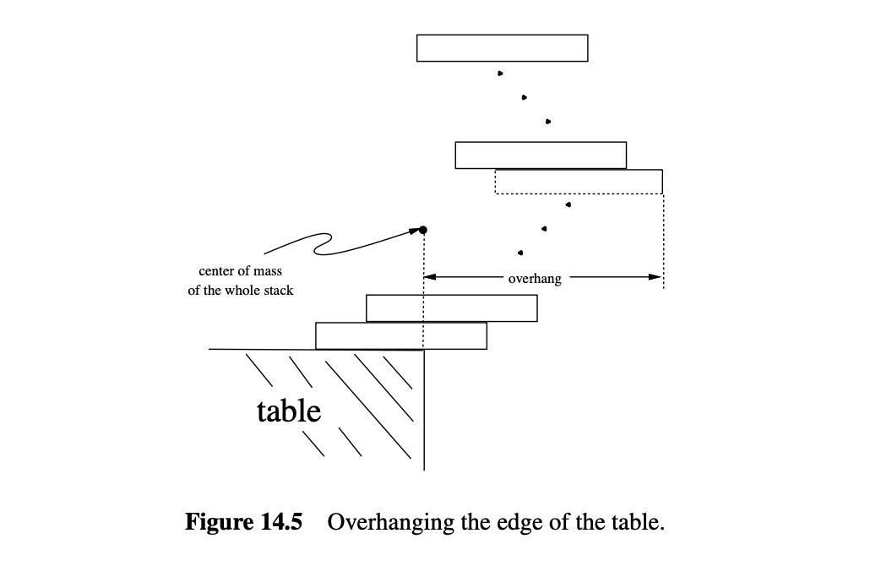

## 14 Sums and Asymptotics

和乘积在算法分析、金融应用、物理问题和概率系统中定期出现。例如，根据定理2.2.1,

$$
1 + 2 + 3 + \cdots + n = \frac{n(n + 1)}{2}
$$

当然，左边的和可以用带下标的求和符号简洁地表示

$$
\sum_{i=1}^n i
$$

但右边的表达式 $\frac{n(n + 1)}{2}$ 不仅简洁，而且更容易计算。此外，它更清楚地揭示了和的增长率等属性。像 $\frac{n(n + 1)}{2}$ 这样的表达式不使用带下标的求和或乘积符号——或者那些方便但有时麻烦的三点序列——被称为**闭式表达式**。

另一个例子是几何和的闭式表达式

$$
1 + x + x^2 + x^3 + \cdots + x^n = \frac{1 - x^{n+1}}{1 - x}
$$

在问题5.4中给出。像(14.2)左边描述的和涉及 $n$ 次加法，而 $1 + 2 + \cdots + (n - 1) = (n - 1)n/2$ 次乘法，但它的闭式右边可以用快速指数计算，最多只需$2 \log n$ 次乘法、一次除法和几次减法。此外，闭式表达使和的增长和限制行为更明显。

方程(14.1)和(14.2)容易通过归纳法验证，但正如通常情况，归纳法的证明没有提示这些公式是如何找到的。找到它们部分是数学，部分是艺术，我们将在本章开始研究。

我们第一个激励的例子是称为年金的金融工具的价值。这个值将是一个庞大而讨厌的值。然后我们将描述几种方法来找到年金等几种类型和的闭式。在某些情况下，和的闭式可能不存在，因此我们将提供一种通用方法来找到和的良好上限和下限。

本章将使用这种方法找到阶乘函数的良好闭式近似

$$
n! ::= 1 \cdot 2 \cdot 3 \cdots n
$$

我们以讨论渐近符号结束本章，特别是“大O”符号。渐近符号常用于在没有确切闭式表达式时界定和或积的误差项。它还提供了一种方便的方法来表示和或积的增长率或数量级。

### 14.1 年金的价值

你会选择今天拿到一百万美元，还是在余生中每年拿到五万美元？一方面，立即满足感很好。另一方面，如果你活得足够久，每年拿到五万美元的总金额会大得多。

正式地说，这是一个关于年金价值的问题。年金（annuity）是一种金融工具，每年初支付固定金额的钱，持续若干年。特别地，一个n年期、每年支付m美元的年金在每年的开始支付m美元，共持续n年。在某些情况下，n是有限的，但并不总是如此。例子包括彩票支付、学生贷款和房屋抵押贷款。甚至有华尔街的公司专门从事年金交易。

一个关键问题是，“年金值多少钱？”例如，彩票经常在许多年里支付大奖。直观地说，20年内每年支付五万美元应该不如现在拿到一百万美元值钱。如果你现在就拿到所有现金，你可以投资它并开始赚取利息。但如果选择在未来20年内每年支付五万美元和现在拿到五十万美元之间，该如何决定呢？突然之间，哪个选择更好并不那么清楚了。

#### 14.1.1 货币的未来价值

为了回答这样的问题，我们需要知道未来支付的一美元在今天值多少钱。为了模拟这一点，假设钱可以以年利率p进行固定投资。为了便于讨论，我们假设利率为8%，因此$p = 0.08$。

这是利率p很重要的原因。今天投资十美元，以利率p一年后将变成$10 \cdot (1 + p) = 10.80$美元，两年后变成$10 \cdot (1 + p)^2 = 11.66$美元，依此类推。换句话说，现在支付的十美元实际上只值$10 / (1 + p) \approx 9.26$美元，因为如果我们今天有这笔钱，我们可以投资它并在一年后拥有10美元。因此，p决定了未来支付的钱的价值。

对于一个n年期、每年支付m美元的年金，第一年的支付m美元实际上值m美元。但第二年的支付只值$m / (1 + p)^1$美元，同样，第三年的支付值$m / (1 + p)^2$美元，依此类推。总的年金价值V等于支付值的总和。如下所示：

$$
V = \sum_{i=1}^n \frac{m}{(1+p)^{i-1}} = m \cdot \sum_{j=0}^{n-1} \left(\frac{1}{1+p}\right)^j
$$

目标是将求和转换为简单的几何和的形式。这引出了我们可以使用摄动法来发现闭式形式的解释。

#### 14.1.2 摄动法

给定一个具有良好结构的和，通常使用“摄动”这个和，以便将和与摄动结合起来，得到一个更简单的形式。例如，假设

$$
S = 1 + x + x^2 + \cdots + x^n
$$

一个摄动例子是

$$
xS = x + x^2 + \cdots + x^{n+1}
$$

减去xS和S：

$$
S - xS = 1 - x^{n+1}
$$

求解S得到所需的闭式形式：

$$
S = \frac{1 - x^{n+1}}{1 - x}
$$

我们将在第16章介绍生成函数时看到更多这种方法的例子。

#### 14.1.3 年金价值的闭式形式

使用方程14.2，我们可以导出一个简单的公式来计算年金的价值V，该年金在每年初支付m美元，共持续n年。

$$
V = m \left(\frac{1 - x^n}{1 - x}\right) = m \left(\frac{1 + p - (1 / (1 + p))^n}{p}\right)
$$

方程14.5比具有数十项的求和式更容易使用。例如，一个每年支付五万美元，持续20年的彩票中奖的真实价值是多少？代入$m = \$50,000$，$n = 20$，$p = 0.08$得出$V \approx \$530,180$。由于付款是延迟的，因此一百万美元的彩票实际上只值大约五十万美元！这对广告商来说是一个好把戏。

#### 14.1.4 无限几何级数

我们开始本章时提出的问题是你是否会选择今天的一百万美元，还是余生中每年五万美元。当然，这取决于你能活多久，所以乐观地假设第二种选择是每年永远收到五万美元。这听起来像是无限的钱！但是我们可以通过将几何和取极限来计算带有无限支付的年金的价值。

**定理 14.1.1**

如果$|x| < 1$，则

$$
\sum_{i=0}^{\infty} x^i = \frac{1}{1 - x}
$$

**证明：**

$$
\sum_{i=0}^{\infty} x^i ::= \lim_{n \to \infty} \sum_{i=0}^n x^i = \lim_{n \to \infty} \frac{1 - x^{n+1}}{1 - x} = \frac{1}{1 - x}
$$

在我们的年金问题中，$x = \frac{1}{1 + p} < 1$，因此定理14.1.1适用，我们得到

$$
V = m \cdot \sum_{j=0}^{\infty} x^j = m \cdot \frac{1}{1 - x} = m \cdot \frac{1 + p}{p}
$$

代入$m = \$50,000$和$p = 0.08$，我们看到年金的价值仅为$V = \$675,000$。看起来今天的一百万美元要比永远每年支付五万美元值钱得多！但仔细检查，如果我们今天在银行有一百万美元，年利率8%，我们可以每年取出并花费八万美元，**永远**。所以事实证明，这个答案并不像看起来那么神奇。

#### 14.1.5 例子

方程14.2和定理14.1.1在计算机科学中非常有用。以下是一些可以使用方程14.2和定理14.1.1放入闭式形式的常见和：

$$
1 + \frac{1}{2} + \frac{1}{4} + \cdots = \sum_{i=0}^{\infty} \left(\frac{1}{2}\right)^i = \frac{1}{1 - (1/2)} = 2
$$

$$
0.99999\cdots = 0.9 \sum_{i=0}^{\infty} \left(\frac{1}{10}\right)^i = 0.9 \left(\frac{1}{1 - 1/10}\right) = 0.9 \left(\frac{10}{9}\right) = 1
$$

$$
1 - \frac{1}{2} + \frac{1}{4} - \cdots = \sum_{i=0}^{\infty} \left(-\frac{1}{2}\right)^i = \frac{1}{1 - (-1/2)} = \frac{2}{3}
$$

$$
1 + 2 + 4 + \cdots + 2^{n-1} = \sum_{i=0}^{n-1} 2^i = \frac{1 - 2^n}{1 - 2} = 2^n - 1
$$

$$
1 + 3 + 9 + \cdots + 3^{n-1} = \sum_{i=0}^{n-1} 3^i = \frac{1 - 3^n}{1 - 3} = \frac{3^n - 1}{2}
$$

如果几何和的项逐渐变小，如方程14.6中所示，那么该和被称为**几何递减和**。如果几何和的项逐渐变大，如方程14.9和14.10中所示，那么该和被称为**几何递增和**。在任何一种情况下，该和通常大致等于具有最大绝对值的项。例如，在方程14.6和14.8中，最大项等于1，和分别为2和2/3，都相对接近1。在方程14.9中，和大约是最大项的两倍。在方程14.10中，最大项是$3^{n-1}$，和是$(3^n - 1)/2$，仅大约大1.5倍。通过仔细观察

方程14.2和定理14.1.1，你可以理解这个经验法则为什么有效。

#### 14.1.6 几何和的变体

我们现在了解了几何和——如果有一个，生活就简单了。但是在实践中，人们经常遇到不能通过简单的变量替换转换为$\sum x^i$形式的和。获得新求和公式的一种不显而易见但有用的方法是对x求导或积分。作为一个例子，考虑以下和：

$$
\sum_{i=1}^{n-1} ix^i = x + 2x^2 + 3x^3 + \cdots + (n-1)x^{n-1}
$$

这不是几何和。连续项之间的比率不是固定的，因此我们不能直接应用几何和的公式。但对方程14.2求导得到：

$$
\frac{d}{dx} \left(\sum_{i=0}^{n-1} x^i\right) = \frac{d}{dx} \left(\frac{1 - x^n}{1 - x}\right)
$$

方程14.11的左侧是简单的

$$
\sum_{i=0}^{n-1} \frac{d}{dx} \left(x^i\right) = \sum_{i=0}^{n-1} ix^{i-1}
$$

方程14.11的右侧是

$$
\frac{-nx^{n-1}(1-x) - (1)(1-x^n)}{(1-x)^2} = \frac{1 - nx^{n-1} + (n-1)x^n}{(1-x)^2}
$$

因此，方程14.11意味着

$$
\sum_{i=0}^{n-1} ix^{i-1} = \frac{1 - nx^{n-1} + (n-1)x^n}{(1-x)^2}
$$

问题14.2显示了如何将摄动法应用于推导此公式。通常，求导或积分会弄乱每一项中的x指数。在这种情况下，我们现在有了$\sum_{i=0}^{n-1} ix^{i-1}$形式的公式，但我们想要$\sum ix^i$的公式。解决方法很简单：乘以x。这样得到：

$$
\sum_{i=1}^{n-1} ix^i = \frac{x - nx^n + (n-1)x^{n+1}}{(1-x)^2}
$$

我们得到了所需的闭式和公式。虽然看起来有些复杂，但比直接处理和更容易。

注意如果$|x| < 1$，则该级数收敛到有限值，即使有无限多项。取方程14.12的极限得到以下定理：

**定理 14.1.2**

如果$|x| < 1$，则

$$
\sum_{i=1}^{\infty} ix^i = \frac{x}{(1-x)^2}
$$

因此，假设有一个年金，每年i的年末支付$im$美元，持续永远。例如，如果$m = \$50,000$，那么支付依次为$\$50,000$，然后$\$100,000$，然后$\$150,000$等等。很难相信这个年金的价值是有限的！但我们可以使用定理14.1.2计算其价值：

$$
V = \sum_{i=1}^{\infty} \frac{im}{(1+p)^i} = m \cdot \frac{\frac{1}{(1+p)}}{(1 - \frac{1}{1+p})^2} = m \cdot \frac{1 + p}{p^2}
$$

第二行通过应用定理14.1.2来计算这个值

$$
\begin{aligned}
V & =\sum_{i=1}^{\infty} \frac{i m}{(1+p)^i} \\
& =m \cdot \frac{1 /(1+p)}{\left(1-\frac{1}{1+p}\right)^2} \\
& =m \cdot \frac{1+p}{p^2}
\end{aligned}
$$

第二行通过应用定理 14.1.2 得到。第三行是通过将分子和分母同时乘以 $(1 + p)^2$ 得到的。 例如，如果 $m = \$50,000$，并且 $p = 0.08$ 如常，那么年金的价值 $V = \$8,437,500$。尽管支付每年增加，但增加只是随时间线性增加；相比之下，未来支付的美元价值则以指数方式递减。几何递减淹没了线性增加。遥远未来的支付几乎一文不值，因此年金的价值是有限的。 需要记住的重要一点是对求和公式进行导数（或积分）的技巧。当然，这种方法要求正确地计算复杂的导数，但这至少在理论上是可行的！

## 14.2 幂的和

在第5章，我们验证了公式(14.1)，但这个公式的来源仍然是一个谜。 当然，我们可以通过使用良序或归纳法来证明它是正确的，但是右边的表达式最初是从哪里来的呢？ 更令人费解的是连续平方和的闭合形式表达式：

$$
\sum_{i=1}^n i^2 = \frac{(2n+1)(n+1)n}{6}. \tag{14.15}
$$

事实证明，有一种方法可以推导出这些表达式，但在我们解释之前，我们认为这会很有趣——好吧，我们对“有趣”的定义可能和你的不同——向你展示高斯在他还是个小男孩时应该如何证明公式14.1。

高斯的想法与我们在第14.1.2节中使用的扰动方法有关。设

$$
S = \sum_{i=1}^n i.
$$

然后我们可以用两种顺序写出和：

$$
S = 1 + 2 + \cdots + (n-1) + n,
$$

$$
S = n + (n-1) + \cdots + 2 + 1.
$$

将这两个等式相加得到

$$
2S = (n+1) + (n+1) + \cdots + (n+1) + (n+1) = n(n+1).
$$

因此，

$$
S = \frac{n(n+1)}{2}.
$$

对于一个小孩来说，不错——高斯表现出了一些潜力……

不幸的是，同样的技巧不适用于连续平方和。 但是，我们可以观察到结果可能是n的三次多项式，因为和包含n项，这些项的平均值随着n的平方增长。 因此我们可以猜测

$$
\sum_{i=1}^n i^2 = an^3 + bn^2 + cn + d.
$$

如果我们的猜测是正确的，那么我们可以通过插入一些n的值来确定参数a、b、c和d。 每个这样的值给出a、b、c和d的线性方程。 如果我们插入足够多的值，我们可能会得到一个具有唯一解的线性系统。 将这种方法应用于我们的例子得到：

$$
n=0 \implies 0=d
$$

$$
n=1 \implies 1=a+b+c+d
$$

$$
n=2 \implies 5=8a+4b+2c+d
$$

$$
n=3 \implies 14=27a+9b+3c+d.
$$

解决这个系统得到解 $a = 1/3, b = 1/2, c = 1/6, d = 0$。 因此，如果我们对解的形式的初步猜测是正确的，那么求和等于 $n^3/3 + n^2/2 + n/6$，这与公式14.15匹配。

关键是，如果所需的公式是一个多项式，那么一旦你估计了多项式的阶数，就可以自动找到该多项式的所有系数。

小心!

这种方法让你发现公式，但并不保证它们是正确的！在通过这种方法得到公式之后，重要的是通过归纳或其他方法返回并证明它。如果对解的初步猜测不是正确的形式，那么得到的公式将完全错误！后面的章节将描述一种基于生成函数的方法，不需要任何猜测。

## 14.3 近似求和

不幸的是，并不总能找到和的闭合形式表达式。 例如，对于

$$
S = \sum_{i=1}^n \sqrt{i}.
$$

没有已知的闭合形式。

在这种情况下，如果我们想要一个闭合形式，则需要求助于对 $S$ 的近似。 好消息是，有一种通用方法可以找到适用于许多求和的闭合形式上限和下限。 更好的是，该方法简单且易于记忆。 它通过用积分代替和来工作，然后在和中加上第一个或最后一个项。

::: def
#### 定义 14.3.1

一个函数 $f : \mathbb{R}^+ \to \mathbb{R}^+$ 当 $x < y$ 时严格递增，当 $x < y$ 时 $f(x) < f(y)$，且当 $x < y$ 时弱递增 $f(x) \leq f(y)$。

类似地，当 $x < y$ 时严格递减 $f(x) > f(y)$，且当 $x < y$ 时弱递减 $f(x) \geq f(y)$。
:::

例如，$2^x$ 和 $\sqrt{x}$ 是严格递增函数，而 $\max\{x, 2\}$ 和 $\lceil x \rceil$ 是弱递增函数。 函数 $1/x$ 和 $2^{-x}$ 是严格递减的，而 $\min\{1/x, 1/2\}$ 和 $\lfloor 1/x \rfloor$ 是弱递减的。

::: thm
#### 定理 14.3.2

设 $f : \mathbb{R}^+ \to \mathbb{R}^+$ 为弱递增函数。定义

$$
S ::= \sum_{i=1}^n f(i). \tag{14.16}
$$

和

$$
I ::= \int_1^n f(x) \, dx.
$$

则

$$
I + f(1) \leq S \leq I + f(n). \tag{14.17}
$$

类似地，如果 $f$ 是弱递减的，则

$$
I + f(n) \leq S \leq I + f(1).
$$
:::

::: prf
假设 $f : \mathbb{R}^+ \to \mathbb{R}^+$ 是弱递增的。求和 $S$ 的值在 (14.16) 中是 $n$ 个宽度为 $1$ 的矩形的面积之和，矩形的高度为 $f(1), f(2), \ldots, f(n)$。这些矩形的面积如图14.1所示。

$I$ 的值

$$
I = \int_1^n f(x) \, dx
$$

是图14.2中从1到n的曲线 $f(x)$ 下的阴影面积。

比较图14.1和图14.2中的阴影区域表明，$S$ 至少是 $I$ 加上最左边矩形的面积。因此，

$$
S \geq I + f(1). \tag{14.18}
$$

这是在 (14.17) 中给出的 $S$ 的下界。

要导出在 (14.17) 中给出的 $S$ 的上界，我们将图14.3中从1到n的 $f(x)$ 曲线向左平移一个单位。

比较图14.1和图14.3中的阴影区域表明，$S$ 至多是 $I$ 加上最右边矩形的面积。即，

$$
S \leq I + f(n).
$$

对于弱递减的情况，类似的论证留给问题14.10。
:::

定理14.3.2为大多数求和提供了良好的界限。 在最坏的情况下，界限将偏离求和中的最大项。 例如，我们可以使用定理14.3.2来界定求和

$$
S = \sum_{i=1}^n \sqrt{i}
$$

如下。

我们首先计算

$$
\begin{aligned}
I &= \int_1^n \sqrt{x} \, dx \\
&= \left. \frac{2}{3} x^{3/2} \right|_1^n\\
&= \frac{2}{3} (n^{3/2} - 1).\\
\end{aligned}
$$

然后我们应用定理14.3.2得出

$$
\frac{2}{3} (n^{3/2} - 1) + 1 \leq S \leq \frac{2}{3} (n^{3/2} - 1) + \sqrt{n}
$$

因此

$$
\frac{2}{3} n^{3/2} + \frac{1}{3} \leq S \leq \frac{2}{3} n^{3/2} + \sqrt{n} - \frac{2}{3}.
$$

换句话说，和非常接近于 $\frac{2}{3} n^{3/2}$。在本章结尾，我们将定义几种“非常接近于”某物的方法。

作为定理14.3.2的第一个应用，我们在下一节解释了它如何帮助解决结构工程中的经典悖论。

## 14.4 悬挂在桌子的边缘

假设你有一堆书，你想把它们堆叠起来，一个在另一个上方，以某种偏心方式放置，使得最上面的书在其下方的书上伸出而不会掉下来。如果你把堆叠移到桌子的边缘，你认为你能让最上面的书伸出桌子边缘多远？最上面的书能完全超出桌子的边缘吗？你不能使用胶水或其他任何支撑来固定堆叠。

大多数人对书堆叠问题的第一个反应——有时也是他们的第二和第三反应——是“不，最上面的书永远不会完全超过桌子的边缘。”但实际上，你可以让最上面的书按你想要的长度伸出来：一个书长、两个书长、任意多个书长！

### 14.4.1 问题的形式化

我们将递归地处理这个问题。我们可以让一本书从桌子的末端伸出多远？只要它的质心在桌子上方，它就不会倾斜，所以我们可以让它伸出半个书长，如图14.4所示。

现在假设我们有一堆不会倾翻的书，如果底部的书放在桌子上——称之为稳定堆叠。我们定义稳定堆叠的悬垂为从堆叠质心到最上面一本书边缘的水平距离。因此，无论它在桌子上的放置如何，悬垂只是堆叠的一个属性。如果我们将稳定堆叠的质心放在桌子的边缘，如图14.5所示，悬垂就是我们能让堆叠中最上面的书超出边缘的长度。

一般来说，如果且仅当前 i 本书的质心位于第 $(i+1)$ 本书上方，则 n 本书的堆叠是稳定的，其中 $i = 1, 2, \ldots, n-1$。

所以我们想要一个公式来表示稳定堆叠 $n$ 本书时可能实现的最大悬垂 $B_n$。

我们已经观察到一本书的悬垂是半个书长。即，

$$
B_1 = \frac{1}{2}.
$$

现在假设我们有一个稳定堆叠 $n+1$ 本书且悬垂最大。如果最下面的书上方 $n$ 本书的悬垂不是最大，我们可以通过用一堆 $n$ 本书替换顶部堆叠来使书伸出更远，从而获得更大的悬垂。所以最大悬垂 $B_{n+1}$ 是通过在底部书上放置一个具有最大悬垂的 $n$ 本书稳定堆叠来获得的。通过将 $n$ 本书的质心正好放在底部书的边缘上，我们可以获得 $n+1$ 本书堆叠的最大悬垂，如图14.6所示。

因此，我们知道在何处放置第 $n+1$ 本书以获得最大悬垂。事实上，上述推理实际上表明，这种堆叠 $n+1$ 本书的方法是构建一个稳定堆叠的唯一方法，其中最上面的书尽可能地伸展。我们所要做的就是计算这个扩展。

最简单的方法是让顶部 n 本书的质心为原点。这样，整个 n+1 本书堆叠的质心的水平坐标将等于悬垂的增加。但现在底部书的质心具有1/2的水平坐标，因此整个 n+1 本书堆叠的质心的水平坐标为

$$
\frac{0 \cdot n + (1/2) \cdot 1}{n+1} = \frac{1}{2(n+1)}.
$$

换句话说，

$$
B_{n+1} = B_n + \frac{1}{2(n+1)}, \tag{14.19}
$$

如图14.6所示。

把公式(14.19)展开得到

$$
\begin{aligned}
B_{n+1} & =B_{n-1}+\frac{1}{2 n}+\frac{1}{2(n+1)} \\
& =B_1+\frac{1}{2 \cdot 2}+\cdots+\frac{1}{2 n}+\frac{1}{2(n+1)} \\
& =\frac{1}{2} \sum_{i=1}^{n+1} \frac{1}{i}
\end{aligned} \tag{14.20}
$$

我们的下一个任务是研究 $B_n$ 随 $n$ 增长的行为。

### 14.4.2 调和级数

::: def
#### 定义 14.4.1

第 $n$ 个调和数 $H_n$ 是

$$
H_n ::= \sum_{i=1}^n \frac{1}{i}.
$$
:::

所以(14.20)意味着

$$
B_n = \frac{H_n}{2}.
$$

前几个调和数很容易计算。例如，$H_4 = 1 + \frac{1}{2} + \frac{1}{3} + \frac{1}{4} = \frac{25}{12} > 2$。$H_4$ 大于 2 这一事实具有特殊意义：它意味着 4 本书堆叠的总悬垂长度大于一本书的长度！这就是图 14.7 所示的情况。

关于调和数有好消息也有坏消息。坏消息是调和数没有已知的闭合形式表达式。好消息是我们可以使用定理14.3.2来获得 $H_n$ 的接近的上界和下界。特别是，因为

$$
\int_1^n \frac{1}{x} \, dx = \ln(x) \bigg|_1^n = \ln(n),
$$

定理14.3.2意味着

$$
\ln(n) + \frac{1}{n} \leq H_n \leq \ln(n) + 1. \tag{14.21}
$$

换句话说，第 $n$ 个调和数非常接近于 $\ln(n)$。

由于调和数在实践中经常出现，数学家们努力获得更好的近似公式。实际上，现在已知

$$
H_n = \ln(n) + \gamma + \frac{1}{2n} + \frac{1}{12n^2} + \frac{\epsilon(n)}{120n^4} \tag{14.22}
$$

这里 $\gamma$ 是一个值 0.577215664...，称为欧拉常数，$\epsilon(n)$ 在 0 和 1 之间且对所有 $n$ 有效。我们将不证明此公式。

我们终于完成了对书堆叠问题的分析。将 $H_n$ 的值代入 (14.20)，我们发现 $n$ 本书的最大悬垂非常接近于 $\ln(n)/2$。由于 $\ln(n)$ 随 $n$ 增长而趋于无穷大，这意味着如果我们有足够的书，我们可以使一本书任意远地悬挂在桌子的边缘。当然，我们需要的书的数量将随着悬垂的指数增长；仅仅达到3的悬垂就需要227本书，更不用说100的悬垂了。

#### 进一步延伸桌子的边缘

我们上面分析的悬垂是最上面的书能延伸过桌子的最远距离。这就留下了一个问题，是否有更好的方法来构建一个稳定的堆叠，使得最上面的书以外的其他书延伸得更远。例如，图 14.8 显示了一个两本书的稳定堆叠，其中底部的书比顶部的书延伸得更远。此外，底部的书延伸了书长的3/4，这与两本书堆叠中顶部书的最大悬垂相同。

由于图 14.8(a) 中的两本书排列方式与图 14.8(b) 中的堆叠方式的最大悬垂距离相同，我们可以将独特的稳定堆叠切换为顶部两本书的顺序，如图 14.8(a)。这将给出一个 n 本书的稳定堆叠，其中第二本书的悬垂距离最大。因此，对于 $n > 1$，至少有两种方法来构建一个 n 本书的稳定堆叠，这两种方法都扩展了最大悬垂距离——一种方法是最上面的书延伸最远，另一种方法是第二本书延伸最远。

不难证明这两种方法是实现最大悬垂的唯一方法，前提是我们坚持只将一本书堆叠在另一书上。但事情不止于此。构建更多书相互叠放的书堆——想象一个倒金字塔——可以使 n 本书的堆叠延伸到 $\sqrt[3]{n}$ 书长，而不会倒塌。详见 [16]，最大悬垂。

### 14.4.3 渐近相等

对于如(14.22)所示的函数增长情况，我们使用一种特殊记号 $\sim$ 来表示函数的主要项的增长。例如，我们说 $H_n \sim \ln(n)$ 来表示 $H_n$ 的主要项是 $\ln(n)$。更具体地：

::: def
#### 定义 14.4.2

对于函数 $f, g : \mathbb{R} \to \mathbb{R}$，我们说 $f$ 渐近等于 $g$，用符号表示为

$$
f(x) \sim g(x)
$$

当且仅当

$$
\lim_{x \to \infty} f(x)/g(x) = 1.
$$
:::

虽然将 $H_n \sim \ln(n) + \gamma$ 写作表示两个主要项是有诱惑力的，但这并不正确。根据定义 14.4.2，$H_n \sim \ln(n) + c$，其中 $c$ 是任意常数。正确的表示 $\gamma$ 是第二大项的方法是 $H_n - \ln(n) \sim \gamma$。

$\sim$ 记号有用的原因是我们通常不关心较低阶项。例如，如果 $n = 100$，那么我们可以仅使用两个主要项来精确计算 $H(n)$：

$$
|H_n - \ln(n) - \gamma| \leq \left| \frac{1}{200} - \frac{1}{120000} + \frac{1}{120 \cdot 100^4} \right| < \frac{1}{200}.
$$

我们将在本章结尾详细讨论渐近记号。但现在，让我们回到使用求和。

## 14.5 积

我们已经介绍了几种寻找和的闭合形式的方法，但没有处理积的方法。幸运的是，当我们遇到诸如

$$
n! ::= \prod_{i=1}^n i. \tag{14.23}
$$

这样的积时，我们不需要开发全新的一套工具。

这是因为我们可以通过取对数将任何积转换为和。例如，如果

$$
P = \prod_{i=1}^n f(i),
$$

则

$$
\ln(P) = \sum_{i=1}^n \ln(f(i)).
$$

然后我们可以应用求和工具找到 $\ln(P)$ 的闭合形式（或近似闭合形式），然后在最后通过指数化来逆转对数。

例如，让我们看看这对阶乘函数 $n!$ 是如何工作的。我们首先取对数：

$$
\ln(n!) = \ln(1 \cdot 2 \cdot 3 \cdots (n-1) \cdot n) = \ln(1) + \ln(2) + \ln(3) + \cdots + \ln(n-1) + \ln(n) = \sum_{i=1}^n \ln(i).
$$

不幸的是，这个和没有已知的闭合形式。然而，我们可以应用定理14.3.2来找到这个和的良好闭合形式边界。为此，我们首先计算

$$
\int_1^n \ln(x) \, dx = x \ln(x) - x \bigg|_1^n = n \ln(n) - n + 1.
$$

将这个结果代入定理14.3.2，意味着

$$
n \ln(n) - n + 1 \leq \sum_{i=1}^n \ln(i) \leq n \ln(n) - n + 1 + \ln(n).
$$

指数化得到

$$
\frac{n^n}{e^n \cdot e^{-1}} \leq n! \leq \frac{n^{n+1}}{e^n \cdot e^{-1}}. \tag{14.24}
$$

这意味着 $n!$ 在 $n$ 和 $\frac{n^n}{e^n - 1}$ 的因子内。

### 14.5.1 斯特林公式

离散数学中最常用的积可能是 $n!$，数学家们一直在努力为其值找到紧密的闭合形式边界。最有用的边界在定理14.5.1中给出。

::: thm
#### 定理 14.5.1 （斯特林公式）

对于所有 $n \geq 1$，

$$
n! = \sqrt{2 \pi n} \left( \frac{n}{e} \right)^n e^{\epsilon(n)}
$$

其中

$$
\frac{1}{12n+1} \leq \epsilon(n) \leq \frac{1}{12n}.
$$
:::

可以用归纳法证明定理14.5.1（需要一些痛苦），也有很多使用初等微积分的证明，但我们不会详细讨论这些。

关于斯特林公式，有几点重要的事情需要注意。首先，$\epsilon(n)$ 总是正的。这意味着

$$
n! > \sqrt{2 \pi n} \left( \frac{n}{e} \right)^n \tag{14.25}
$$

对于所有 $n \in \mathbb{N}^+$。

其次，$\epsilon(n)$ 随着 $n$ 的增大趋近于零。这意味着

$$
n! \sim \sqrt{2 \pi n} \left( \frac{n}{e} \right)^n \tag{14.26}
$$

这是令人印象深刻的。毕竟，谁能想到 $\pi$ 和 $e$ 都会出现在一个渐近等于 $n!$ 的闭合形式表达式中？

第三，$\epsilon(n)$ 即使对于小的 $n$ 也很小。这意味着斯特林公式为大多数 $n$ 值提供了很好的近似。例如，如果我们使用

$$
\sqrt{2 \pi n} \left( \frac{n}{e} \right)^n
$$

作为 $n!$ 的近似值，就像许多人那样，我们保证在正确值的因子 $e^{\epsilon(n)} \leq e^{1/12n}$ 以内。对于 $n \geq 10$，这意味着我们将在正确值的1%以内。对于 $n \geq 100$，误差将小于0.1%。

如果我们需要一个更接近的 $n!$ 近似值，那么我们可以使用

$$
\sqrt{2 \pi n} \left( \frac{n}{e} \right)^n e^{1/12n}
$$

或者

$$
\sqrt{2 \pi n} \left( \frac{n}{e} \right)^n e^{1/(12n+1)}
$$

这取决于我们是否需要上界或下界。通过定理14.5.1，我们知道这两个边界都在正确值的因子

$$
e^{1/12n - 1/12n+1} = e^{1/144n^2 + 12n}
$$

以内。对于 $n \geq 10$，这意味着任一边界将在正确值的0.01%以内。对于 $n \geq 100$，误差将小于0.0001%。

为了快速参考，这些事实在推论14.5.2和表14.1中总结。

::: cor
#### 推论 14.5.2

$$
n! < \sqrt{2 \pi n} \left( \frac{n}{e} \right)^n \cdot \begin{cases}
1.09 & \text{当 } n \geq 1, \\
1.009 & \text{当 } n \geq 10, \\
1.0009 & \text{当 } n \geq 100.
\end{cases}
$$
:::

## 14.6 双重求和的麻烦

有时我们必须计算和的和，也称为双重求和。这听起来很麻烦，有时确实如此。但通常情况下，它是直接的——你只需要计算内层和，用闭合形式代替它，然后计算外层和（它里面不再有求和）。例如，

$$
\begin{aligned}
& \sum_{n=0}^{\infty}\left(y^n \sum_{i=0}^n x^i\right)=\sum_{n=0}^{\infty}\left(y^n \frac{1-x^{n+1}}{1-x}\right) \\
& =\left(\frac{1}{1-x}\right) \sum_{n=0}^{\infty} y^n-\left(\frac{1}{1-x}\right) \sum_{n=0}^{\infty} y^n x^{n+1} \\
& =\frac{1}{(1-x)(1-y)}-\left(\frac{x}{1-x}\right) \sum_{n=0}^{\infty}(x y)^n \\
& =\frac{1}{(1-x)(1-y)}-\frac{x}{(1-x)(1-x y)} \\
& =\frac{(1-x y)-x(1-y)}{(1-x)(1-y)(1-x y)} \\
& =\frac{1-x}{(1-x)(1-y)(1-x y)} \\
& =\frac{1}{(1-y)(1-x y)} . \\
&
\end{aligned}
$$

当内层和没有明显的闭合形式时，一个常用的技巧是尝试交换求和顺序。例如，假设我们想计算前 $n$ 个调和数的和

$$
\sum_{k=1}^n H_k = \sum_{k=1}^n \sum_{j=1}^k \frac{1}{j} \tag{14.27}
$$

为了直观理解这个求和，我们可以将定理14.3.2应用于公式14.21，从而得出这个求和接近于

$$
\int_1^n \ln(x) \, dx = x \ln(x) - x \bigg|_1^n = n \ln(n) - n + 1.
$$

现在让我们寻找一个精确的答案。如果我们考虑我们正在求和的 $(k, j)$ 对，它们形成一个三角形：

$$
\begin{array}{cc|ccccccc} 
& & j & & & & & \\
& & 1 & 2 & 3 & 4 & 5 & \ldots & n \\
\hline k & 1 & 1 & & & & & & \\
& 2 & 1 & 1 / 2 & & & & & \\
& 3 & 1 & 1 / 2 & 1 / 3 & & & & \\
& 4 & 1 & 1 / 2 & 1 / 3 & 1 / 4 & & & \\
& & \ldots & & & & & \\
& n & 1 & 1 / 2 & & \ldots & & 1 / n
\end{array}
$$

公式14.27中的求和是先对每一行求和，然后将行和相加。相反，我们可以对列求和，然后将列和相加。检查表格，我们看到这个双重求和可以写成

$$
\begin{aligned}
\sum_{k=1}^n H_k & =\sum_{k=1}^n \sum_{j=1}^k \frac{1}{j} \\
& =\sum_{j=1}^n \sum_{k=j}^n \frac{1}{j} \\
& =\sum_{j=1}^n \frac{1}{j} \sum_{k=j}^n 1 \\
& =\sum_{j=1}^n \frac{1}{j}(n-j+1) \\
& =\sum_{j=1}^n \frac{n+1}{j}-\sum_{j=1}^n \frac{j}{j} \\
& =(n+1) \sum_{j=1}^n \frac{1}{j}-\sum_{j=1}^n 1 \\
& =(n+1) H_n-n .
\end{aligned} \tag{14.28}
$$

## 14.7 渐近记号

渐近记号是一种简写，用于快速测量函数 $f(n)$ 随 $n$ 增大的行为。例如，定义14.4.2中的渐近记号 $\sim$ 是一个二元关系，表示两个函数以相同的速率增长。还有一个二元关系 "小o" 表示一个函数增长速度显著慢于另一个函数，以及 "大O" 表示一个函数增长不超过另一个函数的速度。

### 14.7.1 小o

::: def
#### 定义 14.7.1

对于函数 $f, g : \mathbb{R} \to \mathbb{R}$，且 $g$ 非负，我们说 $f$ 渐近小于 $g$，用符号表示

$$
f(x) = o(g(x)),
$$

当且仅当

$$
\lim_{x \to \infty} \frac{f(x)}{g(x)} = 0.
$$
:::

例如，$1000x^{1.9} = o(x^2)$，因为

$$
\lim_{x \to \infty} \frac{1000x^{1.9}}{x^2} = 1000 \lim_{x \to \infty} \frac{1}{x^{0.1}} = 1000 \cdot 0 = 0.
$$

这个论点可以直接推广到：

::: lem
#### 引理 14.7.2

$f = o(g)$ 蕴含 $c \cdot f = o(g)$ 对于任意常数 $c$。

$$
x^a = o(x^b) \quad \text{对于常数} \quad 0 \leq a < b.
$$
:::

此外，$\log$ 的增长比根慢：

::: lem
#### 引理 14.7.3

$\log_a x = o(x^\epsilon)$ 对于任意 $a > 1, \epsilon > 0$。
:::

证明. 对于 $y \geq 1$，我们有 $1/y \leq y$。对 1 到 $z$ 积分，得出

$$
\ln z \leq \frac{z^2}{2}. \tag{14.31}
$$

对于 $z \geq 1$，选择 $\delta > 0$ 并设 $z = \sqrt{x^\delta}$，然后

$$
\frac{\delta \ln x}{2} \leq \frac{x^\delta}{2},
$$

$$
\ln x \leq \frac{x^\delta}{\delta} \quad \text{由引理14.7.2得到} \quad \ln x = o(x^\epsilon). \tag{14.32}
$$

最后，对于任何实数 $a > 1$，

$$
\log_a x = \frac{\ln x}{\ln a} = o(x^\epsilon) \quad \text{由(14.32)和(14.29)}。
$$

::: cor
#### 推论 14.7.4

$x^b = o(a^x)$ 对于任意 $a, b \in \mathbb{R}$ 且 $a > 1$。
:::

引理14.7.3和推论14.7.4也可以使用洛必达法则或对数和指数的麦克劳林级数证明。证明可在大多数微积分教材中找到。

### 14.7.2 大O

"大O" 是最常用的渐近记号。它用于给出函数增长的上界，例如算法的运行时间。大O 的标准定义如下，但我们首先给出一个替代定义，使得大O 的几个基本性质更加明显。

::: def
#### 定义 14.7.5

给定函数 $f, g : \mathbb{R} \to \mathbb{R}$ 且 $g$ 非负，我们说

$$
f = O(g)
$$

当且仅当

$$
\limsup_{x \to \infty} \left| \frac{f(x)}{g(x)} \right| < \infty。
$$
:::

这里我们使用了极限上确界的技术概念，而不仅仅是极限。但由于极限和极限上确界在极限存在时是相同的，这种表述使得检查大O 的基本性质变得容易。我们将以下引理作为理所当然。

::: lem
#### 引理 14.7.6

如果函数 $f : \mathbb{R} \to \mathbb{R}$ 有有限或无限的极限，并且其自变量趋向无穷大，那么其极限和极限上确界是相同的。
:::

现在定义14.7.5 立即意味着：

::: lem
#### 引理 14.7.7

如果 $f = o(g)$ 或 $f \sim g$，那么 $f = O(g)$。
:::

证明. $\lim \frac{f/g = 0}$ 或 $\lim \frac{f/g = 1}$ 蕴含 $\lim f/g < \infty$，因此根据引理 14.7.6，$\limsup f/g < \infty$。

注意，引理 14.7.7 的逆命题不成立。例如，$2x = O(x)$，但 $2x \not= x$ 且 $2x \not= o(x)$。

我们还具有：

::: lem
#### 引理 14.7.8

如果 $f = o(g)$，则 $g \not= O(f)$。
:::

证明.

$$
\lim_{x \to \infty} \frac{g(x)}{f(x)} = \frac{1}{\limsup_{x \to \infty} \frac{f(x)}{g(x)}} = \frac{1}{0} = \infty,
$$

因此根据引理 14.7.6，$g \not= O(f)$。

我们需要在定义 14.7.5 中使用 $\limsup$ 来涵盖极限不存在的情况。例如，如果 $f(x)/g(x)$ 随着 $x$ 的增长在 3 和 5 之间振荡，则 $\lim f/g$ 不存在，但 $f = O(g)$ 因为 $\limsup f/g = 5$。

一种等效的、更常用的 大O 形式不涉及 $\limsup$：

::: def
#### 定义 14.7.9

给定函数 $f, g : \mathbb{R} \to \mathbb{R}$ 且 $g$ 非负，我们说

$$
f = O(g)
$$

当且仅当存在常数 $c \geq 0$ 和 $x_0$，使得对于所有 $x \geq x_0$，有 $|f(x)| \leq c g(x)$。
:::

此定义相当复杂，但其思想很简单：$f(x) \leq g(x)$ 表示 $f(x)$ 小于等于 $g(x)$，除了我们愿意忽略的一个常数因子，即 $c$，并且允许对小 $x$ 的例外，即对于 $x < x_0$。所以在 $f(x)/g(x)$ 在 3 和 5 之间振荡的情况下，根据定义 14.7.9，$f = O(g)$，因为 $f \leq 5g$。

::: prop
#### 命题 14.7.10

$100x^2 = O(x^2)$。
:::

证明. 选择 $c = 100$ 和 $x_0 = 1$。则命题成立，因为对于所有 $x \geq 1$，有 $|100x^2| \leq 100x^2$。

::: prop
#### 命题 14.7.11

$x^2 + 100x + 10 = O(x^2)$。
:::

证明. $(x^2 + 100x + 10)/x^2 = 1 + 100/x + 10/x^2$，因此其极限为 $x \to \infty$ 时为 $1 + 0 + 0 = 1$。所以实际上，$x^2 + 100x + 10 \sim x^2$，因此 $x^2 + 100x + 10 = O(x^2)$。实际上，反过来也成立，即 $x^2 = O(x^2 + 100x + 10)$。

命题 14.7.11 可推广到任意多项式：

::: prop
#### 命题 14.7.12

$a_k x^k + a_{k-1} x^{k-1} + \cdots + a_1 x + a_0 = O(x^k)$。
:::

我们将省略常规证明。

大O 记号在描述算法的运行时间时特别有用。例如，乘以 $n \times n$ 矩阵的通常算法在最坏情况下使用的操作数与 $n^3$ 成正比。这个事实可以简洁地表达为运行时间是 $O(n^3)$。渐近记号在一个高层次上强调了算法的行为，抽象掉了可能是编程语言或机器特定的实现细节。

### 14.7.3 Theta

有时我们想要具体说明运行时间 $T(n)$ 精确到常数因子是二次的（既有上界又有下界）。我们可以通过说 $T(n) = O(n^2)$ 和 $n^2 = O(T(n))$ 来实现这一点，但数学家们发明了另一个符号 $\Theta$ 来完成这个工作。

::: def
#### 定义 14.7.13

$f = \Theta(g)$ 当且仅当 $f = O(g)$ 且 $g = O(f)$。
:::

语句 $f = \Theta(g)$ 可以直观地解释为“$f$ 和 $g$ 在常数因子内是相等的。”

Theta 记号使我们能够突出增长率并抑制分散注意力的因子和低阶项。例如，如果一个算法的运行时间是

$$
T(n) = 10n^3 - 20n^2 + 1,
$$

那么我们可以更简单地写作

$$
T(n) = \Theta(n^3).
$$

在这种情况下，我们会说 $T$ 是三次的，或 $T(n)$ 是三次增长的，这通常是我们真正想知道的。

### 14.7.4 渐近记号的陷阱

使用渐近记号有很多错误的方法。本节列出了一些 大O 记号可能导致的问题。通过最小的努力，你可以用其他符号制造同样的混乱。

#### 指数错误

有时涉及 大O 的关系并不那么明显。例如，有人可能会猜测 $4^x = O(2^x)$，因为 4 只是比 2 大一个常数因子。然而，这种推理是错误的；实际上 $4^x$ 以 $2^x$ 的平方速度增长。

#### 常数混淆

每个常数都是 $O(1)$。例如，17 = $O(1)$。这是真的，因为如果我们让 $f(x) = 17$ 和 $g(x) = 1$，则存在一个常数 $c > 0$ 和一个 $x_0$ 使得对于所有 $x \geq x_0$，$|f(x)| \leq c g(x)$。特别是，我们可以选择 $c = 17$ 和 $x_0 = 1$，因为对于所有 $x \geq 1$，$|17| \leq 17 \cdot 1$。

::: thm
#### 伪定理 14.7.14

$$
\sum_{i=1}^n i = O(n)
$$
:::

伪证明：定义 $f(n) = \sum_{i=1}^n i = 1 + 2 + 3 + \cdots + n$。既然我们已经证明每个常数 $i$ 都是 $O(1)$，$f(n) = O(1) + O(1) + \cdots + O(1) = O(n)$。

当然实际上 $\sum_{i=1}^n i = n(n + 1)/2 \neq O(n)$。

这个错误源于对 $i = O(1)$ 语句的含义的混淆。对于任何常数 $i \in \mathbb{N}$，$i = O(1)$ 是真的。更准确地说，如果 $f$ 是任何常数函数，那么 $f = O(1)$。但在这个伪定理中，$i$ 不是常数——它在依赖于 $n$ 的 0 到 $n$ 的值范围内变化。

#### 等式错误

符号 $f = O(g)$ 太过深入以至于无法避免，但使用“=” 是令人遗憾的。例如，如果 $f = O(g)$，看起来很合理写 $O(g) = f$。但这样做可能会导致以下错误：因为 $2n = O(n)$，我们可以说 $O(n) = 2n$。但 $n = O(n)$，因此我们得出 $n = O(n) = 2n$，因此 $n = 2n$。

类似地，你会经常看到像

$$
H_n = \ln(n) + \gamma + O\left( \frac{1}{n} \right)
$$

或

$$
n! = (1 + o(1)) \sqrt{2 \pi n} \left( \frac{n}{e} \right)^n
$$

在这种情况下，真正的意思是

$$
H_n = \ln(n) + \gamma + f(n)
$$

其中 $f(n)$ 是 $O(1/n)$，和

$$
n! = (1 + g(n)) \sqrt{2 \pi n} \left( \frac{n}{e} \right)^n
$$

其中 $g(n) = o(1)$。只要你（和你的读者）知道你的意思，这些最后的错误是可以的。

#### 运算符应用错误

假设熟悉的操作保留渐近关系是很诱人的，但事实并非如此。例如，$f \sim g$ 通常并不意味着 $3f = \Theta(3g)$。另一方面，一些运算符保留甚至加强渐近关系，例如，

$$
f = \Theta(g) \implies \ln f \sim \ln g。
$$

### 14.7.5 Omega（可选）

有时人们错误地在下界的上下文中使用 大O。例如，他们可能会说：“运行时间 $T(n)$ 至少是 $O(n^2)$。”这是另一个错误！大O 只能用于上界。表示下界的正确方法是

$$
n^2 = O(T(n))。
$$

下界也可以用另一个特殊记号“大Omega”来描述。

::: def
#### 定义 14.7.15

给定函数 $f, g : \mathbb{R} \to \mathbb{R}$ 且 $f$ 非负，定义

$$
f = \Omega(g)
$$

表示

$$
g = O(f)。
$$
:::

例如，$x^2 = \Omega(x)$，$2^x = \Omega(x^2)$ 和 $x/100 = \Omega(100x + \sqrt{x})$。

所以如果你的算法在大小为 $n$ 的输入上的运行时间是 $T(n)$，你想说它至少是二次的，可以说

$$
T(n) = \Omega(n^2)。
$$

有一个类似的“小omega”记号表示对应于 小o 的下界：

::: def
#### 定义 14.7.16

对于函数 $f, g : \mathbb{R} \to \mathbb{R}$ 且 $f$ 非负，定义

$$
f = \omega(g)
$$

表示

$$
g = o(f)。
$$
:::

例如，$x^{1.5} = \omega(x)$ 和 \$\sqrt{x} = \omega((\ln\^2(x))。

小omega记号不像我们定义的其他渐近符号那样广泛使用。
