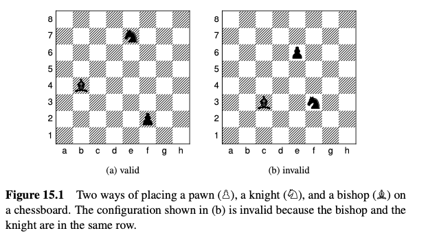
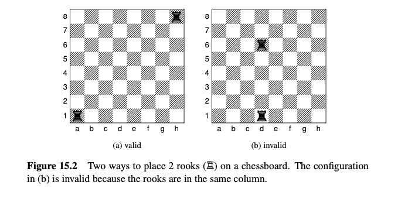
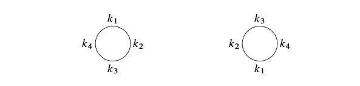
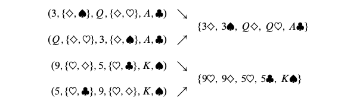
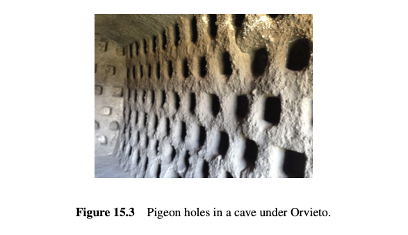
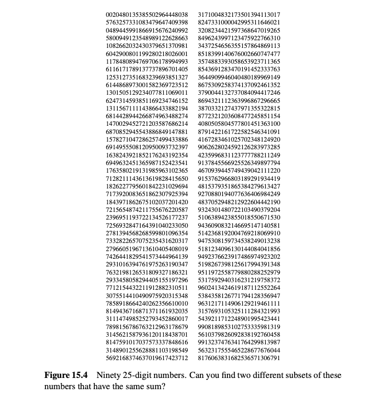
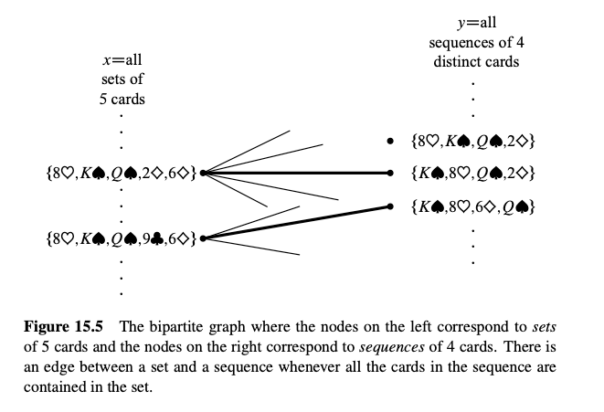
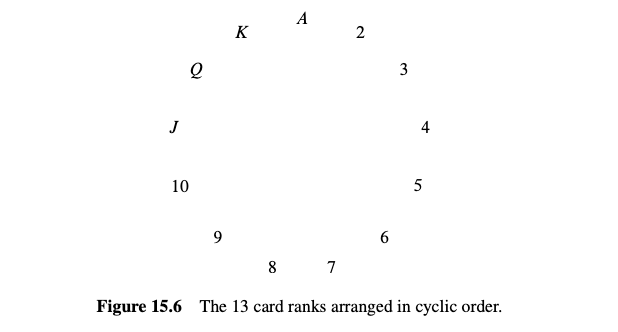

## 15.1 通过计数另一件事来计数一件事

你如何计算拥挤房间里的人数呢？你可以数头，因为每个人都有一个头。或者，你可以数耳朵然后除以二。当然，你可能需要调整计算，如果有人在海盗袭击中失去了一只耳朵或者有人出生时有三只耳朵。这里的关键是你可以通过计数另一件事来计数一件事，尽管有时可能需要调整。这是计数的核心主题，从最简单的问题到最困难的。事实上，我们已经在定理 4.5.5 中看到过这种技术，其中证明了 n 元素集合的子集数目与长度为 n 的位串数目相同，通过描述子集和位串之间的双射。

通过计数另一件事来计数一件事的最直接方法是找到它们之间的双射，因为如果两个集合之间存在双射，那么这些集合的大小相同。这个重要的事实通常被称为双射规则。我们已经在映射规则双射案例 (4.7) 中看到过它。

### 15.1.1 双射规则

双射规则充当了计数能力的放大器；如果你找出一个集合的大小，那么你可以通过双射立即确定许多其他集合的大小。例如，让我们看看 Part III 开始时提到的两个集合：

$A =$ 所有选择十二个甜甜圈的方式，当有五种可用的品种时

$B =$ 所有恰好有 4 个 1 的 16 位序列

集合 $A$ 的一个元素的例子是：

$$
\underbrace{00}_{\text {chocolate }} \underbrace{-}_{\text {lemon-filled }} \underbrace{000000}_{\text {sugar }} \underbrace{00}_{\text {glazed }} \underbrace{00}_{\text {plain }}
$$

在这里，我们描绘了每个甜甜圈为 0 并在不同种类之间留出了一个间隙。因此，上述选择包含两个巧克力甜甜圈，没有柠檬馅的，六个糖的，两个上釉的，和两个普通的。现在我们在四个间隙中各放一个 1：

$$
\underbrace{00}_{\text {chocolate }} 1 \underbrace{}_{\text {lemon-filled }} 1 \underbrace{000000}_{\text {sugar }} 1 \underbrace{00}_{\text {glazed }} 1 \underbrace{00}_{\text {plain }}
$$

并去掉间隙：

$$ 
001100000100100 .
$$

我们刚刚形成了一个恰好有 4 个 1 的 16 位数——一个 B 的元素！

这个例子提出了从集合 A 到集合 B 的双射：将一打甜甜圈：

$$
c \text { chocolate, } l \text { lemon-filled, } s \text { sugar, } g \text { glazed, and } p \text { plain }
$$

映射到序列：

$$
\underbrace{0 \ldots 0}_c \quad 1 \underbrace{0 \ldots 0}_l 1 \underbrace{0 \ldots 0}_s 1 \underbrace{0 \ldots 0}_g 1 \underbrace{0 \ldots 0}_p
$$

结果序列总是有 16 位并且恰好有 4 个 1，因此是 B 的一个元素。此外，映射是一个双射：每个这样的位序列都对应于恰好一个十二个甜甜圈的顺序。因此，$|A| = |B|$ 通过双射规则。更一般地，

::: lem
#### 引理 15.1.1

选择 n 个甜甜圈的方法数，当 k 个口味可用时，与恰好有 n 个 0 和 k-1 个 1 的二进制序列数相同。
:::

这个例子展示了双射规则的力量。我们设法证明了两个非常不同的集合实际上是相同的大小——即使我们不知道其中一个的确切大小。但一旦我们弄清楚一个集合的大小，我们将立即知道另一个集合的大小。

这种特定的双射可能看起来令人害怕地巧妙，如果你以前没有见过它。但你会用几乎完全相同的论点一次又一次地证明，因此很快你会认为这是常规的。

## 15.2 计数序列

双射规则让我们通过计数另一件事来计数一件事。这提出了一般策略：只要擅长计数一些东西，然后使用双射来计数其他所有东西！这是我们将遵循的策略。特别是，我们将非常擅长计数序列。当我们想确定某些其他集合 $T$ 的大小时，我们将找到从 $T$ 到一个序列集合 $S$ 的双射。然后我们将使用我们的超级忍者序列计数技巧来确定 $|S|$，这将立即给我们 $|T|$。我们需要在进行过程中稍微磨练这个想法，但基本上就是这样！

### 15.2.1 乘法规则

乘法规则给出了集合乘积的大小。回想一下，如果 $P_1, P_2, \ldots, P_n$ 是集合，那么

$$ 
P_1 \times P_2 \times \cdots \times P_n 
$$

是所有序列的集合，其中第一项取自 $P_1$，第二项取自 $P_2$，依此类推。

规则 15.2.1 (乘法规则)。如果 $P_1, P_2, \ldots, P_n$ 是有限集合，那么：

$$ 
|P_1 \times P_2 \times \cdots \times P_n| = |P_1| \cdot |P_2| \cdot \cdots \cdot |P_n| 
$$

例如，假设日常饮食由从集合 $B$ 选择的早餐，从集合 $L$ 选择的午餐和从集合 $D$ 选择的晚餐组成，其中：

$$ 
B = \{\text{pancakes, bacon and eggs, bagel, Doritos}\} 
$$

\$\$ L = {\text{burger and fries, garden salad, pasta}}

\$\$

\$\$ D = {\text{macaroni, pizza, frozen burrito, pasta, Doritos}} \$\$

那么 $B \times L \times D$ 是所有可能的日常饮食的集合。这里有一些示例元素：

$$
\begin{aligned}
(\text{pancakes, burger and fries, pizza}) \\
(\text{bacon and eggs, garden salad, pasta}) \\
(\text{Doritos, Doritos, frozen burrito})
\end{aligned}
$$

乘法规则告诉我们有多少种不同的日常饮食是可能的：

$$ 
|B \times L \times D| = |B| \cdot |L| \cdot |D| $$ $$ = 4 \cdot 3 \cdot 5 $$ $$ = 60.
$$

### 15.2.2 n 元素集合的子集

在定理 4.5.5 中证明了 $n$ 元素集合的子集有 $2^n$ 个，通过建立子集和长度为 $n$ 的位串之间的双射。因此，原来的子集问题被转换为关于序列的问题——完全按照计划！现在我们可以用乘法规则填补解释中缺失的部分，为什么长度为 $n$ 的位串有 $2^n$ 个：我们可以将所有 $n$ 位序列的集合写成集合的乘积：

$$ 
\{0, 1\}^n ::= \{0, 1\} \times \{0, 1\} \times \cdots \times \{0, 1\}. $$ $$ \text{n terms} 
$$

然后乘法规则给出了答案：

$$ 
|\{0, 1\}^n| = |\{0, 1\}|^n = 2^n. 
$$

### 15.2.3 加法规则

巴特给他的小妹妹丽萨分配了 20 天暴躁

日，40 天易怒日，和 60 天一般性阴郁日。丽萨可以以某种方式过度暴躁的日子有多少天？让集合 $C$ 是她的暴躁日，$I$ 是她的易怒日，和 $S$ 是她的一般性阴郁日。在这些术语中，问题的答案是 $|C \cup I \cup S|$，假设她每天最多允许一个不良情绪，则集合的大小由加法规则给出：

规则 15.2.2 (加法规则)。如果 $A_1, A_2, \ldots, A_n$ 是不相交的集合，那么：

$$ 
|A_1 \cup A_2 \cup \cdots \cup A_n| = |A_1| + |A_2| + \cdots + |A_n| 
$$

因此，根据巴特的预算，丽萨可以在以下的某一天：

$$ 
|C \cup I \cup S| = |C| + |I| + |S| $$ $$ = 20 + 40 + 60 $$ $$ = 120 \text{ days.}
$$

请注意，加法规则仅适用于不相交的集合。找到具有重叠集合的并集大小是我们将在第 15.9 节中讨论的更复杂的问题。

### 15.2.4 计数密码

很少有计数问题可以用一个规则解决。通常，解决方案是一系列和、积和其他方法的组合。

对于涉及密码、电话号码和车牌号的问题，加法规则和乘法规则一起使用。例如，在某个计算机系统上，有效密码是六到八个符号的序列。第一个符号必须是字母（可以是小写或大写），其余符号必须是字母或数字。可以有多少种不同的密码？

让我们定义两个集合，对应于密码中第一个和随后的符号位置的有效符号。

$$ 
F = \{a, b, \ldots, z, A, B, \ldots, Z\} 
$$

$$
S = \{a, b, \ldots, z, A, B, \ldots, Z, 0, 1, \ldots, 9\} 
$$

用这些术语，所有可能密码的集合是：

$$
(F \times S^5) \cup (F \times S^6) \cup (F \times S^7) 
$$

因此，六位密码在集合 $F \times S^5$，七位密码在集合 $F \times S^6$，八位密码在集合 $F \times S^7$ 中。由于这些集合是不相交的，我们可以应用加法规则并计算可能密码的总数如下：

$$
\begin{array}{rlr}
\left|\left(F \times S^5\right) \cup\left(F \times S^6\right) \cup\left(F \times S^7\right)\right| & \text { Sum Rule } \\
& =\left|F \times S^5\right|+\left|F \times S^6\right|+\left|F \times S^7\right| & \text { Product Rule } \\
& =|F| \cdot|S|^5+|F| \cdot|S|^6+|F| \cdot|S|^7 & \\
& =52 \cdot 62^5+52 \cdot 62^6+52 \cdot 62^7 & \\
& \approx 1.8 \cdot 10^{14} \text { different passwords. }
\end{array}
$$

## 15.3 广义乘法规则

假设有一个诺贝尔奖、日本奖和普利策奖要颁发给 $n$ 个人，有多少种方法可以颁发呢？通过将关于奖项的问题转化为关于序列的问题，可以很容易地回答这个问题。设 $P$ 为参加课程的 $n$ 个人的集合。那么，从颁发三项奖的方式到集合 $P^3 ::= P \times P \times P$ 存在一个双射。特别地，赋值：

“Barack 获得诺贝尔奖，George 获得日本奖，Bill 获得普利策奖”

映射到序列 (Barack, George, Bill)。通过乘法规则，我们有 $|P^3| = |P|^3 = n^3$，因此有 $n^3$ 种方法将奖项颁发给一个有 $n$ 个人的班级。注意，$P^3$ 包括 (Barack, Bill, Barack) 这样的三元组，其中一个人赢得多个奖项。

但是，如果三个奖项必须颁发给不同的学生呢？和以前一样，我们可以将赋值映射到三元组 (Bill, George, Barack) 属于 $P^3$。但这个函数不再是一个双射。例如，没有有效的赋值映射到三元组 (Barack, Bill, Barack)，因为我们现在不允许 Barack 获得两个奖项。然而，从奖项赋值到集合：

$$ S = \{(x, y, z) \in P^3 \mid x, y 和 z 是不同的人\} $$

存在一个双射。

这将原始问题简化为一个计数序列的问题。不幸的是，乘法规则不直接适用于这种类型的计数，因为条目彼此依赖；特别地，它们必须都不同。然而，一个稍微更尖锐的工具可以解决这个问题。

规则 15.3.1 (广义乘法规则)。设 $S$ 为长度为 $k$ 的序列集合。如果有：

-   $n_1$ 个可能的第一个条目，

-   对于每个第一个条目，有 $n_2$ 个可能的第二个条目，

-   …

-   对于每个长度为 $k-1$ 的序列，有 $n_k$ 个可能的第 $k$ 个条目，

则：

$$ 
|S| = n_1 \cdot n_2 \cdot n_3 \cdots n_k
$$

在奖励的例子中，$S$ 由序列 (x, y, z) 组成。有 $n$ 种选择 $x$ 的方法，奖项 #1 的接受者。对于每一种选择，有 $n-1$ 种选择 $y$ 的方法，奖项 #2 的接受者，因为除了 $x$ 以外的每个人都是合格的。对于 $x$ 和 $y$ 的每种组合，有 $n-2$ 种选择 $z$ 的方法，奖项 #3 的接受者，因为除了 $x$ 和 $y$ 以外的每个人都是合格的。因此，根据广义乘法规则，有：

$$ 
|S| = n \cdot (n-1) \cdot (n-2) 
$$

种方法将三个奖项颁发给不同的人。

### 真正出色的课程工作的奖项

鉴于每个人对这门课程的努力，老师们考虑颁发一些奖项给真正出色的课程工作。以下是三个可能的奖项类别：

最佳行政评论 我们断言测验是闭卷的。在封面页上，一位强有力的候选者写道：“没有书。”

尴尬的问题奖 “好吧，左袜子、右袜子和裤子在反链中，但即使有帮助，我怎么能一次穿上所有三个？”

最佳合作声明 受一位在测验 1 上写下“我独自完成”的学生启发。

### 15.3.1 有缺陷的美元票据

如果在 8 位序列号中有某个数字出现多次，则美元票据有缺陷。如果你检查你的钱包，你会发现有缺陷的票据过于常见。实际上，非有缺陷的票据有多常见呢？假设序列号的数字部分都同样频繁地出现，我们可以通过计算

$$ 
\text{非有缺陷票据的比例} = \frac{\text{所有数字不同的序列号}}{\text{序列号}}. 
$$

首先考虑分母。在这里没有限制；第一个数字有 10 种可能，第二个数字有 10 种可能，第三个数字也是如此。因此，8 位序列号的总数是 $10^8$ 通过乘法规则。

接下来考虑分子。现在我们不允许重复使用任何数字。因此，第一个数字仍有 10 种可能，但第二个数字只有 9 种可能，第三个数字有 8 种可能，依此类推。因此，通过广义乘法规则，有

$$ 
10 \cdot 9 \cdot 8 \cdot 7 \cdot 6 \cdot 5 \cdot 4 \cdot 3 = \frac{10!}{2} = 1,814,400 
$$

个所有数字都不同的序列号。将这些结果代入方程，我们发现：

$$ 
\text{非有缺陷票据的比例} = \frac{1,814,400}{100,000,000} = 1.8144\%. 
$$

### 15.3.2 一个国际象棋问题

我们可以有多少种不同的方法放置一个兵 ($P$)，一个骑士 ($N$) 和一个象 ($B$) 在棋盘上，使得没有两个棋子共享一行或一列？一个有效配置如图 15.1(a) 所示，一个无效配置如图 15.1(b) 所示。

首先，我们将关于棋子的配置问题映射到关于序列的问题。存在一个从配置到序列的双射

$$ 
(r_P, c_P, r_N, c_N, r_B, c_B) 
$$

其中 $r_P, r_N$ 和 $r_B$ 是不同的行，而 $c_P, c_N$ 和 $c_B$ 是不同的列。特别地，$r_P$ 是兵的行，$c_P$ 是兵的列，$r_N$ 是骑士的行，等等。现在我们可以使用广义乘法规则计算此类序列的数量：

-   $r_P$ 是 8 行之一
-   $c_P$ 是 8 列之一
-   $r_N$ 是 7 行之一（除了 $r_P$ ）
-   $c_N$ 是 7 列之一（除了 $c_P$ ）
-   $r_B$ 是 6 行之一（除了 $r_P$ 或 $r_N$ ）
-   $c_B$ 是 6 列之一（除了 $c_P$ 或 $c_N$ ）

因此，总配置数为 $(8 \cdot 7 \cdot 6)^2$。

### 15.3.3 排列

集合 $S$ 的一个排列是一个序列，其中包含 $S$ 的每个元素恰好一次。例如，这里是集合 $\{a, b, c\}$ 的所有排列：

$$ 
(a, b, c) \ \ (a, c, b) \ \ (b, a, c) 
$$

$$ 
(b, c, a) \ \ (c, a, b) \ \ (c, b, a) 
$$

一个 $n$ 元素集合的排列有多少呢？好吧，第一元素有 $n$ 种选择。对于每个这些选择，有 $n-1$ 个剩余选择用于第二元素。对于前两个元素的每个组合，有 $n-2$ 种选择用于第三元素，依此类推。因此，总共有

$$ 
n \cdot (n-1) \cdot (n-2) \cdots 3 \cdot 2 \cdot 1 = n! 
$$

个 $n$ 元素集合的排列。特别地，这个公式表示有

$$ 
3! = 6
$$

个 3 元素集合 $\{a, b, c\}$ 的排列，这是我们上面找到的数字。

排列将在这门课程中大约出现 1.6 亿次。实际上，排列是为什么阶乘如此频繁出现的原因，也是为什么我们教你 Stirling 近似的原因：

$$
n! \sim \sqrt{2 \pi n} \left(\frac{n}{e}\right)^n. 
$$

## 15.4 除法规则

通过数耳朵并除以二是一种傻傻的计数房间里人数的方法，但这种方法代表了一种强大的计数原理。

一个 $k$-对-1 函数将域中的正好 $k$ 个元素映射到余域中的每一个元素。例如，映射每只耳朵到它的主人是 2-对-1。类似地，映射每个手指到它的主人是 10-对-1，映射每个脚趾到它的主人是 20-对-1。一般规则是：

规则 15.4.1 (除法规则)。如果 $f : A \to B$ 是 $k$-对-1 的，那么 $|A| = k \cdot |B|$。

例如，假设 $A$ 是房间里耳朵的集合，而 $B$ 是人的集合。耳朵到人的映射是 2-对-1 的，所以根据除法规则，$|A| = 2 \cdot |B|$。等价地，$|B| = |A|/2$，表达了我们一直以来知道的：人数是耳朵数的一半。尽管看起来不太可能，许多计数问题通过最初多次计数每个项目然后使用除法规则纠正答案变得更容易。让我们看看一些例子。

### 15.4.1 另一个国际象棋问题

你可以有多少种不同的方法在棋盘上放置两个相同的车，使它们不共享一行或一列？图 15.2(a) 显示了一个有效的配置，图 15.2(b) 显示了一个无效的配置。

设 $A$ 为所有序列的集合

$$ (r_1, c_1, r_2, c_2) $$

其中 $r_1$ 和 $r_2$ 是不同的行，$c_1$ 和 $c_2$ 是不同的列。设 $B$ 为所有有效车配置的集合。存在一个自然函数 $f$ 从集合 $A$ 到集合 $B$；特别地，$f$ 将序列 $(r_1, c_1, r_2, c_2)$ 映射到一个配置，其中一个车在第 $r_1$ 行，第 $c_1$ 列，另一个车在第 $r_2$ 行，第 $c_2$ 列。

但现在有一个障碍。考虑序列：

$$ (1, a, 8, h) \quad 和 \quad (8, h, 1, a) $$

第一个序列映射到一个配置，其中一个车在左下角，另一个车在右上角。第二个序列映射到一个配置，其中一个车在右上角，另一个车在左下角。问题是，这是描述同一配置的两种不同方式！事实上，这种排列如图 15.2(a) 所示。

更一般地，函数 $f$ 将正好两个序列映射到每个棋盘配置；$f$ 是一个 2-对-1 函数。因此，通过商规则，$|A| = 2 \cdot |B|$。重排列术语得出：

$$ |B| = \frac{|A|}{2} = \frac{(8 \cdot 7)^2}{2}. $$

在第二个等式中，我们使用广义乘法规则计算了 $|A|$，就像在前面的国际象棋问题中一样。

### 15.4.2 圆桌骑士

亚瑟王可以有多少种方式安排他的 $n$ 个不同的骑士在圆桌旁？一个座位安排定义了谁坐在哪里。如果两个座位安排被认为是相同的，则每个骑士在两个座位安排中都与相同的骑士坐在一起。这种说法的等价方式是，如果两个座位安排通过开始于骑士 1 并顺时针围绕桌子的相同序列产生，则它们被认为是相同的。例如，以下两个座位安排确定了相同的排列：

一个座位安排由顺时针围绕桌子从顶部座位开始的骑士序列决定。因此，座位安排对应于骑士的排列，共有 $n!$ 种。例如：

如果当骑士 1 在顶部座位时，将座位旋转使两个座位安排相同，则这两个座位安排确定相同的排列。例如，当 $n = 4$ 时，有 4 个不同的序列对应于座位安排：

这种从座位到排列的映射实际上是一个 $n$-对-1 函数，因为所有 $n$ 个骑士顺时针移位的座位序列映射到相同的排列。因此，根据除法规则，不同圆桌座位安排的数量是：

$$
\# \text{座位安排} = \frac{n!}{n} = (n-1)!.
$$

## 15.5 计数子集

一个 $n$ 元素集合的 $k$ 元素子集有多少个？这个问题在各种情况下经常出现：

-   有多少种方式可以从我的 100 本书中选择 5 本书带去度假？
-   从 52 张牌的牌堆中可以发出多少种不同的 13 张桥牌手牌？
-   如果有 14 种可用的配料，有多少种方式可以选择 5 种配料用于我的披萨？

这个数字出现的频率如此之高，以至于有一个专门的符号表示它：

$$
\binom{n}{k} ::= n \text{ 元素集合的 } k \text{ 元素子集的数量}.
$$

表达式 $\binom{n}{k}$ 读作“$n$ 选 $k$”。现在我们可以立即表达上述三个问题的答案：

-   我可以从 100 本书中选择 5 本书，方式有 $\binom{100}{5}$ 种。
-   不同的 13 张桥牌手牌有 $\binom{52}{13}$ 种。
-   如果有 14 种配料，则有 $\binom{14}{5}$ 种不同的 5 配料披萨。

### 15.5.1 子集规则

我们可以使用除法规则推导出 $n$ 选 $k$ 数字的简单公式。我们通过将 $n$ 元素集合 $\{a_1, \ldots, a_n\}$ 的任何排列映射到 $k$ 元素子集来实现这一点，只需取排列的前 $k$ 个元素即可。也就是说，排列 $a_1a_2 \ldots a_n$ 将映射到集合 $\{a_1, a_2, \ldots, a_k\}$。

注意，任何其他以相同前 $k$ 个元素和相同顺序排列的排列也将映射到这个集合。更重要的是，如果排列的前 $k$ 个元素是 $a_1, \ldots, a_k$，则排列只能映射到 $\{a_1, a_2, \ldots, a_k\}$。由于前 $k$ 个元素的排列有 $k!$ 种，后 $n-k$ 个元素的排列有 $(n-k)!$ 种可能性，根据乘法规则得出 $n$ 元素集合的排列恰好有 $k! \cdot (n-k)!$ 种。换句话说，从排列到 $k$ 元素子集的映射是 $k! (n-k)!$-对-1 的。

但我们知道一个 $n$ 元素集合的排列有 $n!$ 种，因此根据除法规则，我们得出

$$
n! = k! (n-k)! \binom{n}{k}
$$

证明了：

规则 15.5.1 (子集规则)。一个 $n$ 元素集合的 $k$ 元素子集的数量是

$$
\binom{n}{k} = \frac{n!}{k!(n-k)!}.
$$

注意，这对于 0 元素子集也适用：$\frac{n!}{(0! n!)} = 1$。这里我们使用了 0! 是 0 项的乘积，这根据约定等于 1。

### 15.5.2 位序列

有多少 $n$ 位序列恰好包含 $k$ 个 1？我们已经看到了 $n$ 元素集合的子集和 $n$ 位序列之间的直接双射。例如，这里是一个 3 元素子集 $\{x_1, x_4, x_5\}$ 和关联的 8 位序列：

$$
\{ x_1, x_4, x_5 \} \quad (1, 0, 0, 1, 1, 0, 0, 0)
$$

注意，这个序列恰好有 3 个 1，每个对应于 3 元素子集的一个元素。更一般地，$n$ 位序列对应于 $k$ 元素子集将恰好有 $k$ 个 1。因此，根据双射规则，

::: cor
#### 推论 15.5.2

具有恰好 $k$ 个 1 的 $n$ 位序列的数量是 $\binom{n}{k}$。
:::

此外，选择有味甜甜圈和位序列的双射现在暗示了引理 15.1.1 ，现在推论：

::: cor
#### 推论 15.5.3

当 $k > 0$ 种口味可用时，选择 $n$ 个甜甜圈的方法数量是

$$
\binom{n + (k-1)}{n}.
$$
:::

## 15.6 重复序列

### 15.6.1 子集序列

选择一个 $n$ 元素集合的 $k$ 元素子集与将集合分成一对子集是相同的：第一个子集大小为 $k$，第二个子集由剩余的 $n-k$ 个元素组成。因此，子集规则可以理解为计算这样的成对子集分割数量的规则。

我们可以将其推广为一种计算多于两个子集的分割的方法。设 $A$ 为一个 $n$ 元素集合，$k_1, k_2, \ldots, k_m$ 为其和为 $n$ 的非负整数。一个 $A$ 的 $(k_1, k_2, \ldots, k_m)$ 分割是一个序列

$$ (A_1, A_2, \ldots, A_m) $$

其中 $A_i$ 是 $A$ 的不相交子集，且 $|A_i| = k_i$ 对于 $i = 1, \ldots, m$。

为了计算分割的数量，我们采用与子集规则相同的方法。即，我们将 $n$ 元素集合 $a_1a_2 \ldots a_n$ 的任意排列映射到一个 $(k_1, k_2, \ldots, k_m)$ 分割，通过让分割的第一个子集是排列的前 $k_1$ 个元素，第二个子集是排列的下一个 $k_2$ 个元素，依此类推。这是一个 $k_1! k_2! \cdots k_m!$-对-1 的函数，因此根据除法规则，我们得出子集分割规则：

定义 15.6.1 对于 $n, k_1, \ldots, k_m \in \mathbb{N}$，定义多项式系数

$$
\binom{n}{k_1, k_2, \ldots, k_m} ::= \frac{n!}{k_1! k_2! \cdots k_m!}.
$$

规则 15.6.2 (子集分割规则)。一个 $n$ 元素集合的 $(k_1, k_2, \ldots, k_m)$ 分割的数量是

$$
\binom{n}{k_1, k_2, \ldots, k_m}.
$$

### 15.6.2 书记规则

我们还可以将 $n$ 位序列中 $k$ 个 1 的计数推广到计数超过两个字母的字母表上的 $n$ 个字母序列。例如，有多少种序列可以通过排列 10 个字母的单词 BOOKKEEPER 的字母形成？

注意 BOOKKEEPER 中有 1 个 B, 2 个 O, 2 个 K, 3 个 E, 1 个 P 和 1 个 R。这导致了 BOOKKEEPER 排列与 $(1, 2, 2, 3, 1, 1)$ 分割的直接双射。即，将排列映射到每个不同字母出现的位置集。例如，在排列 BOOKKEEPER 本身中，B 在第一个位置，O 在第二和第三个位置，K 在第四和第五个位置，E 在第六、第七和第九个位置，P 在第八个位置，R 在第十个位置。所以 BOOKKEEPER 映射到

$$
(\{1\}, \{2, 3\}, \{4, 5\}, \{6, 7, 9\}, \{8\}, \{10\}).
$$

根据这个双射和子集分割规则，我们得出重新排列 BOOKKEEPER 的字母的方法数量是：

这个例子直接推广到一个非常有用的计数原则，我们称之为书记规则：

规则 15.6.3 (书记规则)。设 $l_1, \ldots, l_m$ 为不同元素。包含 $l_1$ 出现 $k_1$ 次，$l_2$ 出现 $k_2$ 次，……，$l_m$ 出现 $k_m$ 次的序列的数量是

$$
\binom{k_1 + k_2 + \ldots + k_m}{k_1, k_2, \ldots, k_m}.
$$

例如，假设你计划一次 20 英里的步行，其中包括 5 英里的向北行走，5 英里的向东行走，5 英里的向南行走和 5 英里的向西行走。有多少种不同的步行方式？

在这些步行与包含 5 个 N、5 个 E、5 个 S 和 5 个 W 的序列之间有一个双射。根据书记规则，这种序列的数量是：

$$
\frac{20!}{(5!)^4}.
$$

### 关于单词的说明

有一天你可能会在同事面前提到子集分割规则或书记规则，发现他们都在茫然地盯着你。这并不是因为他们愚蠢，而是因为我们编造了书记规则这个名字。然而，这个规则是极好的，这个名字也很合适，所以我们建议你这样玩：“你知道吗？书记规则！你们不知道吗？”

书记规则有时被称为“可区分物品的排列公式”。大小为 $k$ 的 $n$ 元素集合的子集有时被称为 $k$-组合。其他类似的描述是“重复排列，带有重复的排列，$r$-排列，可区分物品的排列”，等等。然而，我们教你的计数规则足以解决所有这些类型的问题，而不需要知道这个术语，所以我们不会让你负担它。

### 15.6.3 二项式定理

计数揭示了代数基本定理之一的内涵。二项式是两个项的和，例如 $a + b$。现在考虑它的四次幂 $(a + b)^4$。

通过反复使用乘积对和的分配律来完全展开这个四次幂表达式，我们得到

$$
(a + b)^4 = aaaa + aaab + aaba + aabb + abaa + abab + abba + abbb + baaa + baab + baba + babb + bbaa + bbab + bbba + bbbb.
$$

注意，每个序列的项数为 $a$ 和 $b$ 的项。总共有 $2^4$ 项，每项中有 $k$ 个 $b$ 和 $n - k$ 个 $a$ 的项数为：

$$
\binom{n}{k} = \frac{n!}{k! (n-k)!}.
$$

根据书记规则。因此，$a^{n-k}b^k$ 的系数是 $\binom{n}{k}$。对于 $n = 4$，这意味着：

$$
(a + b)^4 = \binom{4}{0}a^4b^0 + \binom{4}{1}a^3b^1 + \binom{4}{2}a^2b^2 + \binom{4}{3}a^1b^3 + \binom{4}{4}a^0b^4.
$$

一般来说，这种推理给出了二项式定理：

::: thm
#### 定理 15.6.4 (二项式定理)

对于所有 $n \in \mathbb{N}$ 和 $a, b \in \mathbb{R}$:

$$
(a + b)^n = \sum_{k=0}^n \binom{n}{k} a^{n-k} b^k.
$$
:::

二项式定理解释了为什么 $n$ 选 $k$ 数字被称为二项式系数。

这种关于二项式的推理很好地扩展到了多项式，它们是两个或更多项的和。例如，假设我们想要系数 $b^0 k^2 e^3 pr$ 在展开 $(b + o + k + e + p + r)^{10}$ 中。这个展开的每一项是 10 个变量的乘积，其中每个变量是 $b, o, k, e, p$ 或 $r$ 之一。现在，系数 $b^0 k^2 e^3 pr$ 是恰好有 1 个 b, 2 个 o, 2 个 k, 3 个 e, 1 个 p 和 1 个 r 的项数。这种项的数量正是重新排列单词 BOOKKEEPER 的数量：

$$
\binom{10}{1, 2, 2, 3, 1, 1} = \frac{10!}{1! 2! 2! 3! 1! 1!}.
$$

这种推理扩展到一般定理：

::: thm
#### 定理 15.6.5 (多项式定理)

对于所有 $n \in \mathbb{N}$,

$$
(z_1 + z_2 + \cdots + z_m)^n = \sum_{k_1, \ldots, k_m \in \mathbb{N} \atop k_1 + \cdots + k_m = n} \binom{n}{k_1, k_2, \ldots, k_m} z_1^{k_1} z_2^{k_2} \cdots z_m^{k_m}.
$$
:::

但是记住多项式定理背后的推理比这个笨拙的正式陈述更有用。

## 15.7 计数练习：扑克手牌

五张抽牌是一种纸牌游戏，其中每个玩家最初从 52 张牌的牌堆中抽出 5 张牌。五张抽牌中的不同手牌数量是一个 52 元素集合的 5 元素子集的数量，即：

$$
\binom{52}{5} = 2,598,960.
$$

让我们通过计算具有各种特殊属性的手牌数量来进行一些计数练习。

#### 15.7.1 含有四张相同点数的手牌

四张相同点数是一组四张具有相同点数的牌。有多少手牌包含四张相同点数？这里有一些示例：

$$
\{8\spadesuit, 8\diamondsuit, Q\heartsuit, 8\clubsuit, 8\heartsuit\}
$$

$$
\{4\clubsuit, 2\spadesuit, 2\heartsuit, 2\diamondsuit, 2\clubsuit\}
$$

像往常一样，第一步是将这个问题映射到一个序列计数问题。一个含有四张相同点数的手牌由一个序列完全描述，指定：

1.  四张牌的点数。
2.  额外那张牌的点数。
3.  额外那张牌的花色。

因此，含有四张相同点数的手牌与包含两个不同点数并跟随一个花色的序列之间存在双射。例如，下面的三手牌与以下序列相关联：

$$
(8, Q, \heartsuit) \leftrightarrow \{8\spadesuit, 8\diamondsuit, 8\heartsuit, 8\clubsuit, Q\heartsuit\}
$$

$$
(2, 4, \clubsuit) \leftrightarrow \{2\spadesuit, 2\heartsuit, 2\diamondsuit, 2\clubsuit, 4\clubsuit\}
$$

现在我们只需要计算序列的数量。有 13 种选择第一点数的方法，有 12 种选择第二点数的方法，有 4 种选择花色的方法。因此，根据广义乘法规则，有：

$$
13 \cdot 12 \cdot 4 = 624
$$

手牌含有四张相同点数。这意味着大约每 4165 手牌中只有 1 手牌含有四张相同点数。不出所料，四张相同点数被认为是一手非常好的扑克手牌！

#### 15.7.2 含有葫芦的手牌

葫芦是一手有三张同一点数和另外两张同一点数的手牌。这里有一些示例：

$$
\{2\spadesuit, 2\heartsuit, 2\diamondsuit, J\heartsuit, J\diamondsuit\}
$$

$$
\{5\diamondsuit, 5\clubsuit, 5\heartsuit, 7\diamondsuit, 7\spadesuit\}
$$

同样，我们将问题转移到关于序列的问题。葫芦与指定以下内容的序列之间存在双射：

1.  三张牌的点数，有 13 种选择方法。
2.  三张牌的花色，有 $\binom{4}{3}$ 种选择方法。
3.  一对的点数，有 12 种选择方法。
4.  一对的花色，有 $\binom{4}{2}$ 种选择方法。

示例手牌对应于如下所示的序列：

$$
(2, \{\spadesuit, \heartsuit, \diamondsuit\}, J, \{\heartsuit, \diamondsuit\}) \leftrightarrow \{2\spadesuit, 2\heartsuit, 2\diamondsuit, J\heartsuit, J\diamondsuit\}
$$

$$
(5, \{\diamondsuit, \clubsuit, \heartsuit\}, 7, \{\diamondsuit, \spadesuit\}) \leftrightarrow \{5\diamondsuit, 5\clubsuit, 5\heartsuit, 7\diamondsuit, 7\spadesuit\}
$$

根据广义乘法规则，葫芦的数量是：

$$
13 \cdot \binom{4}{3} \cdot 12 \cdot \binom{4}{2}.
$$

#### 15.7.3 含有两对的手牌

有多少手牌含有两对；即，一个点数的两张牌，另一个点数的两张牌，以及第三个点数的一张牌？这里有一些示例：

$$
\{3\diamondsuit, 3\spadesuit, Q\diamondsuit, Q\heartsuit, A\clubsuit\}
$$

$$
\{9\clubsuit, 9\diamondsuit, 5\spadesuit, 5\clubsuit, K\spadesuit\}
$$

每手含有两对的手牌由一个序列描述，指定：

1.  第一对的点数，有 13 种选择方法。
2.  第一对的花色，有 $\binom{4}{2}$ 种选择方法。
3.  第二对的点数，有 12 种选择方法。
4.  第二对的花色，有 $\binom{4}{2}$ 种选择方法。
5.  额外那张牌的点数，有 11 种选择方法。
6.  额外那张牌的花色，有 4 种选择方法。

因此，看起来两对手牌的数量是：

$$
13 \cdot \binom{4}{2} \cdot 12 \cdot \binom{4}{2} \cdot 11 \cdot 4.
$$

错误的答案！问题在于，从这种序列到两对手牌不存在双射。这实际上是一个 2 对 1 的映射。例如，这里是映射到上面给出的手牌的序列对：

问题在于没有什么可以区分第一对和第二对。5 和 9 的一对与 9 和 5 的一对是一样的。我们避免了计数葫芦的困难，因为，例如，6 和国王的一对不同于国王和 6 的一对。

我们遇到了完全相同的困难上次，当我们从计数棋盘上的不同棋子排列转向计数两个相同车的排列时。解决方案是应用除法规则，我们在这里也可以这样做。在这种情况下，除法规则说序列的数量是手牌数量的两倍，因此含有两对手牌的数量实际上是：

$$
\frac{13 \cdot \binom{4}{2} \cdot 12 \cdot \binom{4}{2} \cdot 11 \cdot 4}{2}.
$$

#### 另一种方法

前面的例子令人不安！在考试中，很容易忽略映射是 2 对 1 的事实，从而导致课程失败，甚至走上犯罪道路。你可以通过两种方式使世界变得更安全：

1.  每当你使用映射 $f : A \to B$ 将一个计数问题转化为另一个问题时，检查 $A$ 中的元素数量是否与映射到 $B$ 中每个元素的元素数量相同。如果 $A$ 的 $k$ 个元素映射到 $B$ 的每个元素，则使用常数 $k$ 应用除法规则。
2.  作为额外检查，尝试以不同方式解决相同问题。通常有多种方法可用，并且所有方法最好给出相同答案！

（有时不同的方法给出的答案看起来不同，但经过一些代数运算后会发现是相同的。）

我们已经使用了第一种方法；让我们尝试第二种方法。含有两对的手牌与指定以下内容的序列之间存在双射：

1.  两对的点数，有 $\binom{13}{2}$ 种选择方法。
2.  低点数对的花色，有 ($\binom{4}{2}$) 种选择方法。
3.  高点数对的花色，有 $\binom{4}{2}$ 种选择方法。
4.  额外那张牌的点数，有 11 种选择方法。
5.  额外那张牌的花色，有 4 种选择方法。

例如，以下序列与手牌对应：

$$
(3, Q, \{\diamondsuit, \spadesuit\}, \{\diamondsuit, \heartsuit\}, A, \clubsuit) \leftrightarrow \{3\diamondsuit, 3\spadesuit, Q\diamondsuit, Q\heartsuit, A\clubsuit\}
$$

$$
(9, 5, \{\diamondsuit, \clubsuit\}, \{\clubsuit, \spadesuit\}, K, \spadesuit) \leftrightarrow \{9\clubsuit, 9\diamondsuit, 5\spadesuit, 5\clubsuit, K\spadesuit\}
$$

因此，含有两对手牌的数量是：

$$
\binom{13}{2} \cdot \binom{4}{2} \cdot \binom{4}{2} \cdot 11 \cdot 4.
$$

#### 15.7.4 含有每种花色的手牌

有多少手牌包含每种花色的至少一张牌？这是一个这样的手牌示例：

$$
\{7\diamondsuit, K\clubsuit, 3\diamondsuit, A\heartsuit, 2\spadesuit\}
$$

每手这样的手牌由一个序列描述，指定：

1.  钻石、梅花、红心和黑桃的点数，有 $13 \cdot 13 \cdot 13 \cdot 13 = 13^4$ 种选择方法。
2.  额外那张牌的花色，有 4 种选择方法。
3.  额外那张牌的点数，有 12 种选择方法。

例如，上述手牌由以下序列描述：

$$
(7, K, A, 2, \diamondsuit, 3) \leftrightarrow \{7\diamondsuit, K\clubsuit, A\heartsuit, 2\spadesuit, 3\diamondsuit\}
$$

是否有其他序列对应于相同手牌？还有一个！我们同样可以将 3\diamondsuit 或 7\diamondsuit 视为额外的那张牌，因此这是一个 2 对 1 的映射。以下是对应于示例手牌的两个序列：

因此，含有每种花色的手牌数量是：

$$
\frac{13^4 \cdot 4 \cdot 12}{2}.
$$

## 15.8 鸽巢原理

这里有一个古老的谜题：

一个黑暗房间里的抽屉里有红色袜子、绿色袜子和蓝色袜子。你必须抽出多少只袜子才能确保你有一双配对的袜子？

例如，抽出三只袜子是不够的；你可能会得到一只红色、一只绿色和一只蓝色。解决方案依赖于

::: thm
#### 鸽巢原理

如果鸽子的数量多于鸽巢的数量，那么至少有两个鸽子在同一个鸽巢里。
:::

这一原理的严格表述如下：

::: thm
#### 规则 15.8.1 (鸽巢原理)

如果 $|A| > |B|$，则对于每个从 $A$ 到 $B$ 的全射函数 $f : A \rightarrow B$，存在 $A$ 中的两个不同元素被 $f$ 映射到 $B$ 的同一元素。
:::

这样陈述原理可能不太直观，但现在应该听起来很熟悉：它只是映射规则单射情况的逆否命题。这里，鸽子形成集合 $A$，鸽巢是集合 $B$，$f$ 描述了每个鸽子占据的鸽巢。

数学家们已经提出了许多聪明的鸽巢原理应用。如果有一本生成这种论证的食谱程序，我们会给你。不幸的是，并没有。不过有一个有用的提示：当你尝试用鸽巢原理解决问题时，关键是要清楚地识别三件事：

1.  集合 $A$（鸽子）。
2.  集合 $B$（鸽巢）。
3.  函数 $f$（分配鸽子到鸽巢的规则）。

> #### 教皇的鸽巢
>
> 
>
> 意大利翁布里亚的奥维耶托镇为中世纪的教皇提供了一个避难所，这些教皇可能被迫从罗马逃离。它位于一个高原顶端，陡峭的悬崖保护着居民免受攻击。几个世纪以来，镇上的人们挖掘了大约 1200 个地下房间，里面养着大量的鸽子，作为自我更新的食物来源，使该镇能够经受住长期的围困。图 15.3 显示了一个典型的洞穴墙壁，其中雕刻了几十个鸽巢。

#### 15.8.1 头上的头发

鸽巢原理有许多推广形式。例如：

::: thm
#### 规则 15.8.2 (广义鸽巢原理)

如果 $|A| > k \cdot |B|$，则每个从 $A$ 到 $B$ 的全射函数 $f : A \rightarrow B$ 至少将 $A$ 中的 $k+1$ 个不同元素映射到 $B$ 的同一元素。
:::

例如，如果你随机选择两个人，他们的头发数量完全相同的可能性极低。然而，在波士顿这个非凡的城市，有一群三个人头发数量完全相同！当然，有很多完全秃顶的人，他们都没有头发。但我们讨论的是非秃顶的人；假设一个人如果头上至少有一万根头发，就不是秃顶的。

波士顿大约有 500,000 个非秃顶的人，一个人的头发数量最多为 200,000。令 $A$ 为波士顿的非秃顶人集合，令 $B = \{10,000, 10,001, \ldots, 200,000\}$，令 $f$ 将一个人映射到他们头上的头发数量。因为 $|A| > 2|B|$，广义鸽巢原理意味着至少有三个人的头发数量完全相同。我们不知道他们是谁，但我们知道他们存在！

#### 15.8.2 和相同的子集

为了您的阅读乐趣，我们在图 15.4 中展示了 90 个 25 位数字。这些 25 位数字中是否有两个不同的子集具有相同的和？例如，第一列中最后十个数字的和是否等于第二列中前十一个数字的和？

找到和相同的两个子集可能看起来像一个简单的谜题，但解决这些问题实际上在多种应用中非常有用，例如找到将包裹适合运输集装箱的好方法和解码加密信息。

事实证明，很难找到和相同的不同子集，这也是这个问题在密码学中出现的原因。但是，证明两个这样的子集存在是容易的。这就是鸽巢原理的用武之地。

令 $A$ 为列表中 90 个数字的所有子集的集合。现在，任何子集的和最多为 $90 \cdot 10^{25}$，因为列表中只有 90 个数字，每个 25 位数字都小于 $10^{25}$。所以令 $B$ 为区间 $[0..90 \cdot 10^{25}]$，并令 $f$ 将每个数字子集（在 $A$ 中）映射到其和（在 $B$ 中）。

我们证明了一个 $n$ 元素集合有 $2^n$ 个不同的子集在第 15.2 节。因此：

$$
|A| = 2^{90} \geq 1.237 \times 10^{27}
$$

另一方面：

$$
|B| = 90 \cdot 10^{25} + 1 \leq 0.901 \times 10^{27}.
$$

这两个数量都很庞大，但 $|A|$ 略大于 $|B|$。这意味着 $f$ 至少将 $A$ 中的两个元素映射到 $B$ 中的同一个元素。换句话说，根据鸽巢原理，必须有两个不同的子集具有相同的和！

注意，这个证明没有指出哪些两个子集具有相同的和。这种令人沮丧的论证方式称为非构造性证明。

> #### 两个和相同的子集的 100 美元奖励
>
> 为了看看是否有可能实际找到两个和相同的不同子集，我们为第一个找到它的学生提供了 100 美元的奖励。我们低估了学生的聪明才智和主动性。一名计算机科学专业的学生编写了一个程序，该程序巧妙地仅在合理较小的一组“可能”集合中按和进行搜索，并实际找到了一对和相同的子集。他赢得了奖金。一名数学专业的学生几天后找到了一个方法，将和问题重新表述为“格基约简”问题；然后他找到了一个实现有效基约简过程的软件包，并使用它快速找到大量和相同的子集对。他没有赢得奖金，但他获得了全班的热烈掌声，包括教职员工。
>
> #### 不同子集和集合的 500 美元奖励
>
> 我们如何构造一个 $n$ 个正整数的集合，使其所有子集具有不同的和？一种方法是使用 2 的幂：
>
> $$
> \{1, 2, 4, 8, 16\}
> $$
>
> 这种方法是如此自然，以至于人们怀疑所有其他此类集合必须涉及更大的数字。（例如，我们可以安全地将 16 替换为 17，但不能将其替换为 15。）然而，令人惊讶的是，还存在涉及更小数字的示例。这是一个：
>
> $$
> \{6, 9, 11, 12, 13\}
> $$
>
> 20 世纪最顶尖的数学家之一保罗·埃尔德什在 1931 年猜想，没有这样的大量显著更小的集合。更准确地说，他猜想这样一个集合中的最大数字必须大于某个常数 $c > 0$ 的 $2^n$ 次幂。他提供了 500 美元奖励给任何能证明或反驳他猜想的人，但这个问题仍然未解决。

#### 15.8.3 一个魔术

魔术师让助手带着一副 52 张牌进入观众席，而魔术师则背对着观众。

五位观众各自从牌堆中选一张牌。助手然后收集这五张牌并举起其中四张让魔术师看到。魔术师集中注意力片刻后，正确说出了第五张牌！

由于我们并不真正相信魔术师会读心术，我们知道助手以某种方式将秘密牌传递给了魔术师。真正的魔术师和助手是不可信任的，因此我们预计助手会通过编码的短语或身体语言秘密传递信息给魔术师，但在这个技巧中，他们不需要作弊。事实上，魔术师和助手可以互不相见，而观众中的某个成员则举起助手选择的 4 张牌让魔术师看到。

当然，不作弊的话，助手仍然有明显的方法将秘密牌传递给魔术师：他可以选择4张牌中的任何一张！4!= 24 种排列方式作为举牌的顺序。但是，这还不够，因为牌堆中还有48张牌，因此助手没有足够的顺序选择来精确指示秘密牌是什么（尽管他可以将范围缩小到两张牌）。

#### 15.8.4 秘密

助手可以用来精确传递

第五张牌的方法很好地应用了我们所知道的关于计数和匹配的知识。

助手有第二种合法的传递方式：他可以选择隐藏的五张牌中的哪一张。当然，魔术师如何通过看另外四张牌来确定这五张牌中的哪一张是隐藏的并不清楚，但我们现在将解释，有一种方法可以实现这一点。

魔术师和助手面临的问题实际上是一个二分图匹配问题。左边的每个顶点将对应于助手可用的信息，即一组 5 张牌。所以左边的顶点集 $X$ 将有：

$$
\binom{52}{5}
$$

个元素。

右边的每个顶点将对应于魔术师可用的信息，即 4 张不同牌的一个序列。所以右边的顶点集 $Y$ 将有：

$$
52 \cdot 51 \cdot 50 \cdot 49
$$

个元素。当观众选择一组5张牌时，助手必须透露 4 张牌的一个序列。该约束通过在左边的一组 5 张牌和右边的一组 4 张牌的序列之间有一条边来表示，当且仅当每张牌在序列中时。图中示出了一些边。

::: fig
例如，

$$
\{8\heartsuit, K\heartsuit, Q\spadesuit, 2\clubsuit, 6\diamondsuit\}
$$

是左边 $X$ 中的一个元素。如果观众选择这组 5 张牌，那么右边 $Y$ 中有许多不同的 4 张牌序列，助手可以选择透露，包括 $\{8\heartsuit, K\heartsuit, Q\spadesuit, 2\clubsuit\}$、$\{K\heartsuit, 8\heartsuit, 6\diamondsuit, Q\spadesuit\}$ 和 $\{K\spadesuit, 8\heartsuit, 6\diamondsuit, Q\spadesuit\}$。
:::

魔术师和助手需要执行该技巧的是 $X$ 顶点的匹配。如果他们事先就某个匹配达成一致，那么当观众选择一组 5 张牌时，助手会透露匹配的 4 张牌序列。魔术师使用该匹配找到观众选择的 5 张牌中的 4 张牌，因此他可以命名尚未透露的那张牌。

例如，假设助手和魔术师在图 15.5 中包含两条粗边的匹配上达成一致。如果观众选择了集合：

$$
\{8\heartsuit, K\heartsuit, Q\spadesuit, 2\clubsuit, 6\diamondsuit\}，
$$

则助手透露相应的序列：

$$
K\spadesuit, 8\heartsuit, 6\diamondsuit, Q\spadesuit.
$$

利用匹配，魔术师看到手牌（15.3）与序列（15.4）匹配，因此他可以命名相应集合中尚未透露的一张牌，即$9\clubsuit$。注意集合的匹配不同于序列的匹配，这意味着不同的集合与不同的序列配对是至关重要的。例如，如果观众选择了之前的手牌（15.2），助手将会透露相同的序列（15.4），但最好不要这样做；如果这样做，那么魔术师将无法判断剩下的牌是$9\clubsuit$还是$2\diamondsuit$。

那么我们如何确定需要的匹配可以找到？答案是左边每个顶点的度为 $5 \cdot 4!$=120，因为有五种选择来选择保持秘密的卡片，剩下的 4 张牌的排列有4!种方法。此外，右边每个顶点的度为 48，因为有 48 种选择保持第五张牌。因此，该图根据定义 12.5.5 度受限，并根据定理 12.5.6 有匹配。

实际上，这种推理表明，魔术师可以在剩下 48 张牌而不是 48 张牌的情况下仍然执行这个技巧，即该技巧可以使用多达 124 张牌的牌堆进行——不用任何魔法！

#### 15.8.5 真正的秘密

等一下！让助手和魔术师同意一个匹配在原则上很好，但是他们怎么能记住一个有 $\binom{52}{5}$= 2,598,960条边的匹配？为了使技巧在实践中有效，必须有一种方法可以在心里快速匹配手牌和卡序列。

我们将描述一种方法。作为一个持续示例，假设观众选择了：

$$
10\heartsuit \quad 9\clubsuit \quad 3\heartsuit \quad Q\spadesuit \quad J\diamondsuit.
$$

-   助手挑选两张相同花色的牌。在示例中，助手可以选择$3\heartsuit$和10$\heartsuit$。这总是可能的，因为鸽巢原理——有五张牌和四种花色，所以两张牌必须具有相同的花色。

-   助手在图15.6中的循环上定位这两张牌的点数。对于此循环上的任何两个不同点数之一，总是在1到6跳之间顺时针和另一个。因此，$3\heartsuit$距离10$\heartsuit 6$跳顺时针。

-   这两张牌中更顺时针的首先被揭示，另一张成为秘密牌。因此，在我们的例子中，10$\heartsuit$将被揭示，$3\heartsuit$将是秘密牌。因此：

-   剩下的就是在1到6之间传达一个数字。魔术师和助手事先就卡片从小到大排序达成一致，例如：

$$
A\clubsuit \quad A\spadesuit \quad A\heartsuit \quad 2\clubsuit \quad 2\diamondsuit \quad 2\spadesuit \quad \ldots \quad K\heartsuit \quad K\spadesuit.
$$

-   最后三张牌的揭示顺序根据以下方案传达这个数字：

$$
\begin{aligned}
(\text{小}, \text{中}, \text{大}) & = 1 \\
(\text{小}, \text{大}, \text{中}) & = 2 \\
(\text{中}, \text{小}, \text{大}) & = 3 \\
(\text{中}, \text{大}, \text{小}) & = 4 \\
(\text{大}, \text{小}, \text{中}) & = 5 \\
(\text{大}, \text{中}, \text{小}) & = 6.
\end{aligned}
$$

例如，助手想要传达6，并以大、中、小顺序揭示剩下的三张牌。这是魔术师看到的完整序列：

$$
10\heartsuit \quad Q\spadesuit \quad J\diamondsuit \quad 9\clubsuit.
$$

-   魔术师以第一张牌$10\heartsuit$为起点，并顺时针跳6跳到达$3\heartsuit$，这是秘密牌！

因此，这就是该技巧如何与标准的52张牌堆一起工作。另一方面，霍尔定理暗示魔术师和助手实际上可以使用多达124张牌的牌堆进行表演。事实证明，实际上有一种方法可以让他们学会在合理练习量的情况下使用124张牌的牌堆，但我们不会在这里解释。

#### 15.8.6 用四张牌进行相同的把戏？

假设观众只选择四张牌，助手向魔术师揭示一个三张牌的序列。魔术师能确定第四张牌吗？

设 $X$ 为观众可能选择的所有四张牌的集合，设 $Y$ 为助手可能揭示的所有三张牌的序列。现在，一方面，我们有：

$$
|X| = \binom{52}{4} = 270,725
$$

根据子集规则。另一方面，我们有：

$$
|Y| = 52 \cdot 51 \cdot 50 = 132,600
$$

根据广义乘法规则。因此，根据鸽巢原理，助手必须至少在:

$$
\left\lceil \frac{270,725}{132,600} \right\rceil = 3
$$

不同的四张牌手牌中揭示相同的三张牌序列。这对魔术师来说是坏消息：如果他看到那个三张牌序列，那么至少有三个第四张牌的可能性他不能区分。因此，助手没有合法的方法来传达第四张牌是什么！

## 15.9 包容-排除原理

集合的并集有多大？例如，假设有 60 名数学专业的学生，200 名 EECS 专业的学生，以及 40 名物理专业的学生。这三个系里总共有多少学生呢？

令 $M$ 为数学专业学生的集合，$E$ 为 EECS 专业的学生的集合，$P$ 为物理专业学生的集合。用这些术语来说，我们要求的是 $|M \cup E \cup P|$ 的大小。

如果 $M$、$E$ 和 $P$ 是互斥的，那么根据加法规则，它们的大小之和就是

$$
|M \cup E \cup P| = |M| + |E| + |P|.
$$

然而，集合 $M$、$E$ 和 $P$ 可能不是互斥的。例如，可能有学生同时主修数学和物理。这样的学生会在这个等式的右边被计算两次，一次作为 $M$ 的元素，一次作为 $P$ 的元素。更糟的是，可能有三重专业的学生在右边被计算三次！

我们最复杂的计数规则确定了不一定是互斥的集合的并集的大小。在陈述规则之前，让我们通过考虑一些较容易的特例来建立一些直觉：两个或三个集合的并集。

#### 15.9.1 两个集合的并集

对于两个集合 $S_1$ 和 $S_2$，包容-排除规则是它们的并集的大小为：

$$
|S_1 \cup S_2| = |S_1| + |S_2| - |S_1 \cap S_2| \tag{15.5}
$$

直观地，$S_1$ 的每个元素在第一个项中被计算，$S_2$ 的每个元素在第二个项中被计算。两个集合中的元素被计算了两次——一次在第一个项中，一次在第二个项中。最终项修正了这个双重计算。

#### 15.9.2 三个集合的并集

那么数学、EECS 和物理系有多少学生呢？换句话说，如果：

$$
|M| = 60 \\
|E| = 200 \\
|P| = 40
$$

三个集合的并集大小由更复杂的包容-排除公式给出：

$$
|S_1 \cup S_2 \cup S_3| = |S_1| + |S_2| + |S_3| - |S_1 \cap S_2| - |S_1 \cap S_3| - |S_2 \cap S_3| + |S_1 \cap S_2 \cap S_3|
$$

值得注意的是，右边的表达式正好计算了 $S_1$、$S_2$ 和 $S_3$ 的并集中的每个元素一次。例如，假设 $x$ 是所有三个集合的元素。然后 $x$ 被计算三次（通过 $|S_1|、|S_2|$ 和 $|S_3|$ 项），减去三次（通过 $|S_1 \cap S_2|$、$|S_1 \cap S_3|$ 和 $|S_2 \cap S_3|$ 项），然后再加一次（通过 $|S_1 \cap S_2 \cap S_3|$ 项）。净效果是 $x$ 被计算了一次。

如果 $x$ 在两个集合中（如 $S_1$ 和 $S_2$），则 $x$ 被计算两次（通过 $|S_1|$ 和 $|S_2|$ 项）并减去一次（通过 $|S_1 \cap S_2|$ 项）。在这种情况下，$x$ 不贡献任何其他项，因为 $x \notin S_3$。

因此，我们在不知道各种交集的大小的情况下无法回答最初的问题。假设有：

4 数学-EECS 双专业

3 数学-物理 双专业

11 EECS-物理 双专业

2 三重专业

然后：

$$
|M \cap E| = 4 + 2, \\
|M \cap P| = 3 + 2, \\
|E \cap P| = 11 + 2, \\
|M \cap E \cap P| = 2.
$$

将所有这些代入公式中：

$$
|M \cup E \cup P| = |M| + |E| + |P| - |M \cap E| - |M \cap P| - |E \cap P| + |M \cap E \cap P|
= 60 + 200 + 40 - 6 - 5 - 13 + 2
= 278
$$

#### 15.9.3 包含 42、04 或 60 的序列

在 $\{0, 1, 2, \ldots, 9\}$ 的多少个排列中，42、0 和 4 或 6 和 0 成对连续出现？例如，在以下排列中没有这些对出现：

$$
(7, 2, 9, 5, 4, 1, 3, 8, 0, 6)
$$

末尾的 06 不算；我们需要 60。另一方面，04 和 60 连续出现于此排列中：

$$
(7, 2, 5, 6, 0, 4, 3, 8, 1, 9)
$$

设 $P_{42}$ 为包含 42 的所有排列的集合。类似地定义 $P_{60}$ 和 $P_{04}$。因此，例如，以上排列包含在 $P_{60}$ 和 $P_{04}$ 中，但不在 $P_{42}$ 中。用这些术语来说，我们正在寻找集合 $P_{42} \cup P_{04} \cup P_{60}$ 的大小。

首先，我们必须确定各个集合的大小，如 $P_{60}$。我们可以用一个技巧：将 6 和 0 组合为一个单一的符号。然后，在 $\{0, 1, 2, \ldots, 9\}$ 的排列中包含 6 和 0 连续出现与包含 60 的排列之间存在立即的双射。例如，以下两个序列相对应：

$$
(7, 2, 5, 6, 0, 4, 3, 8, 1, 9) \longleftrightarrow (7, 2, 5, 60, 4, 3, 8, 1, 9)
$$

包含 60 的集合的排列有 $9!$ 个，所以 $|P_{60}| = 9!$ 根据双射规则。同样，$|P_{04}| = |P_{42}| = 9!$ 也是。

接下来，我们必须确定两个交集的大小，例如 $P_{42} \cap P_{60}$。再次使用组合技巧，与包含以下集合的排列存在双射：

$$
\{42, 60, 1, 3, 5, 7, 8, 9\}
$$

因此，$|P_{42} \cap P_{60}| = 8!$。同样，通过类似论证，$|P_{60} \cap P_{04}| = 8!$。并且 $|P_{42} \cap P_{04}| = 8!$。

最终，注意到 $|P_{60} \cap P_{04} \cap P_{42}| = 7!$ 通过与以下集合的排列的双射：

$$
\{6042, 1, 3, 5, 7, 8, 9\}
$$

将所有这些代入公式中：

$$
|P_{42} \cup P_{04} \cup P_{60}| = 9! + 9! + 9! - 8! - 8! - 8! + 7!.
$$

#### 15.9.4 n 个集合的并集

n 个集合的并集的大小由以下规则给出：

::: thm
#### 规则 15.9.1 (包容-排除).

$$
\left|\bigcup_{i=1}^{n} S_i \right| = \text{单个集合的大小之和} - \text{所有两两交集的大小之和} + \text{所有三重交集的大小之和} - \text{所有四重交集的大小之和} + \ldots
$$
:::

两个和三个集合并集的公式是此一般规则的特例。

这种表达包容-排除的方法很容易理解，几乎和用数学符号表达一样精确，但我们需要下面的符号版本，所以现在让我们来解读它。

我们已经有一个简洁的符号表示单

个集合的大小之和，即

$$
\sum_{i=1}^{n} |S_i|.
$$

“两两交集”是形式为 $|S_i \cap S_j|$ 的集合，其中 $i \ne j$。我们将 $|S_i \cap S_j|$ 视为与 $|S_j \cap S_i|$ 相同的两两交集，所以我们可以假设 $i < j$。现在我们可以将两两交集的大小之和表示为

$$
\sum_{1 \le i < j \le n} |S_i \cap S_j|.
$$

同样，三重交集的大小之和是

$$
\sum_{1 \le i < j < k \le n} |S_i \cap S_j \cap S_k|.
$$

这些和在包容-排除公式中交替符号，k 重交集的和得到符号 $(-1)^{k-1}$。这最终导致规则的符号版本：

::: thm
#### 规则 (包容-排除-II).

$$
\left|\bigcup_{i=1}^{n} S_i \right| = \sum_{i=1}^{n} |S_i| - \sum_{1 \le i < j \le n} |S_i \cap S_j| + \sum_{1 \le i < j < k \le n} |S_i \cap S_j \cap S_k| + \ldots + (-1)^{n-1} \left| \bigcap_{i=1}^{n} S_i \right|.
$$
:::

虽然经常用这种方式将规则表达为和的和很方便，但不必计算每个交集的大小，可以通过集合中有多少个集合来求和。所以这种规则的另一种说法是：

::: thm
#### 规则 (包容-排除-III).

$$
\left|\bigcup_{i=1}^{n} S_i \right| = \sum_{\varnothing \ne I \subseteq \{1, \ldots, n\}} (-1)^{|I|+1} \left| \bigcap_{i \in I} S_i \right|. \tag{15.6}
$$
:::

仅使用高中代数的方法在问题 15.59 中给出了这些规则的证明。如果你已经厌倦了所有那些讨厌的代数，那么好消息来了。在下一节中，我们将向你展示如何在完全不使用代数的情况下证明一些重型公式。只需几个单词，你就完成了。不是开玩笑。

## 15.10 组合证明

假设你有 $n$ 件不同的 T 恤，但只想保留 $k$ 件。你可以选择你想保留的 $k$ 件 T 恤，或者选择你想丢弃的剩余的 $n - k$ 件 T 恤。因此，从 $n$ 件 T 恤中选择 $k$ 件的方式数必须等于从 $n$ 件中选择 $n - k$ 件的方式数。因此：

$$
\binom{n}{k} = \binom{n}{n - k}.
$$

这很容易通过代数证明，因为两边都等于：

$$
\frac{n!}{k!(n - k)!}
$$

但我们不必真的诉诸代数；我们只用了计数原则。

#### 15.10.1 帕斯卡三角恒等式

著名的计算机科学数学讲师 Zach 决定试图加入城市拳击队。毕竟，他看完了所有的《洛奇》电影，并在镜子前花了几个小时冷笑着说：“你想来一块吗？！” Zach 认为 $n$ 个人（包括他自己）正在竞争队伍中的位置，并且只有 $k$ 人会被选中。作为争取队伍中的一员的一部分，他需要计算出可以形成多少种不同的队伍。有两种情况需要考虑：

-   Zach 被选入队伍，他的 $k - 1$ 名队友从其他 $n - 1$ 名竞争者中选出。可以通过这种方式形成的队伍数为：

$$
\binom{n - 1}{k - 1}.
$$

-   Zach 没有被选入队伍，所有 $k$ 名队员从其他 $n - 1$ 名竞争者中选出。可以通过这种方式形成的队伍数为：

$$
\binom{n - 1}{k}.
$$

所有第一种类型的队伍都包含 Zach，而第二种类型的队伍都不包含 Zach；因此，这两组队伍是互斥的。因此，根据加法规则，总的可能的城市拳击队的数量是：

$$
\binom{n - 1}{k - 1} + \binom{n - 1}{k}.
$$

同样著名的联合讲师 Albert 认为 Zach 并没有那么强壮，所以他也可能去试一试。Albert 推理说，包括他自己在内的 $n$ 个人正在争取 $k$ 个位置。因此，选择队伍的方式数只是：

$$
\binom{n}{k}.
$$

Albert 和 Zach 各自正确地计算了可能的拳击队数量。因此，他们的答案必须相等。所以我们知道：

::: lem
#### 引理 15.10.1 (帕斯卡三角恒等式).

$$
\binom{n}{k} = \binom{n - 1}{k - 1} + \binom{n - 1}{k}. \tag{15.7}
$$
:::

我们在没有任何代数的情况下证明了帕斯卡的三角恒等式！相反，我们纯粹依赖计数技术。

#### 15.10.2 提供组合证明

组合证明是一种通过依赖计数原则来建立代数事实的论证。许多这样的证明遵循相同的基本轮廓：

1.  定义一个集合 $S$。
2.  通过一种方法证明 $|S| = n$。
3.  通过另一种方法证明 $|S| = m$。
4.  得出结论 $n = m$。

在前面的例子中，$S$ 是所有可能的城市拳击队的集合。Zach 通过一种方法计算了

$$
|S| = \binom{n - 1}{k - 1} + \binom{n - 1}{k}
$$

而 Albert 通过另一种方法计算了

$$
|S| = \binom{n}{k}.
$$

将这两个表达式等同起来得出了帕斯卡的恒等式。

#### 检查组合证明

组合证明基于不同方法计数同一事物。这在你熟练不同的计数方法时是可以的，但在有疑问时，你可以依靠双射和序列计数来检查这些证明。

例如，让我们更仔细地看看我们对帕斯卡恒等式（15.7）的组合证明。假设编号为 $1$ 到 $n$ 的 $n$ 个竞争者。所以集合 $S$ 需要计数的事物是整数区间 $[1..n]$ 的所有大小为 $k$ 的子集的集合。

Albert 通过子集规则计数 $S$ 并得到了 $|S| = \binom{n}{k}$。Zach 有另一种计数方法。给自己编号为 $n$，Zach 定义了两组集合，Zach-chosen 和 Zach-not-chosen：

$$
\text{Zach-chosen} ::= \{X \subseteq [1..n-1] \mid |X| = k-1\} \\
\text{Zach-not-chosen} ::= \{Y \subseteq [1..n-1] \mid |Y| = k\}.
$$

显然，Zach-chosen 和 Zach-not-chosen 是互斥的，因为 Zach-chosen 中集合的元素比 Zach-not-chosen 中集合的元素少。因此，

$$
|\text{Zach-chosen} \cup \text{Zach-not-chosen}| = |\text{Zach-chosen}| + |\text{Zach-not-chosen}|.
$$

同样，根据子集规则，

$$
|\text{Zach-chosen}| = \binom{n - 1}{k - 1}, \\
|\text{Zach-not-chosen}| = \binom{n - 1}{k}.
$$

现在，通过指定 Zach-chosen 和 Zach-not-chosen 的双射，将 (15.7) 的组合证明形式化为

$$
f(s) ::= \begin{cases} 
s \cup \{n\} & \text{如果} |s| = k-1, \\
s & \text{如果} |s| = k.
\end{cases}
$$

#### 15.10.3 一个多彩的组合证明

在组合证明中，以不同方式计数的集合通常用简单的序列或集合来定义，而不是关于助教的精巧故事。这里是另一个组合论证的多彩例子。

::: thm
#### 定理 15.10.2.

$$
\sum_{r=0}^{n} \binom{n}{r} \binom{2n}{n-r} = \binom{3n}{n}.
$$

**证明.** 我们给出一个组合证明。设 $S$ 为从包含 $n$ 张不同红牌和 $2n$ 张不同黑牌的牌堆中抽出的所有 $n$ 张牌的集合。首先，注意到每个 $3n$ 元素集合有

$$
|S| = \binom{3n}{n}
$$

个 $n$ 元素子集。

从另一个角度来看，恰好包含 $r$ 张红牌的 $n$ 张牌的数量是

$$
\binom{n}{r} \binom{2n}{n-r}
$$

因为有 $\binom{n}{r}$ 种选择 $r$ 张红牌的方式，有 $\binom{2n}{n-r}$ 种选择 $n-r$ 张黑牌的方式。由于红牌的数量可以从 $0$ 到 $n$ 任何值，$n$ 张牌的总数是：

$$
|S| = \sum_{r=0}^{n} \binom{n}{r} \binom{2n}{n-r}.
$$

将这两个表达式等同起来就证明了该定理。 $\blacksquare$
:::

#### 寻找组合证明

组合证明几乎是神奇的。定理 15.10.2 看起来非常可怕，但我们在没有任何代数操作的情况下就证明了它。构造组合证明的关键是选择正确的集合 $S$，这可能很棘手。通常，等式的简单一侧应提供一些指导。例如，定理 15.10.2 的右侧是 $\binom{3n}{n}$，这表明选择 $S$ 为某个 $3n$ 元素集合的所有 $n$ 元素子集将是有帮助的。
