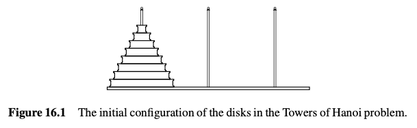
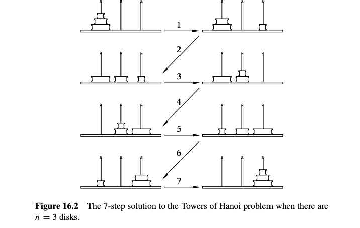
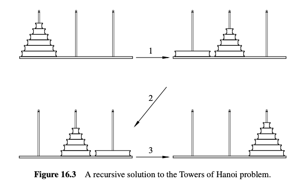

# 16. 生成函数

生成函数是离散数学中最令人惊讶和有用的发明之一。粗略地说，生成函数将关于**序列**的问题转化为关于**代数**的问题。这非常好，因为我们有很多代数规则。多亏了生成函数，我们可以将关于序列的问题简化为检查代数表达式的性质。这将允许我们使用生成函数来解决各种计数问题。

几种类型的生成函数，如普通生成函数、指数生成函数和狄利克雷生成函数，定期在组合数学中出现。此外，与普通生成函数密切相关的 $Z$ 变换在控制理论和信号处理方面非常重要。但是普通生成函数足以说明这个想法的力量，所以我们会坚持使用它们。因此，从现在开始，**生成函数**将意味着普通生成函数，我们将提供这一大主题的一个片段，展示生成函数如何用于解决某些类型的计数问题，以及如何用它们找到线性递归函数的简单公式。

## 16.1 无限级数

非正式地说，一个生成函数 $F(x)$ 是一个无限级数

$$ 
F(x) = f_0 + f_1 x + f_2 x^2 + f_3 x^3 + \cdots 。 \tag{16.1} 
$$

我们使用记号 $[x^n]F(x)$ 表示生成函数 $F(x)$ 中 $x^n$ 的系数。也就是说，

$$
[x^n]F(x) \overset{\text{def}}{=} f_n
$$

通过将序列的元素作为生成函数的连续系数来分析任何数列 $f_0, f_1, \ldots f_n \ldots$ 的行为。事实证明，由计数、递归定义和编程问题产生的复杂序列的性质，通过将它们视为生成函数，可以很容易地解释。

生成函数可以产生显著的见解，即使系数序列是平凡的。例如，设 $G(x)$ 是所有项为1, 1, 1, \ldots 的无限序列的生成函数，即几何级数。

$$
G(x) \overset{\text{def}}{=} 1 + x + x^2 + \cdots + x^n + \cdots 。 \tag{16.2} 
$$

我们将使用典型的生成函数推理来推导 $G(x)$ 的一个简单公式。这个方法实际上是14.1.2节摄动法的一个简化版本。具体来说，

$$ 
G(x) = 1 + x + x^2 + x^3 + \cdots + x^n + \cdots $$ $$ -xG(x) = - x - x^2 - x^3 - \cdots - x^n - \cdots
$$

$$ 
G(x) - xG(x) = 1 
$$

解 $G(x)$ 得到

$$ 
\frac{1}{1 - x} = G(x) \overset{\text{def}}{=} \sum_{n=0}^{\infty} x^n 。 \tag{16.3} 
$$

换句话说，

$$
[x^n] \left( \frac{1}{1 - x} \right) = 1 
$$

继续这种方法得到 $N(x)$ 的一个公式：

$$
N(x) \overset{\text{def}}{=} 1 + 2x + 3x^2 + \cdots + (n + 1)x^n + \cdots 。 \tag{16.4} 
$$

具体来说，

$$ 
N(x) = 1 + 2x + 3x^2 + 4x^3 + \cdots + (n + 1)x^n + \cdots $$ $$ -xN(x) = - x - 2x^2 - 3x^3 - \cdots - nx^n - \cdots 
$$

$$
N(x) - xN(x) = 1 + x + x^2 + x^3 + \cdots + x^n + \cdots = G(x) 
$$

解 $N(x)$ 得到

$$ 
\frac{1}{(1 - x)^2} = \frac{G(x)}{1 - x} = N(x) \overset{\text{def}}{=} \sum_{n=0}^{\infty} (n + 1)x^n 。 \tag{16.5} 
$$

换句话说，

$$ 
[x^n] \left( \frac{1}{(1 - x)^2} \right) = n + 1。 
$$

### 16.1.1 不必在意收敛性

方程 (16.3) 和 (16.5) 在 $|x| < 1$ 时数值上成立，因为当 $|x| \geq 1$ 时，两个生成函数级数都会发散。但是在生成函数的背景下，我们将无限级数视为正式的代数对象。方程如 (16.3) 和 (16.5) 定义了符号上的恒等式，仅出于纯粹的代数原因是成立的。事实上，可以很好地利用由在任何地方（除了 $x = 0$）不收敛的无限级数确定的生成函数。我们将在本章末的16.5节进一步解释这一点，但现在，请相信你不需要担心收敛性。

## 16.2 使用生成函数计数

生成函数对于表示和计数选择 $n$ 个物品的方法特别有用。例如，假设有两种口味的甜甜圈，巧克力和普通的。设 $d_n$ 是选择 $n$ 个巧克力或普通口味甜甜圈的方法数。 $d_n = n + 1$，因为有 $n + 1$ 种这样的甜甜圈选择——全部是巧克力，1 个普通和 $n - 1$ 个巧克力，2 个普通和 $n - 2$ 个巧克力，……，全部是普通的。我们通过设生成函数 $D(x)$ 用来计数这些甜甜圈选择，令 $x^n$ 的系数为 $d_n$。这给出了方程

$$ 
D(x) = \frac{1}{(1 - x)^2}。 \tag{16.6} 
$$

### 16.2.1 苹果和香蕉

更一般地，假设我们有两种东西——比如苹果和香蕉——以及一些关于每种东西可以选择多少的限制。假设有 $a_n$ 种选择 $n$ 个苹果的方法和 $b_n$ 种选择 $n$ 个香蕉的方法。选择苹果的生成函数为

$$ 
A(x) \overset{\text{def}}{=} \sum_{n=0}^{\infty} a_n x^n
$$

选择香蕉的生成函数为

$$ 
B(x) \overset{\text{def}}{=} \sum_{n=0}^{\infty} b_n x^n 
$$

现在假设苹果是以每 6 个一篮子的形式出现的，所以没有办法选择 1 到 5 个苹果，只有一种选择 6 个苹果的方法，没有选择 7 个的方法，依此类推。换句话说，

$$ 
a_n = \begin{cases} 
1 & \text{如果 } n \text{ 是 6 的倍数}, \\
0 & \text{否则}.
\end{cases} 
$$

在这种情况下，我们将有

$$ 
A(x) = 1 + x^6 + x^{12} + \cdots + x^{6n} + \cdots = \frac{1}{1 - x^6}
$$

假设有两种香蕉——红色和黄色。现在，$b_n = n + 1$，通过同样的推理来计算选择 $n$ 个巧克力和普通甜甜圈的方法，我们有

$$
B(x) = \frac{1}{(1 - x)^2}。 
$$

那么，选择 $n$ 个苹果和香蕉混合物的方法有多少呢？首先，我们决定选择多少个苹果。这可以是任意从 0 到 $n$ 的数。我们然后以 $a_k$ 种方式选择这些苹果，这就留下了 $n - k$ 个香蕉要被选择，这可以通过 $b_{n - k}$ 种方式来选择。所以选择 $k$ 个苹果和 $n - k$ 个香蕉的总方法数是 $a_k b_{n - k}$。这意味着选择一些大小为 $n$ 的苹果和香蕉混合物的方法总数是

$$ 
a_0 b_n + a_1 b_{n-1} + a_2 b_{n-2} + \cdots + a_n b_0。 \tag{16.7} 
$$

### 16.2.2 生成函数的乘积

现在这里是计数和生成函数之间的酷联系：表达式 (16.7) 等于生成函数乘积 $A(x) B(x)$ 中 $x^n$ 的系数。换句话说，我们声称

::: prop
$$
[x^n](A(x) \cdot B(x)) = a_0 b_n + a_1 b_{n-1} + a_2 b_{n-2} + \cdots + a_n b_0。 \tag{16.8}
$$
:::

为了解释生成函数乘积规则，我们可以通过使用一个表来识别来自乘积和的所有交叉项来考虑评估 $A(x) \cdot B(x)$ 的乘积：

$$
\begin{array}{c|cccc}
 & b_0 x^0 & b_1 x^1 & b_2 x^2 & b_3 x^3 & \cdots \\
\hline
a_0 x^0 & a_0 b_0 x^0 & a_0 b_1 x^1 & a_0 b_2 x^2 & a_0 b_3 x^3 & \cdots \\
a_1 x^1 & a_1 b_0 x^1 & a_1 b_1 x^2 & a_1 b_2 x^3 & \cdots \\
a_2 x^2 & a_2 b_0 x^2 & a_2 b_1 x^3 & \cdots \\
a_3 x^3 & a_3 b_0 x^3 & \cdots \\
\vdots & \cdots \\
\end{array}
$$

在这种布局中，所有涉及的术语在一个 45 度倾斜的对角线上。这样，乘积 $A(x) \cdot B(x)$ 中的 $x^n$ 系数是对角线上所有术语的系数的和，即 (16.7)。乘积 $A(x) \cdot B(x)$ 的系数序列称为序列 $(a_0, a_1, a_2, \ldots)$ 和 $(b_0, b_1, b_2, \ldots)$ 的卷积。除了它们的代数作用外，序列的卷积在信号处理和控制理论中起着重要作用。

这个乘积规则为几何级数 $1/(1 - x)$ 不论收敛性如何都等于 1/(1 - x) 提供了代数上的正当性。具体来说，常数 1 描述了生成函数

$$ 
1 = 1 + 0x + 0x^2 + \cdots + 0x^n + \cdots 
$$

同样，表达式 1 - x 描述了生成函数

$$ 
1 - x = 1 + (-1)x + 0x^2 + \cdots + 0x^n + \cdots 
$$

因此，对于系数全为1的级数 $G(x)$，乘积规则以纯代数方式暗示

$$ 
(1 - x) \cdot G(x) = 1 + 0x + 0x^2 + \cdots + 0x^n + \cdots = 1。 
$$

换句话说，根据乘积规则，几何级数 $G(x)$ 是 $1 - x$ 的乘法逆元 $1/(1 - x)$。

类似的推理证明了将生成函数乘以一个常数项。即，乘积规则的一个特例是

::: prop
$$
[x^n](c \cdot F(x)) = c \cdot [x^n]F(x)。 \tag{16.9}
$$
:::

### 16.2.3 卷积规则

我们可以用以下规则总结上面的讨论

::: prop
卷积规则:

$$
 \text{设 } A(x) \text{ 是从集合 } A \text{ 中选择项的生成函数，} B(x) \text{ 是从集合 } B \text{ 中选择项的生成函数。选择来自不相交集合 } A \cup B \text{ 的项的生成函数是乘积 } A(x) \cdot B(x)。
$$
:::

这个规则取决于一种选择项的精确定义“从集合 $A \cup B$ 中选择项的集合”。不过，从集合 $A$ 和集合 $B$ 中选择项的限制来定义选择项的生成函数是很容易理解的。

### 16.2.4 用卷积规则计数甜甜圈

我们可以使用卷积规则以另一种方式推导出选择巧克力和普通甜甜圈的方法数的生成函数 $D(x)$，如 (16.6) 中所示。首先，选择 $n$ 个巧克力甜甜圈的方法只有一种。这意味着选择 $n$ 个巧克力甜甜圈的生成函数的每一个系数都等于1。所以巧克力甜甜圈选择的生成函数是 $1/(1 - x)$；同样地，选择 $n$ 个普通甜甜圈的生成函数也是 $1/(1 - x)$。现在通过卷积规则，当同时有巧克力和普通口味时，选择 $n$ 个甜甜圈的方法数的生成函数是

$$
 D(x) = \frac{1}{1 - x} \cdot \frac{1}{1 - x} = \frac{1}{(1 - x)\^2}。 
$$

所以我们在没有引用 (16.5) 的情况下推导了 (16.6)。

我们应用卷积规则来处理两种口味的情况同样适用于 $k$ 种口味的情况；当有 $k$ 种口味可供选择时，选择甜甜圈的方法数的生成函数是 $1/(1 - x)^k$。我们已经从推论 15.5.3 中推导了当有 $k$ 种口味可供选择时选择 $n$ 个甜甜圈的方法数的公式，即

$$ 
[x^n] \left( \frac{1}{(1 - x)^k} \right) = \binom{n + (k - 1)}{n}。 \tag{16.10} 
$$

### 使用麦克劳林定理提取系数

我们已经使用甜甜圈计数论证来推导出 $1/(1 - x)^k$ 的系数，但通过麦克劳林定理用代数方法推导这个系数也是有启发的。

::: thm

#### 定理 16.2.1 (麦克劳林定理).

$$ 
f(x) = f(0) + f'(0)x + \frac{f''(0)}{2!} x^2 + \frac{f'''(0)}{3!} x^3 + \cdots + \frac{f^{(n)}(0)}{n!} x^n + \cdots。
$$

这个定理表明 $1/(1 - x)^k$ 的第 $n$ 个系数等于其在 0 处的第 $n$ 阶导数再除以 $n!$。计算第 $n$ 阶导数并不困难：

$$ 
\frac{d^n}{dx^n} \left( \frac{1}{(1 - x)^k} \right) = k(k + 1) \cdots (k + n - 1)(1 - x)^{-(k + n)}。 
$$

换句话说，

$$ 
[x^n] \left( \frac{1}{(1 - x)^k} \right) = \left( \frac{d^n}{dx^n} \left( \frac{1}{(1 - x)^k} \right) (0) \right) \frac{1}{n!} 
$$

$$
= \frac{k(k + 1) \cdots (k + n - 1)(1 - 0)^{-(k + n)}}{n!} = \binom{n + (k - 1)}{n}。 
$$

换句话说，代替使用甜甜圈计数公式 (16.10) 来找到 $x^n$ 的系数，我们可以使用这个代数论证和卷积规则来推导甜甜圈计数公式。

### 16.2.5 从卷积规则中得出的二项式定理

卷积规则还提供了另一个证明二项式定理 15.6.4 的途径。具体来说，首先，处理单个元素集 $\{a_1\}$。从这个集合中选择 $n$ 个不同元素的方法数的生成函数就是 $1 + x$：我们有 1 种方法选择零个元素，1 种方法选择一个元素，0 种方法选择超过一个元素。类似地，从任意单元素集合 $\{a_i\}$ 中选择 $n$ 个元素的方法数具有相同的生成函数 $1 + x$。现在通过卷积规则，从集合 $\{a_1, a_2, \ldots, a_m\}$ 中选择 $n$ 个元素的方法数的生成函数是从每个 $m$ 个单元素集合中选择的方法生成函数的乘积，即 $(1 + x)^m$。由于我们知道从大小为 $m$ 的集合中选择 $n$ 个元素的方法数为 $\binom{m}{n}$，我们得出结论

$$ 
[x^n](1 + x)^m = \binom{m}{n} 
$$

这是二项式定理 15.6.4 的一个重述。因此，我们在没有分析 $(1 + x)^m$ 展开成积的情况下证明了二项式定理。

这些甜甜圈计数的例子和推导二项式系数说明了生成函数的强大之处：

> 生成函数可以允许通过代数操作解决计数问题，反之亦然，它们可以通过计数技巧推导代数恒等式。

### 16.2.6 一个荒谬的计数问题

到目前为止，我们用生成函数所做的一切都可以通过其他方式完成。但是这里有一个荒谬的计数问题——真的非常夸张！我们可以用以下限制来填充一个包含 $n$ 个水果的袋子有多少种方式？

-   苹果的数量必须是偶数。
-   香蕉的数量必须是 5 的倍数。
-   橙子的数量最多为四个。
-   梨的数量最多为一个。

例如，以下是用 6 个水果形成袋子的 7 种方法：

| 苹果 | 6   | 4   | 4   | 2   | 2   | 0   | 0   |
|------|-----|-----|-----|-----|-----|-----|-----|
| 香蕉 | 0   | 0   | 0   | 0   | 0   | 5   | 5   |
| 橙子 | 0   | 2   | 1   | 4   | 3   | 1   | 0   |
| 梨   | 0   | 0   | 1   | 0   | 1   | 0   | 1   |

这些约束条件如此复杂，以至于得到一个好的答案似乎是不可能的。但让我们看看生成函数揭示了什么。

首先，我们将构造一个选择苹果的生成函数。由于苹果数量必须是偶数，我们可以以一种方式选择 0 个苹果，以一种方式选择 2 个苹果，零种方式选择 3 个苹果，依此类推。因此，我们有：

$$ 
A(x) = 1 + x^2 + x^4 + x^6 + \cdots = \frac{1}{1 - x^2}。 
$$

类似地，选择香蕉的生成函数是：

$$ 
B(x) = 1 + x^5 + x^{10} + x^{15} + \cdots = \frac{1}{1 - x^5}。 
$$

现在，我们可以以一种方式选择 0 个橙子，以一种方式选择 1 个橙子，以一种方式选择 2 个橙子，以一种方式选择 3 个橙子，以一种方式选择 4 个橙子。我们不能选择超过四个橙子，因此我们有生成函数：

$$ 
O(x) = 1 + x + x^2 + x^3 + x^4 = \frac{1 - x^5}{1 - x}。 
$$

最后，我们只能选择 0 或 1 个梨，所以我们有：

$$ 
P(x) = 1 + x。 
$$

卷积规则说，从四种水果中选择的方法数的生成函数是：

$$ 
A(x)B(x)O(x)P(x) = \frac{1}{1 - x^2} \cdot \frac{1}{1 - x^5} \cdot \frac{1 - x^5}{1 - x} \cdot (1 + x) = \frac{1}{(1 - x)^2} = 1 + 2x + 3x^2 + 4x^3 + \cdots 
$$

几乎所有的东西都消除了！我们得到了 $1/(1 - x)^2$，它给出了一个幂级数：$x^n$ 的系数只是 $n + 1$。因此，形成一个包含 $n$ 个水果的袋子的方法数仅为 $n + 1$。这与我们之前计算的示例一致，因为我们计算了包含 6 个水果的 7 种不同水果袋。太惊人了！

这个例子被人为地看起来复杂，目的是为了突出生成函数的计数能力。但是这个简单的建议表明，应该有一个不用生成函数就能得出这种结论的初等推导，实际上确实存在 (见问题 16.8)。

## 16.3 部分分式

我们通过化简生成函数为我们已经知道其幂级数系数的表达式 $1/(1 - x)^2$ 解决了 16.2.6 节中看似不可能的计数问题。这个问题设置为使答案能够巧妙地解决，但其他问题就不是这样了。为了使用生成函数解决更多的一般问题，我们需要找到给定公式的生成函数的幂级数系数。麦克劳林定理 16.2.1 是一个非常通用的方法来找到系数，但它仅适用于可以找到重复导数的公式，这并不常见。然而，有一种自动方法可以找到任何公式的幂级数系数，该公式是多项式的商，即从基础微积分中得到的部分分式方法。

部分分式方法基于这样的事实：多项式的商可以表示为项的和，这些项的幂级数系数有简单的公式。例如，当分母多项式具有不同的非零根时，方法依赖于

::: lem
**引理 16.3.1**

设 $p(x)$ 是一个次数小于 $n$ 的多项式，并且设 $\alpha_1, \ldots, \alpha_n$ 是不同的非零数。那么存在常数 $c_1, \ldots, c_n$ 使得

$$ 
\frac{p(x)}{(1 - \alpha_1 x)(1 - \alpha_2 x) \cdots (1 - \alpha_n x)} = \frac{c_1}{1 - \alpha_1 x} + \frac{c_2}{1 - \alpha_2 x} + \cdots + \frac{c_n}{1 - \alpha_n x} 
$$
:::

我们通过找到函数 $R(x) \overset{\text{def}}{=} \frac{x}{1 - x - x^2}$ 的幂级数系数来说明引理 16.3.1 的使用。

我们可以用二次公式找到分母 $1 - x - x^2$ 的根 $r_1, r_2$：

$$ 
r_1 = \frac{-1 - \sqrt{5}}{2}, \quad r_2 = \frac{-1 + \sqrt{5}}{2}。 
$$

所以

$$ 
1 - x - x^2 = (x - r_1)(x - r_2) = r_1 r_2 (1 - x/r_1)(1 - x/r_2)。
$$

通过一些代数，我们发现

$$ 
R(x) = \frac{x}{(1 - \alpha_1 x)(1 - \alpha_2 x)}
$$

其中

$$ 
\alpha_1 = \frac{1 + \sqrt{5}}{2}, \quad \alpha_2 = \frac{1 - \sqrt{5}}{2}。 
$$

接下来，我们找到满足以下条件的 $c_1$ 和 $c_2$：

$$ 
\frac{x}{(1 - \alpha_1 x)(1 - \alpha_2 x)} = \frac{c_1}{1 - \alpha_1 x} + \frac{c_2}{1 - \alpha_2 x}。
$$

一般来说，我们可以通过代入 $x$ 的几个值来生成两个关于 $c_1$ 和 $c_2$ 的线性方程，然后求解 $c_1$ 和 $c_2$ 的方程。在这种情况下，一种更简单的方法是通过分母的左侧乘以 (16.11) 的两边来得到

$$ 
x = c_1(1 - \alpha_2 x) + c_2(1 - \alpha_1 x)。
$$

现在令 $x = 1/\alpha_2$，我们得到

$$ 
c_2 = \frac{1/\alpha_2}{1 - \alpha_1/\alpha_2} = \frac{1/\alpha_2}{\alpha_2 - \alpha_1} = -\frac{1}{\sqrt{5}}， 
$$

类似地，令 $x = 1/\alpha_1$ 得到

$$
c_1 = \frac{1}{\sqrt{5}}。
$$

将这些 $c_1, c_2$ 的值代入方程 (16.11) 最终得到了部分分式展开：

$$
R(x) = \frac{x}{1 - x - x^2} = \frac{1}{\sqrt{5}} \left( \frac{1}{1 - \alpha_1 x} - \frac{1}{1 - \alpha_2 x} \right) 
$$

部分分式展开中的每一项都有一个简单的幂级数公式，由几何和公式给出：

$$ 
\frac{1}{1 - \alpha_1 x} = 1 + \alpha_1 x + \alpha_1^2 x^2 + \cdots 
$$

$$
\frac{1}{1 - \alpha_2 x} = 1 + \alpha_2 x + \alpha_2^2 x^2 + \cdots 
$$

将这些级数代入生成函数的幂级数：

$$ 
R(x) = \frac{1}{\sqrt{5}} \left( (1 + \alpha_1 x + \alpha_1^2 x^2 + \cdots) - (1 + \alpha_2 x + \alpha_2^2 x^2 + \cdots) \right) 
$$

因此

$$ 
[x^n]R(x) = \frac{\alpha_1^n - \alpha_2^n}{\sqrt{5}} = \frac{1}{\sqrt{5}} \left( \left( \frac{1 + \sqrt{5}}{2} \right)^n - \left( \frac{1 - \sqrt{5}}{2} \right)^n \right)。 \tag{16.12} 
$$

#### 16.3.1 重根的部分分式

引理 16.3.1 推广到分母多项式具有重非零根，重数为 $m$ 的情况，通过将商展开为形式为

$$ 
\frac{c}{(1 - \alpha x)^k} 
$$

的项的和，其中 $\alpha$ 是根的倒数并且 $k \leq m$。这种形式的项的系数公式来自甜甜圈公式 (16.10)：

$$ 
[x^n] \left( \frac{c}{(1 - \alpha x)^k} \right) = c \alpha^n \binom{n + (k - 1)}{n}。 \tag{16.13} 
$$

### 16.4 解决线性递归

#### 16.4.1 斐波那契数列的生成函数

斐波那契数列 $f_0, f_1, \ldots, f_n, \ldots$ 递归定义如下：

$$ 
f_0 \overset{\text{def}}{=} 0 
$$

$$
f_1 \overset{\text{def}}{=} 1 
$$

$$
f_n \overset{\text{def}}{=} f_{n-1} + f_{n-2} \quad \text{(for \( n \geq 2 \))} 
$$

生成函数现在将允许我们推导出 $f_n$ 的惊人闭式。

令 $F(x)$ 为斐波那契数列的生成函数，即

$$
F(x) \overset{\text{def}}{=} f_0 + f_1 x + f_2 x^2 + \cdots + f_n x^n + \cdots。 
$$

我们按照本章开始时推导几何级数公式的方法进行推导，

$$
\begin{aligned}
F(x) &= f_0 + f_1 x + f_2 x^2 + \cdots + f_n x^n + \cdots。 \\
-x F(x) &= -f_0 x - f_1 x^2 - \cdots - f_{n-1} x^n - \cdots。 \\
-x^2 F(x) &= -f_0 x^2 - \cdots - f_{n-2} x^n - \cdots。
\end{aligned}
$$

于是

$$
F(x)(1 - x - x^2) = f_0 + (f_1 - f_0)x + 0x^2 + \cdots + 0x^n + \cdots。 
$$

因此

$$ 
F(x) = \frac{x}{1 - x - x^2}。 
$$

但 $F(x)$ 与我们在 16.3 节中用于说明部分分式方法的函数相同。所以根据等式 (16.12)，我们得到所谓的 Binet 公式：

$$ 
f_n = \frac{1}{\sqrt{5}} \left( \left( \frac{1 + \sqrt{5}}{2} \right)^n - \left( \frac{1 - \sqrt{5}}{2} \right)^n \right)。 \tag{16.14} 
$$

Binet 公式对于斐波那契数列来说是令人惊讶且可能让人害怕的。右边的表达式 (16.14) 是整数并不是显而易见的。但这个公式非常有用。例如，通过重复求和方法，它提供了一种更有效的计算斐波那契数的方法，而不是通过递归。它还显式地说明了这些数的指数增长。

#### 16.4.2 汉诺塔

传说，在河内有一座寺庙，有三根柱子和 64 个不同大小的金盘子。每个盘子中间都有一个孔，可以放在柱子上。在迷雾中，所有的盘子都放在第一根柱子上，最大的在底部，最小的在顶部，如图 16.1 所示。

寺庙中的僧侣多年来一直在努力按照以下规则将所有盘子移动到另一个柱子上：

-   唯一允许的动作是从一个柱子上取下顶部的盘子并将其放在另一个柱子上。
-   较大的盘子不能位于较小的盘子之上。

例如，将整个盘子堆一起拿起并放在另一个柱子上是非法的。这很好，因为传说说，当僧侣们完成这个难题时，世界就会终结！

为澄清问题，假设只有 3 个金盘子而不是 64 个。那么这个难题可以在 7 步内解决，如图 16.2 所示。

我们必须回答的问题是：“如果有足够的时间，僧侣们能成功吗？”如果可以，“世界末日还要多久？”最重要的是，“这会在期末考试之前发生吗？”

##### 递归解法

汉诺塔问题可以递归解决。我们在描述过程中，还将分析解决 $n$ 盘子问题所需的最小步骤数 $t_n$。例如，一些实验表明 $t_1 = 1$ 和 $t_2 = 3$。如上所示的程序使用了 7 步，这表明 $t_3$ 最多为 7。

递归解法有三个阶段，如图 16.3 所示。为清楚起见，最大盘子在图中被阴影表示。

-   阶段 1：将前 $n-1$ 个盘子从第一根柱子移到第二根柱子上，使用 $n-1$ 个盘子的解决方案。可以在 $t_{n-1}$ 步内完成。
-   阶段 2：将最大盘子从第一根柱子移到第三根柱子。这只需 1 步。
-   阶段 3：将第二根柱子上的 $n-1$ 个盘子移到第三根柱子上，使用 $n-1$ 盘子的解决方案。也可以在 $t_{n-1}$ 步内完成。

这个算法表明，将 $n$ 个盘子移动到不同柱子所需的最小步骤数 $t_n$ 最多为

$$ 
t_n \leq t_{n-1} + 1 + t_{n-1} = 2 t_{n-1} + 1。 
$$

我们可以用这个事实来上界移动各种高度盘子所需的操作次数：

$$ 
t_3 \leq 2 \cdot t_2 + 1 = 7 
$$

$$
t_4 \leq 2 \cdot t_3 + 1 \leq 15 
$$

以此类推，我们可以最终计算出移动 64 个盘子所需的步骤数的上界。因此这个算法回答了第一个问题：如果有足够的时间，僧侣们可以完成他们的任务并结束世界。这是一个耻辱。毕竟，他们可能想打几个高五，然后出去吃汉堡和冰淇淋，但没有——世界结束了。

##### 寻找递归

我们还不能确切计算僧侣们需要多少步骤来移动 64 个盘子，只能计算出一个上界。也许，僧侣们从时间开始就一直在思考这个问题，他们想出了一个更好的算法。

幸运的是，没有更好的算法。原因如下：在某些步骤中，僧侣们必须将最大盘子从第一根柱子移到另一根柱子。为此，必须将 $n-1$ 个较小的盘子全部堆在唯一剩下的柱子上。以这种方式排列 $n-1$ 个较小盘子至少需要 $t_{n-1}$ 次移动。在最大盘子移动后，将 $n-1$ 个盘子堆在最大盘子上至少需要另 $t_{n-1}$ 次移动。

这个论证表明所需的步骤数至少为 $2 t_{n-1} + 1$。由于我们给出的算法正好使用这个步骤数，我们现在可以写出 $t_n$ 的表达式，移动 $n$ 个盘子完成汉诺塔问题所需的步骤数：

$$
t_0 = 0 
$$

$$ 
t_n = 2 t_{n-1} + 1 \quad \text{(for \( n \geq 1 \))。} 
$$

##### 解决递归

我们现在可以使用生成函数为 $t_n$ 找到一个公式。令 $T(x)$ 为 $t_n$ 的生成函数，即

$$ 
T(x) \overset{\text{def}}{=} t_0 + t_1 x + t_2 x^2 + \cdots + t_n x^n + \cdots。 
$$

我们像对斐波那契递归一样进行推导，

$$
\begin{aligned}
T(x) &= t_0 + t_1 x + \cdots + t_n x^n + \cdots \\
-2x T(x) &= -2 t_0 x - 2 t_1 x^2 - \cdots - 2 t_{n-1} x^n - \cdots \\
-1/(1-x) &= -1 - x - x^2 - \cdots \\
T(x)(1 - 2x) &= t_0 - 1 + 0x + \cdots + 0x^n + \cdots = -1,
\end{aligned}
$$

因此

$$ T(x)(1 - 2x) = \frac{1}{1 - x} - 1 = \frac{x}{1 - x}, $$

并且

$$
 T(x) = \frac{x}{(1 - 2x)(1 - x)}。 
$$

使用部分分式，

$$ 
\frac{x}{(1 - 2x)(1 - x)} = \frac{c_1}{1 - 2x} + \frac{c_2}{1 - x}
$$

对于某些常数 $c_1, c_2$。现在将两边乘以左分母得

$$ 
x = c_1(1 - x) + c_2(1 - 2x)。 
$$

将 $x = 1/2$ 代入，得到 $c_1 = 1$，将 $x = 1$ 代入，得到 $c_2 = -1$。

最后，我们可以读出移动 $n$ 个盘子所需的步骤数的简单公式：

$$ 
t_n = [x^n] T(x) = [x^n] \left( \frac{1}{1 - 2x} - \frac{1}{1 - x} \right) = 2^n - 1。
$$

#### 16.4.3 解决一般线性递归

形如

$$
f(n) = c_1 f(n - 1) + c_2 f(n - 2) + \cdots + c_d f(n - d) + h(n) \tag{16.15} 
$$

的方程称为具有非齐次项 $h(n)$ 的 $d$ 阶线性递归，常数 $c_i \in \mathbb{C}$。

上面使用的方法可以用来解决具有大量非齐次项的线性递归。特别是，当非齐次项本身具有可以表示为多项式商的生成函数时，上述用于推导斐波那契和汉诺塔示例生成函数的方法可以推广到得到定义生成函数 $f(0) + f(1)x + f(2)x^2 + \cdots$ 的多项式商。然后，可以使用部分分式找到 $f(n)$ 的公式，该公式是形式为 $n^k \alpha^n$ 的项的线性组合，其中 $k$ 是非负整数，$k \leq d$，而 $\alpha$ 是分母多项式根的倒数。例如，请参见问题 16.14、16.15、16.18 和 16.19。

### 16.5 形式幂级数

#### 16.5.1 发散生成函数

令 $F(x)$ 为 $n!$ 的生成函数，即

$$
F(x) \overset{\text{def}}{=} 1 + 1x + 2x^2 + \cdots + n!x^n + \cdots。 
$$

由于 $x^n = o(n!)$ 对于所有 $x \neq 0$，此生成函数仅在 $x = 0$ 时收敛。

接下来，令 $H(x)$ 为 $n \cdot n!$ 的生成函数，即

$$
H(x) \overset{\text{def}}{=} 0 + 1x + 4x^2 + \cdots + n \cdot n!x^n + \cdots。 
$$

同样，$H(x)$ 仅在 $x = 0$ 时收敛，因此 $H(x)$ 和 $F(x)$ 描述相同的部分实数函数。

另一方面，$F(x)$ 和 $H(x)$ 对于所有 $x > 1$ 的幂具有不同的系数，我们可以将它们用作正式的符号对象来区分它们。

为说明这一点，通过从 $F(x)$ 中减去 1，然后将剩余项除以 $x$，得到一个系数为 $(n + 1)!$ 的级数，即

$$
[x^n] \left( \frac{F(x) - 1}{x} \right) = (n + 1)!。 \tag{16.16} 
$$

通过进一步考虑 $F(x)$ 和 $H(x)$，我们可以推导出以下关于 $n!$ 的恒等式：

$$
n! = 1 + \sum_{i=1}^{n} (i - 1) \cdot (i - 1)!。 \tag{16.17} 
$$

证明这个恒等式，注意从 (16.16) 中我们有

$$
[x^n] H(x) \overset{\text{def}}{=} n \cdot n! = (n + 1)! - n! = [x^n] \left( \frac{F(x) - 1}{x} \right) - [x^n] F(x)。 
$$

换句话说，

$$
H(x) = \frac{F(x) - 1}{x} - F(x)， \tag{16.18} 
$$

解 $F(x)$，得到

$$
F(x) = \frac{xH(x) + 1}{1 - x}。 \tag{16.19} 
$$

但 $[x^n] (xH(x) + 1)/(1 - x)$ 对于 $n \geq 1$ 为 $(n - 1) \cdot (n - 1)!$，对于 $n = 0$ 为 1，根据卷积公式，

$$
[x^n] \left( \frac{xH(x) + 1}{1 - x} \right) = 1 + \sum_{i=1}^{n} (i - 1) \cdot (i - 1)!。 
$$

恒等式 (16.17) 现在立即从 (16.19) 推导出来。

#### 16.5.2 幂级数环

那么为什么我们不必担心收敛半径为零的级数，以及如何证明上节中的推导公式 (16.19)？答案来自于抽象地考虑无限数列及其操作。

例如，结合两个无限数列的基本操作是逐项相加。也就是说，如果我们令

$$
G \overset{\text{def}}{=} (g_0, g_1, g_2, \ldots)，
$$

$$
H \overset{\text{def}}{=} (h_0, h_1, h_2, \ldots)，
$$

那么我们可以定义序列和 $\oplus$ 的规则为：

$$
G \oplus H \overset{\text{def}}{=} (g_0 + h_0, g_1 + h_1, \ldots, g_n + h_n, \ldots)。
$$

另一个基本操作是序列乘法 $\otimes$，其通过卷积规则定义（而不是逐项）：

$$
G \otimes H \overset{\text{def}}{=} \left( g_0 h_0, g_0 h_1 + g_1 h_0, \ldots, \sum_{i=0}^{n} g_i h_{n-i}, \ldots \right)。
$$

这些操作在无限序列上有很多不错的性质。例如，容易检查序列相加和相乘是交换的：

$$
G \oplus H = H \oplus G，
$$

$$
G \otimes H = H \otimes G。
$$

如果我们令

$$ 
Z \overset{\text{def}}{=} (0, 0, 0, \ldots)，
$$

$$ 
I \overset{\text{def}}{=} (1, 0, 0, \ldots)，
$$

那么同样容易检查 $Z$ 表示零，$I$ 表示一：

$$ 
Z \oplus G = G，
$$

$$ 
Z \otimes G = Z
$$

$$ 
I \otimes G = G。 \tag{16.20}
$$

现在如果我们定义

$$
-G \overset{\text{def}}{=} (-g_0, -g_1, -g_2, \ldots)，
$$

那么

$$
 G \oplus (-G) = Z。
$$

事实上，操作 $\oplus$ 和 $\otimes$ 满足 9.7.1 节中描述的所有交换环公理。带有这些操作的无限数列集合称为数的形式幂级数环。

当 $G \otimes H = I$ 时，序列 $H$ 是序列 $G$ 的倒数。

$G$ 的倒数也称为乘法逆或简单的 $G$ 的“逆”。环公理暗示，如果存在逆，则它是唯一的（请参见问题 9.33），所以如果它存在，可以明确使用 $1/G$ 表示这个逆。例如，令

$$
J \overset{\text{def}}{=} (1, -1, 0, 0, \ldots)，
$$

$$
K \overset{\text{def}}{=} (1, 1, 1, 1, \ldots)，
$$

定义 $G$ 为 $I \oplus K = I$，因此 $J = 1/J$ 和 $J = 1/K$。

在形式幂级数环中，等式 (16.20) 意味着零序列 $Z$ 没有逆，因此 $1/Z$ 是未定义的——就像实数上的表达式 1/0 是未定义的一样。很容易验证一个级数当且仅当其初始元素非零时有逆（请参见问题 16.25）。

现在我们可以解释正确理解生成函数定义的方法

$$
G(x) \overset{\text{def}}{=} \sum\_{n=0}\^{\infty} g_n x\^n。
$$

这意味着 $G(x)$ 实际上是指其在形式幂级数环中系数的无限数列 $(g_0, g_1, \ldots)$。简单表达式 $x$ 可以理解为

$$
X \overset{\text{def}}{=} (0, 1, 0, 0, \ldots)。
$$

同样，$1 - x$ 简写为上面的序列 $J$，熟悉的等式

$$ 
\frac{1}{1 - x} = 1 + x + x^2 + x^3 + \cdots \tag{16.21} 
$$

可以理解为重新陈述断言 $K$ 是 $1/J$。换句话说，变量 $x$ 的幂仅用作占位符——作为卷积定义的提醒。等式 (16.21) 与 $x$ 的值或级数的收敛无关。相反，它表示在形式幂级数环中成立的性质。关于发散级数的推理在这种表示中完全在形式幂级数的性质中得到正当性。
