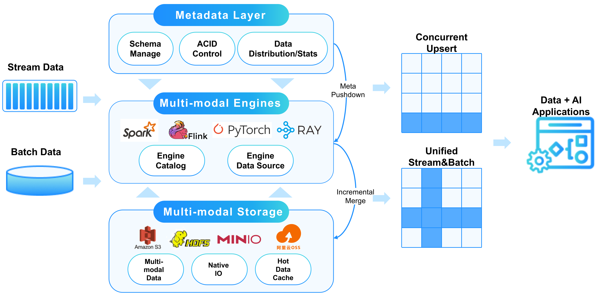
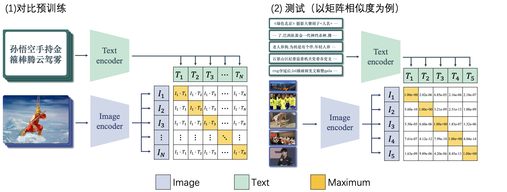

# 二、数据湖LakeSoul注定失败的尝试

## 选题的意义

-   熟悉新兴技术数据湖
-   熟悉使用 Docker

## 数据湖的概述

架构简述

## 遇到的问题

-   只能从 `Spark` 读入, 难以从数据湖中读出(官方样例)
    -   原因分析: 官网没有标注`pytorch`的版本
        -   更新的`pytorch`更改了并行任务实现的模式
        -   在pytorch端报了错`init_task_group must be called`

询问开发LakeSoul的专家: "我看看"

-   要了版本号: 和他们的 C 写的后端不兼容
    -   `double free`
    -   阅读 C 代码要比阅读 Python 代码需要显著的时间

## 所以先放着

-   调了 \~2 周, 难以发现解决方案
-   `ddl` 要来了, 怎么办
-   💡 数据湖又不止它一家
    -   干脆熬它一个通宵找个靠谱的实现了吧

# 三、基于LakeFS的图像检索系统

## LFS选题意义

技能层面

-   实时添加和读取
-   快速获取结果

知识层面

-   前后端分离
    -   我: 后端(提供API, 入数据湖, 出数据湖)
    -   Shurui Hu: 提供前端, 图像解析等
-   掌握新型框架

## LakeFS 是类似 Git 的文件管理

优点

-   任意数据大小
-   任意数据格式
-   所有的数据都是对象存储

## LakeFS 的原理

原理

-   使用Key-Value Store进行所有数据库操作
-   通用接口
    -   Get, Set, Compare-and-Set, Delete, Scan
    -   每个条目由[partition, key, value]三元组表示
-   KV实现依赖于后端数据库, 目前支持DynamoDB和PostgreSQL
-   lakeFS在KV Store之上实现了另一层用于管理元数据对象
    -   Repositories, Branches, Commits, Tags, Uncommitted Objects

## 流程

-   用户提交图片(BASE64)
    -   图片的特征入湖(`.npy`)
    -   返回当前的图片分类数量
    -   (前端) 更新为 `echarts`
-   用户提交文字
    -   图片特征出湖
    -   使用 `CLIP` 模型进行匹配, 得到top 3以及置信度
    -   (前端) 渲染对应的图片以及文字

## CLIP模型预览

## 实验结果展示二

(在远程服务器上面)

## 问题分析与讨论二

-   模型不够大 `ViT-B-16`.
    -   因此分类比较乱...
-   基本是一个 this can work 的样例 $\leftarrow$ 一晚上极限编程
