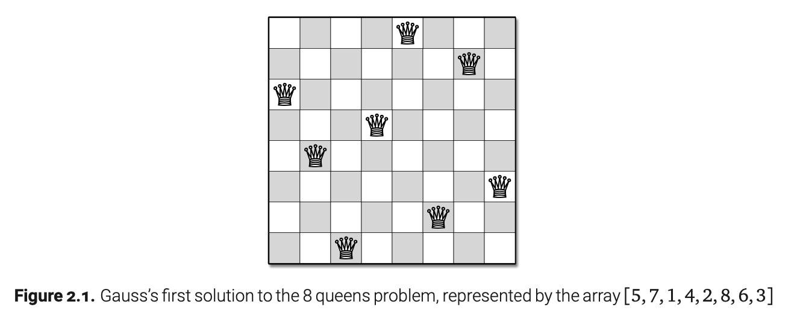
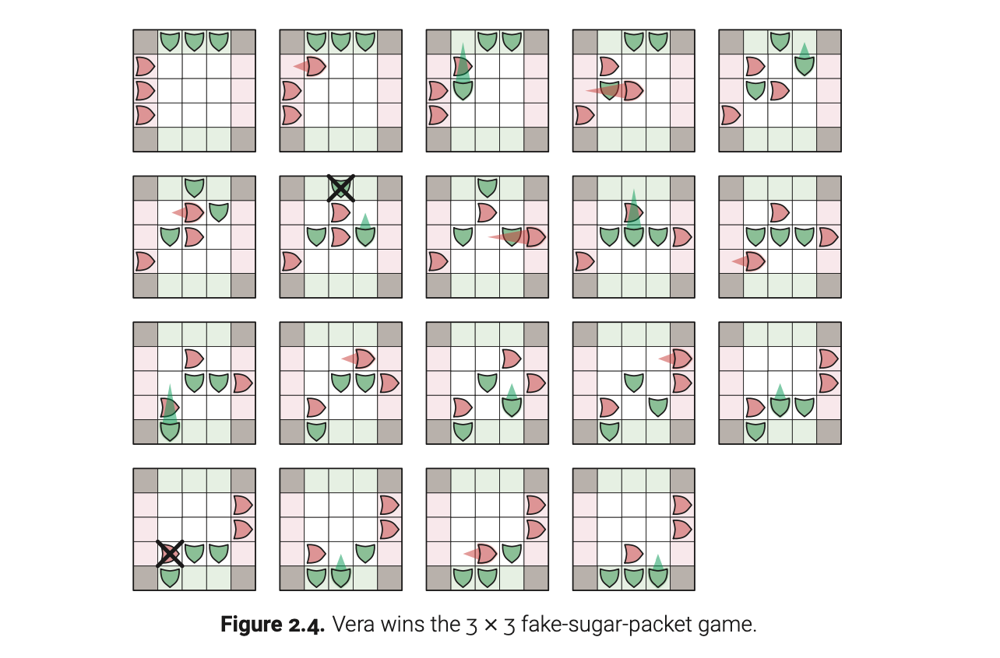
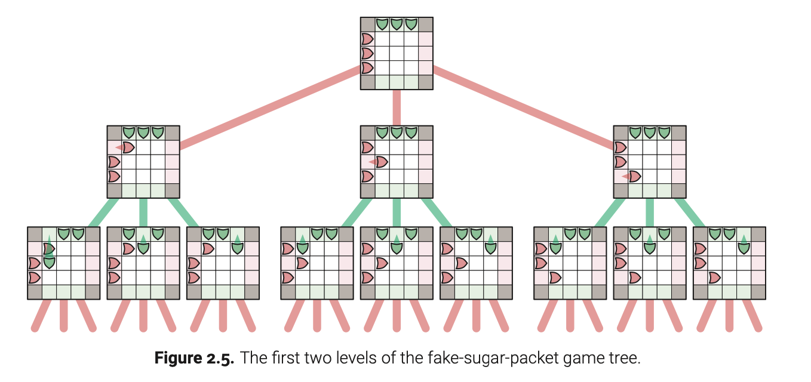

# 2. 回溯

## 2.1 n 皇后问题

原型回溯问题是经典的 n 皇后问题，最早由德国国际象棋爱好者 Max Bezzel 于 1848 年（使用笔名 “Schachfreund”）提出，针对标准的 $8 \times 8$ 棋盘，并由 François-Joseph Eustache Lionnet 于 1869 年提出更一般的 $n \times n$ 棋盘。问题是将 n 个皇后放置在 $n \times n$ 的棋盘上，使得没有两个皇后互相攻击。

对于不熟悉国际象棋规则的读者，这意味着没有两个皇后在同一行、同一列或同一对角线上。



1850 年，著名数学家卡尔·弗里德里希·高斯（Carl Friedrich Gauss）在给他的朋友 Heinrich Schumacher 的信中写道，可以很容易地通过试错法在几个小时内确认 Franz Nauck 关于八皇后问题有 92 种解法的说法。（“Schwer ist es übrigens nicht, durch ein methodisches Tatonniren sich diese Gewissheit zu verschaffen, wenn man 1 oder ein paar Stunden daran wenden will.”）他描述的方法 Tatonniren 源自法语 tâttonner，意为在黑暗中摸索，盲目探索。

高斯的信描述了以下递归策略来解决 n 皇后问题；1882 年法国数学教师 Édouard Lucas 描述了同样的策略，并将此方法归因于 Emmanuel Laquièrre。我们将皇后一行一行地放在棋盘上，从第一行开始。要放置第 $r$ 个皇后，我们在一个简单的循环中从左到右依次尝试每一个正方形。如果某个正方形被前面的皇后攻击，我们忽略该正方形；否则，我们暂时将皇后放置在该正方形上，并递归地摸索下一行中皇后的合法位置。

下图显示了产生的算法，该算法递归地枚举所有与给定部分解一致的完整 n 皇后解。遵循高斯的思路，我们使用数组 $Q[1..n]$ 表示皇后的位置，其中 $Q[i]$ 表示第 $i$ 行中包含皇后的正方形。调用 PlaceQueens 时，输入参数 $r$ 是第一个空行的索引，前缀 $Q[1..r-1]$ 包含前 $r-1$ 个皇后的位置。特别是，为了计算没有任何限制的所有 n 皇后解，我们会调用 $PlaceQueens(Q[1..n], 1)$。外部 for 循环考虑在第 $r$ 行放置皇后的所有可能位置；内部 for 循环检查候选位置是否与前 $r-1$ 行中的皇后位置一致。

PlaceQueens 的执行可以用递归树来说明。递归树中的每个节点对应一个递归子问题，从而对应一个局部部分解；特别是，根节点对应于空棋盘（$r=0$）。递归树中的边对应递归调用。叶子对应不能进一步扩展的部分解，要么因为每行已经有一个皇后，要么因为下一个空行中的每个位置都被现有皇后攻击。回溯搜索完整解相当于对这棵树进行深度优先搜索。

``` r
PlaceQueens(Q[1..n], r):
  if r = n + 1
    print Q[1..n]
  else
    for j ← 1 to n
      legal ← True
      for i ← 1 to r - 1
        if (Q[i] = j) or (Q[i] = j + r - i) or (Q[i] = j - r + i)
          legal ← False
      if legal
        Q[r] ← j
        PlaceQueens(Q[1..n], r + 1)
```

## 2.2 游戏树

考虑以下简单的双人游戏，在一个边界为正方形的 $n \times n$ 棋盘上进行。我们称玩家为 Horace Fahlberg-Remsen 和 Vera Rebaudi。每个玩家有 $n$ 个棋子，他们将棋子从棋盘的一边移动到另一边。Horace 的棋子从左边界开始，每行一个，水平向右移动；相应地，Vera 的棋子从上边界开始，每列一个，垂直向下移动。玩家轮流移动。在每一回合，Horace 可以将他的一个棋子向右移动一步到一个空位，或将他的一个棋子跳过 Vera 的一个棋子到右边两个空位。如果没有合法的移动或跳跃可用，Horace 就跳过这一回合。同样地，Vera 可以在她的每一回合中将她的一个棋子向下移动一步，除非没有移动或跳跃的机会。第一个将所有棋子移出棋盘边缘的玩家获胜。（很容易证明，只要棋盘上还有棋子，至少有一个玩家可以合法地移动，因此最终总会有人获胜。）



除非你以前见过这个游戏，否则你可能完全不知道该怎么玩。然而，有一个相对简单的回溯算法可以完美地玩这个游戏——或者任何没有随机性或隐藏信息并在有限步数内结束的双人游戏。也就是说，如果我们将你放在游戏的中间，并且在理论上可以战胜另一个完美的玩家，那么该算法将告诉你如何获胜。

游戏的一个状态由所有棋子的当前位置和当前玩家的身份组成。这些状态可以连接成一个游戏树，如果且仅当当前玩家在状态$x$可以合法地移动到状态$y$，则从状态$x$到状态$y$有一条边。游戏树的根是游戏的初始位置，从根到叶子的每一条路径都是一个完整的游戏。



为了在这个游戏树中导航，我们递归地定义一个游戏状态是好（good）还是坏（bad），如下所示：

-   如果当前玩家已经赢了，或者当前玩家可以移动到对手的坏状态，则这个游戏状态是好的。
-   如果当前玩家已经输了，或者所有可用的移动都会导致对手的好状态，则这个游戏状态是坏的。

等价地，游戏树中一个非叶子节点是好的，如果它至少有一个坏的子节点；一个非叶子节点是坏的，如果它的所有子节点都是好的。通过归纳法，任何在自己的回合中发现游戏处于一个好状态的玩家，即使对手完美地玩，也能赢得比赛；另一方面，从一个坏状态开始，玩家只有在对手犯错时才有可能获胜。这个递归定义由Ernst Zermelo在1913年提出。

这个递归定义立即提出了如下递归回溯算法，以确定给定的游戏状态是好还是坏。其核心，这个算法只是一个游戏树的深度优先搜索；等价地，游戏树是算法的递归树！如果输入是一个好的游戏状态，通过简单修改这个回溯算法可以找到一个好的移动（甚至所有可能的好移动）。

$$
\begin{aligned}
&\text{PlayAnyGame}(X, \text{player}): \\
&\quad \text{if player has already won in state } X \\
&\quad \quad \text{return Good} \\
&\quad \text{if player has already lost in state } X \\
&\quad \quad \text{return Bad} \\
&\quad \text{for all legal moves } X \rightarrow Y \\
&\quad \quad \text{if PlayAnyGame}(Y, \neg \text{player}) = \text{Bad} \\
&\quad \quad \quad \text{return Good} \quad \langle\text{X} \rightarrow \text{Y is a good move}\rangle \\
&\quad \text{return Bad} \quad \langle\text{There are no good moves}\rangle \\
\end{aligned}
$$

所有的游戏程序最终都是基于这个简单的回溯策略。然而，由于大多数游戏有大量的状态，在实践中不可能遍历整个游戏树。相反，游戏程序采用其他启发式方法来修剪游戏树，通过忽略显然（或“明显”）好的或坏的状态，或者至少比其他状态更好或更坏的状态，并且/或者通过在一定深度（或“层次”）修剪树，并使用更高效的启发式方法来评估叶子节点。

## 2.3 子集和

我们来考虑一个更复杂的问题，称为子集和问题（Subset Sum）：给定一个正整数集合 $X$ 和目标整数 $T$，是否存在一个 $X$ 中的元素子集，其和为 $T$？注意，可以有不止一个这样的子集。例如，如果 $X = \{8, 6, 7, 5, 3, 10, 9\}$ 且 $T = 15$，答案是 \textbf{True}，因为子集 $\{8, 7\}$ 和 $\{7, 5, 3\}$ 和 $\{6, 9\}$ 和 $\{5, 10\}$ 的和都为 15。另一方面，如果 $X = \{11, 6, 5, 1, 7, 13, 12\}$ 且 $T = 15$，答案是 \textbf{False}。

有两个显而易见的情况。如果目标值 $T$ 为零，那么我们可以立即返回 \textbf{True}，因为空集是每个集合 $X$ 的子集，并且空集的元素和为零。另一方面，如果 $T < 0$，或者 $T \neq 0$ 但集合 $X$ 为空，那么我们可以立即返回 \textbf{False}。

对于一般情况，考虑一个任意元素 $x \in X$。（我们已经处理了 $X$ 为空的情况。）如果且仅当以下两个条件之一为真，才存在一个和为 $T$ 的 $X$ 的子集：

-   存在一个包含 $x$ 的 $X$ 的子集，其和为 $T$。
-   存在一个不包含 $x$ 的 $X$ 的子集，其和为 $T$。

在第一种情况下，必须存在一个 $X \setminus \{x\}$ 的子集，其和为 $T - x$；在第二种情况下，必须存在一个 $X \setminus \{x\}$ 的子集，其和为 $T$。因此，我们可以通过将其简化为两个更简单的实例来解决 $SubsetSum(X, T)$：$SubsetSum(X \setminus \{x\}, T - x)$ 和 $SubsetSum(X \setminus \{x\}, T)$。结果递归算法如下所示。

$$
\begin{aligned}
&\text{SubsetSum}(X, T): \\
&\quad \text{if } T = 0 \\
&\quad \quad \text{return True} \\
&\quad \text{else if } T < 0 \text{ or } X = \emptyset \\
&\quad \quad \text{return False} \\
&\quad \text{else} \\
&\quad \quad x \leftarrow \text{any element of } X \\
&\quad \quad with \leftarrow \text{SubsetSum}(X \setminus \{x\}, T - x) \quad \langle \text{Recurse!} \rangle \\
&\quad \quad wout \leftarrow \text{SubsetSum}(X \setminus \{x\}, T) \quad \langle \text{Recurse!} \rangle \\
&\quad \quad \text{return (with} \lor \text{wout)}
\end{aligned}
$$

### 正确性

证明此算法的正确性是一个简单的归纳练习。如果 $T = 0$，则空子集的元素和为 $T$，因此 \textbf{True} 是正确的输出。否则，如果 $T$ 为负数或集合 $X$ 为空，则没有子集 $X$ 的和为 $T$，因此 \textbf{False} 是正确的输出。否则，如果存在一个子集和为 $T$，那么它要么包含 $X[n]$ 要么不包含，并且递归妖精正确地检查了这两种可能性。完成。

### 分析

为了分析这个算法，我们必须更精确地描述一些实现细节。首先，让我们假设输入集合 $X$ 以数组 $X[1..n]$ 的形式给出。

前面的递归算法允许我们在主要递归情况下选择 $x \in X$ 的任何元素。纯粹为了效率考虑，选择一个元素 $x$ 使得剩余子集 $X \setminus \{x\}$ 具有简洁的描述，这样设置递归调用所需的开销最小是有帮助的。具体地，我们将 $x$ 设为最后一个元素 $X[n]$；那么子集 $X \setminus \{x\}$ 存储在前缀 $X[1..n-1]$ 中。传递整个前缀的完整副本到递归调用将花费太长时间——我们需要 $\Theta(n)$ 时间仅仅复制——所以我们仅传递两个值：数组的引用（或其起始地址）和前缀的长度。（或者，我们可以通过将 $X$ 设为全局变量来避免将其引用传递给每个递归调用。）

$$
\begin{aligned}
&\text{SubsetSum}(X, i, T): \\
&\quad \text{if } T = 0 \\
&\quad \quad \text{return True} \\
&\quad \text{else if } T < 0 \text{ or } i = 0 \\
&\quad \quad \text{return False} \\
&\quad \text{else} \\
&\quad \quad with \leftarrow \text{SubsetSum}(X, i - 1, T - X[i]) \quad \langle \text{Recurse!} \rangle \\
&\quad \quad wout \leftarrow \text{SubsetSum}(X, i - 1, T) \quad \langle \text{Recurse!} \rangle \\
&\quad \quad \text{return (with} \lor \text{wout)}
\end{aligned}
$$

有了这些实现选择，我们算法的运行时间 $T(n)$ 满足递归式 $T(n) \leq 2T(n-1) + O(1)$。这个解 $T(n) = O(2^n)$ 可以很容易地使用递归树或更简单的“哦，是的，我们已经为汉诺塔方法解决了这个递归”来得出。在最坏的情况下——例如，当 $T$ 大于所有元素之和时——这个算法的递归树是一个具有深度 $n$ 的完整二叉树，并且算法考虑 $X$ 的所有 $2^n$ 个子集。

## 变体

只需稍加修改，我们就可以解决子集和问题的几种变体。例如，图 2.6 显示了一个算法，该算法实际上构造出一个 $X$ 的子集，其和为 $T$（如果存在的话），否则返回错误值 \textbf{None}。该算法使用的递归策略与之前的决策算法完全相同。该算法也运行在 $O(2^n)$ 时间内；如果我们假设一个集合数据结构允许我们在 $O(1)$ 时间内插入一个元素（例如，链表），那么分析是最简单的，但实际上即使插入需要 $O(n)$ 时间（例如，有序链表），运行时间仍然是 $O(2^n)$。类似的变体允许我们计算和为特定值的子集数量，或者选择最佳子集（根据某些其他标准）以和为特定值。

大多数通过回溯解决的问题都具有这一特性：相同的递归策略可以用来解决同一问题的许多不同变体。例如，很容易修改上一节描述的递归策略，该策略确定给定的游戏位置是好还是坏，以便返回一个好的移动或所有好的移动的列表。出于这个原因，当我们设计回溯算法时，我们应该瞄准问题的最简单可能变体，计算一个数字，甚至一个布尔值，而不是更复杂的信息或结构。

$$
\begin{aligned}
&\text{ConstructSubset}(X, i, T): \\
&\quad \text{if } T = 0 \\
&\quad \quad \text{return} \ \emptyset \\
&\quad \text{if } T < 0 \text{ or } n = 0 \\
&\quad \quad \text{return} \ \text{None} \\
&\quad Y \leftarrow \text{ConstructSubset}(X, i - 1, T) \\
&\quad \text{if } Y \neq \text{None} \\
&\quad \quad \text{return} \ Y \\
&\quad Y \leftarrow \text{ConstructSubset}(X, i - 1, T - X[i]) \\
&\quad \text{if } Y \neq \text{None} \\
&\quad \quad \text{return} \ Y \cup \{X[i]\} \\
&\quad \text{return} \ \text{None} \\
\end{aligned}
$$

## 2.4 一般模式

回溯算法通常用于做出一系列决策，目标是构建一个递归定义的结构以满足某些约束。通常（但不总是）这个目标结构本身就是一个序列。例如：

-   在 $n$ 皇后问题中，目标是一系列皇后的位置，每行一个，这样没有两个皇后互相攻击。对于每一行，算法决定将皇后放置在哪里。

-   在游戏树问题中，目标是一系列合法的移动，使得每个移动对于执行它的玩家来说都是尽可能好的。对于每个游戏状态，算法决定下一个最佳移动。

-   在子集和问题中，目标是一系列输入元素，使其和为一个特定值。对于每个输入元素，算法决定是否将其包含在输出序列中。

（等等，为什么子集和的目标是找到一个序列？这是一个有意的设计决定。我们通过使用数组表示输入集来强加一个方便的顺序，而不是一些其他更不规则的数据结构，这样我们可以在我们的递归算法中加以利用。）

在回溯算法的每个递归调用中，我们需要做出一个决策，并且我们的选择必须与之前的所有决策一致。因此，每个递归调用不仅需要尚未处理的输入数据部分，还需要我们已经做出的决策的适当摘要。为了提高效率，过去决策的摘要应该尽可能小。例如：

-   对于 $n$ 皇后问题，我们不仅需要传递空行的数量，还需要传递所有先前放置的皇后的位置。在这里，不幸的是，我们必须完整地记住过去的决策。

-   对于游戏树问题，我们只需要传递当前游戏状态，包括下一位玩家的身份。我们不需要记住过去的任何决策，因为谁从给定游戏状态中获胜并不取决于产生该状态的移动。

-   对于子集和问题，我们需要传递剩余可用整数和剩余目标值，即原始目标值减去先前选择的元素的和。具体选择了哪些元素并不重要。

当我们设计新的递归回溯算法时，我们必须事先弄清楚在算法中间我们将需要哪些关于过去决策的信息。如果这些信息是非平凡的，我们的递归算法可能需要解决比最初要求我们解决的问题更一般的问题。（我们之前看到过这种泛化：为了在线性时间内找到未排序数组的中位数，我们推导出了一个选择第 $k$ 小元素的算法，适用于任意 $k$。）

最后，一旦我们弄清楚了我们真正需要解决的递归问题，我们就通过递归暴力求解该问题：尝试所有与过去决策一致的可能性，并让递归妖精担心其余部分。这里没有更好的选择。不要跳过“显然”愚蠢的选择。尝试一切。您以后可以使算法更快。

## 2.5 文本分割（Interpunctio Verborum）

假设你有一个字符串，代表某种外语的文本，但没有任何空格或标点符号，你想把这个字符串分成各个组成部分的单词。例如，你可能会得到下面这段来自西塞罗在公元前 62 年为卢基乌斯·利基尼乌斯·穆雷纳辩护的著名演说中的段落，用经典拉丁文的连续书写法书写：

```         
PRIMVSDIGNITASINTAMTENVIISCIENTIANONPOTEST
ESSERESEENIMSVNTPARVAEPROPEINSINGVLISLITTERIS
ATQVEINTERPVNCTIONIBVSVERBORVMOCCVPATAE
```

一个熟练的拉丁语读者会将这个字符串（以现代拼写法）解析为：“Primus dignitas in tam tenui scientia non potest esse; res enim sunt parvae, prope in singulis litteris atque interpunctionibus verborum occupatae。” 文本分割不仅是古典拉丁文和希腊文的问题，而且在包括巴厘语、缅甸语、中文、日文、爪哇语、高棉语、老挝语、泰语、藏语和越南语在内的几种现代语言和文字中也是如此。类似的问题还出现在将无标点的英文文本分割成句子、将文本分割成行以便排版、语音和手写识别、曲线简化和几种时间序列分析中。为了说明起见，我将坚持使用现代英语字母表中的字母序列进行分割成现代英语单词。

当然，有些字符串可以以多种不同方式进行分割；例如，BOTHEARTHANDSATURNSPIN 可以分解为英语单词，如 BOTH · EARTH · AND · SATURN · SPIN 或 BOT · HEARTH · HANDS · AT · URNS · PIN，以及其他许多可能性。现在，让我们考虑一个极其简单的分割问题：给定一个字符序列，是否可以将其分割成英语单词？

为了使问题具体化（并且与语言无关），假设我们可以访问一个子例程 $\texttt{IsWord(w)}$，该子例程将一个字符串 $w$ 作为输入，如果 $w$ 是一个“单词”则返回 $\textbf{True}$，否则返回 $\textbf{False}$。例如，如果我们试图将输入字符串分解为回文，那么“单词”是回文的同义词，因此 $\texttt{IsWord(ROTATOR)} = \textbf{True}$，而 $\texttt{IsWord(PALINDROME)} = \textbf{False}$。

就像子集和问题一样，输入结构是一个序列，这次包含字母而不是数字，因此自然考虑一个决策过程，该过程按从左到右的顺序消耗输入字符。同样，输出结构是一个单词序列，因此自然考虑一个决策过程，该过程按从左到右的顺序生成输出单词。因此，在分割过程的中间，我们可以想象如下的递归方案：


这里黑条将我们过去的决策——将前17个字母分成四个单词——与我们尚未处理的输入字符串部分分开。

在我们设想的过程中，下一阶段是决定输出序列中下一个单词的位置。在这个具体的例子中，下一输出单词有四种可能性——HE、HEAR、HEART和HEARTH。我们不知道这四种选择中哪一种（如果有的话）与输入字符串的完整分割一致。此时我们可以“聪明”一点，试着弄清楚哪些选择是好的，但这需要思考！相反，让我们“愚蠢地”通过暴力尝试每一种可能性，并让递归仙女做所有真正的工作。

-   首先，暂时接受HE作为下一个单词，让递归仙女完成其余的决策。

    ```         
    BLUE|STEM|UNIT|ROBOT|HE|ARTHANDSATURNSPIN
    ```

-   然后，暂时接受HEAR作为下一个单词，让递归仙女完成其余的决策。

    ```         
    BLUE|STEM|UNIT|ROBOT|HEAR|THANDSATURNSPIN
    ```

-   然后，暂时接受HEART作为下一个单词，让递归仙女完成其余的决策。

    ```         
    BLUE|STEM|UNIT|ROBOT|HEART|HANDSATURNSPIN
    ```

-   最后，暂时接受HEARTH作为下一个单词，让递归仙女完成其余的决策。

    ```         
    BLUE|STEM|UNIT|ROBOT|HEARTH|ANDSATURNSPIN
    ```

只要递归仙女至少报告一次成功，我们就报告成功。另一方面，如果递归仙女从不报告成功——特别是，如果可能的下一个单词集为空——那么我们报告失败。

我们过去的决策不会影响现在可用的选择；现在重要的是我们尚未处理的字符后缀。特别是，过去的几种不同的决策序列可以导致相同的后缀，但它们都给我们留下了完全相同的选择集。

```         
BLUE|STEM|UNIT|ROBOT|HEARTHANDSATURNSPIN
BLUEST|EMU|NITRO|BOT|HEARTHANDSATURNSPIN
```

因此，我们可以通过丢弃黑条左边的一切来简化递归过程的图示：

```         
HEARTHANDSATURNSPIN
```

我们现在有一个简单而自然的回溯策略：选择第一个输出单词，并递归地分割剩余的输入字符串。

要得到一个完整的递归算法，我们需要一个基准情况。我们的递归策略在输入字符串结束时失败，因为没有下一个单词。幸运的是，空字符串有唯一的分割，即零个单词！

把所有部分放在一起，我们得到了下面这个简单的递归算法：

``` r
Splittable(A[1..n]):
  if n == 0:
    return True
  for i from 1 to n:
    if IsWord(A[1..i]):
      if Splittable(A[i+1..n]):
        return True
  return False
```

### 指标形式

在实践中，传递数组作为输入参数是相当慢的；我们应该真正找到一种更紧凑的方式来描述我们的递归子问题。为了设计算法，处理原始输入数组作为全局变量是非常有用的，然后重新表述问题和算法，以数组索引而不是显式子数组的形式描述。

对于我们的字符串分割问题，任何递归调用的参数总是原始输入数组的一个后缀 $A[i..n]$。因此，如果我们将输入数组 $A[1..n]$ 处理为全局变量，我们可以将递归问题重新表述如下：

给定索引 $i$，找到后缀 $A[i..n]$ 的分割。

为了描述我们的算法，我们需要两个布尔函数：

-   对于任何索引 $i$ 和 $j$，令 $\texttt{IsWord(i, j)}$ 当且仅当子字符串 $A[i..j]$ 是一个单词时为 $\textbf{True}$。 (我们假设此函数已提供给我们。)
-   对于任何索引 $i$，令 $\texttt{Splittable(i)}$ 当且仅当后缀 $A[i..n]$ 可以被分割成单词时为 $\textbf{True}$。 (这是我们需要实现的函数。)

例如，$\texttt{IsWord(1, n)}$ 当且仅当整个输入字符串是一个单词时为 $\textbf{True}$，并且 $\texttt{Splittable(1)}$ 当且仅当整个输入字符串可以被分割时为 $\textbf{True}$。我们之前的递归策略给了我们以下递归式：

$$
Splittable(i) =
  \begin{cases}
  \text{True} & \text{if } i > n \\
  \bigvee_{j=i}^{n} ( \text{IsWord}(i, j) \land \text{Splittable}(j + 1) ) & \text{otherwise}
  \end{cases}
$$

现在我们掌握了基本的递归模式，就可以像处理子集和问题一样，利用它来解决许多不同变体的分段问题。这里我将描述一个例子；更多的变体在练习中讨论。通常情况下，我们问题的原始输入是数组 $A[1..n]$。

如果一个字符串可以分成多个单词序列，我们可能希望根据某种标准找到最佳分段；相反地，如果输入字符串不能分成单词，我们可能希望计算出我们能找到的最佳分段，而不仅仅是报告失败。为实现这两个目标，假设我们可以访问一个函数 $\texttt{Score}$，该函数接受一个字符串作为输入并返回一个数值。例如，我们可以为更长或更常见的单词分配更高的分数，为更短或更不常见的单词分配较低的分数，为小拼写错误分配轻微的负分数，并为明显的非单词分配更多的负分数。我们的目标是找到一个分段，使这些分段的分数之和最大化。

对于任何索引 $i$，令 $\texttt{MaxScore(i)}$ 表示后缀 $A[i..n]$ 的任何分段的最大分数；我们需要计算 $\texttt{MaxScore(1)}$。此函数满足以下递归关系：

$$
\text{MaxScore}(i) = 
\begin{cases} 
0 & \text{if } i > n \\
\max_{i \le j \le n} (\text{Score}(A[i..j]) + \text{MaxScore}(j + 1)) & \text{otherwise}
\end{cases}
$$

这本质上与我们为 $\texttt{Splittable}$ 开发的递归关系相同；唯一的区别是布尔运算 $\lor$ 和 $\land$ 被数值运算 $\max$ 和 $+$ 取代。

## 2.6 最长递增子序列

对于任意序列 $S$，$S$ 的子序列是通过删除零个或多个元素（不改变剩余元素的顺序）从 $S$ 中获得的另一个序列；子序列的元素在 $S$ 中不必是连续的。例如，当你开车穿过一个大城市的主干道时，你会经过一系列带有红绿灯的交叉口，但你只需要在某些交叉口停下，这些交叉口的红灯亮起。如果你很幸运，你一次都不需要停：空序列是 $S$ 的子序列。另一方面，如果你非常不幸运，你可能需要在每个交叉口停下：$S$ 本身就是它自己的子序列。

另一个例子是，字符串 BENT、ACKACK、SQUARING 和 SUBSEQUENT 都是字符串 SUBSEQUENCEBACKTRACKING 的子序列，空字符串和整个字符串 SUBSEQUENCEBACKTRACKING 也是它的子序列，但字符串 QUEUE 和 EQUUS 以及 TALLYHO 不是。一个子序列，其元素在原始序列中是连续的，称为子字符串；例如，MASHER 和 LAUGHTER 都是 MANSLAUGHTER 的子序列，但只有 LAUGHTER 是子字符串。

现在假设给定一个整数序列，我们需要找到最长的递增子序列，其中的元素按递增顺序排列。更具体地说，输入是一个整数数组 $A[1..n]$，我们需要计算最长的可能的索引序列 $1 \le i_1 < i_2 < \cdots < i_\ell \le n$ 使得 $A[i_k] < A[i_{k+1}]$ 对所有 $k$ 成立。

构建这个最长递增子序列的一种自然方法是，依次对每个索引 $j$ 从 1 到 $n$ 进行决策，是否将 $A[j]$ 包含在子序列中。在这个决策序列的中间，我们可以想象如下的图景：

```         
3 1 4 | 1 5 9 2 6 5 3 5 8 9 7 9 3 2 3 8 4 6 2 6
```

正如我们之前的文本分割示例一样，黑色条分隔了我们已经处理过的部分输入（即决策的一部分）和我们尚未处理的部分输入。我们已经决定包含的数字用粗体显示；我们已经决定排除的数字用灰色显示。

在这个例子中，我们肯定不能包含 5，因为这样选择的数字就不会再是递增顺序了。所以让我们跳到下一个决策：

```         
3 1 4 1 5 | 9 2 6 5 3 5 8 9 7 9 3 2 3 8 4 6 2 6
```

现在我们可以包含 8，但是否应该包含并不明显。与其尝试“聪明”地做出选择，不如使用简单的暴力搜索。我们的回溯算法将采取以下步骤：

-   首先，暂时包含 8，然后让递归精灵做出剩余的决策。
-   然后，暂时排除 8，然后让递归精灵做出剩余的决策。

无论哪种选择能导致更长的递增子序列就是正确的选择。（这正是我们用来解决子集和问题的递归模式。）

现在关键问题是：我们需要从过去的决策中记住什么？只有当结果子序列是递增的情况下，我们才能包含 $A[j]$。如果我们假设（通过归纳法）从 $A[1..j-1]$ 中选择的数字是递增的，那么当且仅当 $A[j]$ 大于从 $A[1..j-1]$ 中选择的最后一个数字时，我们才能包含 $A[j]$。因此，我们需要从过去的决策中记住的唯一信息是 **到目前为止选择的最后一个数字**。我们可以通过删除不需要的部分来修正我们的图景：

```         
6 | 5 8 9 7 9 3 2 3 8 4 6 2 6
6 | 8 9 7 9 3 2 3 8 4 6 2 6
```

因此，我们的递归策略实际上解决的问题是：

**给定一个整数** $\texttt{prev}$ 和一个数组 $A[1..n]$，找到 $A$ 的最长递增子序列，其中每个元素都大于 $\texttt{prev}$。

和往常一样，我们的递归策略需要一个基例。当我们到达数组的末尾时，我们当前的策略就会崩溃，因为没有“下一个数字”可以考虑。但是，空数组恰好有一个子序列，即空序列。显然，空序列中的每个元素都大于你想要的任何值，空序列中的每对元素都按递增顺序排列。因此，空数组的最长递增子序列的长度为 0。

这是得到的递归算法：

```         
LISBIGGER(prev, A[1..n]):
  if n = 0
    return 0
  else if A[1] ≤ prev
    return LISBIGGER(prev, A[2..n])
  else
    skip ← LISBIGGER(prev, A[2..n])
    take ← LISBIGGER(A[1], A[2..n])} + 1
    return max(skip, take)
```

记住，将数组传递给调用栈是昂贵的；让我们尝试使用数组索引来重新描述问题，假设数组 $A[1..n]$ 是一个全局变量。整数 $prev$ 通常是数组元素 $A[i]$，其余数组总是原始输入数组的后缀 $A[j..n]$。因此，我们可以将我们的递归问题重新表述如下：

> 给定两个索引 $i$ 和 $j$，其中 $i < j$，找到 $A[j..n]$ 中每个元素都大于 $A[i]$ 的最长递增子序列。

令 $LIS_{bigger}(i, j)$ 表示 $A[j..n]$ 中每个元素都大于 $A[i]$ 的最长递增子序列的长度。我们的递归策略给出了以下递推关系：

$$
LIS_{bigger}(i, j) = 
\begin{cases} 
0 & \text{if } j > n \\
LIS_{bigger}(i, j + 1) & \text{if } A[i] \geq A[j] \\
\max \left( LIS_{bigger}(i, j + 1), 1 + LIS_{bigger}(j, j + 1) \right) & \text{otherwise} 
\end{cases}
$$

或者，如果你更喜欢伪代码：

```         
LISbigger(i, j):
  if j > n
    return 0
  else if A[i] ≥ A[j]
    return LISbigger(i, j + 1)
  else
    skip ← LISbigger(i, j + 1)
    take ← LISbigger(j, j + 1) + 1
    return max{skip, take}
```

最后，我们需要将我们的递归策略与原始问题联系起来：找到没有其他约束的数组的最长递增子序列。最简单的方法是向数组的开头添加一个人工哨兵值 $-\infty$。

## 2.7 最长递增子序列，第二种方法

这并不是我们用来找到最长递增子序列的唯一回溯策略。我们可以尝试逐个构造输出序列的元素。也就是说，我们可以直接问：“输出序列的下一个元素在哪里？”

跳到此策略的中间，我们可能会面对如下图所示的情况。假设我们刚刚决定在输出序列中包括黑条左边的6，并且需要决定包括黑条右边的哪个元素。

$$
\begin{array}{ccccccccccccccccc}
3 & 1 & 4 & 1 & 5 & \boxed{9} & 2 & 6 & | & 5' & 3' & 5' & 8' & 9' & 7' & 9' & 3' \\
\end{array}
$$

当然，我们只能包括比6大的数字；否则，我们的输出序列将不会递增。

$$
\begin{array}{cccccccccccccccc}
3 & 1 & 4 & 1 & 5 & \boxed{6} & | & 5 & 3 & 5 & 8 & 9 & 7 & 9 & 3 \\
\end{array}
$$

但是我们不知道这些较大数字中的哪一个是最好的选择，试图聪明地找出最佳选择需要太多的工作，并且只会让我们陷入麻烦。因此，我们通过暴力枚举所有可能性，让递归精灵评估每一个可能性。

$$
\begin{array}{cccccccccccccccc}
3 & 1 & 4 & 1 & 5 & \boxed{6} & | & 5 & 3 & 5 & \boxed{8} & 9 & 7 & 9 & 3 \\
3 & 1 & 4 & 1 & 5 & \boxed{6} & | & 5 & 3 & 5 & 8 & \boxed{9} & 7 & 9 & 3 \\
3 & 1 & 4 & 1 & 5 & \boxed{6} & | & 5 & 3 & 5 & 8 & 9 & \boxed{7} & 9 & 3 \\
3 & 1 & 4 & 1 & 5 & \boxed{6} & | & 5 & 3 & 5 & 8 & 9 & 7 & \boxed{9} & 3 \\
\end{array}
$$

我们可以简化决策过程，只保留右边的数字。

$$
\begin{array}{cccccccccccc}
\boxed{6} & | & 5 & 3 & 5 & 8 & 9 & 7 & 9 & 3 \\
\end{array}
$$

剩余的数字序列只是原始输入数组的一个后缀。因此，如果我们将输入数组 $A[1..n]$ 视为全局变量，我们可以形式化地将我们的递归问题表达为索引：

> 给定索引 $i$，找到以 $A[i]$ 开头的 $A[i..n]$ 的最长递增子序列。

令 $LIS_{first}(i)$ 表示以 $A[i]$ 开头的 $A[i..n]$ 的最长递增子序列的长度。我们现在可以将我们的递归回溯策略表述为以下递归定义：

$$
LIS_{first}(i) = 1 + \max \{ LIS_{first}(j) \mid j > i \text{ and } A[j] > A[i] \}
$$

因为我们处理的是自然数集，我们定义 $\max \emptyset = 0$。然后我们自动地有 $LIS_{first}(i) = 1$ 如果 $A[i]$ 是最后一个元素。

我们也可以将这个递归定义表示为伪代码：

```         
LISfirst(i):
  best ← 0
  for j ← i + 1 to n
    if A[j] > A[i]
      best ← max{best, LISfirst(j)}
  return 1 + best
```

最后，我们需要将这个递归算法与我们的原始问题连接起来——找到最长的递增子序列，而不知道它的第一个元素。一个自然的方法是通过暴力尝试所有可能的第一个元素。等价地，我们可以向数组开头添加一个哨兵元素 $-\infty$，找到以哨兵元素开头的最长递增子序列，最后忽略哨兵元素。

```         
LIS(A[1..n]):
  best ← 0
  for i ← 1 to n
    best ← max{best, LISfirst(i)}
  return best
```

```         
LIS(A[1..n]):
  A[0] ← -infty
  return LISfirst(0) - 1
```

## 2.8 最优二叉搜索树

我们的最后一个例子结合了递归回溯与分治策略。回想一下，成功搜索二叉搜索树的运行时间与目标节点的祖先数量成正比。因此，最坏情况下的搜索时间与树的深度成正比。因此，为了最小化最坏情况下的搜索时间，树的高度应尽可能小；根据这个标准，理想的树是完全平衡的。

在许多二叉搜索树的应用中，最重要的是最小化多次搜索的总成本，而不是单次搜索的最坏成本。如果$x$是比$y$更频繁的搜索目标，我们可以通过构建一个$x$的深度比$y$小的树来节省时间，即使这意味着增加整个树的深度。如果某些元素显著比其他元素更常见，那么完全平衡的树并不是最好的选择。事实上，深度为$\Omega(n)$的完全不平衡的树可能实际上是最佳选择！

这种情况提出了以下问题。假设我们有一个已排序的键数组$A[1..n]$和对应的访问频率数组$f[1..n]$。我们的任务是构建一个二叉搜索树，使得总的搜索时间最小化，假设每个键$A[i]$的搜索次数恰好为$f[i]$。

在考虑如何解决这个问题之前，我们首先需要为我们试图优化的函数提供一个好的递归定义！假设我们还有一个包含$n$个节点的二叉搜索树$T$。令$v_1, v_2, \ldots, v_n$表示$T$的节点，按排序顺序索引，使得每个节点$v_i$存储对应的键$A[i]$。那么，忽略常数因素，执行所有二叉搜索的总成本由下式给出：

$$
\text{Cost}(T, f[1..n]) := \sum_{i=1}^{n} f[i] \cdot \#\text{ancestors of } v_i \text{ in } T \quad (\ast)
$$

现在假设$v_r$是$T$的根节点；根据定义，$v_r$是$T$中每个节点的祖先。如果$i < r$，则$v_i$的所有祖先（除了根）都在$T$的左子树中。同样，如果$i > r$，则$v_i$的所有祖先（除了根）都在$T$的右子树中。因此，我们可以将成本函数分为三部分，如下所示：

$$
\text{Cost}(T, f[1..n]) = \sum_{i=1}^{n} f[i] + \sum_{i=1}^{r-1} f[i] \cdot \#\text{ancestors of } v_i \text{ in left}(T) + \sum_{i=r+1}^{n} f[i] \cdot \#\text{ancestors of } v_i \text{ in right}(T)
$$

对成本的简单替代现在给出了一个递归公式：

$$
\text{Cost}(T, f[1..n]) = \sum_{i=1}^{n} f[i] + \text{Cost}(\text{left}(T), f[1..r-1]) + \text{Cost}(\text{right}(T), f[r+1..n])
$$

该递归的基本情况是$n=0$时，执行空树中没有搜索的成本为零。

现在我们的任务是计算使此成本函数最小化的树$T_{\text{opt}}$。假设我们以某种方式神奇地知道$T_{\text{opt}}$的根是$v_r$。那么$\text{Cost}(T, f)$的递归定义立即暗示，左子树$\text{left}(T_{\text{opt}})$必须是键$A[1..r-1]$和访问频率$f[1..r-1]$的最优搜索树。同样，右子树$\text{right}(T_{\text{opt}})$必须是键$A[r+1..n]$和访问频率$f[r+1..n]$的最优搜索树。选择正确的键作为根之后，递归精灵将构造其余的最优树。

更一般地，令$\text{OptCost}(i, k)$表示频率区间$f[i..k]$的最优搜索树的总成本。此函数遵循以下递归：

$$
\text{OptCost}(i, k) = 
\begin{cases}
0 & \text{if } i > k \\
\sum_{j=i}^{k} f[j] + \min\limits_{i \le r \le k} \left\{ \text{OptCost}(i, r-1) + \text{OptCost}(r+1, k) \right\} & \text{otherwise}
\end{cases}
$$

该基本情况正确地表明，将零次搜索执行到空集中，最小可能成本为零！我们原来的问题是计算$\text{OptCost}(1, n)$。

这个递归定义可以机械地翻译成递归回溯算法来计算$\text{OptCost}(1, n)$。不出所料，这个算法的运行时间是指数级的。在下一章中，我们将看到如何将运行时间减少到多项式，因此计算精确的运行时间没有多大意义。

#### 分析

……除非你喜欢这种事。为了好玩，让我们看看这个回溯算法究竟有多慢。运行时间满足递归关系

$$
T(n) \le \sum_{k=1}^{n} (T(k-1) + T(n-k)) + O(n)
$$

$O(n)$项来自计算总搜索次数$\sum_{i=1}^{n} f[i]$。是的，这是一个丑陋的递归关系，但我们可以使用之前使用的减法技巧来解决。我们用一个明确的常数替换$O(n)$符号，重新分组并收集相同项，减去$T(n-1)$的递归关系，以消除求和，然后再次重新分组。

$$
\begin{aligned}
T(n) &= 2 \sum_{k=0}^{n-1} T(k) + \alpha n \\
T(n-1) &= 2 \sum_{k=0}^{n-2} T(k) + \alpha (n-1) \\
T(n) - T(n-1) &= 2T(n-1) + \alpha \\
T(n) &= 3T(n-1) + \alpha
\end{aligned}
$$

嘿，这看起来并没有那么糟糕。递归树方法立即给我们解$T(n) = O(3^n)$（或者我们可以猜测并通过归纳法确认）。

这个分析意味着我们的递归算法没有检查所有可能的二叉搜索树！带有$n$个节点的二叉搜索树的数量满足递归关系

$$
N(n) = \sum_{r=1}^{n-1} (N(r-1) \cdot N(n-r)),
$$

具有封闭形式解$N(n) = \Theta\left(\frac{4^n}{\sqrt{n}}\right)$（不，这并不明显）。我们的算法通过独立搜索每个根的左子树和右子树的最优性来节省大量时间。对二叉搜索树进行完全枚举将考虑所有可能的左子树和右子树对；因此递归关系中的乘积对于$N(n)$是合理的。
