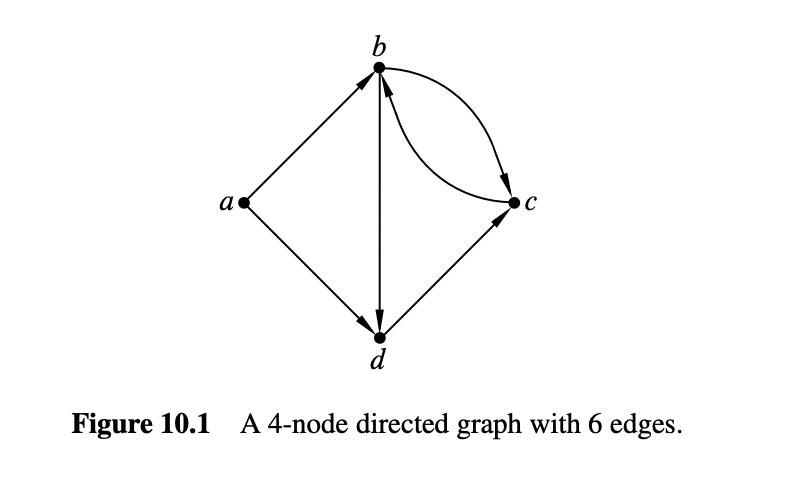
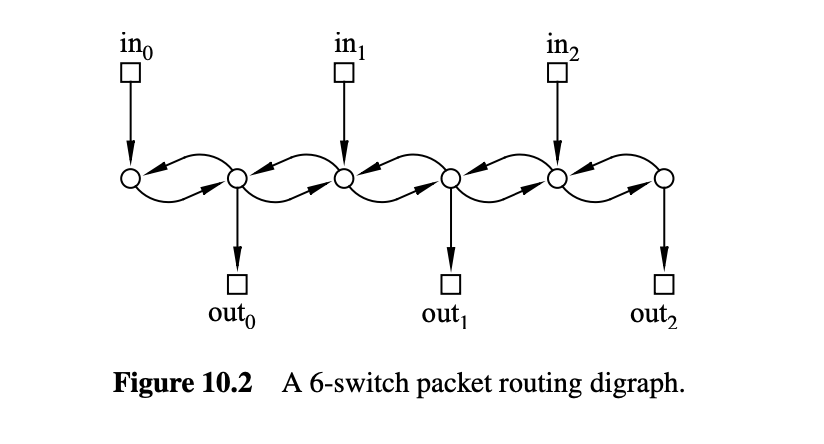
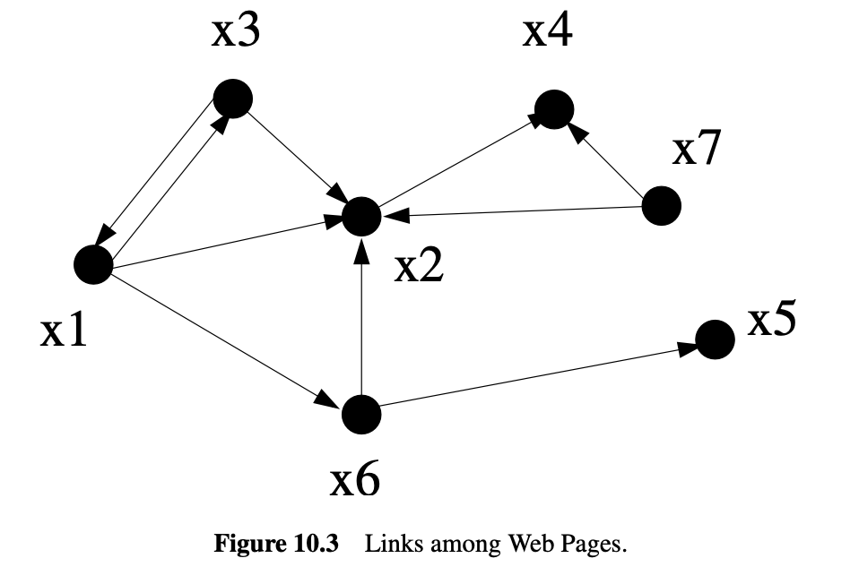
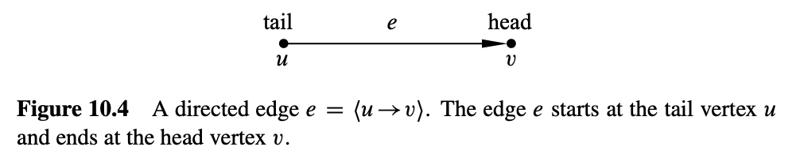
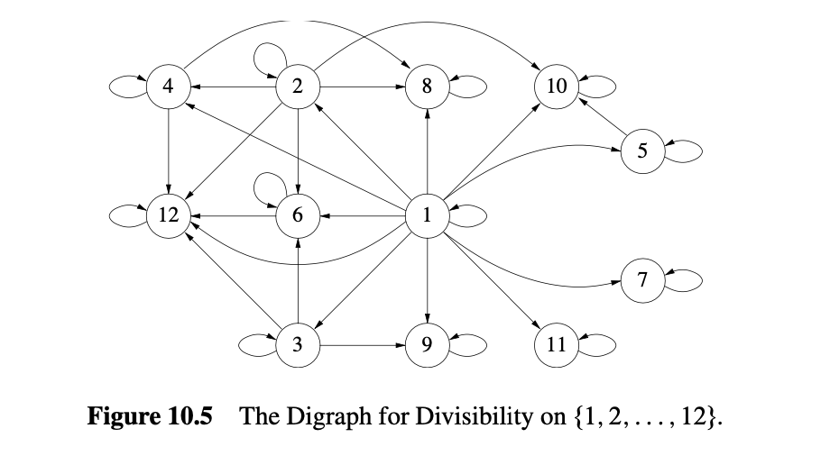
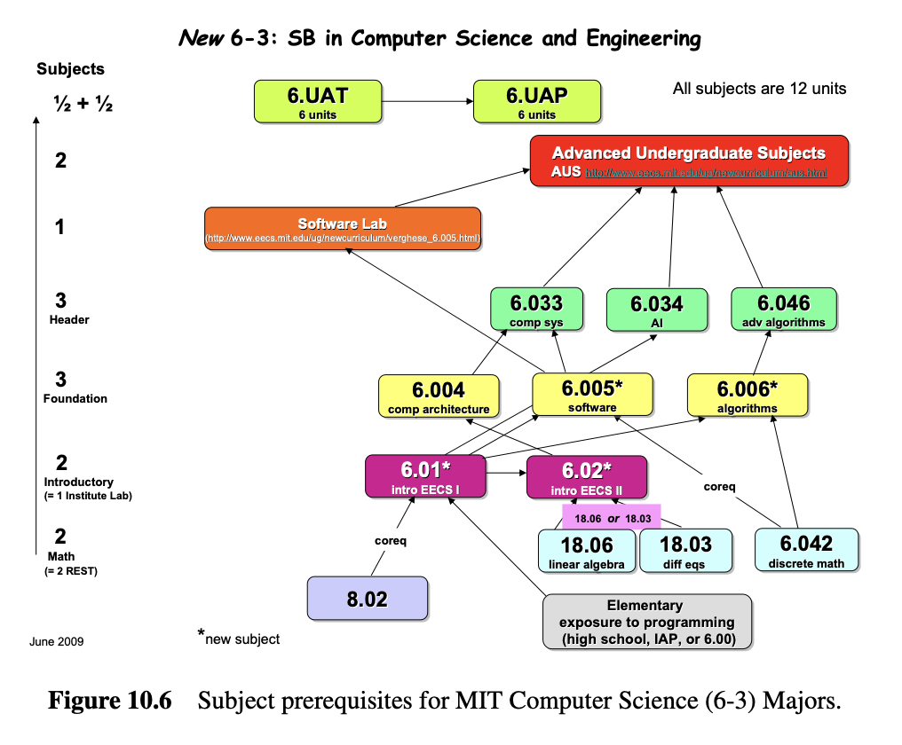
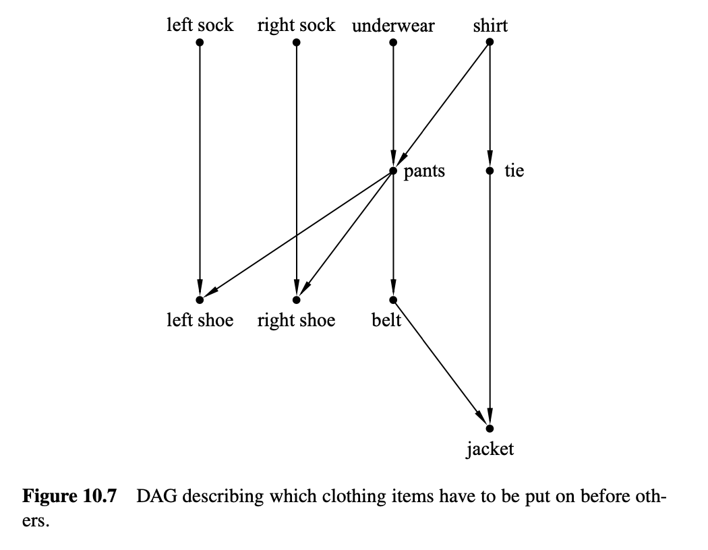
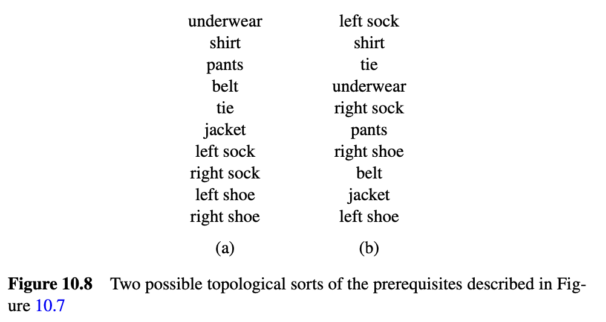

# 10. 有向图和偏序关系

### 10.0.1 有向图

有向图(directed graphs, digraph),
提供了一种方便的方式来表示事物如何连接在一起,
以及如何通过这些连接从一个地方到达另一个地方.
这些”地方”通常被描绘为一些点或圆圈, 并在他们之间画出箭头, 如图 10.1
所示. 这些”地方”称为节点(nodes)或顶点(vertices),
节点之间的连线称为有向边(directed edges)或箭头(arrow)；图 10.1
中的有向图有 4 个节点和 6 条有向边.

计算机科学中, 有向图无处不在. 例如, 图 10.2 表示一个通信网络,
这是我们将在第 11 章深入探讨的一个主题. 图 10.2
有三个“输入”节点（画成小方块）, 表示数据包可能到达网络的位置,
三个“输出”节点表示数据包的目的地位置,
其余六个节点（画成小圆圈）表示交换机. 16
条边表示数据包可以通过路由器的路径.

有向图在计算机科学中出现的另一个地方是在万维网的超链接结构中. 令顶点
$x_1, x_2, \ldots, x_n$ 对应于网页,
并使用箭头表示一个页面何时有超链接到另一个页面, 我们就得到了一个像图
10.3 这样的有向图——尽管实际的万维网图可能有数十亿甚至数万亿个顶点.
乍一看, 这个图似乎不太有趣. 但在 1995 年, 斯坦福的两名学生 Larry Page 和
Sergey Brin 最终成为了亿万富翁,
因为他们意识到这种图的结构在构建搜索引擎时是多么有用.
所以只要认真学习图论, 谁知道会发生什么呢！

#### 定义 10.0.1

有向图 $G$ 由一个非空集合 $V(G)$ 组成, 称为 $G$ 的顶点集, 以及一个集合
$E(G)$, 称为 $G$ 的边集. $V(G)$ 的元素称为顶点.
顶点也称为节点；词语“顶点”和“节点”可互换使用. $E(G)$ 的元素称为有向边.
一个有向边也称为“箭头”或简单地称为“边”. 有向边从某个顶点 $u$ 开始,
称为边的尾部, 并在某个顶点 $v$ 结束, 称为边的头部, 如图 10.4 所示.
这样的边可以用有序对 $(u, v)$ 表示. 符号
$\langle u \rightarrow v \rangle$ 表示这条边.

定义 10.0.1 中没有新内容, 只是大量的术语. 形式上, 有向图 $G$ 与集合
$V = V(G)$ 上的二元关系相同——即, 有向图只是一个二元关系,
其定义域和陪域是相同的集合 $V$. 事实上, 我们已经将关系 $G$ 中的箭头称为
$G$ 的“图”. 例如, 区间 $[1..12]$ 中整数的可整除关系可以通过图 10.5
中的有向图来表示.

### 10.1 顶点度数

一个有向图中顶点的入度(in degree)(记作indeg)是指进入该顶点的箭头数量,
同样, 其出度(out degree)(记作outdeg)是指从该顶点出的箭头数量.
更精确地说,

#### 定义 10.1.1

如果 $G$ 是一个有向图, 且 $v \in V(G)$, 那么

$$
\text{indeg}(v) ::= \{ e \in E(G) \mid \text{head}(e) = v \}
$$

$$
\text{outdeg}(v) ::= \{ e \in E(G) \mid \text{tail}(e) = v \}
$$

这个定义的一个直接结果是

#### 引理 10.1.2

$$
\sum_{v \in V(G)} \text{indeg}(v) = \sum_{v \in V(G)} \text{outdeg}(v). 
$$

两者的和都等于 $|E(G)|$.

### 10.2 游走与路径

用点和箭头描述有向图使得谈论沿着图中的**连续边进行游走**(walk)变得自然而然.
例如, 在图10.5的有向图中, 你可以从顶点1开始, 依次沿着从顶点1到顶点2,
从2到4, 从4到12的边, 然后从12到12,
再从12到12（如果你喜欢的话可以多次这样做）.
以这种方式依次经过的**边序列**称为图中的一个游走.
一个**路径(path)**是一个从不多次访问同一顶点的游走. 因此,
从1到2到4到12的边序列是一个路径, 但如果你再次去12, 它就不再是路径了.

以这个顺序代表游走的自然方式是记录它经过的顶点序列, 在这种情况下：

$$
1 \; 2 \; 4 \; 12 \; 12 \; 12.
$$

然而, 习惯上用交替的顶点和边的序列来表示游走, 所以这个游走正式表示为

$$
1 \; \langle 1 \to 2 \rangle \; 2 \; \langle 2 \to 4 \rangle \; 4 \; \langle 4 \to 12 \rangle \; 12 \; \langle 12 \to 12 \rangle \; 12 \; \langle 12 \to 12 \rangle \; 12.  \tag{10.1}
$$

这种定义的冗余足以令任何计算机科学家感到厌烦,
但它确实使得谈论顶点和边在游走中出现的次数变得容易. 以下是一个正式定义：

#### 定义 10.2.1

在有向图中的游走是一个交替的顶点和边的序列, 以一个顶点开始,
以一个顶点结束, 并且对于游走中的每个边 $\langle u \to v \rangle$, 顶点
$u$ 是边之前的元素, 顶点 $v$ 是边之后的元素.

因此, 一个游走 $\mathbf{v}$ 是以下形式的序列：

$$
\mathbf{v} ::= v_0 \langle v_0 \to v_1 \rangle v_1 \langle v_1 \to v_2 \rangle v_2 \cdots \langle v_{k-1} \to v_k \rangle v_k, 
$$

其中 $\langle v_i \to v_{i+1} \rangle \in E(G)$ 对于 $i \in [0..k]$.
游走的起点为 $v_0$, 终点为 $v_k$, 游走的长度 $|\mathbf{v}|$ 定义为 $k$.

如果所有 $v_i$ 不同, 即 $i \neq j$ 则 $v_i \neq v_j$, 则游走是路径.

一个闭合游走是一个起点和终点相同的游走. 一个环是一个正长度的闭合游走,
其顶点除起点和终点相同外, 其他的都不同.

注意, 一个单一顶点算作长度为零的路径, 这种路径同时也是一个闭合游走,
但不算作一个环, 因为环定义上必须具有正长度.
长度为1的环在节点有一个箭头指回自己时是可能的. 图10.1中没有这种环,
但图10.5的有向图中每个顶点在长度为1的环中. 长度为1的环有时称为自环.

虽然游走在正式上是一个顶点和边交替的序列,
但它完全可以由它经过的顶点序列或它经过的边序列来确定.
我们将在方便的时候以这些方式描述游走. 例如, 对于图10.1,

-   $(a, b, d)$ 或简单地 $abd$, 是一个（顶点序列描述的）长度为2的路径,
-   $(\langle a \to b \rangle , \langle b \to d \rangle)$, 或简单地
    $\langle a \to b \rangle \langle b \to d \rangle$,
    是（边序列描述的）相同长度为2的路径,
-   $abcb$ 是一个长度为4的游走,
-   $dcbcb$ 是一个长度为5的闭合游走,
-   $bdcb$ 是一个长度为3的环,
-   $\langle b \to c \rangle \langle c \to b \rangle$ 是一个长度为2的环,
-   $\langle c \to b \rangle \langle b \leftarrow a \rangle \langle a \to d \rangle$
    不是一个游走. 一个游走不允许沿相反方向的边游走.

如果你游走了一段时间, 在某个顶点停下来休息, 然后继续游走,
你就把一个游走分成了两部分. 例如, 在10.1的游走中, 经过两个边后休息,
通过可分性图将游走分为游走的第一部分

$$
1 \; \langle 1 \to 2 \rangle \; 2 \; \langle 2 \to 4 \rangle \; 4
$$

和游走的其余部分

$$
4 \; \langle 4 \to 12 \rangle \; 12 \; \langle 12 \to 12 \rangle \; 12 \; \langle 12 \to 12 \rangle \; 12.  \tag{10.3}
$$

我们会说整个游走 (10.1) 是游走 (10.2) 和 (10.3) 的合并游走.
在一般情况下, 如果一个游走 $\mathbf{f}$ 以顶点 $v$ 结束, 另一个游走
$\mathbf{r}$ 以同一个顶点 $v$ 开始, 我们会说它们的合并
$\mathbf{f} \hat~ \mathbf{r}$ 是以 $\mathbf{f}$ 开始并以 $\mathbf{r}$
继续的游走. 两个游走只有在第一个游走以同一个顶点 $v$ 结束而第二个游走从
$v$ 开始时才能合并. 我们将使用记号 $\mathbf{f} \hat v \mathbf{r}$
来描述一个以 $v$ 结束的游走 $\mathbf{f}$ 和一个以 $v$ 开始的游走
$\mathbf{r}$ 的合并.

这个定义的一个结果是

#### 引理 10.2.2

$$
|\mathbf{f} \hat v \mathbf{r}| = |\mathbf{f}| + |\mathbf{r}|. 
$$

#### 10.2.1 找一条路径

如果你试图快速游走到某个地方, 如果你两次来到同一个地方, 你就知道麻烦了.
这实际上是图论的一个基本定理.

#### 定理 10.2.3

从一个顶点到另一个顶点的最短游走是一个路径.

证明. 如果从顶点 $u$ 到另一个顶点 $v \neq u$ 有一个游走,
那么根据良序原理, 必须存在一个从 $u$ 到 $v$ 的最小长度游走 $\mathbf{w}$.
我们声称 $\mathbf{w}$ 是路径.

为证明该主张, 假设 $\mathbf{w}$ 不是路径, 这意味着某个顶点 $x$
在该游走中出现了两次. 也就是说,

$$
\mathbf{w} = \mathbf{e} \hat x \mathbf{f} \hat x \mathbf{g}
$$

对于某些游走 $\mathbf{e}$, $\mathbf{f}$, $\mathbf{g}$ 其中 $\mathbf{f}$
的长度为正. 但“删除” $\mathbf{f}$ 产生了一个严格更短的游走

$$
\mathbf{e} \hat x \mathbf{g}
$$

从 $u$ 到 $v$, 这与 $\mathbf{w}$ 是最小的相矛盾.

#### 定义 10.2.4

图中从顶点 $u$ 到顶点 $v$ 的距离 $\text{dist}(u, v)$ 是从 $u$ 到 $v$
的最短路径的长度.

正如预期的那样, 这一定义的距离满足：

#### 引理 10.2.5 \[三角不等式\]

$$
\text{dist} (u, v) \leq \text{dist} (u, x) + \text{dist}(x, v)
$$

对所有顶点 $u, v, x$, 当且仅当 $x$ 在从 $u$ 到 $v$ 的最短路径上时,
等式成立.

当然, 你可能会期望这种属性为真, 但距离有一个技术定义,
并且它的属性不能被认为是理所当然的. 例如, 与普通空间距离不同, 从 $u$ 到
$v$ 的距离通常不同于从 $v$ 到 $u$ 的距离. 所以, 令我们证明三角不等式.

证明不等式, 假设 $\mathbf{f}$ 是从 $u$ 到 $x$ 的最短路径, $\mathbf{r}$
是从 $x$ 到 $v$ 的最短路径. 然后根据引理10.2.2,
$\mathbf{f} \hat x \mathbf{r}$ 是从 $u$ 到 $v$ 的长度为
$\text{dist} (u, x) + \text{dist} (x, v)$ 的游走, 所以这个和是从 $u$ 到
$v$ 的最短路径的长度的上界, 根据定理10.2.3.

“当且仅当”的证明见问题10.3.

最后, 游走与路径之间的关系扩展到闭合游走与环：

#### 引理 10.2.6

通过某个顶点的最短正长度闭合游走是一个环.

引理10.2.6的证明本质上与定理10.2.3相同；见问题10.4.

### 10.3 邻接矩阵

如果一个图 $G$ 有 $n$ 个顶点 $v_0, v_1, \ldots, v_{n-1}$,
一种表示它的有用方法是用一个 $n \times n$ 的零和一的矩阵,
称为它的邻接矩阵 $A_G$. 邻接矩阵的第 $i$ 行第 $j$ 列的元素 $(A_G)_{ij}$
为1, 如果从顶点 $v_i$ 到顶点 $v_j$ 有一条边, 否则为0. 即：

$$
(A_G)_{ij} ::= \begin{cases} 
1 & \text{如果} \ \langle v_i \to v_j \rangle \in E(G), \\
0 & \text{否则}.
\end{cases}
$$

例如, 令 $H$ 为图10.1中的4个节点图. 它的邻接矩阵 $A_H$ 是一个4x4的矩阵：

$$
A_H = \begin{bmatrix}
 & a & b & c & d \\
a & 0 & 1 & 0 & 1 \\
b & 0 & 0 & 1 & 1 \\
c & 0 & 1 & 0 & 0 \\
d & 0 & 0 & 1 & 0 \\
\end{bmatrix}
$$

这种表示法的一个好处是我们可以用矩阵的幂来计算顶点之间游走的数量. 例如,
在图 $H$ 中, 有两条从顶点 $a$ 到顶点 $c$ 的长度为2的游走：

$$
a \langle a \to b \rangle b \langle b \to c \rangle c
$$

$$
a \langle a \to d \rangle d \langle d \to c \rangle c
$$

这两条是唯一的从 $a$ 到 $c$ 的长度为2的游走. 此外, 只有一条从 $b$ 到 $c$
的长度为2的游走, 只有一条从 $c$ 到 $c$ 的长度为2的游走和一条从 $d$ 到
$b$ 的长度为2的游走, 这些是图 $H$ 中唯一的长度为2的游走. 我们可以从矩阵
$(A_H)^2$ 的条目中读取这些计数：

$$
(A_H)^2 = \begin{bmatrix}
 & a & b & c & d \\
a & 0 & 0 & 2 & 1 \\
b & 0 & 1 & 1 & 0 \\
c & 0 & 0 & 1 & 1 \\
d & 0 & 1 & 0 & 0 \\
\end{bmatrix}
$$

更一般地, 矩阵 $(A_G)^k$ 提供了任何有向图 $G$ 中顶点之间长度为 $k$
的游走的数量, 如下所述.

#### 定义 10.3.1

对于一个 $n$ 顶点图 $G$, 长度为 $k$ 的游走计数矩阵 $C$ 是一个
$n \times n$ 的矩阵, 使得

$$
C_{uv} ::= \text{从顶点} \ u \ \text{到顶点} \ v \ \text{的长度为} \ k \ \text{的游走的数量}.  \tag{10.4}
$$

注意邻接矩阵 $A_G$ 是图 $G$ 的长度为1的游走计数矩阵, 而 $(A_G)^0$,
根据惯例是单位矩阵, 是长度为0的游走计数矩阵.

#### 定理 10.3.2

如果 $C$ 是图 $G$ 的长度为 $k$ 的游走计数矩阵, $D$ 是长度为 $m$
的游走计数矩阵, 那么 $CD$ 是图 $G$ 的长度为 $k + m$ 的游走计数矩阵.

根据这个定理, 邻接矩阵的平方 $(A_G)^2$ 是图 $G$ 的长度为2的游走计数矩阵.
将定理再次应用于 $(A_G)^2A_G$ 显示长度为3的游走计数矩阵是 $(A_G)^3$.
更一般地, 通过归纳法可以得到

#### 推论 10.3.3

有向图 $G$ 的长度为 $k$ 的游走计数矩阵是 $(A_G)^k$, 对于所有
$k \in \mathbb{N}$.

换句话说, 你可以通过计算邻接矩阵的第 $k$
次幂来确定任何一对顶点之间长度为 $k$ 的游走的数量！

这可能看起来很惊人, 但证明揭示了矩阵乘法和游走数量之间的这种简单关系.

定理 10.3.2 的证明. 任何从顶点 $u$ 到 $v$ 的长度为 $(k + m)$
的游走都以长度为 $k$ 的游走开始, 结束于某个顶点 $w$, 然后接着以长度为
$m$ 的游走从 $w$ 开始并结束于 $v$. 所以从 $u$ 到 $v$ 的长度为 $(k + m)$
的游走的数量经过 $w$ 在第 $k$ 步等于从 $u$ 到 $w$ 的长度为 $k$
的游走的数量 $C_{uw}$, 乘以从 $w$ 到 $v$ 的长度为 $m$ 的游走的数量
$D_{wv}$. 我们可以通过对所有可能的顶点 $w$ 求和来得到从 $u$ 到 $v$
的长度为 $(k + m)$ 的游走的总数量, 这些游走在第 $k$ 步经过 $w$.
换句话说,

$$
\# \text{长度为} (k + m) \text{从} u \text{到} v \text{的游走的数量} = \sum_{w \in V(G)} C_{uw} \cdot D_{wv} \tag{10.5}
$$

但 (10.5) 的右侧正是 $(CD)_{uv}$ 的定义. 因此, $CD$ 确实是长度为
$(k + m)$ 的游走计数矩阵.

#### 10.3.1 最短路径

邻接矩阵的幂与游走数量之间的关系对我们这些数学迷来说很酷——至少对我们这些数学迷来说是这样——但一个更重要的问题是找到节点对之间的最短路径.
例如, 当你开车回家度假时, 你通常想走时间最短的路线.

找到 $n$ 顶点图 $G$ 中所有最短路径长度的一种简单方法是通过逐个计算 $A_G$
的连续幂, 直到第 $n - 1$ 次, 观察每个条目变为正的第一次幂.
这是因为定理10.3.2暗示了从 $u$ 到 $v$ 的最短路径的长度（如果有的话）将是
$k$ 的最小值, 使得 $(A_G)^k_{uv}$ 为非零, 并且如果有最短路径, 其长度将
$\leq n - 1$.
对这个想法的改进导致了在合理有效的时间内找到最短路径的方法.
这些方法也适用于加权图, 其中边被标记为权重或成本,
并且目标是找到权重最小、最便宜的路径. 这些改进通常在入门算法课程中涉及,
我们将不再进一步讨论它们.

### 10.4 游走关系

关于有向图的一个基本问题是是否有办法从一个特定的顶点到达另一个顶点.
所以对于任何有向图 $G$, 我们感兴趣的是一个二元关系 $G^*$, 称为 $V(G)$
上的游走关系, 其中

$$
u \, G^* \, v ::= \text{存在从} \ u \ \text{到} \ v \ \text{的游走}.  \tag{10.6}
$$

同样地, 还有一个正游走关系

$$
u \, G^+ \, v ::= \text{存在从} \ u \ \text{到} \ v \ \text{的正长度游走}.  \tag{10.7}
$$

#### 定义 10.4.1

当存在从顶点 $v$ 到顶点 $w$ 的游走时, 我们说 $w$ 是从 $v$ 可达的,
或者等价地, $v$ 是与 $w$ 连接的.

### 10.4.1 关系的复合

有一个简单的方法可以将函数的复合扩展到关系的复合,
这提供了另一种方法来讨论有向图中的游走和路径.

#### 定义 10.4.2

设 $R : B \to C$ 和 $S : A \to B$ 是二元关系. 那么 $R$ 和 $S$
的复合是二元关系 $(R \circ S) : A \to C$, 其定义规则为

$$
a \, (R \circ S) \, c ::= \exists b \in B. (a \, S \, b) \ \text{且} \ (b \, R \, c).  \tag{10.8}
$$

这与定义4.3.1中的函数复合一致.

记住, 有向图是其顶点上的二元关系, 所以将有向图与其自身复合是有意义的.
然后, 如果我们令 $G^n$ 表示 $G$ 的自身复合 $n$ 次, 很容易检查 $G^n$
是长度为 $n$ 的游走关系（见问题10.11）.

$$
a \, G^n \, b \iff \text{存在长度为} \ n \ \text{的从} \ a \ \text{到} \ b \ \text{的游走}. 
$$

这甚至适用于 $n = 0$, 通常的惯例是 $G^0$ 是顶点集上的恒等关系
$\text{Id}_{V(G)}$. 由于当且仅当存在路径时才存在游走,
并且每条路径的长度最多为 $|V(G)| - 1$, 我们现在有

$$
G^* = G^0 \cup G^1 \cup G^2 \cup \ldots \cup G^{|V(G)|-1} = (G \cup G^0)^{|V(G)|-1}.  \tag{10.9}
$$

最终的等式指出了使用重复平方作为计算 $G^*$ 的方法, 而不是 $n - 1$
次关系的复合.

### 10.5 有向无环图与调度

MIT计算机科学课程的一些先修课如图10.6所示. 一个从课程 $s$ 到课程 $t$
的边表示 $s$ 是 $t$ 的直接先修课. 当然, 在你可以学习课程 $t$ 之前,
你不仅需要学习课程 $s$, 还需要学习所有课程 $s$ 的先修课,
以及这些先修课的先修课, 依此类推.
我们可以用正游走关系来准确地表述这一点：如果 $D$ 是课程的直接先修关系,
那么课程 $u$ 必须在学习课程 $v$ 之前完成, 当且仅当 $u \, D^+ \, v$.

当然, 如果这个直接先修图有一个正长度的闭合游走,
那么要毕业需要花费很长时间. 我们需要禁止这样的闭合游走, 根据引理10.2.6,
这与禁止环路是一样的. 因此, 课程之间的直接先修图最好是无环的：

#### 定义 10.5.1

有向无环图（DAG）是一个没有环的有向图.

DAG在计算机科学中具有特别重要的意义.
它们捕捉了分析任务调度和并发控制中使用的关键概念.
当在多个处理器上分配程序时, 如果程序的一部分需要另一个尚未生成的输出,
我们就会遇到麻烦！所以令我们更深入地研究DAG及其在调度中的连接.

### 10.5.1 调度

在调度问题中, 有一组任务, 以及一组约束条件,
指定开始某些任务取决于其他任务的完成. 我们可以将这些集合映射到一个图中,
任务作为节点, 直接先修约束作为边.

例如, 图10.7中的DAG描述了一个人如何为正式场合穿衣服. 如上所述,
顶点对应于衣物, 边表示哪些衣物必须先穿上.

当面对一组先决条件时, 最基本的任务是找到一个顺序来执行所有任务,
一次一个, 同时尊重依赖约束. 按这种方式排序任务称为拓扑排序.

#### 定义 10.5.2

有限DAG的拓扑排序是所有顶点的列表, 使得每个顶点 $v$
在列表中出现的位置早于所有从 $v$ 可达的顶点.

事实上, 我们可以证明每个有限DAG都有一个拓扑排序.
你可以将此视为一个数学证明, 即你确实可以在早上穿衣服.

构造有限DAG的拓扑排序很容易, 从最小元素开始：

#### 定义 10.5.3

DAG $D$ 的顶点 $v$ 是最小的, 当且仅当没有其他顶点从 $v$ 可达.

可能使用“最小”和“最小化”这两个词来讨论起始路径的顶点显得有些奇怪.
这些词来源于顶点“比它连接到的任何其他顶点都小”的观点.
我们将在下一节探索这种思考DAG的方式, 但现在我们将使用这些术语,
因为它们是传统的.

这种术语的一个特别之处在于, DAG可能没有最小元素, 但有许多最小化元素.
特别地, 穿衣例子中有四个最小化元素：左袜子, 右袜子, 内衣和衬衫.

为了构建穿衣顺序, 我们选择其中一个最小化元素——比如衬衫.
现在有一组新的最小化元素；我们没有选择的三个元素仍然是最小化的,
一旦我们去掉了衬衫, 领带也变得最小化. 我们再选择另一个最小化元素,
继续以这种方式, 直到所有元素都被选择.
这些元素按照选择顺序形成的序列将是一个拓扑排序.
上面的拓扑排序就是这样构建的.

所以我们的构造表明：

#### 定理 10.5.4

每个有限DAG都有一个拓扑排序.

还有许多其他方法来构造拓扑排序. 例如, 而不是从路径起始的最小元素开始,
我们可以从路径末尾的最大元素开始构建拓扑排序. 实际上,
我们可以通过从有限DAG中任意选择顶点并简单地将它们插入列表中以适应的位置来构建拓扑排序.

### 10.5.2 并行任务调度

对于任务依赖关系, 拓扑排序提供了一种方法来依次执行任务,
同时尊重这些依赖关系. 但如果我们有能力同时执行多个任务怎么办？例如,
假设任务是程序, DAG表示数据依赖关系, 我们有一个并行机器,
拥有许多处理器而不是只有一个顺序执行的机器.
我们应该如何调度这些任务？我们的目标应该是最小化完成所有任务所需的总时间.
为简单起见, 假设所有任务需要相同的时间, 并且所有处理器都是相同的.

因此, 给定一组有限的任务,
执行它们的最佳并行调度需要多长时间？我们可以使用无环图上的游走关系来分析这个问题.

在第一个时间单位, 我们应该做所有的最小化项, 所以我们会穿上左袜子,
右袜子, 内衣和衬衫. 在第二个时间单位, 我们应该穿上裤子和领带.
注意我们不能穿左鞋或右鞋, 因为我们还没有穿上裤子. 在第三个时间单位,
我们应该穿上左鞋、右鞋和皮带. 最后, 在最后一个时间单位,
我们可以穿上外套. 该调度如图10.9所示.

完成这些任务的总时间是4个单位. 由于存在4个必须依次完成的任务序列,
我们不能做得比这更快. 我们必须穿上衬衫然后穿裤子, 穿裤子然后穿皮带,
穿皮带然后穿外套. 这样的项目序列称为链.

#### 定义 10.5.5

DAG中的两个顶点是可比较的, 当且仅当其中一个顶点可达另一个顶点.
链是DAG中一组顶点的集合, 这些顶点中的任何两个都是可比较的.
以链的最大元素结束的有限链称为在其最大元素处结束的.

即使有无限数量的处理器, 调度任务所需的时间至少和任何链中的顶点数一样大.
因为如果我们用的时间比某些链的大小更少,
那么链中的两个项目必须在同一步骤中完成, 这与优先约束相矛盾. 因此,
最大链也称为关键路径. 例如, 图10.9显示了穿衣有向图的关键路径.

在这个例子中, 我们能够在 $t$ 步内完成所有任务, 其中 $t$ 是最大链的大小.
DAG的一个优点是这总是可能的！换句话说, 对于任何DAG,
存在一个合法的并行调度, 在 $t$ 总步骤内运行.

一般来说, 执行任务的调度指定在连续步骤中要做哪些任务.
每个任务必须在某个步骤中调度, 并且在任务 $a$
调度之前必须完成的所有任务必须在更早的步骤中调度. 以下是调度的严格定义.

#### 定义 10.5.6

集合 $A$ 的划分是一组称为划分块的不相交非空子集, 使得集合 $A$
的每个元素恰好属于一个划分块.

例如, 将集合 $\{a, b, c, d, e\}$ 划分为三个划分块的一种可能方式是

$$
\{a, c\}, \ \{b, e\}, \ \{d\}. 
$$

#### 定义 10.5.7

DAG $D$ 的并行调度是 $V(D)$ 的划分块 $A_0, A_1, \ldots$, 使得当 $j < k$
时, $A_j$ 中的任何顶点都不可达 $A_k$ 中的任何顶点. 块 $A_k$ 称为在步骤
$k$ 调度的元素集合, 调度所需的块的数量称为处理器的数量.

以元素 $a$ 结束的最大链称为 $a$ 的关键路径, 链中小于 $a$
的所有元素的数量称为 $a$ 的深度. 因此, 在任何可能的并行调度中,
必须至少经过深度 $(a)$ 步才能开始任务 $a$. 特别是,
最小化元素正是具有深度0的元素.

有一个非常简单的调度,
它在最少的步骤数内完成每个任务：只需使用“贪心”策略尽快执行任务即可.
在步骤 $k$ 调度所有深度为 $k$ 的元素. 这就是我们找到穿衣调度的方式.

#### 定理 10.5.8

有限DAG的最小时间调度由集合 $A_0, A_1, \ldots$ 组成, 其中

$$
A_k ::= \{a \in V(D) | \text{depth} (a) = k\}. 
$$

我们将根据定义10.5.7将证明这些集合 $A_k$
是一个并行调度的证明留到问题10.24.
我们可以这样总结上述内容：对于无限数量的处理器,
完成所有任务的并行时间只是关键路径的大小.

#### 推论 10.5.9

并行时间 = 关键路径的大小.

当处理器数量有限时, 情况变得更加复杂；参见问题10.25的示例.

### 10.5.3 Dilworth引理

#### 定义 10.5.10

DAG中的反链是顶点集合,
这些顶点中没有两个是可比较的——集合中的任何两个不同顶点之间不存在游走.

我们关于调度的结论也告诉我们一些关于反链的事情.

#### 推论 10.5.11

在DAG $D$ 中, 如果最大链的大小是 $t$, 那么 $V(D)$ 可以划分为 $t$ 个反链.

证明. 令反链为集合 $A_k ::= \{a \in V(D) | \text{depth} (a) = k$.
验证每个集合 $A_k$ 是一个反链是一个简单的练习（问题10.24）.

推论10.5.11暗示了关于无环有向图的一个著名结果：

#### 引理 10.5.12

（Dilworth）对于所有 $t > 0$, 每个具有 $n$
个顶点的DAG必须具有一个大小大于 $t$ 的链或一个大小至少为 $n/t$ 的反链.

证明. 假设没有一个大小大于 $t$ 的链. 令 $\ell$ 为最大反链的大小.
如果我们根据推论10.5.11做一个并行调度,
我们会创建一个数量等于最大链大小的反链, 这个链小于或等于 $t$.
每个元素恰好属于一个反链, 没有一个链的大小超过 $\ell$. 因此, 最多有 $t$
条反链, 元素总数为 $n$, 即 $\ell t \geq n$. 简单除法得出
$\ell \geq n/t$.

#### 推论 10.5.13

每个具有 $n$ 个顶点的DAG都有一个大小大于 $\sqrt{n}$ 的链或一个大小至少为
$\sqrt{n}$ 的反链.

证明. 令 $t = \sqrt{n}$ 在引理10.5.12中.

#### 例子 10.5.14

当示例中的人穿衣时, $n = 10$.

-   试 $t = 3$. 有一个大小为4的链.
-   试 $t = 4$. 没有大小为5的链, 但有一个大小为4的反链 $\geq 10/4$.

任何将“直接先决条件”关系映射到有向图的过程使我们能够使用工具来理解计算机科学家的图,
以便对像穿衣这样平凡的事情做出推论. 这可能令你感到惊讶,
但我们可以做得更好. 在本章的介绍中,
我们提到了一个值得重复的有用事实：任何有向图形式上都是其顶点为域和上域的二元关系.
这意味着任何其域和上域相同的二元关系都可以转换为有向图！谈论二元关系的边或一组元素在有向图下的图像乍一看可能有点奇怪,
但这样做会令我们能够绘制不同类型关系之间的重要连接. 例如,
我们可以应用Dilworth引理到穿衣的“直接先决条件”关系, 因为该关系的图是DAG.

但是我们如何判断二元关系是否是DAG？一旦我们知道一个关系是DAG,
我们究竟能得出什么结论？在本节中,
我们将抽象出二元关系可能具有的一些属性, 并使用这些属性来定义关系的类别.
特别是, 我们将解释本节的标题, 偏序关系.

### 10.6.1 DAG中的游走关系的性质

首先, 令我们谈谈所有有向图的一些共同特征. 由于将从 $u$ 到 $v$ 的游走与从
$v$ 到 $w$ 的游走合并会产生从 $u$ 到 $w$ 的游走,
因此游走和正游走关系都具有称为传递性的关系属性：

#### 定义 10.6.1

集合 $A$ 上的二元关系 $R$ 是传递的, 当且仅当对每个 $a, b, c \in A$ 有：

$$
(a \ R \ b \ \text{and} \ b \ R \ c) \implies a \ R \ c
$$

因此, 我们有：

#### 引理 10.6.2

对于任何有向图 $G$, 游走关系 $G^+$ 和 $G^*$ 是传递的.

由于从任何顶点到自身的长度为零的游走,
游走关系具有另一种称为自反性的关系属性：

#### 定义 10.6.3

集合 $A$ 上的二元关系 $R$ 是自反的, 当且仅当对每个 $a \in A$ 有
$a \ R \ a$.

现在我们有：

#### 引理 10.6.4

对于任何有向图 $G$, 游走关系 $G^*$ 是自反的.

我们知道, 如果一个有向图没有正长度闭合游走, 那么它是DAG.
由于闭合游走中的任何顶点都可以作为游走的起点和终点,
说一个图是DAG与说从任何顶点到自身没有正长度路径是一样的.
这意味着DAG的正游走关系具有称为反自反性的关系属性.

#### 定义 10.6.5

集合 $A$ 上的二元关系 $R$ 是反自反的, 当且仅当对每个 $a \in A$ 有
$\neg (a \ R \ a)$.

因此, 我们有：

#### 引理 10.6.6

当且仅当 $R^+$ 是反自反的, $R$ 是DAG.

### 10.6.2 严格偏序关系

这是我们开始定义关系类别的有趣部分：

#### 定义 10.6.7

一个关系是传递和反自反的, 称为严格偏序关系.

引理10.6.6 直接提供了严格偏序关系和DAG之间的一个简单连接：

#### 定理 10.6.8

当且仅当 $R$ 是DAG的正游走关系时, $R$ 是严格偏序关系.

严格偏序关系出现在许多与有向图无关的情况下. 例如, 数上的小于关系 $<$
是严格偏序关系：

-   如果 $x < y$ 且 $y < z$, 则 $x < z$, 所以小于是传递的；
-   $\neg (x < x)$, 所以小于是反自反的.

真包含关系 $\subset$ 也是偏序关系：

-   如果 $A \subset B$ 且 $B \subset C$, 则 $A \subset C$,
    所以包含是传递的；
-   $\neg (A \subset A)$, 所以真包含是反自反的.

如果有两个顶点可以互相到达, 则有一个从一个顶点开始的正长度闭合游走,
经过另一个顶点, 然后返回. 因此, DAG是其中没有两个顶点是互相可达的有向图.
这对应于称为反对称性的关系属性.

#### 定义 10.6.9

集合 $A$ 上的二元关系 $R$ 是反对称的, 当且仅当对所有 $a, b \in A$,
$a \ R \ b \implies \neg (b \ R \ a)$.

因此, 我们也可以用反对称性来表征DAG：

#### 推论 10.6.10

当且仅当 $D^+$ 是反对称的, DAG $D$ 是DAG.

推论10.6.10和定理10.6.8结合起来得到：

#### 推论 10.6.11

当且仅当它是传递和反对称的, 集合 $A$ 上的二元关系 $R$ 是严格偏序关系.

严格偏序关系可能是不同DAG的正游走关系.
这引发了寻找具有最少边数的DAG的问题, 该DAG决定了给定的严格偏序关系.
对于有限严格偏序关系,
最小的这种DAG结果是唯一且易于找到的（参见问题10.30）.

### 10.6.3 弱偏序关系

小于等于关系 $\leq$ 至少与小于严格偏序关系一样熟悉, 而普通包含关系
$\subseteq$ 比真包含关系更常见. 这些是弱偏序关系的示例,
具有使得每个元素都与自身相关的附加条件. 要精确定义这一点,
我们必须放宽反对称性属性,
使其不适用于一个顶点与自身相比；这种放松的属性称为反自对称性：

#### 定义 10.6.12

集合 $A$ 上的二元关系 $R$ 是反自对称的, 当且仅当对所有 $a, b \in A$,
$a \neq b$ 有 $a \ R \ b \implies \neg (b \ R \ a)$.

现在我们可以给出弱偏序关系的公理定义, 与严格偏序关系平行：

#### 定义 10.6.13

集合 $A$ 上的二元关系 $R$ 是弱偏序关系,
当且仅当它是传递、自反和反自对称的.

以下引理给出了弱偏序关系的另一个特征, 这直接来自这个定义.

#### 引理 10.6.14

集合 $A$ 上的二元关系 $R$ 是弱偏序关系, 当且仅当存在集合 $A$
上的严格偏序关系 $S$, 使得对所有 $a, b \in A$ 有：

$$
a \ R \ b \iff (a \ S \ b \ \text{or} \ a = b)
$$

由于长度为零的游走从顶点到自身, 这个引理与定理10.6.8结合得出：

#### 推论 10.6.15

一个关系是弱偏序关系, 当且仅当它是DAG的游走关系.

对于一般的弱偏序关系, 我们通常使用排序样式符号, 如 $\preceq$ 或
$\subseteq$, 而不是像 $R$ 这样的字母符号. 同样, 我们通常使用 $<$ 或
$\subset$ 来表示严格偏序关系.

以下是值得注意的偏序关系的两个例子：

#### 例 10.6.16

令 $A$ 为某个集合的族, 并定义 $a \ R \ b$ 当且仅当 $a \supset b$. 则 $R$
是严格偏序关系.

#### 例 10.6.17

可除性关系是非负整数上的弱偏序关系.

通过练习这些定义, 你可以检查两个更多的例子, 它们是集合 $D$ 上

的平凡偏序关系：恒等关系 $\text{Id}_D$ 是弱偏序关系,
空关系（没有箭头的关系）是严格偏序关系.

请注意, 一些作者将“偏序关系”定义为我们所称的弱偏序关系. 然而,
我们将使用“偏序关系”一词来表示可能是弱偏序关系或严格偏序关系的关系.

## 10.7 使用集合的包含表达偏序关系

公理可以很好地抽象和推理对象的重要性质,
但帮助我们了解满足这些公理的事物是很有用的. 有向无环图 (DAG)
提供了一种描绘偏序关系的方法, 但将它们描绘成其他熟悉的数学对象也有帮助.
在本节中, 我们将展示每个偏序关系都可以描绘成一个由包含关系连接的集合.
这就是说, 每个偏序关系都有与这样的集合“相同的形状”.
“相同的形状”的技术词是“同构”.

#### 定义 10.7.1

集合 $A$ 上的二元关系 $R$ 与集合 $B$ 上的关系 $S$ 是同构的,
当且仅当存在从 $A$ 到 $B$ 的保关系双射 $f$, 即对于所有 $a, a' \in A$,
有：

$$
a \ R \ a' \iff f(a) \ S \ f(a')
$$

为了将集合 $A$ 上的偏序关系 $\preceq$ 表示为一组集合的包含关系,
我们简单地表示集合 $A$ 的每个元素 $a$ 为那些元素组成的集合,
这些元素相对于该元素 $a$ 而言是小于等于的, 即：

$$
a \longleftrightarrow \{b \in A \ | \ b \preceq a \}
$$

例如, 如果 $\preceq$ 是整数集合 $\{1, 3, 4, 6, 8, 12\}$ 上的可除性关系,
那么我们用在 $A$ 中将每个整数表示为能整除它的整数的集合. 因此,

$$
\begin{aligned}
1 & \longleftrightarrow \{1\},\\
3 & \longleftrightarrow \{1, 3\},\\
4 & \longleftrightarrow \{1, 4\},\\
6 & \longleftrightarrow \{1, 3, 6\},\\
8 & \longleftrightarrow \{1, 4, 8\},\\
12 & \longleftrightarrow \{1, 3, 4, 6, 12\}.
\end{aligned}
$$

因此, 事实 $3 \ | \ 12$ 对应于事实
$\{1, 3\} \subseteq \{1, 3, 4, 6, 12\}$.

通过这种方式, 我们通过相应集合上的包含关系 $\subseteq$
完全捕获了弱偏序关系 $\preceq$. 形式上, 我们有：

#### 引理 10.7.2

令 $\preceq$ 为集合 $A$ 上的弱偏序关系. 那么 $\preceq$ 同构于包含关系
$\subseteq$ 在相应集合的逆像上的关系.

我们将证明留给问题 10.36. 实际上,
相同的构造表明严格偏序关系可以通过集合在真子集关系 $\subset$
下表示（问题 10.37）. 总结如下：

#### 定理 10.7.3

每个弱偏序关系 $\preceq$ 同构于一组集合上的包含关系 $\subseteq$.
每个严格偏序关系 $\prec$ 同构于一组集合上的真子集关系 $\subset$.

## 10.8 线性序

#### 定义 10.8.1

设 $R$ 为集合 $A$ 上的二元关系, 且设 $a, b$ 为 $A$ 的元素. 那么, 如果
$[a \ R \ b \ \text{或} \ b \ R \ a]$, 则 $a$ 和 $b$ 相对于 $R$
是可比较的. 对每两个不同元素都是可比较的偏序关系称为线性序.

因此, \< 和 $\leq$ 是实数集 $\mathbb{R}$ 上的线性序. 而另一方面,
包含关系不是线性序, 因为, 例如, 任何两个不同的相同大小的有限集在
$\subseteq$ 下都是不可比较的. 课程6的先修关系也不是线性序, 因为例如,
8.01 和 6.042 彼此之间不是先修关系.

## 10.9 乘积关系

取两个关系的乘积是从旧关系构造新关系的一种有用方法.

#### 定义 10.9.1

若 $R_1$ 和 $R_2$ 为关系, 则 $R_1 \times R_2$
的积关系定义为具有如下性质的关系：

$$
\text{domain}(R_1 \times R_2) ::= \text{domain}(R_1) \times \text{domain}(R_2),
$$

$$
\text{codomain}(R_1 \times R_2) ::= \text{codomain}(R_1) \times \text{codomain}(R_2),
$$

$$
(a_1, a_2) (R_1 \times R_2) (b_1, b_2) \iff [a_1 R_1 b_1 \text{ 且 } a_2 R_2 b_2].
$$

从定义直接得出, 积关系保留传递性、自反性、反自反性和反对称性（参见问题
10.51）. 如果 $R_1$ 和 $R_2$ 具有这些性质中的某一个, 则 $R_1 \times R_2$
也具有该性质. 这意味着如果 $R_1$ 和 $R_2$ 都是偏序关系, 则
$R_1 \times R_2$ 也是偏序关系.

#### 例 10.9.2

定义一个关系 $Y$ 关于年龄-身高对, 其关系是年轻且较矮. 这个关系定义在对
$(y, h)$ 的集合上, 其中 $y$ 是一个非负整数 $\leq 2400$ , 表示年龄（月）,
$h$ 是一个非负整数 $\leq 120$, 表示身高（英寸）. 我们根据以下规则定义
$Y$：

$$
(y_1, h_1) \ Y \ (y_2, h_2) \iff y_1 \leq y_2 \text{ 且 } h_1 \leq h_2.
$$

即, $Y$ 是关于年龄的 $\leq$ 关系和关于身高的 $\leq$ 关系的积.

由于年龄和身高都是按数值顺序排列的, 年龄-身高关系 $Y$ 是偏序关系.
现在假设我们有一个 101 名学生的班级. 然后我们可以应用 Dilworth 引理
10.5.12 得出存在一个 11 名学生的链, 即有 11 名学生随着年龄增长而变高,
或者一个 11 名学生的反链, 即有 11 名学生随着年龄增长而变矮,
这为课堂演示提供了有趣的案例.

另一方面, 线性序的性质未被保留. 例如, 年龄-身高关系 $Y$
是两个线性序的积, 但它不是线性序：年龄 240 个月, 身高 68 英寸的对,
$(240, 68)$ 和 $(228, 72)$ 在 $Y$ 下是不可比较的.

## 10.10 等价关系

#### 定义 10.10.1

集合 $A$ 上的关系 $R$ 当且仅当满足

$$
\forall x, y \in A, x \ R \ y \implies y \ R \ x
$$

时, 是对称的.

若关系是自反的、对称的和传递的, 则它是等价关系.

模 $n$ 同余是等价关系的一个重要例子：

-   它是自反的, 因为 $x \equiv x \ (\text{mod} \ n)$.
-   它是对称的, 因为 $x \equiv y \ (\text{mod} \ n)$ 蕴含
    $y \equiv x \ (\text{mod} \ n)$.
-   它是传递的, 因为 $x \equiv y \ (\text{mod} \ n)$ 和
    $y \equiv z \ (\text{mod} \ n)$ 蕴含
    $x \equiv z \ (\text{mod} \ n)$.

实际上, 还有一个更为人熟知的等价关系的例子：相等性本身.

如果我们把一个全函数 $f$ 看作给其域内的每个元素附加一个标签,
那么“具有相同标签”就定义了一个等价关系. 更准确地说, 如果 $f$
是一个全函数, 我们可以定义其域上的基本等价关系 $\equiv_f$ 如下：

#### 定义 10.10.2

如果 $f$ 是一个全函数, 则其上的关系 $\equiv_f$ 由以下规则定义：

$$
a \equiv_f b \iff f(a) = f(b).
$$

关系 $\equiv_f$ 从相等关系的相应性质继承了自反性、对称性和传递性. 因此,
$\equiv_f$ 确实是一个等价关系. 这一观察提供了另一种理解模 $n$
同余为何为等价关系的方法：余数引理 9.6.1 表明, 模 $n$ 同余与 $\equiv_r$
相同, 其中 $r(a)$ 是 $a$ 除以 $n$ 的余数.

实际上, 当且仅当某个全函数 $f$ 等于 $\equiv_f$ 时, 关系才是等价关系.
因此,
每个等价关系实际上都可以理解为根据某种标签方案“具有相同标签”的关系.

### 等价类

等价关系与划分密切相关, 因为元素在等价关系下的像就是划分的块.

#### 定义 10.10.3

给定等价关系 $R : A \to A$, 元素 $a \in A$ 的等价类 $[a]_R$ 是与 $a$
有关的所有 $A$ 元素的集合. 即,

$$
[a]_R ::= \{x \in A \ | \ a \ R \ x\}.
$$

换句话说, $[a]_R$ 是像 $R(a)$.

例如, 假设 $A = \mathbb{Z}$, 且 $a \ R \ b$ 意味着
$a \equiv b \ (\text{mod} \ 5)$. 那么

$$
[7]_R = \{\ldots, -3, 2, 7, 12, 22, \ldots\}.
$$

注意 7、12、17 等等, 所有这些元素具有相同的等价类；即,
$[7]_R = [12]_R = [17]_R = \ldots$.

在集合 $A$ 上的等价关系和 $A$ 的划分之间存在准确的对应关系. 即,
给定集合的任何划分, 显然在同一块中的元素具有等价关系. 另一方面, 我们有：

#### 定理 10.10.4

集合 $A$ 上等价关系的等价类是 $A$ 的划分的块.

我们将定理 10.10.4 的证明留作公理化推理的基本练习（参见问题 10.56）,
但令我们看一个例子. 同余模 5 关系将整数划分为五个等价类：

$$
\{\ldots, -5, 0, 5, 10, 15, 20, \ldots\}
$$

$$
\{\ldots, -4, 1, 6, 11, 16, 21, \ldots\}
$$

$$
\{\ldots, -3, 2, 7, 12, 17, 22, \ldots\}
$$

$$
\{\ldots, -2, 3, 8, 13, 18, 23, \ldots\}
$$

$$
\{\ldots, -1, 4, 9, 14, 19, 24, \ldots\}
$$

用这些术语来说, $x \equiv y \ (\text{mod} \ 5)$ 等价于断言 $x$ 和 $y$
都在该划分的同一个块中. 例如, 6 $\equiv$ 16 $(\text{mod}  5)$,
因为它们都在第二个块中, 但是 2 $\not\equiv$ 9 ( $\text{mod }5$ ), 因为 2
在第三个块中而 9 在最后一个块中.

在社交术语中, 如果“喜欢”是一个等价关系,
那么每个人都会被划分到只喜欢彼此而不喜欢其他人的朋友群体中.

## 10.11 关系的总结

一个关系 $R : A \to A$ 与一个顶点集合为 $A$ 的有向图是一样的.

#### 自反性(Reflexivity)

$R$ 是自反的当且仅当

$$
\forall x \in A. \ x \ R \ x.
$$

在 $R$ 中, 每个顶点都有一个自环.

#### 反自反性(Irreflexivity)

$R$ 是反自反的当且仅当

$$
\text{NOT} [ \exists x \in A. \ x \ R \ x].
$$

在 $R$ 中, 没有自环.

#### 对称性(Symmetry)

$R$ 是对称的当且仅当

$$
\forall x, y \in A. \ x \ R \ y \implies y \ R \ x.
$$

如果 $R$ 中有从 $x$ 到 $y$ 的边, 那么也有从 $y$ 到 $x$ 的边.

#### 不对称性(Assymmetry)

$R$ 是不对称的当且仅当

$$
\forall x, y \in A. \ x \ R \ y \implies \text{NOT} [y \ R \ x].
$$

在 $R$ 中, 任意两个顶点之间最多只有一条有向边, 并且没有自环.

#### 反对称性(Antisymmetry)

$R$ 是反对称的当且仅当

$$
\forall x \ne y \in A. \ x \ R \ y \implies \text{NOT} [y \ R \ x].
$$

等价地,

$$
\forall x, y \in A. \ (x \ R \ y \ \text{AND} \ y \ R \ x) \implies x = y.
$$

在 $R$ 中, 任意两个不同的顶点之间最多只有一条有向边, 但可能有自环.

#### 传递性(Transitivity)

$R$ 是传递的当且仅当

$$
\forall x, y, z \in A. \ (x \ R \ y \ \text{AND} \ y \ R \ z) \implies x \ R \ z.
$$

如果有从 $u$ 到 $v$ 的正长度路径, 则有从 $u$ 到 $v$ 的边.

#### 线性(Linear)

$R$ 是线性的当且仅当

$$
\forall x \ne y \in A. \ (x \ R \ y \ \text{OR} \ y \ R \ x).
$$

给定 $R$ 中的任意两个顶点, 存在一条从 $u$ 到 $v$ 或从 $v$ 到 $u$ 的边.

#### 严格偏序(Strict partial order)

$R$ 当且仅当 $R$ 是传递的和反自反的 $R$ 是严格偏序. $R$ 当且仅当 $R$
是传递的和反对称的 $R^+$ 是 DAG 的正长度步行关系.

#### 弱偏序(Weak partial order)

$R$ 当且仅当 $R$ 是传递的、反对称的和自反的 $R$ 是弱偏序. $R$
是传递的、自反的和反对称的关系.

#### 等价关系(Equivalence relation)

$R$ 是等价关系当且仅当 $R$ 是自反的、对称的和传递的. $R$ 等于对某个划分
$R$ 的域的同块关系.
