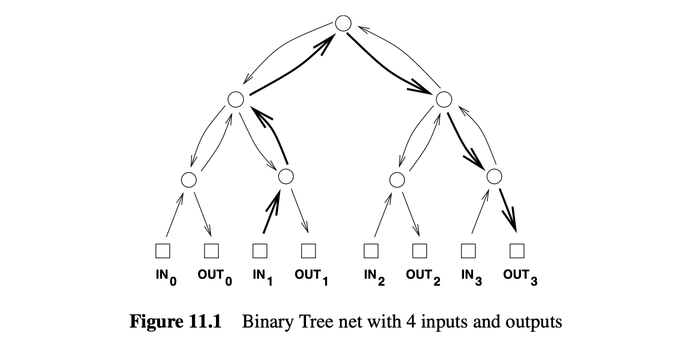
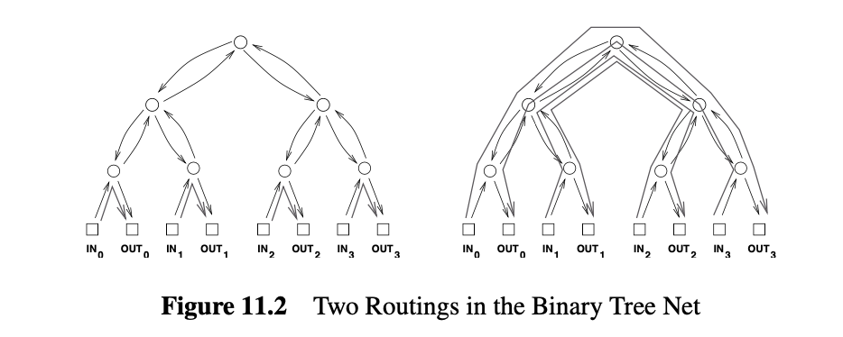
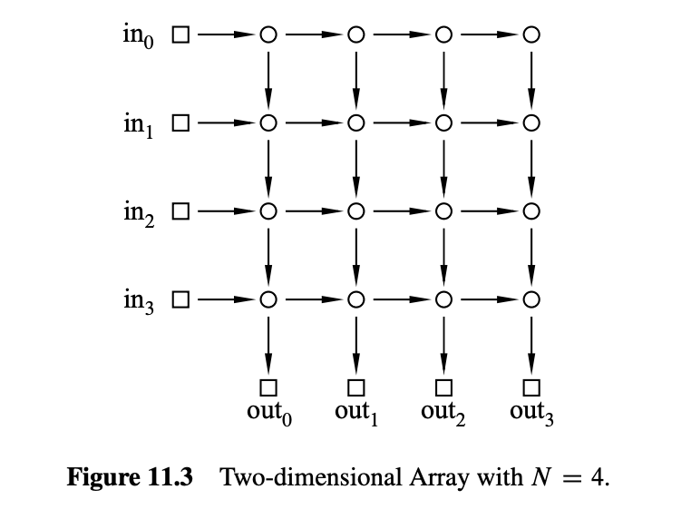
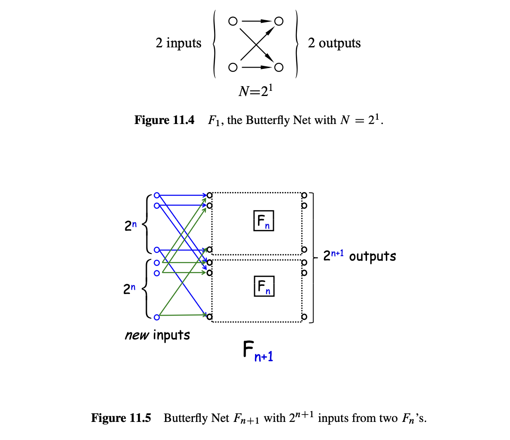
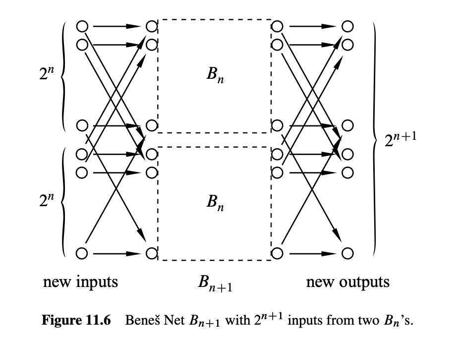
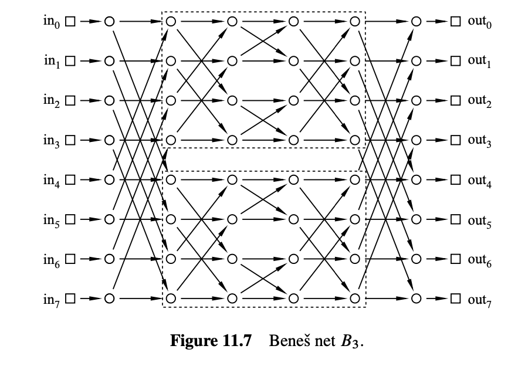
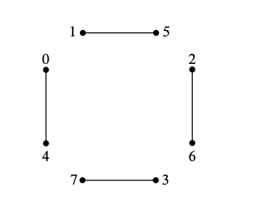
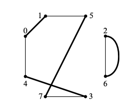
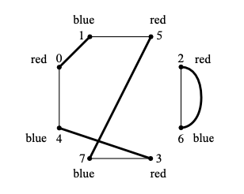

# 11.通信网络 {#通信网络}

建模通信网络是计算机科学中有向图的一个重要应用. 在这种模型中,
顶点表示计算机、处理器和交换机；边表示数据流经的电线、光纤或其他传输线.
对于某些通信网络, 如互联网, 相应的图是巨大且混乱的. 相比之下,
高度结构化的网络在电话交换系统和平行计算机内部的通信硬件中找到应用.
在本章中, 我们将介绍一些最优秀和最常用的结构化网络.

## 11.1 路由 {#路由}

我们考虑的通信网络旨在传输数据包,
这些数据包在计算机、处理器、电话或其他设备之间传输.
术语数据包指的是某些固定大小的数据——比如256字节或4096字节.

### 11.1.1 完全二叉树 {#完全二叉树}

让我们从一棵完全二叉树开始. 图11.1是一个有4个输入和4个输出的例子.

在此图中, 以及后续的许多图中, 方块表示终端——数据包的来源和目的地.
圆形表示交换机, 它们通过网络引导数据包. 交换机在输入边接收数据包,
并沿着输出边转发它们. 因此,
你可以想象一个数据包从输入终端通过一系列由有向边连接的交换机跳跃到输出终端.

在树中, 每对顶点之间有唯一的路径,
所以只有一种方式将数据包从输入终端路由到输出终端. 例如,
从输入1到输出3的数据包路径以粗体显示.

### 11.1.2 路由问题 {#路由问题}

通信网络的目标是将数据包从输入传输到输出,
每个数据包在其自己的输入交换机进入网络, 并在其自己的输出交换机到达.
我们将考虑几种不同的通信网络设计,
其中每个网络有*N*个输入和*N*个输出；为了方便起见, 我们假设*N*是2的幂.

哪个输入应该去哪里由\[0..*N*−1\]的一个排列指定. 因此,
排列*π*定义了一个路由问题：使一个数据包从输入*i*开始到达输出*π*(*i*).
解决路由问题*π*的路由是从每个输入到其指定输出的一组路径*P*. 也就是说,
*P*是一组路径*P**i*,
其中*P**i*从输入*i*到输出*π*(*i*), 对于*i* ∈ \[0..*N*−1\].

## 11.2 路由度量 {#路由度量}

### 11.2.1 网络直径 {#网络直径}

数据包从输入到达其指定输出之间的延迟是通信网络中的一个关键问题. 通常,
这种延迟与数据包所遵循路径的长度成正比.
假设跨越一条电线需要一个时间单位,
那么数据包的延迟将是其从输入到输出所跨越的电线数.

数据包通常通过最短路径从输入路由到输出. 对于最短路径路由,
最坏情况下的延迟是距离最远的输入和输出之间的距离. 这称为网络的直径.
换句话说, 网络的直径是任意输入和输出之间的最短路径的最大长度.

例如, 在上述完全二叉树中, 从输入1到输出3的距离为6.
输入和输出之间没有比这更远的距离, 因此这棵树的直径也是6.

更广泛地说, 具有*N*个输入和输出的完全二叉树的直径是2log *N* + 2.
这非常好, 因为对数函数增长得非常缓慢.
我们可以使用一个完全二叉树连接多达210 = 1024个输入和输出,
任何数据包的最坏输入输出延迟为2log (210) + 2 = 22.

#### 交换机大小 {#交换机大小}

减少网络直径的一种方法是使用更大的交换机. 例如, 在完全二叉树中,
大多数交换机有三个输入边和三个输出边, 这使它们成为3×3的交换机.
如果我们有4×4的交换机, 我们可以构建一个直径更小的三叉树. 原则上,
我们甚至可以通过一个巨大的*N* × *N*交换机连接所有输入和输出.

当然, 这样做并不太有效.
使用*N* × *N*交换机只是将原始网络设计问题隐藏在这个抽象的交换机中. 最终,
我们将不得不使用更简单的组件设计巨型交换机的内部, 然后我们又回到了起点.
因此,
设计通信网络的挑战在于如何使用固定大小的基本设备（如3×3交换机）获得*N* × *N*交换机的功能.

### 11.2.2 交换机数量 {#交换机数量}

设计通信网络的另一个目标是使用尽可能少的交换机. 在完全二叉树中,
顶部有一个“根”交换机, 随后每行的交换机数量翻倍,
因此具有*N*个输入的完全二叉树中的交换机数量为1 + 2 + 4 + 8 + ⋯ + *N*.
因此, 交换机的总数量是2*N* − 1, 根据几何和的公式（问题5.4）.
这几乎是使用3×3交换机的最佳结果.

### 11.2.3 网络延迟 {#网络延迟}

我们有时会选择通过网络路由来优化除延迟以外的一些量. 例如, 在下一节中,
我们将尝试最小化数据包拥塞. 当我们不最小化延迟时,
最短路由并不总是最佳的, 通常, 数据包的延迟取决于它的路由方式.
对于任何路由, 延迟最大的数据包将是遵循最长路径的数据包.
路由中最长路径的长度称为延迟.

网络的延迟取决于优化的目标.
通过假设在将输入引导到其指定输出时总是选择最优路由来度量. 也就是说,
对于每个路由问题*π*, 我们选择解决*π*的最优路由. 然后,
网络延迟被定义为这些最优路由中最大的路由延迟. 如果路由总是选择优化延迟,
那么网络延迟将等于网络直径, 但如果路由选择优化其他内容,
延迟可能显著更大.

对于我们下面考虑的网络,
从输入到输出的路径是唯一确定的（对于树的情况）或者所有路径长度相同,
因此网络延迟总是等于网络直径.

### 11.2.4 拥塞 {#拥塞}

完全二叉树有一个致命的缺陷：根交换机是一个瓶颈. 最好的情况下,
这个交换机必须处理左右方向的数据包.
通过这个交换机的所有数据包可能需要很长时间. 最坏情况下,
如果这个交换机故障, 网络将被分成两块大小相等的部分.

确实, 如果路由问题由恒等排列给出, Id(*i*) :  := *i*,
那么有一个简单的路由*P*可以解决问题：让*P**i*是从输入*i*到输出*i*通过一个交换机再返回输入*i*的路径.
另一方面, 如果问题由*π*(*i*) :  := (*N*−1) − *i*给出, 那么在任何解*Q*中,
每条路径*Q**i*从输入*i*开始最终必须通过根交换机再返回到输出(*N*−1) − *i*.
这两种情况如图11.2所示. 我们可以根据拥塞区分“好”的路径集和“坏”的路径集.

路由*P*的拥塞等于通过单个交换机的最大路径数. 例如, 左图路由的拥塞是1,
因为每个交换机最多通过1条路径. 然而, 右图路由的拥塞是4,
因为4条路径通过根交换机（并且根下面的两个交换机各通过2条路径）. 通常,
较低的拥塞更好, 因为数据包可能在过载交换机处延迟.

通过将拥塞的概念扩展到网络,
我们也可以根据瓶颈问题区分“好”的网络和“坏”的网络.
对于网络的每个路由问题*π*, 我们假设选择一个优化拥塞的路由,
即在解决*π*的所有路由中具有最小拥塞的路由.
那么交换机将遭受的最大拥塞是这些最优路由中最大的拥塞.
这种“极小极大”拥塞称为网络的拥塞.

因此, 对于完全二叉树, 最坏的排列是*π*(*i*) :  := (*N*−1) − *i*.
在每个可能的*π*解中, 每个数据包都必须经过根交换机. 因此,
完全二叉树的最大拥塞是*N*——这很糟糕!

让我们总结一下我们的分析结果：

| 网络       | 直径         | 交换机的大小 | 交换机的数量 | 拥塞 |
|------------|--------------|--------------|--------------|------|
| 完全二叉树 | 2log *N* + 2 | 3 × 3        | 2*N* − 1     | *N*  |

## 11.3 网络设计 {#网络设计}

### 11.3.1 二维网格 {#二维网格}

通信网络也可以设计成二维网格.
图11.3显示了一个具有四个输入和输出的二维网格.

在此例子中, 直径为8, 即输入0和输出3之间的边数. 更一般地,
具有*N*个输入和输出的数组的直径是2*N*,
这比完全二叉树的直径2log *N* + 2要差得多.
但我们得到了另一个好处：用数组替换完全二叉树几乎消除了拥塞.

#### 定理 11.3.1 {#定理-11.3.1}

*N*输入数组的拥塞为2.

首先, 我们证明拥塞最多为2. 设*π*为任意排列.
定义*π*的解*P*为路径集*P**i*,
其中*P**i*从输入*i*向右到达列*π*(*i*),
然后向下到达输出*π*(*i*). 因此,
行*i*和列*j*的交换机最多传输两个数据包：一个来自输入*i*,
另一个发往输出*j*的数据包.

接下来, 我们证明拥塞至少为2. 这是因为在任何路由问题*π*中,
其中*π*(0) = 0且*π*(*N*−1) = *N* − 1, 两个数据包必须通过左下角的交换机.

因此, 当最小化拥塞时, 网络延迟与直径相同.
这是因为给定输入和输出之间的所有路径长度相同.

现在我们可以记录二维数组的特性.

| 网络       | 直径         | 交换机的大小 | 交换机的数量    | 拥塞 |
|------------|--------------|--------------|-----------------|------|
| 完全二叉树 | 2log *N* + 2 | 3 × 3        | 2*N* − 1        | *N*  |
| 二维网格   | 2*N*         | 2 × 2        | *N*2 | 2    |

这里关键的是交换机的数量, 即*N*2.
这是二维数组的主要缺陷；大小为*N* = 1000的网络将需要一百万个2 × 2的交换机!
尽管如此, 对于*N*较小的应用程序,
数组的简单性和低拥塞使其成为一个有吸引力的选择.

### 11.3.2 蝶形网络 {#蝶形网络}

交换网络的圣杯将结合完全二叉树（低直径、少交换机）和数组（低拥塞）的最佳特性.
蝶形网络是两者之间的广泛使用的折中方案.

理解蝶形网络的一个好方法是将其视为递归数据类型. 递归定义更有效,
因为我们只定义交换机及其连接, 省略终端. 因此,
我们递归定义*F**n*为具有*N* :  := 2*n*输入和输出交换机的蝶形网络中的交换机和连接.

基本情况是*F*1, 它有2个输入交换机和2个输出交换机,
如图11.4所示.

在构造步骤中,
我们通过将两个*F**n*网络连接到一组新的2*n* + 1输入交换机,
构建*F**n* + 1, 如图11.5所示. 也就是说,
第*i*个和第2*n* + *i*个新输入交换机分别连接到相同的两个交换机,
即两个*F**n*组件中第*i*个输入交换机,
*i* = 1, …, 2*n*.
*F**n* + 1的输出交换机只是每个*F**n*副本的输出交换机.

因此, 通过在*F**n*的列中添加一列交换机,
*F**n* + 1布置在高度为2*n* + 1的列中.
由于构造从*n* = 1时的两列开始,
*F**n* + 1的交换机排列在*n* + 1列中.
交换机的总数是列的高度乘以列的数量2*n* + 1(*n*+1).
记住*n* = log *N*, 我们得出具有*N*输入的蝶形网络有*N*(log*N*+1)个交换机.

在构造步骤中,
我们通过将两个*B**n*网络连接到一组新的2*n* + 1输入交换机和一组新的2*n* + 1输出交换机,
构建*B**n* + 1. 如图11.6所示.

*i*和2*n* + *i*个新输入交换机分别连接到相同的两个交换机：两个*B**n*组件中的第*i*个输入交换机,
*i* = 1, …, 2*n*, 正如在蝶形网络中一样. 此外,
*i*和2*n* + *i*个新输出交换机连接到相同的两个交换机,
即两个*B**n*组件中的第*i*个输出交换机.

现在, 通过在*B**n*的列中添加两列交换机,
*B**n* + 1布置在高度为2*n* + 1的列中. 因此,
*B**n* + 1的交换机排列在2(*n*+1)列中.
交换机的总数是列的数量乘以高度2(*n*+1)2*n* + 1.

*B**n* + 1中从输入交换机到输出交换机的所有路径长度为2(*n*+1) − 1,
2*n* + 1输入的Beneš网络的直径为该长度加上连接到终端的两个边,
因此为2(*n*+1) + 1.

因此, Beneš将交换机数量和直径增加了一倍,
但通过这样做他完全消除了拥塞问题!
这一事实的证明依赖于稍后将要讨论的巧妙归纳论证.
让我们首先看看Beneš网络如何堆叠：

| 网络       | 直径         | 交换机的大小 | 交换机的数量    | 拥塞                       |
|----------------|--------------|--------------|--------------|----------------|
| 完全二叉树 | 2log *N* + 2 | 3 × 3        | 2*N* − 1        | *N*                        |
| 二维网格   | 2*N*         | 2 × 2        | *N*2 | 2                          |
| 蝶形网络   | log *N* + 2  | 2 × 2        | *N*(log(*N*)+1) | $\sqrt{N}$ 或 $\sqrt{N}/2$ |
| Beneš      | 2log *N* + 1 | 2 × 2        | 2*N*log *N*     | 1                          |

Beneš网络尺寸小, 直径小, 并且完全消除了拥塞. 路由网络的圣杯就在手中!

#### 定理 11.3.2 {#定理-11.3.2}

*N*输入的Beneš网络的拥塞为1.

通过对*n*进行归纳, 其中*N* = 2*n*.
归纳假设是*P*(*n*) :  := *B**n*的拥塞为1.

基本情况（*n* = 1）：*B*1 = *F*1如图11.4所示.
*F*1中的唯一路由拥塞为1.

归纳步骤：我们假设*N* = 2*n*输入的Beneš网络的拥塞为1,
并证明2*N*输入的Beneš网络的拥塞也为1.

插曲. 暂停时间! 让我们通过一个例子来演练, 建立一些直觉, 然后完成证明.
在图11.7所示的具有*N* = 8输入和输出的Beneš网络中,
两个4输入/输出子网络在虚线框中.

根据归纳假设, 子网络可以以拥塞1的任意排列进行路由. 因此,
如果我们能引导数据包安全通过第一级和最后一级,
那么我们就可以依靠归纳来完成其余部分!
让我们看看这个例子中的排列路由问题如何工作：

*π*(0) = 1  *π*(4) = 3  
*π*(1) = 5  *π*(5) = 6  
*π*(2) = 4  *π*(6) = 0  
*π*(3) = 7  *π*(7) = 2

我们可以将每个数据包通过上层子网络或下层子网络路由到其目的地. 然而,
一个数据包的选择可能会限制另一个的选择. 例如,
我们不能通过同一网络路由数据包0和数据包4,
因为这会导致两个数据包在单个交换机处碰撞, 导致拥塞. 相反,
一个数据包必须通过上层网络, 另一个通过下层网络. 同样, 数据包1和5,
数据包2和6以及3, 7必须通过不同的网络进行路由.

让我们在图中记录这些约束. 顶点是8个数据包.
如果两个数据包必须通过不同的网络, 则它们之间有一条边. 因此,
我们的约束图如下所示：

注意, 每个顶点至多有一条边相交. 网络的输出端施加了一些进一步的约束.
例如,
发送到输出0（即数据包6）和输出4（即数据包2）的数据包不能通过同一个网络；那样会要求这两个数据包从同一个交换机到达.
同样, 发送到输出1和5、2和6、3和7的数据包也必须通过不同的交换机.
我们可以在图中用灰色边记录这些附加约束：

注意, 每个顶点至多有一条新边相交.
2和6之间绘制的两条线反映了这两个不同原因,
表示这些数据包必须通过不同的网络. 然而,
我们打算这是一个简单的图；这两条线仍然表示一条边.

现在, 这里的关键见解是：假设我们可以将每个顶点着色为红色或蓝色,
使得相邻顶点着色不同. 然后, 如果我们将红色数据包通过上层网络,
蓝色数据包通过下层网络, 则所有约束都满足.
这种图的2-着色对应于路由问题的解决方案.
唯一剩下的问题是约束图是否可以2-着色, 这很容易验证：

#### 引理 11.3.3 {#引理-11.3.3}

证明如果图的边可以分成两组, 使得每个顶点至多有一条来自每组的边相交,
则图可以2-着色.

很容易证明图可以2-着色当且仅当图中的每个环都是偶数长度（参见定理12.8.3）.
我们将在此默认这一点.

因此, 我们所要做的就是证明每个环都是偶数长度. 由于两组边可能重叠,
我们称重叠的边为重复边.

有两种情况：

1.  **环包含重复边**：环的任一端点都不能与重复边的端点相交,
    因为那样端点将与来自同一组的两条边相交. 因此,
    环遍历重复边的次数是偶数次.

2.  **环中没有边是重复的**：由于每个顶点与每组的至多一条边相交,
    任何没有重复边的路径必须交替穿过每组的连续边. 因此,
    环必须交替穿过两组边, 从不同组的边开始和结束.
    这意味着环的长度必须是偶数.

比如, 这里是约束图的一个2-着色:

对这一图着色问题的解决方案为数据包路由问题提供了一个开始：

我们可以通过归纳在两个较小的Beneš网络中完成路由! 回到证明中.

设*π*为\[0..*N*−1\]的任意排列.
令*G*为顶点为数据包编号0, 1, …, *N* − 1且边来自以下两个集合之一的图：

*E*1 := {{*u* − *v*}\|\|*u* − *v*\| = *N*/2},

*E*2 := {{*u* − *w*}\|\|*π*(*u*) − *π*(*w*)\| = *N*/2}.

现在,
任何顶点*u*至多有两条边：一条唯一的边{*u* − *v*} ∈ *E*1和一条唯一的边{*u* − *w*} ∈ *E*2.
因此, 根据引理11.3.3, *G*的顶点可以2-着色. 现在,
将一种颜色的数据包通过上层子网络,
另一种颜色的数据包通过下层子网络进行路由. 由于每条*E*1中的边,
一顶点通过上层子网络, 另一顶点通过下层子网络, 第一层中不会有任何冲突.
由于每条*E*2中的边, 一顶点通过上层子网络, 另一顶点通过下层子网络,
最后一层中不会有任何冲突.
我们可以通过归纳假设*P*(*n*)在每个子网络中完成路由.

