# 12. 简单图

*简单图* 描述的是**对称**关系, 即这种关系是相互的.
此类相互关系的例子包括婚姻、说同一种语言、不说同一种语言、在重叠的时间间隔内发生、或通过导线连接.
他们出现在各种应用中, 包括日程安排、约束满意度、计算机图形学和通信,
但我们将从一个旨在吸引你注意的应用开始：我们将对性行为进行专业调查.
具体来说, 我们将看看平均而言, 谁有更多的异性伴侣：男性还是女性.

性别统计学一直是许多研究的主题. 在最大的一项研究中,
芝加哥大学的研究人员在几年的时间里随机采访了2500人, 试图回答这个问题.
他们的研究于1994年发表, 题为《性的社会组织》,
发现男性平均比女性多74%的异性伴侣.

其他研究发现这种差距甚至更大. 特别是, ABC新闻声称,
平均一个男性一生有20个伴侣, 而平均一个女性有6个, 百分比差距为233%.
ABC新闻在2004年播出的Primetime Live节目中,
声称这是有史以来最科学的调查之一, 误差仅为2.5%.
该调查被称为“美国性调查：床单之间的窥探”,
这对他们的报道严肃性提出了一些质疑.

然而, 在2007年8月, 《纽约时报》报道称,
美国政府国家健康统计中心的一项研究显示, 男性有七个伴侣, 而女性有四个.
那么, 你认为芝加哥大学、ABC新闻或国家中心的数字哪个更准确呢？

不要回答——这是一个旨在令你陷入困境的陷阱问题. 通过一个小小的图论理论,
我们将解释为什么这些发现都不可能接近真实.

## 12.1 顶点相邻性和度

简单图的定义几乎与有向图相同,
只是边是**无向的**——它们连接两个顶点而不指向顶点之间的任一方向. 因此,
简单图中没有有向边$\langle v \rightarrow w \rangle$,
只有无向边$\langle v \text{—} w \rangle$连接顶点$v$和$w$.

#### 定义 12.1.1

一个简单图$G$由一个非空集$V(G)$（称为顶点集）和一个集$E(G)$（称为边集）组成.
$V(G)$的元素称为顶点. $E(G)$的元素是无向边, 简称为“边”.
无向边有两个顶点$u \ne v$, 称为其端点.
这样的边可以用二元集合$\{u, v\}$表示.
记号$\langle u \text{—} v \rangle$表示这条边.

$$
\langle u \text{—} v \rangle \text{ 和 } \langle v \text{—} u \rangle \text{ 表示相同的无向边, 其端点是 } u \text{ 和 } v. 
$$

例如, 令$H$是图12.1所示的图. $H$的顶点对应于图12.1中的九个点, 即

$$
V(H) = \{a, b, c, d, e, f, g, h, i\}. 
$$

边对应于八条线, 即

$$
E(H) = \{\langle a \text{—} b \rangle, \langle a \text{—} c \rangle, \langle b \text{—} d \rangle, \langle c \text{—} d \rangle, \langle c \text{—} e \rangle, \langle e \text{—} f \rangle, \langle e \text{—} g \rangle, \langle h \text{—} i \rangle\}. 
$$

数学上, 这就是图$H$的全部内容.

#### 定义 12.1.2

简单图中的两个顶点当且仅当它们是同一条边的端点时,
称为相邻；边当且仅当其端点是顶点时, 称为连接.
与顶点$v$相连的边的数量称为顶点$v$的度, 并表示为$\deg(v)$. 等效地,
顶点的度是其相邻顶点的数量.

例如, 对于图12.1中的图$H$, 顶点$a$与顶点$b$相邻, $b$与$d$相邻.
边$\langle a \text{—} c \rangle$连接其端点$a$和$c$. 顶点$h$的度为1,
$d$的度为2, $e$的度为3. 顶点可以有度0, 在这种情况下,
它不与任何其他顶点相邻. 简单图$G$不需要有任何边. $|E(G)|$可以为零,
这意味着每个顶点的度也为零.
但简单图必须至少有一个顶点——$|V(G)|$要求至少为1.

请注意, 在简单图中, 同一对顶点之间不能有多于一条边$\tag{1}$. 此外,
简单图中不允许有自环——即起始和终止于同一顶点的边.

*对于本章的其余部分, 我们将“图”用作“简单图”的缩写.*

顶点的同义词是“节点”, 我们将这些词互换使用. 简单图有时被称为网络,
边有时被称为弧或线. 我们在此提醒你,
以防你查看其他图论文献；我们不会使用这些词.

## 12.2 美国的性别统计

令我们用图论模型来描述异性恋伴侣的问题. 为此, 我们设$G$为一个图,
其顶点$V$是所有美国人. 然后我们将$V$分为两个子集：$M$包含所有男性,
$F$包含所有女性. 我们会在一个男性和一个女性之间画一条边,
当且仅当他们曾经是性伴侣. 这个图如图12.2所示, 男性在左边, 女性在右边.

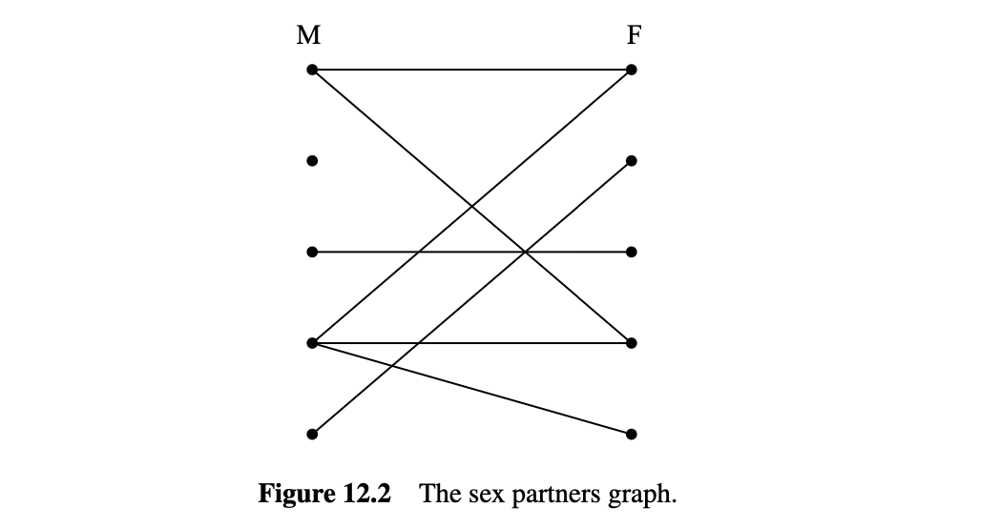

实际上, 这是一个很难搞清楚的图, 更别提画出来了.
这个图是巨大的：美国人口约为3亿, 所以$|V| \approx 300M$. 其中,
大约50.8%是女性, 49.2%是男性, 所以$|M| \approx 147.6M$,
$|F| \approx 152.4M$. 而且我们甚至没有关于边的数量的可信估计,
更不用说精确的配对了. 但事实证明,
我们不需要知道这些——我们只需要弄清楚男性和女性的平均伴侣数量的关系.
为此, 我们注意到每条边在$M$顶点上有一个端点（记住,
我们只考虑男女关系）；所以$M$顶点的度的和等于边的数量. 同样的原因,
$F$顶点的度的和也等于边的数量. 所以这些和是相等的：

$$
\sum_{x \in M} \deg(x) = \sum_{y \in F} \deg(y). 
$$

现在我们假设将等式两边除以两个集合的大小$|M| \cdot |F|$：

$$
\left( \frac{\sum_{x \in M} \deg(x)}{|M|} \right) \cdot \frac{1}{|F|} = \left( \frac{\sum_{y \in F} \deg(y)}{|F|} \right) \cdot \frac{1}{|M|}. 
$$

括号中的术语是$M$顶点的平均度和$F$顶点的平均度. 所以我们知道：

$$
\text{Avg. deg in } M = \frac{|F|}{|M|} \cdot \text{Avg. deg in } F \tag{12.1}
$$

换句话说,
我们已经证明了在群体中男性的女性伴侣的平均数量与女性的男性伴侣的平均数量仅由人口中男女的相对数量决定.

现在, 人口普查局报告说, 美国的女性比男性稍多；特别是$|F|/|M|$约为1.035.
所以我们知道男性平均比女性多3.5%的异性伴侣,
这并不能说明任何性别的淫乱或选择性. 实际上, 这只是与男女的相对数量有关.
总体而言, 男性和女性有相同数量的异性伴侣,
因为每个配对需要一个来自每组的成员, 但男性较少, 所以他们的比例较高.
这意味着芝加哥大学、ABC和联邦政府的研究都错了. 经过巨大的努力,
他们给出了完全错误的答案.

没有明确的解释为什么这样的调查总是错误的.
一种假设是男性夸大了他们的伴侣数量——或者女性低估了她们的数量——但这些解释都是猜测性的.
有趣的是, 这项研究的主要作者, 美国国家健康统计中心的研究员报告说,
她知道结果肯定是错误的, 但那是收集到的数据, 她的工作是报告它.

相同的基本问题导致了对其他调查数据的严重误解. 例如, 几年前,
《波士顿环球报》对波士顿地区校园学生学习习惯的调查显示,
少数族裔学生平均比非少数族裔学生更倾向于与非少数族裔学生一起学习.
然后他们详细解释了为什么这种“显著现象”可能是真实的. 但这并不显著.
使用我们的图论公式, 我们可以看到,
这只是在说少数族裔学生比非少数族裔学生少, 这当然是“少数族裔”意味着的.

### 12.2.1 握手引理

前面的论证依赖于度的和与边的数量之间的联系.
任何图中这两者之间有一个简单的联系：

#### 引理 12.2.1

图中顶点的度的和等于边的两倍.

每条边对度的和贡献2, 每个端点一个. $\blacksquare$

我们将引理12.2.1称为握手引理：如果我们统计在一个聚会上每个人握手的人的数量,
总数将是发生的握手数量的两倍.

#### 12.3 一些常见的图

有些图经常出现, 以至于它们有了名字. 一个完全图$K_n$有$n$个顶点,
每两个顶点之间都有一条边, 总共有$n(n-1)/2$条边. 例如, 图12.3显示了$K_5$.

空图没有任何边. 例如, 图12.4显示了一个五顶点的空图.

一个有$n$个顶点的图, 包含$n-1$条连续边, 称为线图$L_n$. 更正式地, $L_n$有

$$
V(L_n) = \{v_1, v_2, \ldots, v_n\}
$$

和

$$
E(L_n) = \{\langle v_1 \text{—} v_2 \rangle, \langle v_2 \text{—} v_3 \rangle, \ldots, \langle v_{n-1} \text{—} v_n \rangle\}
$$

例如, $L_5$如图12.5所示.

还有一个单向无限线图$L_\infty$, 可以通过令非负整数$\mathbb{N}$作为顶点,
并将边$\langle k \text{—} (k + 1) \rangle$加到所有$k \in \mathbb{N}$上来定义.

如果我们将边$\langle v_n \text{—} v_1 \rangle$添加到线图$L_n$中,
我们得到一个称为长度为$n$的循环图$C_n$. 图12.6显示了一个长度为5的循环图.

#### 12.4 同构

两个看起来不同的图在形式上实际上可能是相同的. 例如,
图12.7中的两个图都是四个顶点、五条边的图, 通过将图(a)顺时针旋转90度,
你可以得到图(b).

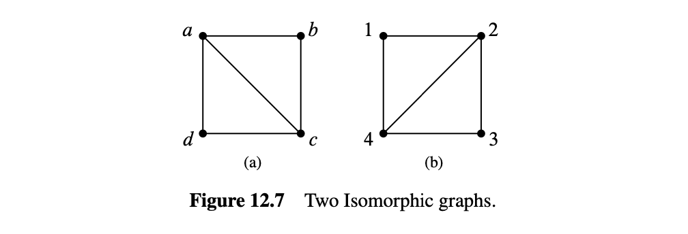

严格来说, 这些图是不同的数学对象,
但这种差异并不能反映两个图可以用相同的图描述的事实——除了顶点上的标签不同.
这个关于“标签改变”的思想可以通过调整10.7.1节的有向图同构定义来简洁地捕捉,
以处理简单图. 两个图之间的同构是它们的顶点集之间保持边的双射：

#### 定义 12.4.1

图$G$和$H$之间的同构是一个从$V(G)$到$V(H)$的双射$f$, 使得

$$
\langle u \text{—} v \rangle \in E(G) \text{ 当且仅当 } \langle f(u) \text{—} f(v) \rangle \in E(H)
$$

对于所有$u, v \in V(G)$. 当存在同构时, 两个图是同构的.

这里是图12.7中两个图之间的同构$f$：

$$
f(a) ::= 2 \quad f(b) ::= 3 \quad f(c) ::= 4 \quad f(d) ::= 1. 
$$

你可以检查, 如果左图中的两个顶点之间有一条边,
那么当且仅当右图中对应的两个顶点之间也有一条边.

两个同构的图可能绘制得非常不同. 例如,
图12.8显示了绘制$C_5$的两种不同方式.

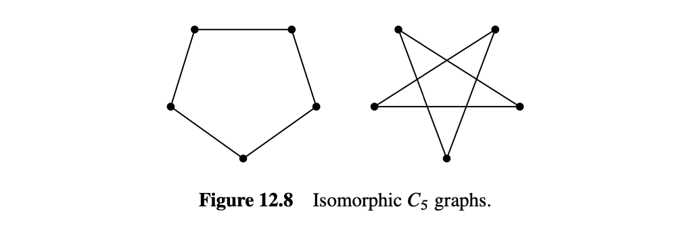

注意, 如果$f$是$G$和$H$之间的同构, 那么$f^{-1}$也是$H$和$G$之间的同构.
同构也是传递的, 因为同构的组合是同构. 事实上, 同构是一个等价关系.

同构保留了图的连接属性, 抽象了顶点的名称、构成材料或在图中的位置.
更准确地说, 如果一个图的属性在同构下被保留, 则当$G$具有该属性时,
每个与$G$同构的图也具有该属性. 例如, 由于同构是顶点集之间的双射,
同构图必须具有相同数量的顶点. 此外, 如果$f$是图同构,
将一个图的顶点$v$映射到同构图的顶点$f(v)$, 那么根据同构的定义,
每个与$v$相邻的顶点将被$f$映射到与$f(v)$相邻的顶点. 因此,
$v$和$f(v)$将具有相同的度. 如果一个图有一个度为四的顶点而另一个没有,
那么它们就不可能是同构的. 事实上, 如果两个图中度为四的顶点数量不同,
那么它们就不是同构的.

寻找被保留的属性可以很容易地确定两个图不是同构的,
或者在有同构时指导同构的搜索. 在实践中, 通常很容易确定两个图是否同构.
然而,
至今还没有找到一种保证在所有图对上都能在多项式时间内运行的确定两个图是否同构的程序.

如果有这样一个程序将是有用的. 例如,
它可以很容易地根据分子键在数据库中搜索特定的分子. 另一方面,
知道没有这样的高效程序也很有价值：安全协议、加密和远程认证可以建立在图同构计算量大的假设上.

双射和同构的定义适用于无限图以及有限图,
正如本章其余部分的大多数结果一样. 但图论主要关注有限图, 我们也是.

*在本章的其余部分, 我们将假设图是有限的.*

自从我们在12.3节开头写“$K_n$有$n$个顶点……”以来,
我们实际上一直在默认同构.

*图论就是关于同构所保留的属性.*

#### 12.5 二部图与匹配

在“美国的性别统计”图中有两类顶点, 男性和女性, 边只在这两类顶点之间.
这样的图如此频繁地出现, 以至于它们有了一个特殊的名字：二部图.

#### 定义 12.5.1

二部图是一个图, 其顶点可以划分为两个部分, $L(G)$和$R(G)$,
使得每条边有一个端点在$L(G)$中, 另一个端点在$R(G)$中.

所以每个二部图看起来都像图12.2中的图.

#### 12.5.1 二部匹配问题

二部匹配问题与我们刚研究的“美国的性别统计”问题有关；只是现在,
目标是令每个人幸福地结婚. 如你所想象的, 由于各种原因, 这是不可能的,
其中最重要的是美国的女性比男性多. 因此, 简单地说,
不可能令每个男人与一个女人结婚, 使得每个男人最多结婚一次.

但要令每个男人都有一个伴侣,
使得每个女人最多结婚一次呢？是否可以做到每个男人都与他喜欢的女人配对？答案当然取决于表示谁喜欢谁的二部图,
但好消息是可以找到决定这个问题的二部图的自然属性.

一般来说, 假设我们有一组男人和一个等于或大于这组男人的女人集合,
并且当一个男人喜欢一个女人时, 图中就有一条边. 在这种情况下,
“喜欢”关系不需要是对称的, 因为目前我们只会担心为每个男人找到一个伴侣.

稍后, 我们也会从女性的角度考虑“喜欢”关系. 例如,
我们可能会得到图12.9中的图.

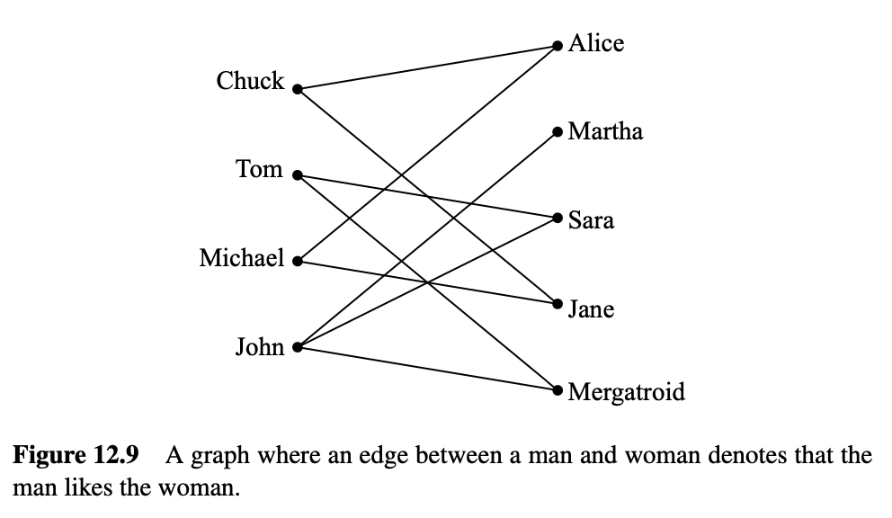

匹配定义为将一个女人分配给每个男人, 使不同的男人分配给不同的女人,
并且男人总是分配给他喜欢的女人. 例如,
图12.10显示了一个可能的匹配.

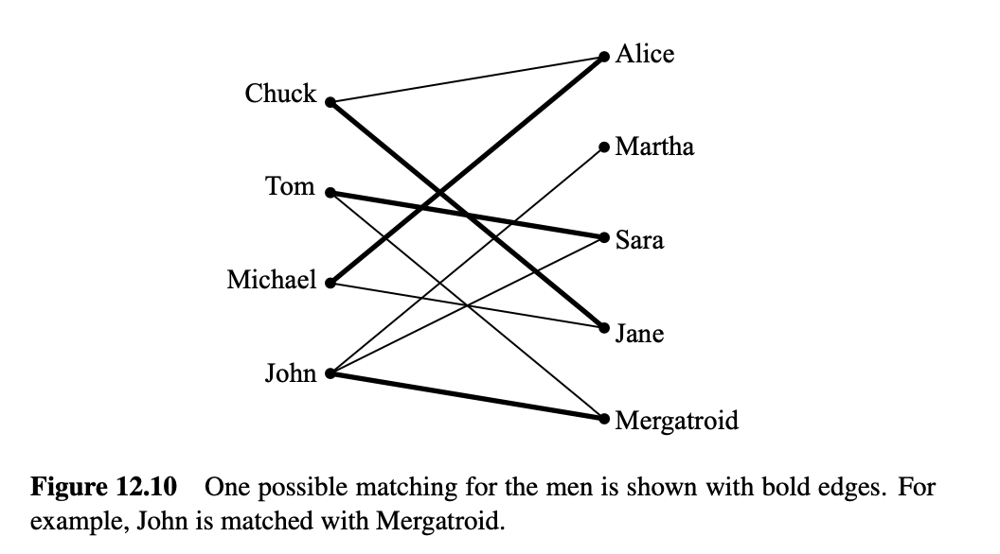

#### 12.5.2 匹配条件

一个著名的结果称为霍尔匹配定理,
它给出了二部图中存在匹配的必要和充分条件.
事实证明这是一个非常有用的数学工具.

我们将使用“男人喜欢女人”的术语来陈述和证明霍尔定理.
定义给定一组男人喜欢的女人集为至少一个男人喜欢的所有女人. 例如,
图12.9中的汤姆和约翰喜欢的女人集包括玛莎、莎拉和梅格特罗伊德.
为了使我们有机会完成所有男人的匹配, 必须满足以下匹配条件：

匹配条件：男人的每个子集至少喜欢同样多的女人集.

例如, 如果某个4人的男人集只喜欢3个女人, 我们就无法找到匹配.
霍尔定理说这个必要条件实际上是充分的；如果满足匹配条件, 则存在匹配.

#### 定理 12.5.2

当且仅当满足匹配条件时, 可以为一组男人$M$与一组女人$W$找到一个匹配.

首先, 假设存在一个匹配并证明匹配条件成立. 对于男人的每个子集,
每个男人至少喜欢他匹配的那个女人, 并且一个女人最多与一个男人匹配. 因此,
男人的每个子集至少喜欢同样多的女人集. 因此, 匹配条件成立.

接下来, 假设匹配条件成立并证明存在一个匹配.
我们使用强归纳法来证明关于男人数量$|M|$的命题：

$P(m) ::= \text{如果匹配条件对集合 } M \text{ 成立, 则 } M \text{ 有一个匹配}$.

基本情况（$|M| = 1$）：如果$|M| = 1$,
则匹配条件意味着孤独的男人至少喜欢一个女人, 因此存在一个匹配.

归纳步骤：假设$|M| = m + 1 \ge 2$. 要找到$M$的匹配, 有两种情况.

**情况1**：最多$m$人的每个非空子集喜欢严格更多的女人集. 在这种情况下,
我们有一定的自由度：我们将一个任意男人与他喜欢的一个女人配对,
然后送走他们. 这留下了$m$个男人和一个女人, 匹配条件仍然成立. 因此,
归纳假设$P(m)$意味着我们可以匹配剩余的$m$人.

**情况2**：最多$m$人的某个非空子集$X$喜欢一个等大小的女人集$Y$.
匹配条件在$X$内部必须成立,
因此强归纳假设意味着我们可以将$X$中的男人与$Y$中的女人匹配.
这留下了将集合$M - X$的男人与集合$W - Y$的女人匹配的问题.

但将$M - X$与$W - Y$匹配的问题也满足匹配条件,
因为$M - X$中的男人喜欢$W - Y$中的女人的任何子集意味着有一组男人喜欢$W - Y$中的较少女人.
即,
如果$M_0 \subseteq M - X$喜欢严格较少的女人子集$W_0 \subseteq W - Y$,
则$M_0 \cup X$的男人只喜欢$W_0 \cup Y$的较小子集. 因此,
强归纳假设再次意味着我们可以将$M - X$中的男人与$W - Y$中的女人匹配,
从而完成了$M$的匹配.

因此, 在这两种情况下, 男人都有一个匹配, 从而完成了归纳步骤.
定理通过归纳法得证. $\blacksquare$

定理12.5.2的证明给出了在二部图中找到匹配的算法, 尽管不是非常高效. 然而,
确实存在高效的算法来找到二部图中的匹配. 因此,
如果一个问题可以简化为找到匹配, 则可以以合理的效率解决该问题.

### 正式表述

我们用数学术语重新表述定理12.5.2, 以便你不再总是说,
“现在这组男人喜欢至少同样多的女人……”

#### 定义 12.5.3

图$G$中的一个匹配是边集$M \subseteq E(G)$,
使得$M$中的任意两条边都不与同一顶点相交.
$M$中的边相交的顶点称为被$M$覆盖. 覆盖$V(G)$时, 匹配称为完美匹配.
顶点集$S \subseteq V(G)$的邻居集$\mathbb{N}(S)$是边关系下的$S$的像, 即

$$
\mathbb{N}(S) ::= \{r \mid \langle s \text{—} r \rangle \in E(G) \text{ for some } s \in S \}. 
$$

如果$|S| > |\mathbb{N}(S)|$, 则$S$称为瓶颈.

#### 定理 12.5.4

（霍尔定理）设$G$为二部图. 当且仅当$L(G)$的任何子集$S$都不是瓶颈时,
$G$中才存在覆盖$L(G)$的匹配.

### 简单匹配条件

二部匹配条件要求每个男人子集都有某种属性. 一般来说,
即使很容易检查某个特定子集是否具有该属性,
验证每个子集是否具有某种属性也很快变得无法处理,
因为即使是相对较小的集合的子集数量也是巨大的——例如,
一个大小为30的集合有超过十亿个子集. 然而,
有一个简单的顶点度属性可以保证匹配的存在.
称二部图在左侧顶点度至少与右侧顶点度一样大时为度约束的, 更正式地说：

#### 定义 12.5.5

当存在整数$d \ge 1$使得

$$
\deg(l) \ge d \ge \deg(r) \quad \text{对于每个} \ l \in L(G) \ \text{和} \ r \in R(G) \tag{12.2}
$$

时, 二部图$G$是度约束的.

例如, 图12.9中的图是度约束的, $d = 2$,
因为左侧的每个顶点至少与右侧的两个顶点相邻,
而右侧的每个顶点最多与左侧的两个顶点相邻.

#### 定理 12.5.6

如果$G$是度约束的二部图, 则存在覆盖$L(G)$的匹配.

假设$G$满足(12.2), 并且令$S$是$L(G)$的一个子集.
我们将证明$S$满足霍尔条件, 即

$$ 
\|\mathbb{N}(S)\| \ge \|S\|.  \tag{12.3} 
$$

令$D_S$为有一个端点在$S$中的边集. 根据(12.2),
$S$中的每个顶点是至少$d$条边的端点,

$$
|D_S| \ge d |S|. 
$$

同样, $D_S$中的任何边都有一个端点在$\mathbb{N}(S)$中. 根据定义,
$\mathbb{N}(S)$中的每个顶点最多是$d$条边的端点, 所以我们也有

$$
d |\mathbb{N}(S)| \ge |D_S|. 
$$

结合上述不等式得到

$$
d |\mathbb{N}(S)| \ge d |S|. 
$$

现在取消$d$得出(12.3). $\blacksquare$

当所有顶点具有相同度时, 图是规则的. 规则图在许多示例中出现.
由于非空二部规则图根据定义是度约束的, 定理12.5.6保证它将有一个完美匹配.

#### 12.6 着色

在12.2节中, 我们使用边来表示一对节点之间的亲和性. 但是, 在很多情况下,
边将对应于节点之间的冲突. 考试安排就是一个典型的例子.

#### 12.6.1 考试安排问题

每个学期, 麻省理工学院的时间安排办公室必须为每个期末考试分配一个时间段.
这并不容易, 因为一些学生正在修读多门有期末考试的课程,
并且（即使在麻省理工学院）一个学生在特定的时间段内只能参加一场考试.
安排办公室希望避免所有冲突. 当然,
你可以通过令每场考试在不同的时间段进行来制定这样的时间表,
但这样你需要为数百门课程安排数百个时间段, 考试期将全年无休！因此,
安排办公室也希望缩短考试期.

安排办公室的问题可以很容易地描述为一个图.
每门有期末考试的课程都有一个顶点, 当有学生同时修读两门课程时,
这两个顶点之间有一条边. 例如,
假设我们需要安排6.041、6.042、6.002、6.003和6.170的考试.
调度图可能如图12.11所示.

6.002和6.042不能在同一时间考试, 因为有学生同时修读这两门课程,
所以它们的节点之间有一条边. 另一方面,
如果6.042和6.170同时授课（有时确实如此）, 它们可以在同一时间考试,
因为没有学生同时修读两门课程（即没有学生在时间冲突时同时报名）.

接下来我们为每个时间段指定一个颜色. 例如, 星期一上午是红色,
星期一下午是蓝色, 星期二上午是绿色, 等等.
将考试分配给一个时间段相当于为相应的顶点着色.
主要约束是相邻顶点必须具有不同的颜色——否则, 一些学生将同时有两场考试.
此外, 为了缩短考试期, 我们应该尝试使用尽可能少的不同颜色为所有顶点着色.
如图12.12所示, 三种颜色足以满足我们的示例.

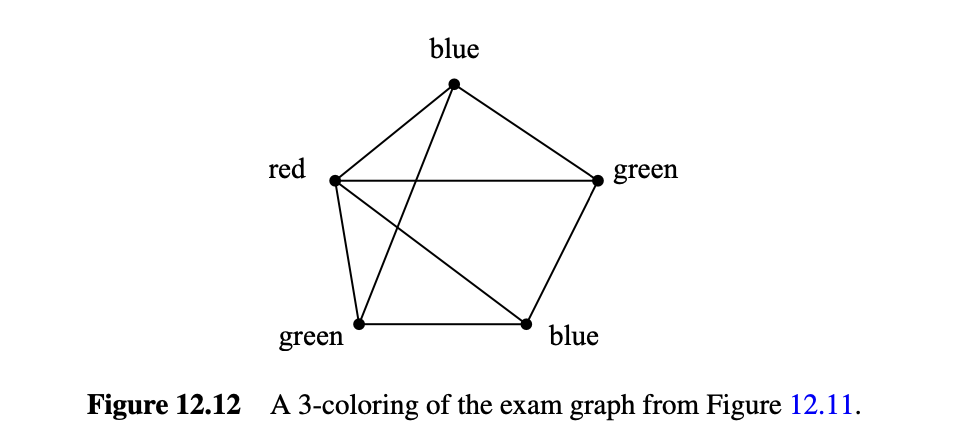

图12.12中的着色对应于在星期一上午（红色）、星期一下午（蓝色）和星期二上午（绿色）进行的考试.
我们可以使用少于三种颜色吗？不行！由于图中有一个三角形,
我们不能只使用两种颜色, 因为三角形中的三个顶点必须有不同的颜色.

这是一个图着色问题的示例：给定一个图$G$, 为每个节点分配颜色,
使相邻节点具有不同的颜色. 具有这种属性的颜色分配称为图的有效着色,
简称为“着色”. 如果图$G$可以用至多$k$种颜色着色, 则称图$G$是$k$-可着色的.

#### 定义 12.6.1

图$G$的有效着色所需的最少颜色数称为其色数, 记作$\chi(G)$.

所以, 当且仅当$\chi(G) \le k$时, $G$是$k$-可着色的.

#### 12.6.2 一些着色界限

图的一些简单性质可以提供关于可着色性的有用界限.

最简单的性质是循环：偶数长度的循环是2-可着色的. 所以

$$
\chi(C_{\text{even}}) = 2. 
$$

另一方面, 奇数长度的循环需要3种颜色, 即

$$
\chi(C_{\text{odd}}) = 3.  \tag{12.4}
$$

你应该花点时间想想为什么这个等式成立.

另一个简单的例子是完全图$K_n$：

$$
\chi(K_n) = n
$$

因为没有两个顶点可以有相同的颜色.

二部性是另一个与可着色性密切相关的性质. 如果一个图是二部图,
那么你可以用2种颜色着色, 左边的节点用一种颜色, 右边的节点用第二种颜色.
反过来, 色数为2的图都是二部图, 左边的所有顶点着一种颜色,
右边的所有顶点着另一种颜色. 由于只有没有边的图——空图——具有色数1,
我们有：

#### 引理 12.6.2

当且仅当$\chi(G) = 2$时, 非空图$G$是二部图.

如果图的顶点度较小, 则图的色数也较小. 特别是,
如果我们有一个图中所有顶点的度的上界,
那么我们可以很容易地找到一个仅比度界多一种颜色的着色.

#### 定理 12.6.3

如果图的最大度至多为$n$, 则图是$(n+1)$-可着色的.

现在你可能会尝试用$n$进行归纳来证明这个定理,
但这是一个糟糕的选择——实际上我们不知道任何这样的方法,
所以如果这是你的作业方法, 我们预计它会毁了你的一周. 另一方面,
顶点数或边数通常是基于图的归纳证明的良好量.
我们将通过顶点数的归纳法来证明定理12.6.3.

令$n \in \mathbb{N}$固定. 归纳假设将是：

$$
P(k) ::= \text{如果一个} k \text{顶点图的最大度为} n, \text{那么它是} (n + 1)\text{-可着色的}. 
$$

基本情况（$k = 1$）：一个1顶点图的最大度为0, 并且是1-可着色的,
所以$P(1)$为真.

归纳步骤：现在假设$P(k)$为真, 令$G$为一个最大度为$n$的$(k + 1)$顶点图.
从$G$中移除一个顶点$v$及其所有关联的边, 留下一个$k$顶点子图$H$.
$H$的最大度仍然至多为$n$,
因此我们可以通过归纳假设找到一个$H$的$(n + 1)$-着色.

现在将顶点$v$添加回来.
由于颜色数比$v$的相邻顶点多——$n + 1$——我们现在可以为$v$选择一个与这些相邻顶点不同的颜色.
这产生了$G$的$(n + 1)$-着色. 所以我们证明了如果$G$的最大度至多为$n$,
则$G$是$(n + 1)$-可着色的. $\blacksquare$

有时$n + 1$种颜色是你能做到的最好的. 例如,
每个顶点在$K_{n+1}$中都有度$n$并且$\chi(K_{n+1}) = n + 1$,
因此这是一个定理12.6.3给出最佳界限的示例.
定理12.6.3还为任何具有$K_{n+1}$作为子图的度界限为$n$的图给出了最佳着色界限.

但有时$n + 1$种颜色远不是你能做到的最好的. 例如,
图12.13中显示的星形图的最大度为六, 但可以使用两种颜色进行着色.

一般来说, 找到一个任意图的最小着色是非常困难的. 实际上,
仅计算色数也是困难的. 我们将在下一节中详细讨论这一点.

#### 12.6.3 为什么着色？

着色问题经常在实践中出现的一个原因是安排冲突非常普遍. 例如,
在互联网公司Akamai, 由Tom Leighton联合创办,
每几天就会在其每台服务器（2016年有200,000台服务器）上部署一个新版本的软件.
如果一次只更新一台服务器, 则需要超过二十年才能完成所有这些服务器的更新,
因此必须同时部署许多服务器. 另一方面,
某些具有常见关键功能的服务器不能同时更新, 因为服务器在更新时需要下线.

通过构建一个200,000节点的冲突图并用十几种颜色对其进行着色来解决这个问题——因此只需要十几次或多次安装波次！

另一个例子来自于为广播电台分配频率的需求. 如果两个电台的广播区域有重叠,
它们不能使用相同的频率. 频率是宝贵且昂贵的,
因此重要的是最小化分配的数量. 这相当于找到一个图的最小着色,
图的顶点是电台, 边连接具有重叠区域的电台.

着色还出现在为程序变量分配寄存器时. 当一个变量在使用中时,
其值需要保存在寄存器中. 寄存器可以重复使用不同的变量,
但如果两个变量在重叠的执行时间间隔中被引用, 则需要不同的寄存器. 因此,
寄存器分配是一个图着色问题, 其顶点

是变量：如果它们的时间间隔重叠, 则顶点是相邻的, 颜色是寄存器. 同样,
目标是最小化为着色图所需的颜色数.

最后, 有一个著名的地图着色问题, 如命题1.1.4中所述.
需要多少种颜色来着色地图,
使得相邻的领地获得不同的颜色？回答这个问题没有直接的实际应用,
但它在一个多世纪以来一直吸引图论专家,
直到在1970年代发现答案——极大的赞赏：四种颜色足以着色任何地图.
一个合理有效的方法可以基于该证明找到实际的四种颜色着色.

令人惊讶的是,
是否存在一个有效的程序来判断一个任意平面图是否真的需要四种颜色——或者三种就足够了——的问题实际上是3.5节的SAT问题的变种.
所以, 如果你能弄清楚确定三可着色性有多难, 你就赢了一百万美元.
一个证明表明, 测试平面图的三可着色性与SAT一样难,
在问题12.30和12.31中给出.

#### 12.7 简单图中的游走

#### 12.7.1 游走、路径、循环

简单图中的游走和路径本质上与有向图中的相同.
我们只是将使用无向边替换有向边的定义. 例如,
简单图中游走的正式定义与定义10.2.1中有向图中游走的定义几乎相同：

#### 定义 12.7.1

在简单图$G$中, 游走是顶点和边的交替序列, 以顶点开始, 以顶点结束,
并且对于游走中的每一条边$\langle u \text{—} v \rangle$,
端点之一$u, v$是边前的元素, 另一个端点是边后的元素.
游走的长度是其中边的总出现次数.

所以游走$\mathbf{v}$是形式为

$$
\mathbf{v} ::= v_0 \langle v_0 \text{—} v_1 \rangle v_1 \langle v_1 \text{—} v_2 \rangle v_2 \ldots \langle v_{k-1} \text{—} v_k \rangle v_k
$$

的序列, 其中$\langle v_i \text{—} v_{i+1} \rangle \in E(G)$,
对于$i \in [0..k]$. 游走被称为从$v_0$开始, 在$v_k$结束,
游走的长度$|\mathbf{v}|$是$k$. 如果所有的$v_i$都不同, 即如果$i \ne j$,
那么$v_i \ne v_j$, 则该游走是一条路径.

以同一个顶点开始和结束的游走是闭合游走.
单个顶点同时算作长度为零的闭合游走和长度为零的路径.

循环可以表示为长度为三或更多的闭合游走, 其顶点除开始和结束的顶点外,
其余均不同.

请注意, 与有向图不同, 我们不将长度为二的闭合游走计为简单图中的循环.
这是因为在同一边上来回走动的游走既不有趣也不重要. 由于简单图没有自环,
也没有长度为一的闭合游走.

与有向图一样, 游走的长度是游走中边的出现次数, 比顶点的出现次数少一.
例如, 图12.14中的图通过七个连续顶点$abcdefg$有一个长度为6的路径.
这是图中最长的路径.
图12.14中的图还有三个通过连续顶点$bhecb, cdecb$和$bcdheb$的循环.

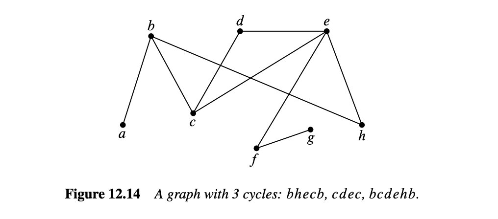

#### 12.7.2 作为子图的循环

我们不打算令循环有一个开始或结束, 所以任何绕循环一圈的路径都可以表示它.
例如, 图12.14中的图, 循环从$b$开始并通过顶点$bcdehb$,
也可以描述为从$d$开始并通过$dehbcd$. 此外,
简单图中的循环没有方向：$dcbhed$描述了与从$d$开始和结束但反向走的相同循环.

一个精确的解释闭合游走表示相同循环的方法是将循环定义为同构于循环图$C_n$的子图.

#### 定义 12.7.2

如果$V(G) \subseteq V(H)$且$E(G) \subseteq E(H)$,
则图$G$称为图$H$的子图.

例如, 单边图$G$其中

$$
V(G) = \{g, h, i\} \quad \text{和} \quad E(G) = \{\langle h \text{—} i \rangle\}
$$

是图12.1中图$H$的子图. 另一方面,
任何包含边$\langle g \text{—} h \rangle$的图将不是$H$的子图,
因为这条边不在$E(H)$中. 另一个例子是$n$个节点的空图,
它将是具有相同顶点集的$L_n$的子图；类似地, $L_n$是$C_n$的子图,
并且$C_n$是$K_n$的子图.

#### 定义 12.7.3

对于$n \ge 3$, 令$C_n$为具有顶点$[0..n]$和边

$$
\langle 0 \text{—} 1 \rangle, \langle 1 \text{—} 2 \rangle, \ldots, \langle (n - 2) \text{—} (n - 1) \rangle, \langle (n - 1) \text{—} 0 \rangle. 
$$

图$G$的循环是同构于某个$n \ge 3$的$C_n$的子图.

这个定义正式捕捉了循环没有方向或起点和终点的概念.

#### 12.8 连通性

#### 定义 12.8.1

当图中存在一条从一个顶点开始并在另一个顶点结束的路径时,
两个顶点是连通的. 按照惯例, 每个顶点通过长度为零的路径与自身连通.
当每对顶点都连通时, 图是连通的.

#### 12.8.1 连通分量

连通通常是图的一个好属性. 例如, 这意味着可以从任意节点到达其他任意节点,
或者可以根据应用程序在任意节点对之间进行通信.

但不是所有的图都是连通的. 例如,
表示城市的节点和表示高速公路的边的图可能对北美城市来说是连通的,
但如果你还包括澳大利亚的城市, 这个图肯定不是连通的. 同样,
对于像互联网这样的通信网络也是如此——为了保护免受在互联网上传播的病毒的侵害,
一些政府网络完全与互联网隔离.

另一个例子如图12.15所示, 看起来像是三个图的图片, 但实际上是一个图的图片.
这个图由三部分组成. 每一部分都是一个本身连通的子图,
但不同部分之间没有路径. 这些连通的部分称为其连通分量.

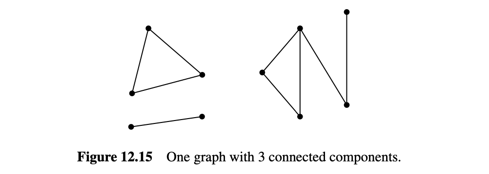

#### 定义 12.8.2

图的连通分量是由某个顶点和与该顶点连通的每个顶点和边组成的子图.

所以图是连通的当且仅当它只有一个连通分量. 在另一个极端,
$n$个顶点的空图有$n$个连通分量, 每个连通分量由单个顶点组成.

#### 12.8.2 奇数循环和2-可着色性

我们已经看到, 确定图的色数是一个具有挑战性的问题. 当图是2-可着色时,
这个问题有一个特别简单的情况.

#### 定理 12.8.3

以下图属性是等价的： 1. 图包含一个奇数长度的循环. 2. 图不是2-可着色的.
3. 图包含一个奇数长度的闭合游走.

换句话说, 如果图具有上述三个属性之一, 则它具有所有这些属性.

我们将展示这些属性之间的以下推论关系：

1.  蕴含 2. 蕴含 3. 蕴含 1.

所以这些属性中的每一个都蕴含其他两个, 这意味着它们都是等价的.

证明1. 蕴含 2.

这从等式12.4推导而来. $\blacksquare$

证明2. 蕴含 3.

如果我们证明这个推论对于连通图成立, 那么它将对任意图成立,
因为它将对每个连通分量成立. 所以我们可以假设$G$是连通的.

选择$G$的一个任意顶点$r$. 由于$G$是连通的,
对于$G$的每个顶点$u \in V(G)$, 将有一个从$u$开始并在$r$结束的游走$w_u$.
按如下方式为$G$的顶点分配颜色：

$$
\text{color}(u) = 
\begin{cases} 
\text{黑色}, & \text{如果} \ |w_u| \ \text{是偶数}, \\
\text{白色}, & \text{否则}. 
\end{cases}
$$

现在由于$G$不是可着色的, 这不能是一个有效的着色. 因此,
必须有一条边连接两个颜色相同的节点$u$和$v$. 但在这种情况下,

$$
w_u \hat{} \text{reverse}(w_v) \hat{} \langle v \text{—} u \rangle
$$

是一个从$u$开始并在$u$结束的闭合游走, 其长度为

$$
|w_u| + |w_v| + 1
$$

这是奇数. $\blacksquare$

证明3. 蕴含 1.

由于存在一个奇数长度的闭合游走, 最小长度的奇数长度闭合游走$w$存在.
我们声称$w$必须是一个循环. 为证明这一点, 假设相反的情况,
$w$不是一个循环, 因此除了开始和结束外, 还存在重复顶点的情况.
根据是否与起始顶点相同, 考虑两种情况.

第一种情况, 起始顶点有一个额外的出现. 即,

$$
w = f \hat{x} r
$$

对于某些正长度的游走$f$和$r$, 它们在$x$处开始和结束. 由于

$$
|w| = |f| + |r|
$$

是奇数, $f$和$r$中恰有一个是奇数长度,
并且将是一个比$w$短的奇数长度闭合游走, 这是一个矛盾.

第二种情况,

$$
w = f \hat{y} g \hat{y} r
$$

其中$f$是从$x$到$y$的游走, $r$是从$y$到$x$的游走, 且$|g| > 0$.
现在$g$不能是奇数长度, 否则它将是一个比$w$短的奇数长度闭合游走.
所以$g$是偶数长度的.
这意味着$f \hat{y} r$必须是一个比$w$短的奇数长度闭合游走,
这也是一个矛盾.

这完成了定理12.8.3的证明. $\blacksquare$

#### 12.9 特殊的游走和旅行

#### 12.9.1 欧拉旅行

你能否在美术博物馆的每个走廊中仅走一次？如果我们用顶点表示走廊,
用边表示走廊之间的连接, 那么这就简化为一个图论问题. 例如,
你能否在图12.16所示的平面图中访问博物馆中的每个走廊且仅一次？

整个图论领域的起源可以追溯到18世纪著名数学家欧拉提出的问题：是否可以仅一次通过柯尼斯堡的七座桥——本质上是我们关于美术博物馆的问题的同样问题.

一个图的欧拉旅行是一个闭合游走, 其中包含每条边且仅一次.
具有欧拉旅行的图很容易辨认：

#### 定理 12.9.1

一个连通图有欧拉旅行当且仅当每个顶点的度是偶数.

这个证明在问题12.43中分几个简单的步骤进行.
隐含在证明中的是找到欧拉旅行的一种简单方法, 即当存在欧拉旅行时,
通过不断拼接闭合游走直到包含所有边.

类似地,
如果一个游走包含每条边且仅一次但不是一个旅行——它在不同的顶点开始和结束——当且仅当有且只有两个顶点的度是奇数.
图12.16所示的图正好有两个奇数度顶点, 所以它有这样一个游走但没有欧拉旅行.

#### 12.9.2 哈密顿循环

哈密顿循环是欧拉旅行的不羁堂兄.

#### 定义 12.9.2

图$G$中的哈密顿循环是一个循环, 该循环在$G$中每个顶点正好经过一次.
类似地, 哈密顿路径是$G$中的一条路径, 该路径在$G$中每个顶点正好经过一次.

虽然哈密顿循环听起来与欧拉旅行相似——一个访问每个节点一次而另一个访问每条边一次——找到哈密顿循环或哈密顿路径可能比找到欧拉旅行或路径困难得多.
还没有人发现当图具有哈密顿循环时的简单特征. 实际上,
确定一个图是否有哈密顿循环与3.5节中的SAT问题属于同一类别的问题：如果你找到一种有效的方法来确定一个图是否有哈密顿循环,
或者证明在所有图上没有有效的程序来解决这个问题,
克雷研究所将给你一百万美元.

#### 12.9.3 旅行商问题

在许多应用中, 图的边与数值成本或权重相关联. 例如,
假设图的节点表示建筑物, 边表示它们之间的连接.
连接的成本可能会根据建筑物或城镇之间的距离而变化.
另一个例子是图的节点表示城市,
边的权重是它们之间的距离：洛杉矶/纽约市边的权重比纽约市/波士顿边的权重大得多.

如果找到哈密顿循环的问题还不够难, 在加权图中,
我们有时需要找到权重和最小的哈密顿循环. 这就是著名的旅行商问题.

例如, 假设你希望在图12.17中显示的图中每个节点仅访问一次,
并在你开始的节点结束. 你能找到权重为15的循环来完成此操作吗？

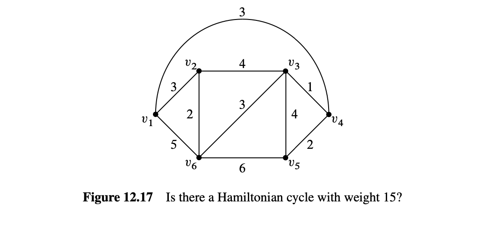

#### 12.10 k-连通图

如果我们将图看作电话网络中的电缆、石油管道或电力线路的模型,
那么我们不仅需要连通性, 还需要在组件故障后保持的连通性.
连通性强度的一个度量是连通性失效之前必须失效的链接数量. 特别地,
当至少需要$k$次“边故障”才能断开它们时, 两个顶点是$k$边连通的.
更精确地说：

#### 定义 12.10.1

当两个顶点在删除最多$k-1$条边后仍保持在每个子图中连通时,
它们在图中是$k$边连通的. 当图中每对不同顶点都是$k$边连通时,
具有两个或更多顶点的图是$k$边连通的.

从现在起, 我们将删除“边”修饰词, 只说“$k$连通”.

例如, 在图12.14中, 顶点$c$和$e$是3连通的, $b$和$e$是2连通的,
$g$和$e$是1连通的, 没有顶点是4连通的. 整个图仅为1连通.
一个完全图$K_n$是$(n-1)$连通的. 每个循环是2连通的.

注意, 如果两个顶点根据定义12.8.1是连通的, 那么它们是1连通的.

割边的概念是解释2连通性的有用方法：

::: \#### 定义 12.10.2 如果两个顶点在图$G$中连通, 但在删除边$e$时不连通,
那么$e$是$G$的割边. :::

所以一个具有多个顶点的图是2连通的当且仅当它是连通的且没有割边.
下面的引理是该定义的另一个直接结果：

#### 引理 12.10.3

当且仅当一条边不在循环上时, 它是一条割边.

更一般地,
如果两个顶点由$k$条边不相交的路径连接——即没有边出现在两条路径中——那么它们必须是$k$连通的,
因为在它们断开之前, 必须从每条路径中删除至少一条边. 一个基本事实是,
如果两个顶点是$k$连通的, 那么有$k$条边不相交的路径连接它们.

#### 12.10.1 连通图中的最小边数

下面的定理指出, 边少的图必须有许多连通分量.

#### 定理 12.10.4

每个图至少有$|V(G)| - |E(G)|$个连通分量.

当然, 为了使定理12.10.4有任何用处, 必须有比顶点少的边.

我们对边数$k$使用归纳法.
设$P(k)$是命题：每个具有$k$条边的图至少有$|V(G)| - k$个连通分量.

基本情况（$k = 0$）：在没有边的图中, 每个顶点本身就是一个连通分量,
因此有$|V(G)| = |V(G)| - 0$个连通分量. 所以$P(0)$成立.

归纳步骤：假设$P(k)$成立, 并且设$G_e$是删除边$e \in E(G)$后的图$G$.
因此$G_e$有$k$条边, 根据归纳假设$P(k)$,
我们可以假设$G_e$至少有$|V(G)| - k$个连通分量.
现在将边$e$加回以获得原始图$G$.
如果$e$的两个端点在$G_e$的同一连通分量中,
那么$G$至少有$|V(G)| - k > (|V(G)| - (k + 1))$个连通分量. 或者,
如果$e$的端点在$G_e$的不同连通分量中,
那么这两个连通分量在$G$中合并为一个分量, 而所有其他分量保持不变,
因此$G$比$G_e$少一个连通分量.
即$G$至少有$|V(G)| - k - 1 = (|V(G)| - (k + 1))$个连通分量. 因此,
在任一情况下, $G$至少有$|V(G)| - (k + 1)$个连通分量.

这完成了归纳步骤, 从而完成了整个归纳证明. $\blacksquare$

#### 推论 12.10.5

每个具有$n$个顶点的连通图至少有$n-1$条边.

定理12.10.4的证明有几点值得注意. 首先, 我们对图中的边数使用了归纳法.
这在涉及图的证明中很常见, 因为对顶点数的归纳也是如此. 处理图问题时,
这两种方法应该是你首先考虑的方法.

第二点更微妙. 注意在归纳步骤中, 我们取了一个任意的$(k + 1)$边图,
扔掉一条边以便可以应用归纳假设, 然后将边加回.
你会在与图相关的证明的归纳步骤中经常看到这种缩减-增长过程.
这个过程在证明相关图的归纳步骤中非常有用.
这似乎是多余的工作：为什么不直接从$k$边图开始再加一条边得到$(k + 1)$边图呢？这在这种情况下效果很好,
但会出现一个讨厌的逻辑错误, 称为“累积错误”, 在问题12.40中进行了说明.

#### 12.11 森林与树

我们已经很好地利用了无环有向图,
但无环简单图可以说是计算机科学中最重要的图.

#### 定义 12.11.1

无环图称为森林. 连通的无环图称为树.

图12.18中的图是一个森林. 其每个连通分量根据定义都是一棵树.

#### 12.11.1 叶子、父母与子女

关于树, 你会注意到的第一件事之一是它们往往有很多度为一的节点.

#### 定义 12.11.2

森林中度为1的节点称为叶子.

图12.18中的森林有4片叶子. 图12.19中的树有5片叶子.

#### 12.11.2 树的性质

树有许多独特的性质. 我们在以下定理中列出了一些.

#### 定理 12.11.3

每棵树具有以下性质：

1.  每个连通的子图都是树.
2.  每对顶点之间有唯一的路径.
3.  在树中的任意两个不相邻节点之间添加一条边会形成一个带环的图.
4.  删除任意一条边会使图断开. 也就是说, 每条边都是割边.
5.  如果树至少有两个顶点, 则至少有两个叶子.
6.  树中的顶点数比边数多一个.

1.  子图中的一个环也是整个图中的一个环,
    因此无环图的任何子图也必须是无环的. 如果子图也是连通的, 则根据定义,
    它是一棵树.

2.  由于树是连通的, 因此每对顶点之间至少有一条路径. 假设出于反证目的,
    在某些顶点对之间有两条不同的路径. 然后,
    在某些顶点对之间有两条长度最小的不同路径$p \ne q$,
    这些路径之间没有除起点和终点外的共同顶点,
    否则从起点到w的部分路径或从w到终点的部分路径之间就会有两条不同的路径,
    其总长度小于$|p| + |q|$, 这与总长度的最小性相矛盾. 因此,
    $p$和$q$之间没有共同顶点, 所以$p\cup reverse(q)$是一个环.

3.  额外的边$\langle u-v \rangle$与$u$和$v$之间的唯一路径形成一个环.

4.  假设我们删除边$\langle u-v \rangle$.
    由于树包含$u$和$v$之间的唯一路径, 该路径必须是$\langle u-v \rangle$.
    因此, 当删除该边时, 不再有路径, 因此图不再连通.

5.  由于树至少有两个顶点, 因此树中的最长路径将具有不同的端点$u$和$v$.
    我们声称$u$是一个叶子. 因为根据端点的定义,
    $u$最多与路径上的一条边相连. 此外, 如果$u$与路径上的其他边相连,
    那么路径可以通过添加该边而变长, 这与路径已经尽可能长相矛盾. 因此,
    $u$只与一条边相连, 即$u$是一个叶子. 同样的道理适用于$v$.

6.  我们对命题使用归纳法：

    $$
     P(n) ::= \text{在任意} n \text{顶点树中有} n-1 \text{条边}
     $$

基本情况（$n = 1$）：$P(1)$成立, 因为一棵有1个节点的树有0条边, $1-1=0$.

归纳步骤：假设$P(n)$成立, 并且考虑具有$(n+1)$个顶点的树$T$.
设$v$为树的一片叶子.
你可以验证从任何连通图中删除度为1的顶点（及其相关边）都会留下一个连通子图.
因此根据定理12.11.3.1, 删除$v$及其相关边得到一个较小的树,
该树通过归纳法有$n-1$条边. 如果我们将顶点$v$及其相关边重新添加,
我们发现$T$有$n = (n+1) - 1$条边. 因此, $P(n+1)$成立, 归纳证明完成.
$\blacksquare$

定理12.11.3中的各种性质提供了树的替代特征. 例如：

#### 引理 12.11.4

当且仅当图$G$是一个森林并且$|V(G)| = |E(G)| + 1$时, 图$G$是一棵树.

证明是定理12.11.3.6的一个简单推论, 参见问题12.48.

#### 12.11.3 生成树

树无处不在. 实际上, 每个连通图都包含一个子图,
这个子图是一棵具有相同顶点的树. 这称为图的生成树. 例如,
图12.20是一个连通图, 突出显示了一个生成树.

#### 定义 12.11.5

图$G$的生成子图是一个顶点与$G$的顶点相同的子图.

#### 定理 12.11.6

每个连通图都包含一个生成树.

假设$G$是一个连通图, 那么图$G$本身就是一个连通的生成子图.
因此根据最小化原理, $G$必须有一个最小边的连通生成子图$T$.

我们声称$T$是一个生成树. 由于$T$是一个连通的生成子图, 根据定义,
$T$是连通的, 但假设相反, $T$包含一个环$C$. 根据引理12.10.3,
环$C$的一条边$e$不是割边, 因此删除它将留下一个连通的生成子图$T-g+e$,
这比$T$小, 矛盾. 因此$T$是无环的生成树. $\blacksquare$

#### 12.11.4 最小权重生成树

生成树对于加权图特别有趣和重要——其边被赋予数值权重.
加权图的总权重是其所有边的权重之和. 例如,
图12.21(a)所示生成树的权重为19.

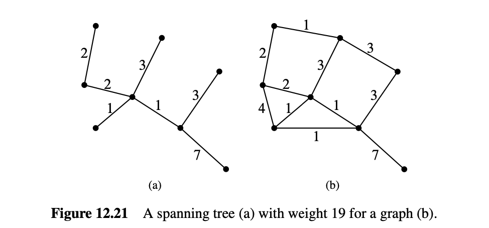

一般目标是找到一个权重最小的生成树, 称为最小权重生成树（MST）.

图12.21(a)所示的生成树实际上不是图12.21(b)的MST：图12.22显示了该图的另一个生成树,
其权重为17. 该权重17确实是MST, 但我们如何证明呢？一般来说,
我们如何为连通图$G$找到MST？我们可以尝试枚举$G$的所有子树,
但这种方法对于大图来说是绝望的.

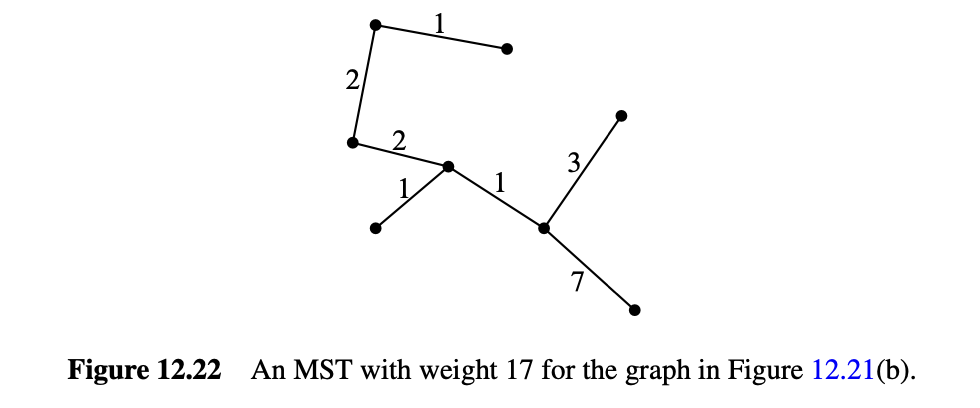

在本节的其余部分, 假设$G$是一个连通的加权图.
我们现在将解释找到$G$的MST的一种简单、通用的方法.

#### 定义 12.11.7

简单图$G$的黑白着色是将顶点$V(G)$划分为两个部分——“黑色”顶点和“白色”顶点.
黑白着色的灰色边是端点颜色不同的边.

#### 引理 12.11.8

如果$G$是连通图, 那么每个黑白着色的$G$包含灰色边.

$G$的任何着色必须至少有一个每种颜色的顶点——这由划分的定义跟随.
由于$G$是连通的, 将有一条路径从黑色顶点开始并以白色顶点结束. 因此,
在路径上的某个点上, 必须有一条边从黑色顶点开始并以白色顶点结束.
这是灰色边. $\blacksquare$

到目前为止的加权图示例中, 每个都有两个或更多相同权重的边. 这是常见的.
但我们的故事在所有权重不同的情况下变得更简单.

*在本节的其余部分, 假设没有相同权重的边：不同的边具有不同的权重.*

假设不同权重没有一般性损失,
因为我们下面做的所有事情都适用于假设不同权重的情况.
如果我们为相同权重的边分配一个任意秩,
并将更高的秩视为具有较大权重的顶点, 则该假设适用.

以下引理使得找到MST变得容易.

#### 引理 12.11.9 （灰色边引理）

对于连通图$G$的任意黑白着色, 着色的灰色边中的最小权

重边必须是$G$的每个MST的边.

所以, 为了找到$G$的MST, 我们只需要找到足够的最小权重灰色边来形成生成树.
我们使用以下方法来完成此操作：

*Minimum-Weight Gray Edge Procedure*

从由所有边删除的顶点组成的不连通生成森林开始.
假设在某个点上$S$是生成森林的一部分. 如果$S$尚未连通,
则选择$G$的黑白着色, 使$S$的所有顶点都在同一连通分量中具有相同颜色.
通过将此着色的最小权重灰色边添加到$S$的边中来更新$S$. 继续, 直到$S$连通.

这个算法允许不太接近的组件并行生长, 这对于“分布式”计算非常有用,
其中各个处理器在有限的通信之间共享工作.

好的, 总结这个故事, 剩下的就是证明引理12.11.9,
即最小权重灰色边必须在每个生成树中. 令我们从另一个引理开始：

#### 引理 12.11.12 （灰色边交换引理）

设$G$是连通加权图, $e$是$G$的某个黑白着色的最小权重灰色边.
假设$C$是连通生成子图, $e$不是$C$的边. 那么有$C$的边$g$使得： \*
$weight(e) < weight(g)$, \* $C-g+e$是连通的,
其中$C-g+e$是通过移除$g$并添加$e$到$C$的边集而得到的图.

选择$e$作为某个黑白着色的最小权重灰色边. 由于$C$是一个连通的生成图,
$C$中存在一条路径$p$, 其端点颜色不同. 因此$p$包含一些灰色边$g \ne e$.
由于$e$是最小权重灰色边并且没有相同权重的边,
我们有$weight(e) < weight(g)$. 接下来, 注意$p+e$是一个环.
所以当$g$从环中移除时, $g$的端点通过环的其余部分连通.
这意味着$C+e-g$仍然是一个连通的生成子图. $\blacksquare$

选择$e$作为某个黑白着色的最小权重灰色边. 由于$C$是一个连通的生成图,
$C$中存在一条路径$p$, 其端点颜色不同. 因此$p$包含一些灰色边$g \ne e$.
由于$e$是最小权重灰色边并且没有相同权重的边,
我们有$weight(e) < weight(g)$. 接下来, 注意$p+e$是一个环.
所以当$g$从环中移除时, $g$的端点通过环的其余部分连通.
这意味着$C+e-g$仍然是一个连通的生成子图. $\blacksquare$

灰色边引理12.11.9现在立即从交换引理12.11.12得出：如果$C$是$G$的生成树,
则$C-g+e$也将是生成树, 并且具有更小的权重.
所以$C$不能是最小权重除非$e$是它的边之一.
