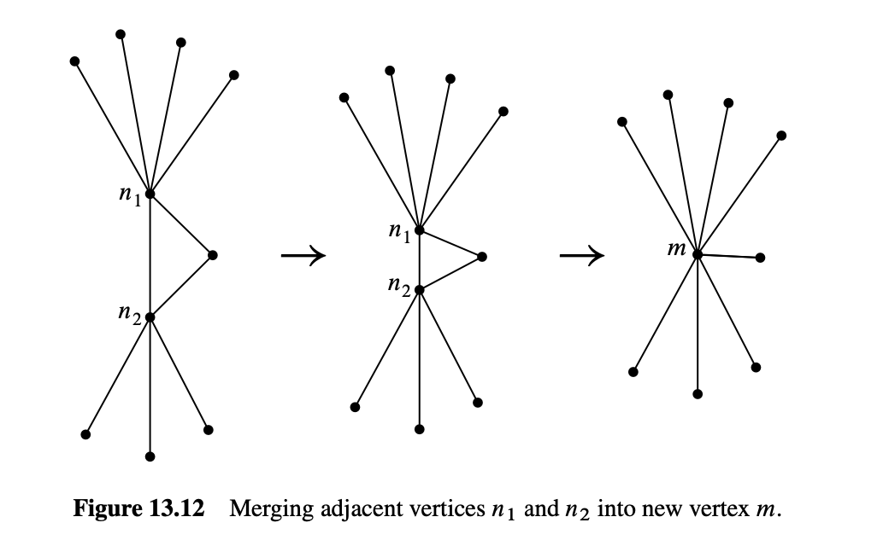

#### 13.1 在平面上画图

假设有三个狗屋和三个人类屋，如图13.1所示。你能找到一条路线，从每个狗屋到每个人类屋，使得没有路线相交吗？


类似的问题也出现在一种鲜为人知的动物quadrapus上，它看起来像一只八爪鱼，但有四只伸展的手臂而不是八只。如果五只quadrapi在海底休息，如图13.2所示，每只quadrapus能否在不让手臂交叉的情况下与其他所有quadrapus握手？


这两个谜题都可以理解为关于在平面上画图的问题。将狗和屋子替换为节点，狗屋谜题可以改写为询问是否存在一个平面图，其中有六个节点和每个前三个节点与后三个节点之间的边。这种图称为完全二分图$K_{3,3}$，如图13.3(a)所示。quadrapi谜题则询问是否存在一个完全图$K_5$的平面图，如图13.3(b)所示。


在每种情况下，答案都是“否——但几乎可以！”事实上，如果从这些图中的任意一个中删除一条边，则结果图可以在平面上重新绘制，使得没有边相交，如图13.4所示。


平面图在电路布局中有应用，并有助于显示图形数据，例如程序流程图、组织结构图和调度冲突。对于这些应用，目标是在平面上尽可能少的边交叉点画图。

> #### Steve Wozniak和一个平面电路设计
>
> 当导线安排在表面上时，如电路板或微芯片，交叉点需要麻烦的三维结构。Steve Wozniak在设计早期Apple II计算机的磁盘驱动器时，艰难地尝试实现接近平面的设计，以下是摘自apple2history.org的描述，该网站引用了Freiberger和Swaine的《Fire in the Valley》：
>
> > 两周内，他每晚加班，努力做出满意的设计。完成后，他发现如果移动一个连接器，可以减少过孔，使电路板更可靠。然而，为了实现这一调整，他不得不重新开始设计。这次只花了二十小时。他接着又看到可以消除的另一个过孔，于是再次重新开始设计。最终设计普遍被计算机工程师认为是出色的，并在工程美学上是美丽的。Woz后来表示：“这是你只有在既是工程师又是PC板布局人员时才能做到的事情。这是一个艺术性的布局。电路板几乎没有过孔。”

## 13.2 平面图的定义

我们在上一节中认为平面图的绘图是理所当然的，但如果我们要证明平面图的性质，我们最好有精确的定义。

::: def
#### 定义 13.2.1

图的绘图将图的每个节点分配到平面中的一个不同点，并将每条边分配到平面中的一条光滑曲线，该曲线的端点对应于该边所连接的节点。如果曲线没有交叉自身或其他曲线，即只有在这些曲线上的点是节点的点，那么该绘图是平面的。当一个图有一个平面图时，这个图是平面的。
:::

定义13.2.1是精确的，但依赖于进一步的概念：“光滑的平面曲线”和“在它们上出现多次的点”。我们没有定义这些概念——我们只是展示了图13.4中的简单图，并希望你能理解。


### 13.2.1 面

平面绘图中的曲线将平面划分为连接的区域，称为绘图的**连续面**。例如，图13.5中的绘图有四个连续面。面IV在所有方向上延伸到无限远，称为**外部面**。


图13.5中每个连续面的边界上的顶点形成一个环。例如，如图13.6所示，给顶点标记，面边界的环可以由顶点序列描述：

```         
abca abda bcdb acda。
```

这四个环与图13.6中的四个连续面很好地对应起来——事实上，它们非常对应，以至于我们可以通过它的环识别图13.6中的每个面。例如，环abca识别面III。列表13.1中的环称为图13.6中的**离散面**。我们使用术语“离散”，因为图中的环是一种离散数据类型——而不是平面中的区域，这是连续数据类型。


不幸的是，平面绘图中的连续面并不总是由图中的环界定——事情可能会变得有点复杂。例如，图13.7中的平面绘图有我们称之为**桥**的东西，即割边。外部区域边界上的顶点序列是

```         
abcefecda。
```

这个序列定义了一个闭合路径，但不定义一个环，因为路径具有桥 $\langle c—e \rangle$ 的两个出现及其端点的每一个。


图13.8中的平面绘图展示了另一个复杂情况。这个绘图有我们称之为**dongle**的东西，即节点 $v、x、y$ 和 $w$，以及连接它们的边。内部区域边界上的顶点序列是

```         
rstvxxywvututr。
```

这个序列定义了一个闭合路径，但同样不定义一个环，因为它具有dongle的每条边的两个出现——一次是“来”一次是“去”。

事实证明，桥和dongle是唯一的复杂情况，至少对于连通图而言。特别是，平面绘图中的每个连续面对应于图中的一个闭合路径。这些闭合路径将被称为绘图的离散面。接下来我们将定义它们。

### 13.2.2 平面图嵌入的递归定义

平面绘图的连续面和闭合路径之间的关联提供了我们可以使用的离散数据类型，而不是连续绘图。我们将定义连通图的平面嵌入为图的边界的闭合路径集合。由于我们只关心图中的连接，因此这些闭合路径正是我们需要的。

问题是如何定义平面嵌入而不涉及连续绘图。有一种简单的方法基于这样的想法：任何连续绘图都可以按步骤绘制：

-   在平面的某个地方绘制一个新点来表示顶点，
-   或者在已经绘制的两个顶点点之间绘制一条曲线，确保新曲线不交叉任何先前绘制的曲线。

新曲线不会交叉任何其他曲线，前提是它保持在一个连续面内。或者，如果新曲线可以在两个不同绘图的外部面之间穿过，它就不会交叉任何其他曲线。因此，为了确保可以绘制新曲线，我们只需检查它的端点是否在同一面的边界上，或其端点是否在不同绘图的外部面上。当然，绘制新曲线会稍微改变面边界，因此一旦绘制了新曲线，面边界就必须更新。这就是以下递归定义背后的思想。

::: def
#### 定义 13.2.2

连通图的平面嵌入由称为嵌入的离散面的非空闭合路径集合组成。平面嵌入递归地定义如下：

基本情况：如果 $G$ 是由单个顶点 $v$ 组成的图，那么 $G$ 的平面嵌入有一个离散面，即长度为零的闭合路径 $v$。

构造情况（分裂一个面）：假设 $G$ 是一个具有平面嵌入的连通图，并假设 $a$ 和 $b$ 是图 $G$ 中离散面 $\gamma$ 上的不同的、非相邻的顶点。即，$\gamma$ 是形式为

$$
\gamma = \alpha \cup \beta
$$

的闭合路径，其中 $\alpha$ 是从 $a$ 到 $b$ 的路径，$\beta$ 是从 $b$ 到 $a$ 的路径。然后通过将边 $\langle a—b \rangle$ 添加到 $G$ 的边集得到的图具有与 $G$ 相同离散面的平面嵌入，除了面 $\gamma$ 被两个离散面

$$
\alpha \cup \langle b—a \rangle 和 \langle a—b \rangle \cup \beta
$$

替换
:::

如图13.9所示。


构造情况（添加一座桥）：假设 $G$ 和 $H$ 是具有平面嵌入和不相交顶点集的连通图。假设 $\gamma$ 是 $G$ 的嵌入的离散面，并假设 $\gamma$ 以顶点 $a$ 开始和结束。同样，假设 $\delta$ 是 $H$ 的嵌入的离散面，并且以顶点 $b$ 开始和结束。

然后，通过添加一条新边 $\langle a—b \rangle$ 连接 $G$ 和 $H$ 得到的图具有平面嵌入，其离散面是 $G$ 和 $H$ 的离散面的并集，除了面 $\gamma$ 和 $\delta$ 被一个新的面

$$
\gamma \cup \langle a—b \rangle \cup \delta \cup \langle b—a \rangle
$$

替换。


如图13.10所示，其中 $G$ 和 $H$ 的面顶点序列分别为：

$$
G: \{axyza, axya, ayza\}
$$

$$
H: \{btuvwvb, btvwb, tuvt\}
$$

在添加桥 $\langle a—b \rangle$ 之后，有一个单一的连通图，其面的顶点序列为

$$
\{axyzabtuuvwba, axya, ayza, btvwb, tuvt\}。
$$

桥仅仅是一个割边，但在平面嵌入的上下文中，桥正是同一离散面上出现两次的边——而不是在两个面上各出现一次。dongle是由桥组成的树；我们仅在插图中使用dongle，因此不需要更精确地定义它们。

### 13.2.3 这玩意管用吗

是的！一般来说，一个图是平面的，因为它有一个平面绘图，按照定义13.2.1，只有当它的每个连通分量都有平面嵌入时，如定义13.2.2所述。当然，我们无法在不进入我们试图避免的连续数学的情况下证明这一点。但现在平面图的递归定义已经到位，我们将永远不需要再依赖连续的东西。这是个好消息。

坏消息是定义13.2.2在技术上比直观的绘图定义要复杂得多，尽管其边缘不交叉。在许多情况下，用图表证明事实更容易。

在专家手中，并且在你手中有一些经验的情况下，通过图形证明平面图的性质可以说服力和可靠。但考虑到这类证明中长期存在的错误历史，最好还是依赖于平面嵌入的精确定义。更一般地说，看到平面绘图的抽象属性如何可以成功地使用离散数据类型来建模也很重要。

### 13.2.4 外部面去哪了?

每个平面图都有一个立即可识别的外部面——它是向所有

方向无限延伸的那个。但在平面嵌入中外部面在哪里呢？

实际上没有！这是因为实际上没有必要区分一个面与另一个面。事实上，平面嵌入可以用任意一个面作为外部面来绘制。对此的直观解释是考虑在球面上绘制嵌入，然后通过在球面上“穿刺”一个面，将穿刺孔拉伸成一个圆形，绕其余面平铺到平面上。这样任何面都可以成为外部面。


因此显示不同“外部”边界的图实际上可能是同一平面嵌入的不同示例。例如，图13.11中显示的两个嵌入实际上是相同的——检查一下：它们具有相同的边界环。

这就是定义13.2.2中“添加桥”情况下的合理性：无论选择哪个面作为不相交平面图的每个嵌入的外部面，我们都可以绘制桥而不需要跨越任何其他边，因为我们可以假设桥连接两个“外部”面。

## 13.3 欧拉公式

递归定义的价值在于它为证明平面图的性质提供了一种强有力的技术，即结构归纳。例如，我们现在将使用定义13.2.2和结构归纳来确定连通平面图的最基本性质之一，即顶点和边的数量完全决定了每个可能的平面嵌入中的面的数量。

::: thm
#### **定理 13.3.1** (欧拉公式)

如果一个连通图有一个平面嵌入，那么

$$
v - e + f = 2
$$

其中 $v$ 是顶点的数量，$e$ 是边的数量，$f$ 是面的数量。
:::

例如，在图13.5中，$v = 4$，$e = 6$ 和 $f = 4$。果然，$4 - 6 + 4 = 2$，正如欧拉公式所述。

证明。证明是通过平面嵌入定义的结构归纳完成的。设 $P(\mathcal{E})$ 为命题 $v - e + f = 2$ 对于嵌入 $\mathcal{E}$ 成立。

::: prf
基本情况 ($\mathcal{E}$ 是单顶点平面嵌入)：根据定义，$v = 1$，$e = 0$ 和 $f = 1$，并且 $1 - 0 + 1 = 2$，因此 $P(\mathcal{E})$ 确实成立。

构造情况（分裂一个面）：假设 $G$ 是一个具有平面嵌入的连通图，并假设 $a$ 和 $b$ 是出现在平面嵌入的某个离散面 $\gamma = a \dots b \dots a$ 上的不同的、非相邻的顶点。然后通过将边 $\langle a—b \rangle$ 添加到 $G$ 的边集得到的图具有一个比 $G$ 多一个面的平面嵌入和一个比 $G$ 多一条边的平面嵌入。因此，对于两个图来说，$v - e + f$ 的量将保持不变，并且由于结构归纳，这个量对于 $G$ 的嵌入是2，对于包含添加边的嵌入也是2。因此，$P(\mathcal{E})$ 对构造嵌入成立。

构造情况（添加桥）：假设 $G$ 和 $H$ 是具有平面嵌入和不相交顶点集的连通图。然后通过添加一个边 $\langle a—b \rangle$ 将这两个图连接起来得到一个带有 $v_G + v_H$ 顶点，$e_G + e_H + 1$ 条边和 $f_G + f_H - 1$ 个面的连通图。因为

$$
(v_G + v_H) - (e_G + e_H + 1) + (f_G + f_H - 1) = (v_G - e_G + f_G) + (v_H - e_H + f_H) - 2 = 2 + 2 - 2 = 2,
$$

对于构造的嵌入，$v - e + f$ 仍然等于2。也就是说，$P(\mathcal{E})$ 在这种情况下也成立。

这完成了构造情况的证明，定理由结构归纳得出。
:::

## 13.4 平面图中边的条数

类似于欧拉公式，以下引理通过结构归纳直接从定义13.2.2得出。

::: lem
#### **引理 13.4.1**

在一个连通图的平面嵌入中，每条边在两个不同的面中各出现一次，或者在一个面中出现两次。
:::

::: lem
#### **引理 13.4.2**

在一个至少有三个顶点的连通图的平面嵌入中，每个面的长度至少为三。
:::

结合引理13.4.1和13.4.2与欧拉公式，我们现在可以证明平面图的边数是有限的：

::: thm
#### **定理 13.4.3**

假设一个连通平面图有 $v \geq 3$ 个顶点和 $e$ 条边。那么

$$
e \leq 3v - 6.
$$
:::

::: prf
根据定义，一个连通图是平面的当且仅当它有一个平面嵌入。所以假设一个有 $v$ 个顶点和 $e$ 条边的连通图有一个包含 $f$ 个面的平面嵌入。由引理13.4.1，每条边在面的边界上正好出现两次。因此，面边界的长度之和正好是 $2e$。又由于引理13.4.2，当 $v \geq 3$ 时，每个面的边界长度至少为三，所以这和至少是 $3f$。这意味着

$$
3f \leq 2e. \tag{13.4}
$$

但根据欧拉公式，$f = e - v + 2$，代入(13.4)得到

$$
3(e - v + 2) \leq 2e \\
e - 3v + 6 \leq 0 \\
e \leq 3v - 6
$$
:::

## 13.5 回到 $K_5$ 和 $K_{3,3}$

最后，我们有一个简单的方法来回答本章开头的quadrapi问题：五个quadrapi不能不交叉地握手。原因是我们知道quadrapi问题与问一个完全图 $K_5$ 是否是平面图是相同的，且定理13.4.3有一个直接的推论：

::: cor
#### **推论 13.5.1**

$K_5$ 不是平面图。
:::

::: prf
证明。$K_5$ 是连通的，有5个顶点和10条边。但是由于 $10 > 3 \cdot 5 - 6$，所以 $K_5$ 不满足(13.3)中平面图的条件。■
:::

我们还可以使用欧拉公式证明 $K_{3,3}$ 不是平面图。证明类似于定理13.3的证明，只是我们使用了 $K_{3,3}$ 是二部图的额外事实。

::: lem
**引理 13.5.2** 在一个至少有3个顶点的连通二部图的平面嵌入中，每个面的长度至少为4。
:::

::: prf
证明。由引理13.4.2，图的平面嵌入的每个面的长度至少为3。但是根据引理12.6.2和定理12.8.3.3，二部图不能有奇数长度的闭合游走。由于平面嵌入的面是闭合游走，所以二部嵌入中不能有长度为3的面。因此，每个面的长度必须至少为4。■
:::

::: thm
#### **定理 13.5.3**

假设一个连通二部图有 $v \geq 3$ 个顶点和 $e$ 条边，并且是平面图。那么

$$
e \leq 2v - 4. \tag{13.5}
$$
:::

::: prf
证明。引理13.5.2意味着嵌入图的所有面的长度至少为4。现在，按照定理13.4.3的证明，我们发现面的边界长度之和正好是 $2e$，至少是 $4f$。因此，对于任意平面二部图的嵌入，我们有

$$
4f \leq 2e. \tag{13.6}
$$

根据欧拉定理，$f = 2 - v + e$。将其代入(13.6)，我们得到 $$
4(2 - v + e) \leq 2e,
$$ 这简化为(13.5)。■
:::

::: cor
#### **推论 13.5.4**

$K_{3,3}$ 不是平面图。
:::

::: prf
证明。$K_{3,3}$ 是连通的，二部图，有6个顶点和9条边。但由于 $9 > 2 \cdot 6 - 4$，$K_{3,3}$ 不满足(13.3)中平面二部图的条件。■
:::

## 13.6 为平面图着色

我们已经涵盖了许多关于平面图的内容，但还不足以证明著名的四色定理。然而，我们可以非常接近。事实上，我们几乎已经足够证明每个平面图都可以使用仅5种颜色来着色。

有两个关于平面性的熟知事实是我们需要的：

::: lem
#### **引理 13.6.1**

平面图的任何子图都是平面图。
:::

::: lem
#### **引理 13.6.2**

合并平面图中的两个相邻顶点仍然得到一个平面图。
:::

合并图中的两个相邻顶点 $n_1$ 和 $n_2$ 意味着删除这两个顶点并将它们替换为一个新的“合并”顶点 $m$，这个新顶点与之前相邻于 $n_1$ 或 $n_2$ 的所有顶点相邻，如图13.12所示。



许多作者认为对于定义13.2.1描述的平面图的连续图绘，引理13.6.1和13.6.2是理所当然的。通过递归定义13.2.2，这两个引理实际上可以使用结构归纳法来证明（参见问题13.9）。

我们只需要另一个引理：

::: lem
#### **引理 13.6.3**

每个平面图至少有一个顶点的度数不超过5。
:::

::: prf
证明。假设相反的情况，即某个平面图的每个顶点的度数至少为6，那么顶点度数的总和至少为 $6v$。但是根据握手引理12.2.1，顶点度数的总和等于 $2e$，因此我们有

$$
e \geq 3v
$$

与定理13.4.3中的 $e \leq 3v - 6 < 3v$ 矛盾。■
:::

::: thm
**定理 13.6.4** 每个平面图都是五可着色的。
:::

::: prf
证明。证明将通过对顶点数 $v$ 的强归纳法进行，归纳假设为：

每个有 $v$ 个顶点的平面图是五可着色的。

基本情况 ($v \leq 5$)：立即可得。

归纳情况：假设 $G$ 是一个有 $v + 1$ 个顶点的平面图。我们将描述 $G$ 的五着色。

首先，选择 $G$ 中一个度数不超过5的顶点 $g$；引理13.6.3保证了存在这样的顶点。

**情况1** ($\deg(g) < 5$)：从 $G$ 中删除 $g$ 得到的图 $H$ 根据引理13.6.1仍然是平面图，并且因为 $H$ 有 $v$ 个顶点，根据归纳假设它是五可着色的。现在定义 $G$ 的五着色如下：对除 $g$ 之外的所有顶点使用 $H$ 的五着色，并为 $g$ 分配一种五种颜色中的一种，使得该颜色与其任何邻居分配的颜色不同。由于其邻居少于5个，总会有一种颜色可用。■

**情况2** ($\deg(g) = 5$)：如果 $G$ 中的 $g$ 的五个邻居彼此都相邻，那么这五个顶点将形成一个同构于 $K_5$ 的非平面子图，与引理13.6.1矛盾（因为 $K_5$ 不是平面图）。所以这五个邻居中必须有两个邻居 $n_1$ 和 $n_2$ 不是相邻的。现在合并 $n_1$ 和 $g$ 成一个新顶点 $m$。在这个新图中，$n_2$ 与 $m$ 相邻，并且根据引理13.6.2，这个图仍然是平面图。所以我们可以将 $m$ 和 $n_2$ 合并成另一个新顶点 $m'$，得到一个新图 $G'$，根据引理13.6.2，$G'$ 仍然是平面图。由于 $G'$ 有 $v - 1$ 个顶点，根据归纳假设它是五可着色的。

现在定义 $G$ 的五着色如下：对除 $g$、$n_1$ 和 $n_2$ 之外的所有顶点使用 $G'$ 的五着色。接下来，将 $G'$ 中 $m'$ 的颜色分配给 $G$ 中邻居 $n_1$ 和 $n_2$ 的颜色。由于 $n_1$ 和 $n_2$ 在 $G$ 中不相邻，这定义了 $G$ 的一个正确的五着色，除了顶点 $g$。但由于 $g$ 的这两个邻居有相同的颜色，$g$ 的邻居已经使用了少于五种颜色。因此，完成 $G$ 的五着色，分配给 $g$ 一种与其邻居分配的颜色不同的五种颜色之一。■
:::

## 13.7 为多面体分类

毕达哥拉斯学派有两个伟大的数学秘密，$\sqrt{2}$ 的无理性和我们即将重新发现的几何结构！

多面体是一个凸的三维区域，由有限数量的多边形面界定。如果每个面都是相同的正多边形，并且每个角都有相同数量的多边形相交，那么这个多面体是正多面体。图13.13展示了三个正多面体的例子：四面体、立方体和八面体。


我们可以通过考虑平面性来确定还有多少正多面体。假设我们取任意一个多面体并在其内部放置一个球体。然后我们可以将多面体面的边界投影到球体上，这样就得到了一个嵌在球体上的平面图像，其中多面体的角对应于图的顶点。我们已经观察到，嵌在球体上的图与嵌在平面上的图是相同的，因此欧拉公式可以帮助我们指导寻找正多面体。

例如，图13.14中三个多面体的平面嵌入展示如下。


设 $m$ 为多面体每个角相交的面数，设 $n$ 为每个面的边数。在对应的平面图中，有 $m$ 条边与每个顶点相交。根据握手引理12.2.1，我们知道：

$$
mv = 2e.
$$

此外，每个面由 $n$ 条边界定。由于每条边位于两个面之间的边界上，我们有：

$$
nf = 2e.
$$

求解这些方程中的 $v$ 和 $f$ 并将其代入欧拉公式得：

$$
\frac{2e}{m} - e + \frac{2e}{n} = 2
$$

简化得到：

$$
\frac{1}{m} + \frac{1}{n} = \frac{1}{e} + \frac{1}{2}
$$

方程13.7对多面体的结构施加了严格的限制。每个非退化多边形至少有3条边，所以 $n \geq 3$。并且至少有3个多边形必须在一个角相交，所以 $m \geq 3$。另一方面，如果 $n$ 或 $m$ 为6或更多，那么方程的左侧最多为 $1/3 + 1/6 = 1/2$，小于右侧。检查剩下的有限个情况，得到仅有五个解，如图13.15所示。对于每个有效的 $n$ 和 $m$ 的组合，我们可以计算出顶点数 $v$、边数 $e$ 和面数 $f$。并且具有这些性质的多面体确实存在。最大的多面体——十二面体，是毕达哥拉斯学派的另一个伟大的数学秘密。

图13.15中的5个多面体是唯一可能的正多面体。因此，如果你想在轨道上放置超过20个地心卫星，使它们均匀覆盖地球，那就太不幸了！

::: fig
$$
\begin{array}{|c|c|c|c|c|}
\hline
n & m & v & e & f & \text{polyhedron} \\
\hline
3 & 3 & 4 & 6 & 4 & \text{tetrahedron} \\
4 & 3 & 8 & 12 & 6 & \text{cube} \\
3 & 4 & 6 & 12 & 8 & \text{octahedron} \\
3 & 5 & 12 & 30 & 20 & \text{icosahedron} \\
5 & 3 & 20 & 30 & 12 & \text{dodecahedron} \\
\hline
\end{array}
$$ 图13.15 可能的正多面体
:::

$$
mv = 2e.
$$

此外，每个面由 $n$ 条边界定。由于每条边位于两个面之间的边界上，我们有：

$$
nf = 2e.
$$

求解这些方程中的 $v$ 和 $f$ 并将其代入欧拉公式得：

$$
\frac{2e}{m} - e + \frac{2e}{n} = 2
$$

简化得到：

$$
\frac{1}{m} + \frac{1}{n} = \frac{1}{e} + \frac{1}{2}
$$

方程13.7对多面体的结构施加了严格的限制。每个非退化多边形至少有3条边，所以 $n \geq 3$。并且至少有3个多边形必须在一个角相交，所以 $m \geq 3$。另一方面，如果 $n$ 或 $m$ 为6或更多，那么方程的左侧最多为 $1/3 + 1/6 = 1/2$，小于右侧。检查剩下的有限个情况，得到仅有五个解，如图13.15所示。对于每个有效的 $n$ 和 $m$ 的组合，我们可以计算出顶点数 $v$、边数 $e$ 和面数 $f$。并且具有这些性质的多面体确实存在。最大的多面体——十二面体，是毕达哥拉斯学派的另一个伟大的数学秘密。

图13.15中的5个多面体是唯一可能的正多面体。因此，如果你想在轨道上放置超过20个地心卫星，使它们均匀覆盖地球，那就太不幸了！

## 13.8 另一个平面图的特征

我们选择 $K_5$ 和 $K_{3,3}$ 作为示例，不是因为它们在狗屋或四肢手臂的问题中的应用，而是因为它们提供了平面图的另一个著名的离散特征：

::: thm
#### 定理 13.8.1 (Kuratowski)

如果一个图包含 $K_5$ 或 $K_{3,3}$ 作为其子图，则该图不是平面图，反之亦然。
:::

::: def
#### 定义 13.8.2

一个图 $G$ 的子图是可以通过重复删除顶点、删除边以及合并 $G$ 的相邻顶点获得的图。
:::

例如，图13.16展示了为什么 $C_3$ 是图13.16(a)中的图的子图。事实上，如果且仅当 $G$ 不是树时，$C_3$ 才是连通图 $G$ 的子图。

已知的Kuratowski定理13.8.1的证明对于一本入门书来说有点太长了，所以我们这里不提供。
