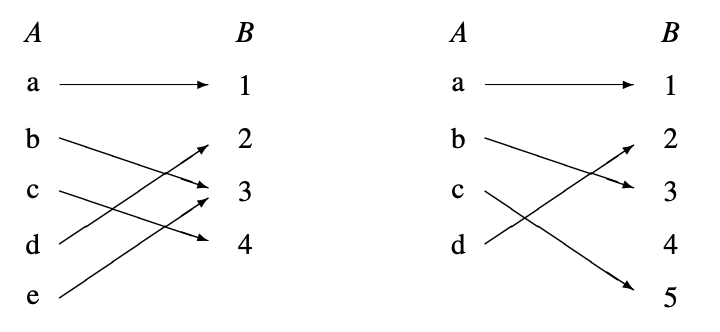

# 4 数学中的”数据类型”

我们假设你在中学已经了解了集合、序列和函数的概念.
在以前的章节中我们已经非正式地使用了它们几次. 在本章中,
我们会更仔细地研究这些数学数据类型. 我们将快速回顾基本定义,
添加一些你可能不熟悉的名词, 比如“像”和“逆像”,
并以一些比较集合大小的方法结束本章.

## 4.1 集合

非正式地说, 集合是一组对象, 称为集合的元素.
集合的元素可以是任何东西：数字、空间中的点, 甚至是其他集合.
写出集合的常规方法是将元素列在大括号内. 例如, 以下是一些集合：

$$
A = \{ \text{Alex, Tippy, Shells, Shadow} \} \quad \text{死了的宠物}
$$

$$
B = \{ \text{red, blue, yellow} \} \quad \text{三原色}
$$

$$
C = \{ \{a, b\}, \{a, c\}, \{b, c\} \} \quad \text{集合的集合}
$$

这对小的有限集合效果很好.
我们还可以通过说明如何生成其中的元素来定义集合：

$$
D ::= \{ 1, 2, 4, 8, 16, \ldots \} \quad \text{2的幂次}
$$

集合中, 元素的顺序不重要,
因此$\{x, y\}$和$\{y, x\}$是用两种不同方式书写的相同集合. 另外,
任何对象是或不是给定集合的元素——没有元素出现多次的概念. 因此,
写$\{x, x\}$只是表示同样的事情两次：$x$在集合中. 特别地,
$\{x, x\} = \{x\}$.

表达式“$e \in S$”说的是$e$是集合$S$的一个元素. 例如,
$32 \in D$和$blue \in B$, 但$Tailspin \notin A$——这个宠物还没有死.

集合是简单、灵活、无处不在的. 你会发现本文中经常提到集合.

### 4.1.1 一些常用的集合

数学家发明了特殊符号来表示一些常见的集合.

| 符号         | 集合     | 元素                                             |
|--------------|----------|--------------------------------------------------|
| $\emptyset$  | 空集     | 无                                               |
| $\mathbb{N}$ | 非负整数 | $\{0, 1, 2, 3, \ldots\}$                         |
| $\mathbb{Z}$ | 整数     | $\{\ldots, -3, -2, -1, 0, 1, 2, 3, \ldots\}$     |
| $\mathbb{Q}$ | 有理数   | $\{\frac{1}{2}, -\frac{5}{3}, 16, \text{...}\}$  |
| $\mathbb{R}$ | 实数     | $\{\pi, e, -9, \sqrt{2}, \text{...}\}$           |
| $\mathbb{C}$ | 复数     | $\{i, \frac{19}{2}, \sqrt{2} - 2i, \text{...}\}$ |

上标“$+$”将集合限制为其正元素；例如, $\mathbb{R}^+$表示正实数集合. 同样,
$\mathbb{Z}^-$表示负整数集合.

### 4.1.2 比较和组合集合

表达式$S \subseteq T$表示集合$S$是集合$T$的子集,
这意味着$S$的每个元素也是$T$的一个元素. 例如,
$\mathbb{N} \subseteq \mathbb{Z}$,
因为每个非负整数都是一个整数；$\mathbb{Q} \subseteq \mathbb{R}$,
因为每个有理数都是一个实数；但$\mathbb{C} \not\subseteq \mathbb{R}$,
因为不是每个复数都是一个实数.

作为记忆技巧, 将“$\subseteq$”符号视为“$\leq$”符号,
左侧是较小的集合或数字. 注意, 就像$n \leq n$对于任何数字$n$一样,
$S \subseteq S$对于任何集合$S$也是如此.

集合上也有一个关系$\subset$, 类似于数字上的“小于”关系$<$.
$S \subset T$意味着$S$是$T$的子集, 但两者不相等. 因此,
正如$n \ne n$对于任何数字$n$一样,
$A \subset A$对于任何集合$A$也是不成立的.
“$S \subset T$”读作“$S$是$T$的真子集”.

有几种基本方法可以组合集合. 例如, 假设

$$
X ::= \{1, 2, 3\},
$$

$$
Y ::= \{2, 3, 4\}.
$$

#### 定义 4.1.1 (并集)

集合$A$和$B$的并集, 表示为$A \cup B$, 包括出现在$A$或$B$或两者中的元素.
即,

$$
x \in A \cup B \text{ 当且仅当 } x \in A \text{ 或 } x \in B.
$$

因此, $X \cup Y = \{1, 2, 3, 4\}$.

#### 定义4.1.2 (交集)

集合$A$和$B$的交集, 表示为$A \cap B$, 包括出现在$A$和$B$中的所有元素.
即,

$$
x \in A \cap B \text{ 当且仅当 } x \in A \text{ 且 } x \in B.
$$

因此, $X \cap Y = \{2, 3\}$.

#### 定义4.1.3 (差集)

集合$A$和$B$的差集, 表示为$A - B$, 包括所有在$A$中但不在$B$中的元素. 即,

$$
x \in A - B \text{ 当且仅当 } x \in A \text{ 且 } x \notin B.
$$

因此, $X - Y = \{1\}$和$Y - X = \{4\}$.

通常考虑的所有集合都是已知论域$D$的子集. 然后对于$D$的任何子集$A$,
我们定义$\overline{A}$为$D$中不在$A$中的所有元素的集合. 即,

$$
\overline{A} ::= D - A.
$$

集合$\overline{A}$称为$A$的补集. 因此,

$$
A = \emptyset \text{ 当且仅当 } A = D.
$$

例如, 如果我们工作的论域是整数, 非负整数的补集是负整数的集合：

$$
\mathbb{N} = \mathbb{Z}^-.
$$

我们可以使用补集将子集重新表述为等式

$$
A \subseteq B \text{ 等价于 } A \cap \overline{B} = \emptyset.
$$

### 4.1.3 幂集

集合$A$的所有子集构成的集合称为$A$的幂集, 记为pow$(A)$. 因此,

$$
B \in \text{pow}(A) \text{ 当且仅当 } B \subseteq A.
$$

例如, pow$(\{1, 2\})$的元素是$\emptyset$, $\{1\}$, $\{2\}$和$\{1, 2\}$.

更一般地说, 如果$A$有$n$个元素, 那么pow$(A)$中有$2^n$个集合. 因此,
一些作者使用符号$2^A$而不是pow$(A)$.

### 4.1.4 构造集表示法

谓词的一个重要用法是构造集表示法.
我们经常想要谈论那些不能通过列出元素或通过并集、交集等简单描述的集合.
构造集表示法经常派上用场. 其思想是使用谓词来定义一个集合；特别地,
该集合包含使谓词为真的所有值. 以下是一些构造集表示法的例子：

$$
A ::= \{n \in \mathbb{N} \mid n \text{ 是质数并且 } n = 4k + 1 \text{ 对于某些整数 } k\},
$$

$$
B ::= \{x \in \mathbb{R} \mid x^3 - 3x + 1 > 0\},
$$

$$
C ::= \{a + bi \in \mathbb{C} \mid a^2 + 2b^2 \leq 1\},
$$

$$
D ::= \{L \in \text{书籍} \mid L \text{ 被本文引用了 }\}.
$$

集合$A$由使谓词“$n$是素数并且$n = 4k + 1$对于某个整数$k$”为真的所有非负整数$n$组成.
因此, $A$的最小元素是：

$$
5, 13, 17, 29, 37, 41, 53, 61, 73, \ldots
$$

试图通过列出前几个元素来指示集合$A$是不太可行的；即使在列出十项之后,
规律也不明显. 同样, 集合$B$由使谓词

$$
x^3 - 3x + 1 > 0
$$

为真的所有实数$x$组成. 在这种情况下,
以区间形式显式描述集合$B$需要解一个三次方程. 集合$C$由使得

$$
a^2 + 2b^2 \leq 1
$$

的所有复数$a + bi$组成. 这是复平面上原点周围的一个椭圆形区域. 最后,
集合$D$的成员可以通过从原书的参考书目的期刊文章列表中过滤出来确定.

### 4.1.5 证明集合的相等性

两个集合如果具有完全相同的元素, 则定义为相等. 即,
$X = Y$意味着$z \in X$当且仅当$z \in Y$, 对于所有元素$z$. 因此,
可以表述和证明集合的相等性, 如“当且仅当”定理. 举例来说：

#### 定理 4.1.2. \[集合的分配律\]

设$A$、$B$和$C$是集合. 那么：

$$
A \cap (B \cup C) = (A \cap B) \cup (A \cap C) \tag{4.1}
$$

等式(4.1)等价于说明对于所有$z$, 都有

$$
z \in A \cap (B \cup C) \iff z \in (A \cap B) \cup (A \cap C) \tag{4.2}
$$

现在我们将通过一系列“当且仅当”来证明(4.2).

现在我们有

$$
z \in A \cap (B \cup C)
$$

当且仅当

$$
(z \in A) \text{ AND } (z \in B \cup C) \quad \text{(交集的定义)}
$$

当且仅当

$$
(z \in A) \text{ AND } (z \in B \text{ OR } z \in C) \quad \text{(并集的定义)}
$$

当且仅当

$$
(z \in A \text{ AND } z \in B) \text{ OR } (z \in A \text{ AND } z \in C) \quad \text{(AND分配律(3.9))}
$$

当且仅当

$$
(z \in A \cap B) \text{ OR } (z \in A \cap C) \quad \text{(交集的定义)}
$$

当且仅当

$$
z \in (A \cap B) \cup (A \cap C) \quad \text{(并集的定义)}
$$

定理4.1.2的证明说明了一种证明涉及基本集合运算的集合相等性的一般方法,
即检查相应的命题公式是否有效. 作为进一步的例子,
从命题的德摩根律(3.14)我们可以推导出相应的集合相等性的德摩根律：

$$
\text{NOT}(P \text{ AND } Q) \text{ 等价于 } \overline{P} \text{ OR } \overline{Q}
$$

我们可以推导出（问题4.5）相应的集合相等性的德摩根律：

$$
\overline{A \cap B} = \overline{A} \cup \overline{B} \tag{4.3}
$$

尽管这两种运算之间有对应关系, 但重要的是不要将命题运算与集合运算混淆.
例如, 如果$X$和$Y$是集合,
那么写“$X \text{ AND } Y$”而不是“$X \cap Y$”是错误的.
将AND应用于集合会导致编译器或评分员抛出类型错误,
因为AND运算只应用于真值, 而你应用于集合. 同样, 如果$P$和$Q$是命题,
那么写“$P \cup Q$”而不是“$P \text{ OR } Q$”也是类型错误.

## 4.2 序列

集合提供了一种对象分组的方法. 另一种分类的方法是序列,
即一列有顺序的对象, 称为其成分、成员或元素. 对于较短的序列,
通常通过将元素用括号和逗号包裹；例如, 序列$(a, b, c)$有三个成分.
它也可以被称为一个三元序列或长度为三的序列.
这些短语都是类似的——序列是如此基本, 以至于它们无处不在,
有很多种方法可以解读它们.

虽然集合和序列都执行分类和整合的功能, 但它们之间有几个区别.

-   集合的元素必须是不同的, 但序列中的元素可以相同. 因此,
    $(a, b, a)$是长度为三的有效序列,
    但$\{a, b, a\}$是具有两个元素的集合, 而不是三个.

-   序列中的元素有指定的顺序, 但集合的元素没有. 例如,
    $(a, b, c)$和$(a, c, b)$是不同的序列,
    但$\{a, b, c\}$和$\{a, c, b\}$是相同的集合.

-   不同的文献对空序列的符号有不同的规定；我们使用$\lambda$表示空序列.

积运算是集合和序列之间的一个连接.
集合的笛卡尔积$S_1 \times S_2 \times \cdots \times S_n$是一个新集合,
包含所有序列, 其中第一个成分来自$S_1$, 第二个成分来自$S_2$, 依此类推.
长度为二的序列称为对. 例如, $\mathbb{N} \times \{a, b\}$是所有对的集合,
其中第一个元素是非负整数, 第二个元素是$a$或$b$：

$$
\mathbb{N} \times \{a, b\} = \{(0, a), (0, b), (1, a), (1, b), (2, a), (2, b), \ldots\}
$$

集合$S$的$n$次积表示为$S^n$. 例如, $\{0, 1\}^3$是所有三比特序列的集合：

$$
\{0, 1\}^3 = \{(0, 0, 0), (0, 0, 1), (0, 1, 0), (0, 1, 1), (1, 0, 0), (1, 0, 1), (1, 1, 0), (1, 1, 1)\}
$$

## 4.3 函数

### 4.3.1 定义域与值域

函数将一个集合的元素（称为定义域）映射到另一个集合的元素（称为值域）.
记作

$$
f : A \to B
$$

表示$f$是一个定义域为$A$、值域为$B$的函数.
常见的记号“$f(a) = b$”表示$f$将$B$中的元素$b$映射到$a$.
这里$b$被称为$f$在$a$处的值.

函数通常用公式定义, 如$x$是一个实变量：

$$
f_1(x) ::= \frac{1}{x^2}
$$

如果$y$和$z$是二进制字符串, 可以定义

$$
f_2(y, z) ::= y10yz
$$

如果$n$在非负整数中取值, 可以定义

$$
f_3(x, n) ::= \text{长度为} n \text{的序列} (x, \ldots, x) \quad n \text{个} x
$$

一个函数如果其定义域是有限的, 那么可以通过一个表来描述,
表中显示了函数在定义域的每个元素上的值. 例如, 函数$f_4(P, Q)$,
其中$P$和$Q$是命题变量, 通过以下方式指定：

| $P$ | $Q$ | $f_4(P, Q)$ |
|-----|-----|-------------|
| T   | T   | T           |
| T   | F   | F           |
| F   | T   | T           |
| F   | F   | T           |

注意, $f_4$也可以通过公式描述：

$$
f_4(P, Q) ::= [P \implies Q]
$$

函数也可以通过一个计算其在定义域的每个元素上的值的过程来定义,
或通过其他一些类型的规范来定义. 例如, 定义

$$
f_5(y)
$$

为从左到右搜索二进制字符串$y$中的位直到出现1的长度, 所以

$$
f_5(0010) = 3,
$$

$$
f_5(100) = 1,
$$

$$
f_5(0000) \text{ 未定义}. 
$$

注意, $f_5$不为仅包含0的字符串分配值.
这说明了关于函数的重要事实：**它们不需要为定义域中的每个元素分配值**.
事实上, 这在我们第一个例子$f_1(x) = 1/x^2$中出现过, 它不为0分配值. 因此,
一般来说, 函数可以是部分函数, 这意味着可能存在一些定义域元素,
对于这些元素, 函数没有定义. 函数定义的定义域元素的集合称为函数的支持.
如果一个函数为其定义域的每个元素分配值, 则其支持等于其定义域,
它被称为全函数.

通常, 找到函数在应用于一组参数元素时所取值的集合是有用的. 因此,
如果$f : A \to B$, 并且$S$是$A$的子集, 我们定义

$$
f(S)
$$

为$f$在应用于$S$的元素时所取值的所有值的集合. 即,

$$
f(S) ::= \{b \in B \mid f(s) = b \text{ 对于某个 } s \in S\}. 
$$

例如, 如果我们让$[r, s]$表示实线上从$r$到$s$的区间中的数的集合, 那么

$$
f_1([1, 2]) = [1/4, 1]. 
$$

再例如, 让我们取“查找1”函数$f_5$.
如果我们让$X$为所有以偶数个0开头并后跟1的二进制字组成的集合, 那么

$$
f_5(X)
$$

将是奇数非负整数.

将$f$应用于一组$S$参数称为“将$f$逐点应用于$S$”,
并且集合$f(S)$称为$S$在$f$下的**像**.
应用于所有可能参数的$f$所产生的值的集合称为$f$的值域. 即,

$$
\text{range}(f) ::= f(\text{domain}(f)). 
$$

一些作者将值域称为函数的范围, 但他们不应该这样做.
范围和值域之间的区别在第4.5节中会很重要,
我们在第4.5节中将集合的大小与集合的性质进行比较.

### 4.3.2 函数的复合

逐步完成事情是一个普遍的概念. 比如外出散步, 根据食谱做饭也是,
执行计算机程序, 求解公式都是这样一步一步地完成的.

抽象地, 做一件事情就相当于把原来的事情丢进一个函数, 然后得到输出,
一件一件事情完成对应于把前一个函数的输出作为后一个函数的输入,
就这样一个接一个地应用函数. 这就是函数的复合运算.
复合函数$f$和$g$意味着首先将$f$应用于某个参数$x$, 得到$f(x)$,
然后将$g$应用于该结果以产生$g(f(x))$.

#### 定义4.3.1

对于函数$f : A \to B$和$g : B \to C$,
$g \circ f$与$f$的复合定义为从$A$到$C$的函数, 定义规则为：

$$
(g \circ f)(x) ::= g(f(x)), 
$$

对于所有$x \in A$.

在初等微积分中我们已经熟悉了基本的法则,
它在离散数学中同样扮演着非常基本的角色.

## 4.4 二元关系

二元关系定义了两个对象之间的关系. 例如,
实数上的“小于”关系将每个实数$a$与另一个实数$b$相关联, 当且仅当$a < b$.
类似地, 子集关系将集合$A$与另一个集合$B$相关联, 当且仅当$A \subseteq B$.
函数$f : A \to B$是二元关系的一个特例, 其中$a \in A$与$b \in B$相关联,
当且仅当$b = f(a)$.

在本节中, 我们将定义一些基本的二元关系词汇和性质.

#### 定义 4.4.1.

二元关系$R$由一个集合$A$（称为$R$的定义域）、一个集合$B$（称为$R$的值域）和$A \times B$的一个子集（称为$R$的图）组成.

一个定义域为$A$且值域为$B$的关系称为“$A$与$B$之间的关系”,
或“从$A$到$B$”. 和函数一样,
我们写$R : A \to B$表示$R$是从$A$到$B$的关系.
当定义域和值域为相同集合$A$时, 我们简单地说关系是在$A$上.
常用“$a \, R \, b$”表示$(a, b)$在$R$的图中.

注意, 定义4.4.1与函数的定义完全相同,
只是它不要求函数条件：对于定义域$a$的每个元素,
图中至多有一对的第一个坐标是$a$. 正如我们所说, 函数是二元关系的一个特例.

MIT 2010年春季课程与讲师的“负责”关系$Chrg$是二元关系的一个方便例子.
它的定义域$Fac$是所有MIT教职员工的名字,
值域是2010年MIT秋季-春季课程列表中的课程编号.
$Chrg$的图包含以下形式的对：

$$
(\text{instructor-name}, \text{subject-num})
$$

例如, $Chrg$的图包含以下对：

$$
\begin{aligned}
&(\text{T. Eng}, &6.UAT), \\
&(\text{G. Freeman}, &6.011),\\
&(\text{G. Freeman}, &6.UAT),\\
&(\text{G. Freeman}, &6.881),\\
&(\text{G. Freeman}, &6.882),\\
&(\text{J. Guttag}, &6.00),\\
&(\text{A. R. Meyer}, &6.042),\\
&(\text{A. R. Meyer}, &18.062),\\
&(\text{A. R. Meyer}, &6.844),\\
&(\text{T. Leighton}, &6.042),\\
&(\text{T. Leighton}, &18.062),\\
&\ldots 
\end{aligned} \tag{(4.4)}
$$

值域$SubNums$中的一些课程不出现在这些对中——即它们不在$Chrg$的值域中.
这些是仅秋季课程. 同样, 定义域$Fac$中的一些讲师不出现在列表中,
因为他们不负责任何春季学期课程.

### 4.4.1 关系图

关系的一些标准性质可以用图来表示. 二元关系$R$的图表示法中,
定义域中的元素对应于一列中的点（如果$domain(R)$是无限的,
则为一列很长的点）. 值域中的所有元素出现在另一列中,
我们通常将其看作在定义域列的右侧.
从定义域列中的点$a$到值域列中的点$b$有一条箭头,
当且仅当对应的元素由$R$关联时. 例如, 这里有两个函数的图表示法：

函数显然是二元关系的重要性质.
这意味着定义域列中的每个点至多有一条箭头指向外. 因此,
我们可以将函数描述为“$\leq 1$ arrow out”性质.
这里有四种更标准的关系性质：

#### 定义 4.4.2.

二元关系$R$是：

-   **函数** 当且仅当它具有“$\leq 1$ 个往外指的箭头”.
-   **满射** 当且仅当它具有“$\geq 1$ 指向它的箭头”. 即,
    值域列中的每个点至少有一个箭头指向它.
-   **全射** 当且仅当它具有“$\geq 1$ 个往外指的箭头”.
-   **单射** 当且仅当它具有“$\leq 1$ 指向它的箭头”.
-   **双射** 当且仅当它同时具有“$= 1$ 个往外指的箭头”和“$= 1$
    指向它的箭头”.

从现在开始, 我们将不再提到这些性质中的箭头. 例如, 只写“$\leq 1$
in(指向它的箭头)”而不是“$\leq 1$ arrows in”.
我们把”$\geq 1$个往外指的箭头”记作” $\geq 1$ out “.

因此, 上图中的左边关系具有“$= 1$ out”和“$\geq 1$ in”性质,
这意味着它是一个全射、满射函数. 但它不具有“$\leq 1$ in”性质,
因为元素3有两个箭头指向它；它不是单射.

右边的关系具有“$= 1$ out”和“$\leq 1$ in”性质,
这意味着它是一个全射、单射函数. 但它不具有“$\geq 1$ in”性质,
因为元素4没有任何箭头指向它；它不是满射.

图中的箭头对应于$R$的图中的对. 注意, 单靠箭头不足以确定, 例如,
$R$是否具有“$\geq 1$ out”性质. 如果我们只知道箭头,
我们不会知道定义域列中是否有任何点没有箭头指向外. 换句话说,
$R$的图本身不足以确定$R$是否是全射：我们还需要知道$domain(R)$是什么.

**例 4.4.3**. 由公式$1/x^2$定义的函数具有“$\geq 1$ out”性质,
如果它的定义域是$\mathbb{R}^+$, 但如果它的定义域是包含0的某些实数集合,
则不具有此性质. 如果其定义域和值域均为$\mathbb{R}^+$, 则具有“$= 1$
in”和“$= 1$ out”性质, 但如果其定义域和值域均为$\mathbb{R}$,
则既不具有“$\leq 1$ in”也不具有“$\geq 1$ out”性质.

### 4.4.2 关系的像

函数下的集合的像的概念直接扩展到关系.

#### 定义 4.4.4.

集合$Y$在关系$R$下的像, 记为$R(Y)$,
是$R$的值域$B$中与$Y$中的某个元素相关的元素集合. 在关系图中,
$R(Y)$是所有带有箭头进入$Y$某点的点的集合.
$R$的值域$range(R)$是其定义域$A$的像$R(A)$. 即,
$range(R)$是值域中所有有箭头指向的点的集合.

例如, Meyer在2010年春季负责的课程编号的集合正是$Chrg(A. Meyer)$.
为了找出这是什么, 我们寻找$Chrg$图中所有以“A. Meyer”开始的箭头,
并查看这些箭头的另一端的课程编号. 查看图中(4.4)的对列表,
我们看到这些课程编号是$\{6.042, 18.062, 6.844\}$. 同样,
为了找到Freeman或Eng负责的课程编号, 我们可以收集所有以“G. Freeman”或“T.
Eng”开始的箭头, 并查看这些箭头的另一端的课程编号.
这是$Chrg(\{G. Freeman, T. Eng\})$.

查看图(4.4), 我们看到

$$
Chrg(\{G. Freeman, T. Eng\}) = \{6.011, 6.881, 6.882, 6.UAT\}
$$

最后, $Fac$是所有负责课程的讲师的集合,
因此$Chrg(Fac)$是2010年春季列出的所有课程的集合.

### 逆关系和像

#### 定义 4.4.5.

关系$R : A \to B$的逆关系$R^{-1}$是从$B$到$A$的关系, 定义规则为：

$$
b \, R^{-1} \, a \iff a \, R \, b. 
$$

换句话说, $R^{-1}$是通过反转$R$图中的箭头得到的关系.

#### 定义 4.4.6.

关系$R$下集合$X \subseteq B$的逆像定义为$R^{-1}(X)$,
即$A$中通过箭头与$B$中某元素相连的元素的集合.
$R$的支持定义为$R^{-1}(B)$, 即具有至少一个箭头指向外的定义域元素的集合.
$R$的支持也称为$R$的定义域.

继续上述负责的例子,
2010年春季负责6.UAT的讲师集合正是6.UAT在关系$Chrg$下的逆像.
从列表(4.4)中, 我们看到Eng和Freeman都负责6.UAT, 即,

$$
\{T. Eng, D. Freeman\} \subseteq Chrg^{-1}(\{6.UAT\}). 
$$

我们不能在此断言相等性, 因为列表中可能有其他对,
显示有更多讲师共同负责6.UAT.

现在, 让$Intro$是所有6开头的介绍性课程编号的集合. 因此,
2010年春季负责这些介绍性课程的讲师名称集合是$Chrg^{-1}(Intro)$.
从(4.4)中显示的$Chrg$列表部分,
我们看到Meyer、Leighton、Freeman和Guttag在2010年春季负责介绍性课程. 即,

$$
\{Meyer, Leighton, Freeman, Guttag\} \subseteq Chrg^{-1}(Intro). 
$$

最后, $Chrg^{-1}(SubNums)$是2010年春季负责某课程的所有讲师的集合.

## 4.5 有限基数

有限集合是只有有限数量元素的集合. 这个元素数量就是集合的“大小”或基数：

#### 定义 4.5.1.

如果$A$是一个有限集合, $A$的基数$|A|$是$A$中的元素数量.

有限集合可能没有元素（空集）, 或者有一个元素, 或者两个元素, 等等,
所以有限集合的基数总是非负整数.

现在假设$R : A \to B$是一个函数.
这意味着$A$的每个元素至多有一个箭头指向$R$的图中的箭头,
因此箭头的数量至多是$A$中的元素数量. 即, 如果$R$是一个函数, 那么

$$
|A| \geq \#\text{arrows}. 
$$

如果$R$也是满射, 那么$B$中的每个元素都有一个箭头指向它,
所以图中箭头的数量至少是$B$的大小. 即,

$$
\#\text{arrows} \geq |B|. 
$$

结合这些不等式意味着如果$R$是一个满射函数, 那么$|A| \geq |B|$.

简而言之,
如果我们写$A \text{ surj } B$表示从$A$到$B$有一个满射(surjective)函数,
那么我们刚刚证明了一个引理：对于有限集合$A$、$B$,
如果$A \text{ surj } B$, 那么$|A| \geq |B|$.
以下定义和引理列出了这一陈述以及三个与定义域和值域大小相关的类似规则.

#### 定义 4.5.2.

设$A$、$B$是集合（不一定是有限的）. 则：

1.  当且仅当从$A$到$B$有一个满射(surjective)函数时, $A \text{ surj } B$.
2.  当且仅当从$A$到$B$有一个单射(injective)全关系时, $A \text{ inj } B$.
3.  当且仅当从$A$到$B$有一个双射(bijection)时, $A \text{ bij } B$.

#### 引理 4.5.3.

对于有限集合$A$、$B$：

1.  如果$A \text{ surj } B$, 那么$|A| \geq |B|$.
2.  如果$A \text{ inj } B$, 那么$|A| \leq |B|$.
3.  如果$A \text{ bij } B$, 那么$|A| = |B|$.

证明. 我们已经给出了第1点的“箭头”证明.
第2点立即从这样的事实中得出：如果$R$具有$\leq 1$ out函数性质和$\geq 1$
in满射性质, 那么$R^{-1}$是全射且单射的,
所以$A \text{ surj } B$当且仅当$B \text{ inj } A$. 最后,
由于双射既是满射函数又是全单射关系, 第3点是前两点的直接结果.

引理4.5.3.1有一个逆命题：如果有限集合$A$的大小大于或等于另一有限集合$B$的大小,
那么总是可以定义一个从$A$到$B$的满射函数. 事实上, 满射可以是全函数.
为了看这是如何工作的, 假设例如

$$
A = \{a_0, a_1, a_2, a_3, a_4, a_5\}
$$

$$
B = \{b_0, b_1, b_2, b_3\}
$$

然后通过以下规则定义一个全函数$f : A \to B$：

$$
f(a_0) ::= b_0, \quad f(a_1) ::= b_1, \quad f(a_2) ::= b_2, \quad f(a_3) = f(a_4) = f(a_5) ::= b_3. 
$$

更简洁地说,

$$
f(a_i) ::= b_{\min(i,3)}, 
$$

对于$0 \leq i \leq 5$. 由于$5 \geq 3$, 所以这个$f$是满射.

所以我们已经确定, 如果$A$和$B$是有限集合,
那么$|A| \geq |B|$当且仅当$A \text{ surj } B$. 总而言之,
这个论证总结了一个定理的证明, 该定理总结了整个有限基数故事：

#### 定理 4.5.4. \[映射规则\]

对于有限集合$A$、$B$,

$$
|A| \geq |B| \iff A \text{ surj } B, \tag{4.5}
$$

$$
|A| \leq |B| \iff A \text{ inj } B, \tag{4.6}
$$

$$
|A| = |B| \iff A \text{ bij } B. \tag{4.7}
$$

### 4.5.1 有限集合有多少子集？

作为双射映射规则(4.7)的一个应用, 我们可以给出一个简单的证明：

#### 定理 4.5.5.

一个$n$元素集合有$2^n$个子集. 即,

$$
|A| = n \implies |\text{pow}(A)| = 2^n. 
$$

例如, 三元素集合$\{a_1, a_2, a_3\}$有八个不同的子集：

$$
\varnothing \quad \{a_1\} \quad \{a_2\} \quad \{a_1, a_2\} \quad \{a_3\} \quad \{a_1, a_3\} \quad \{a_2, a_3\} \quad \{a_1, a_2, a_3\}
$$

定理4.5.5. 由于存在从$A$的子集到$\{0, 1\}^n$的简单双射, 即$n$位序列.
因此, 令$a_1, a_2, \ldots, a_n$为$A$的元素.
双射将$S \subseteq A$的每个子集映射到位序列$(b_1, \ldots, b_n)$,
定义规则为

$$
b_i = 1 \iff a_i \in S. 
$$

例如, 如果$n = 10$,
那么子集$\{a_2, a_3, a_5, a_7, a_{10}\}$映射到一个10位序列如下：

$$
\text{subset:} \quad \{a_2, \quad a_3, \quad a_5, \quad a_7, \quad a_{10}\}
$$

$$
\text{sequence:} \quad (0, \quad 1, \quad 1, \quad 0, \quad 1, \quad 0, \quad 1, \quad 0, \quad 0, \quad 1)
$$

现在根据映射规则4.5.4.(4.7)的双射情况,

$$
|\text{pow}(A)| = |\{0, 1\}^n|. 
$$

但每个计算机科学家都知道,
有$2^n$个$n$位序列！所以我们已经证明了定理4.5.5！
