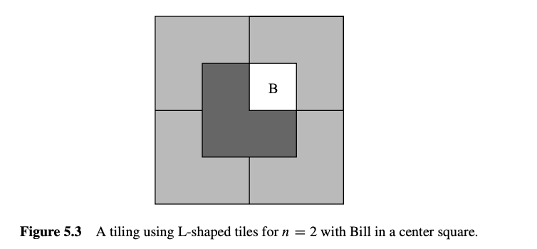
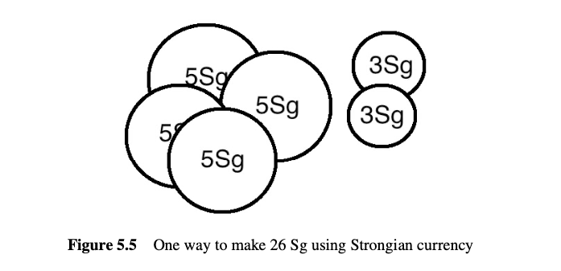
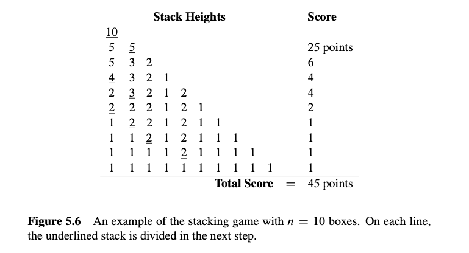

# 5 数学归纳法

归纳法是一种强大的方法, 用于证明某个性质对所有非负整数都成立.
归纳法在离散数学和计算机科学中起着核心作用. 实际上,
它的使用是离散数学的一个定义特征——与连续数学相对.
本章介绍了归纳法的两种版本：普通归纳法和强归纳法,
并解释了它们为什么有效以及如何在证明中使用它们. 它还介绍了不变量原理,
这是一种特别适用于逐步过程推理的归纳法版本.

## 5.1 普通归纳法

为了理解归纳法是如何工作的,
假设有一位教授带着一大袋装满各种小型糖果棒来上她的大班课.
她提供了一种分享糖果的方法. 首先, 她按顺序排列学生.
接着她制定了两条规则：

1.  队伍开头的学生得到一根糖果棒.
2.  如果一个学生得到一根糖果棒, 那么排在他后面的学生也会得到一根糖果棒.

让我们按照计算机科学中的规则, 从0开始给学生按顺序编号.
现在我们可以将第二条规则理解为一系列语句的简短描述：

-   如果学生0得到一根糖果棒, 那么学生1也得到一根.
-   如果学生1得到一根糖果棒, 那么学生2也得到一根.
-   如果学生2得到一根糖果棒, 那么学生3也得到一根.
-   以此类推……

当然, 这个序列有一个更简洁的数学描述：

对所有非负整数$n$, 如果学生$n$得到一根糖果棒, ,
学生$n + 1$也得到一根糖果棒.

因此, 假设你是学生17. 根据这些规则, 你有资格得到一根小型糖果棒吗？当然,
学生0根据第一条规则得到一根糖果棒. 因此, 根据第二条规则,
学生1也得到一根, 这意味着学生2也得到一根, 依此类推.
所以通过教授的第二条规则的17次应用, 你得到了你的糖果棒！当然,
这些规则实际上保证了每个学生都能得到一根糖果棒,
无论他们在队伍的哪个位置.

### 5.1.1 普通归纳法的规则

导致我们得出每个学生都能得到一根糖果棒的推理本质上就是归纳法的全部内容.

#### 归纳法原理

设$P$是关于非负整数的一个谓词. 如果

-   $P(0)$ 是真的, 并且
-   $P(n) \implies P(n + 1)$ 对所有非负整数$n$都成立,

那么

-   $P(m)$ 对所有非负整数$m$都成立.

由于我们将在后面的章节中考虑归纳法的几种有用变体,
我们将在需要区分时将上述的归纳法称为普通归纳法. 作为一个证明规则,
这可以表示为

#### 归纳法规则

$$
\frac{P(0), \quad \forall n \in \mathbb{N}. \; P(n) \implies P(n + 1)}{\forall m \in \mathbb{N}. \; P(m)}
$$

这个归纳法规则之所以有效, 原因与所有学生得到糖果棒的直觉原因相同.
通过使用糖果棒的解释,
我们希望清楚地说明普通归纳法的可靠性是可以被认为是理所当然的. 实际上,
该规则是如此明显, 以至于很难看到什么更基本的原则可以用来证明它.

### 5.1.2 一个熟悉的例子

以下是对$n$之前的非负整数求和的公式(5.1). 该公式对所有非负整数成立,
因此它是归纳法可以直接应用的那种陈述.
我们已经使用良序原理（定理2.2.1）证明了该公式, 但现在我们将使用归纳法,
即使用归纳法原理来证明它.

#### 定理 5.1.1

对于所有$n \in \mathbb{N}$,

$$
1 + 2 + 3 + \cdots + n = \frac{n(n + 1)}{2} \tag{5.1}
$$

为了通过归纳法证明该定理, 定义谓词$P(n)$为等式(5.1). 现在,
定理可以重述为$P(n)$对所有$n \in \mathbb{N}$都成立. 这很好,
因为归纳法原理让我们可以在证明两个简单的事实的前提下得出这个结论：

-   $P(0)$ 是真的.
-   对所有$n \in \mathbb{N}$, $P(n) \implies P(n + 1)$.

所以我们现在的任务简化为证明这两个陈述.

第一个陈述成立, 因为零项和的约定为0. 因此$P(0)$是真实的断言,
即零项和等于$0(0 + 1)/2 = 0$.

第二个陈述更复杂.
但请记住在第1.5节中我们用来证明任何蕴涵的有效性的基本计划：假设左边的陈述,
然后证明右边的陈述. 在这种情况下,
我们假设$P(n)$——即等式(5.1)——以证明$P(n + 1)$, 即等式

$$
1 + 2 + 3 + \cdots + n + (n + 1) = \frac{(n + 1)(n + 2)}{2} \tag{5.2}
$$

这两个等式非常相似；事实上,
将$(n + 1)$加到等式(5.1)的两边并简化右边给出等式(5.2)：

$$
1 + 2 + 3 + \cdots + n + (n + 1) = \frac{n(n + 1)}{2} + (n + 1) = \frac{(n + 2)(n + 1)}{2}. 
$$

因此, 如果$P(n)$为真, 那么$P(n + 1)$也是如此.
这个论证对每个非负整数$n$都有效, 因此, 这确立了归纳证明所需的第二个事实.
因此, 归纳法原理说谓词$P(m)$对所有非负整数$m$都成立. 定理得证.

### 5.1.3 归纳证明的模板

证明等式(5.1)相对简单, 但即使是最复杂的归纳证明也遵循完全相同的模板.
归纳证明有五个组成部分：

1.  **声明证明使用归纳法**. 这立即传达了证明的整体结构,
    有助于读者理解你的论证.
2.  **定义一个合适的谓词**$P(n)$. 谓词$P(n)$称为归纳假设.
    归纳论证的最终结论是$P(n)$对所有非负整数$n$都成立.
    明确的归纳假设通常是归纳证明中最重要的部分,
    遗漏它是学生困惑证明的最大来源. 在最简单的情况下,
    归纳假设可以直接从你要证明的命题中提取,
    就像我们在等式(5.1)中所做的那样. 有时归纳假设会涉及多个变量,
    在这种情况下你应该指出哪个变量作为$n$.
3.  **证明**$P(0)$为真. 通常很容易, 如上面的例子.
    这部分证明称为基本情况或基础步骤.
4.  **证明**$P(n)$蕴涵$P(n + 1)$对每个非负整数$n$成立. 这称为归纳步骤.
    基本计划始终相同：假设$P(n)$为真,
    然后使用这个假设来证明$P(n + 1)$为真. 这两个陈述应该非常相似,
    但弥合差距可能需要一些创造力. 无论你提供什么论证,
    必须对每个非负整数$n$有效, 因为目标是证明以下所有蕴涵都成立： $$
    P(0) \to P(1), \quad P(1) \to P(2), \quad P(2) \to P(3), \ldots. 
    $$
5.  **调用归纳法**. 考虑到这些事实,
    归纳原理允许你得出$P(n)$对所有非负整数$n$都成立.
    这是整个论证的逻辑顶点, 但它是如此标准, 以至于通常不显式提及它.

始终明确标记基本情况和归纳步骤. 这样做将使你的证明更清晰,
并减少你忘记关键步骤的可能性——如检查基本情况.

### 5.1.4 干净的写法

上面给出的定理5.1.1的证明是完全有效的；然而,
它包含了许多在归纳证明中通常看不到的多余解释.
下面的写法更接近你在印刷中可能看到的内容, 并且应该准备好自己编写.

修订的定理5.1.1证明. 我们使用归纳法. 归纳假设$P(n)$将是等式(5.1).

**归纳基础**：$P(0)$为真, 因为当$n = 0$时, 等式(5.1)的两边都等于零.

**归纳步骤**：假设$P(n)$为真, 即等式(5.1)对某个非负整数$n$成立.
那么将$n + 1$加到等式的两边意味着 $$
1 + 2 + 3 + \cdots + n + (n + 1) = \frac{n(n + 1)}{2} + (n + 1) = \frac{(n + 2)(n + 1)}{2}. 
$$ (通过简单的代数) 这证明了$P(n + 1)$.

因此, 通过归纳法, $P(n)$对所有非负整数$n$都成立. ■

可能困扰你的是, 归纳法证明了这个求和公式, 但没有提供一种直观的理解方式,
也没有解释公式最初是从哪里来的. 这既是一个弱点, 也是一个优势.
一个证明如果没有提供洞见, 就会削弱它的说服力.
但它的优势在于可以为读者提供可靠的正确性保证, 而不需要洞见.

### 5.1.5 一个更具挑战性的例子

在麻省理工学院著名的斯塔塔中心开发期间, 随着成本进一步超出预算,
一些激进的筹款想法被提出. 有传言计划是安装一个分成单位正方形的大广场.
这个大正方形将是$2^n$单位一边的正方形, 对于某个未确定的非负整数$n$,
并且在中心的一个单位正方形中有一座富有的潜在捐赠者的雕像——筹款者私下称之为“Bill”.
$n = 3$的情况如图5.1所示.

一个复杂因素是建筑的非传统建筑师弗兰克·盖里,
据称要求只能使用特殊的L形瓷砖（如图5.2所示）用于庭院. 对于$n = 2$,
满足这些约束的庭院如图5.3所示. 但对于更大的$n$值,
是否有办法用L形瓷砖围绕中心的雕像铺设$2^n \times 2^n$的庭院？让我们试着证明这是可能的.

#### 定理 5.1.2

对于所有$n \geq 0$, 存在一个$2^n \times 2^n$的庭院的铺设, Bill在中心.

**证明**（注定失败的尝试）：证明是通过归纳法进行的.
设$P(n)$是存在一个$2^n \times 2^n$的庭院的铺设, Bill在中心.

**归纳基础**：$P(0)$为真, 因为Bill填满了整个庭院.

**归纳步骤**：假设对于某个$n \geq 0$,
存在一个$2^n \times 2^n$的庭院的铺设, Bill在中心.
我们必须证明有一种方法可以铺设$2^{n+1} \times 2^{n+1}$的庭院,
Bill在中心……

中心在较小庭院中放置Bill的能力并不足以铺设一个更大的庭院.
我们还没有弄清楚如何弥合$P(n)$和$P(n+1)$之间的差距.

所以, 如果我们要通过归纳法证明定理5.1.2,
我们需要比仅仅关于$n$的陈述更强的归纳假设.

当这种情况发生时, 你的第一个回退应该是寻找一个更强的归纳假设,
即一个能暗示你之前假设的假设. 例如,
我们可以将$P(n)$设为命题：对于每个Bill在$2^n \times 2^n$庭院中的位置,
存在其余部分的铺设.

这个建议听起来可能很奇怪：“如果你不能证明某件事,
那就试着证明更宏大的东西吧！”但对于归纳论证来说, 这是有意义的.
在归纳步骤中, 你必须证明$P(n)$ 蕴含 $P(n+1)$, 你会处于更有利的地位,
因为你可以假设$P(n)$, 这是一个更强的命题.
让我们看看在庭院铺设的情况下是如何展开的.

（成功尝试）.证明是通过归纳法进行的. 设$P(n)$为命题,
即对于Bill在$2^n \times 2^n$庭院中的每个位置, 存在其余部分的铺设.

**归纳基础**：$P(0)$是成立的, 因为Bill填满了整个庭院.

**归纳步骤**：假设$P(n)$对于某个$n \ge 0$成立,
即对于Bill在$2^n \times 2^n$庭院中的每个位置, 存在其余部分的铺设.
将$2^{n+1} \times 2^{n+1}$庭院分成四个象限, 每个象限为$2^n \times 2^n$.
一个象限包含Bill（如下图所示）.
在每个三个中心方格中放置一个临时Bill（图中的X）, 这些方格位于该象限之外,
如图5.4所示.

现在我们可以通过归纳假设来铺设每个象限.
用一个L形的瓷砖代替三个临时的Bill完成这项工作.
这证明了对于所有$n \ge 0$, $P(n)$ 蕴含 $P(n + 1)$. 因此,
$P(m)$对于所有$m \in \mathbb{N}$成立, 并且定理作为一种特殊情况成立,
其中我们将Bill放在一个中心方格中.

这个证明有两个优点. 首先, 不仅论证了铺设的存在性,
而且给出了找到这种铺设的算法. 其次,
我们有一个更强的结果：如果Bill想要远离那些讨厌的鸽子,
在庭院边缘树立一个雕像, 我们也可以满足他的要求！

加强归纳假设通常是归纳证明不成立时的一个好方法. 但请记住,
更强的断言实际上必须是真的；否则, 构建一个有效的证明没有多大希望. 有时,
找到正确的归纳假设需要反复试验和洞察力. 例如,
数学家花了将近二十年的时间试图证明或反驳每个平面图都是5可着色的猜想.
然后, 在1994年, Carsten
Thomassen给出了一个简单到可以在餐巾纸上解释的归纳证明.
关键在于找到一个极其巧妙的归纳假设；有了这一点, 完成论证就变得很容易！

### 5.1.6 一个错误的归纳证明

如果我们已经很好地编写了这段文字, 现在你应该在想, “嘿,
这个归纳东西也不难嘛——只要证明 $P(0)$ 是真的, 并且 $P(n)$ 蕴含
$P(n + 1)$ 对于任何数字 $n$.” 你是对的,
虽然有时当你自己开始做归纳证明时, 你可能会遇到麻烦. 例如,
我们现在将用归纳法来“证明”所有的马都是同一种颜色——就在你以为可以逃课去做机器人编程的时候！对不起！

**假定理.** 所有的马都是同一种颜色.

注意, 这个断言中没有提到任何 $n$, 所以我们必须以一种使 $n$
明确的方式来表述它. 特别地, 我们将（错误地）证明

#### 假定理 5.1.3.

在每个包含 $n \geq 1$ 匹马的集合中, 所有的马都是同一种颜色.

这是关于所有整数 $n \geq 1$ 的一个陈述,
因此使用归纳法的一个轻微变体是自然的：在基础情况中证明 $P(1)$, 然后证明
$P(n)$ 蕴含 $P(n + 1)$ 对于所有 $n \geq 1$ 在归纳步骤中.
这是一个完全有效的归纳变体, 并不是下面证明的问题.

**伪证明.** 证明是对 $n$ 进行归纳. 归纳假设 $P(n)$ 将是

$$
\text{在每个包含 } n \text{ 匹马的集合中, 所有的马都是同一种颜色. }
$$

**基础情况**: $(n = 1)$. $P(1)$ 是真的, 因为在一个包含 1 匹马的集合中,
只有一匹马, 这匹马肯定和它自己是同一种颜色.

**归纳步骤**: 假设 $P(n)$ 对于某个 $n \geq 1$ 是真的. 也就是说,
假设在每个包含 $n$ 匹马的集合中, 所有的马都是同一种颜色.
现在假设我们有一个包含 $n + 1$ 匹马的集合：

$$
h_1, h_2, \ldots, h_n, h_{n+1}.
$$

我们需要证明这 $n + 1$ 匹马都是同一种颜色.

根据我们的假设, 前 $n$ 匹马是同一种颜色：

$$
\underbrace{h_1, h_2, \ldots, h_n}_{\text{same color}}, h_{n+1}
$$

同样根据我们的假设, 最后 $n$ 匹马是同一种颜色：

$$
h_1, \underbrace{h_2, \ldots, h_n, h_{n+1}}_{\text{same color}}
$$

所以 $h_1$ 和除了 $h_{n+1}$ 之外的剩余马匹颜色相同——即
$h_2, \ldots, h_n$. 同样, $h_{n+1}$ 和除了 $h_1$
之外的剩余马匹颜色相同——即 $h_2, \ldots, h_n$. 既然 $h_1$ 和 $h_{n+1}$
是和 $h_2, \ldots, h_n$ 同一种颜色, 所有 $n + 1$ 匹马必然是同一种颜色,
因此 $P(n + 1)$ 是真的. 因此, $P(n)$ 蕴含 $P(n + 1)$.

根据归纳原理, $P(n)$ 对于所有 $n \geq 1$ 是真的.

我们证明了一些错误的东西！这是否意味着数学崩溃了,
我们都应该改学诗歌？当然不是！这只是意味着这个证明有一个错误.

这个论证中的错误在于以下句子开头的部分：“所以 $h_1$ 和除了 $h_{n+1}$
之外的剩余马匹颜色相同——即 $h_2, \ldots, h_n$.”
表达式“$h_1, h_2, \ldots, h_n, h_{n+1}$”中的省略号符号（“$\ldots$”）给人一种印象,
即有一些剩余的马——即 $h_2, \ldots, h_n$——除了 $h_1$ 和 $h_{n+1}$. 然而,
当 $n = 1$ 时, 这不是真的. 在那种情况下, $h_1, h_2$ 和
$h_1, \ldots, h_n, h_{n+1}$ 只是 $h_1, h_2$ 并且没有“剩余”的马匹可以让
$h_1$ 共享颜色. 当然, 在这种情况下 $h_1$ 和 $h_2$
真的不需要是同一种颜色.

这个错误打破了我们归纳论证中的一个关键环节. 我们证明了 $P(1)$,
并且我们正确地证明了 $P(2) \rightarrow P(3)$, $P(3) \rightarrow P(4)$,
等等. 但是我们没有证明 $P(1) \rightarrow P(2)$,
所以一切都崩溃了：我们不能得出结论 $P(2)$, $P(3)$ 等等是真的. 当然,
这些命题都是假的；对于所有 $n \geq 2$, 确实有颜色不同的马的集合.

学生有时会解释说, 这个证明中的错误在于, 因为 $P(n)$ 对于 $n \geq 2$
是假的, 并且证明假设某些错误的 $P(n)$ 以证明 $P(n + 1)$.
你应该考虑如何帮助学生理解为什么这个解释不会在计算机科学数学课程中得到任何分数.

## 5.2 强归纳法

一种有用的归纳变体称为**强归纳法**.
强归纳法和普通归纳法用于完全相同的事情：证明一个谓词对所有非负整数都成立.
当一个简单的证明不能仅仅从谓词在 $n+1$ 上成立这一事实推导出它在 $n$
上成立, 而是从它在其他值 $\leq n$ 上成立时, 强归纳法是有用的.

### 5.2.1 强归纳法则

#### 强归纳原理

令 $P$ 为非负整数上的谓词. 如果

-   $P(0)$ 为真, 并且
-   对所有 $n \in \mathbb{N}$, $P(0), P(1), \ldots, P(n)$ 一起蕴含
    $P(n + 1)$,

那么 $P(m)$ 对所有 $m \in \mathbb{N}$ 为真.

普通归纳法原理的唯一变化是强归纳法允许在证明的归纳步骤中做更多的假设！在普通归纳法论证中,
你假设 $P(n)$ 为真并试图证明 $P(n + 1)$ 也为真. 在强归纳论证中,
你可以假设当你去证明 $P(n + 1)$ 时, $P(0), P(1), \ldots, P(n)$ 都为真.
因此, 你可以假设一个更强的假设集, 这可以使你的工作更容易.

将其公式化为证明规则, 强归纳法为

#### 命题 强归纳法则

$$ P(0), \quad \forall n \in \mathbb{N}. \left( P(0) \land P(1) \land \ldots \land P(n) \right) \implies P(n + 1) $$

$$ \forall m \in \mathbb{N}. P(m) $$

更简洁地表述, 该规则是

#### 命题 强归纳法则(简洁版)

$$ P(0), \quad [\forall k \leq n \in \mathbb{N}. P(k)] \implies P(n + 1) $$

$$ \forall m \in \mathbb{N}. P(m) $$

强归纳证明的模板与给定于第 5.1.3 节中的普通归纳证明模板相同,
只是有两点例外：

-   你应该声明你的证明是通过强归纳进行的, 并且
-   你可以假设 $P(0), P(1), \ldots, P(n)$ 都为真, 而不仅仅是 $P(n)$
    在归纳步骤中.

### 5.2.2 斐波那契数

以他名字命名的数起源于意大利数学家斐波那契在十三世纪初对人口增长模型的研究.
斐波那契数最终描述了许多有趣的生物数量的增长, 例如菠萝芽或松果的形状,
它们也经常出现在计算机科学中,
用来描述各种数据结构的增长和算法的计算时间.

要生成连续的斐波那契数列表, 你从写 0, 1 开始, 然后通过将前两个数相加,
不断向列表中添加另一个元素：

$$ 0, 1, 1, 2, 3, 5, 8, 13, 21, \ldots $$

另一种描述这个过程的方法是通过以下方程定义第 $n$ 个斐波那契数 $F(n)$：

$$ 
\begin{aligned}
F(0) & ::= 0, \\
F(1) & ::= 1, \\
F(n) & ::= F(n - 1) + F(n - 2) \quad \text{for } n \geq 2.
\end{aligned}
$$

注意, 由于找到斐波那契 $F(n)$ 的通用规则涉及到前两个值 $F(n - 1)$ 和
$F(n - 2)$, 我们需要知道两个初始值 $F(0)$ 和 $F(1)$ 才能开始.

斐波那契数的一个简单性质是它的奇偶模式在长度为三的周期中重复.
一种描述这种情况的好方法是对所有 $n \geq 0$,

$$ F(n) \text{ 是偶数 当且仅当 } F(n + 3) \text{ 是偶数. } \tag{5.4} $$

我们将通过归纳验证等式 (5.4), 但是因为 $F(n)$ 的性质不仅取决于
$F(n - 1)$, 而且取决于 $F(n - 2)$, 因此需要使用强归纳法.

（强）归纳假设 $P(n)$ 将是 (5.4).

**归纳基础：**

-   $(n = 0)$. $F(0) = 0$ 和 $F(3) = 2$ 都是偶数.
-   $(n = 1)$. $F(1) = 1$ 和 $F(4) = 3$ 都不是偶数.

**归纳步骤：** 对于 $n \geq 1$, 假设 $P(n)$ 和 $P(n - 1)$ 为真,
我们要证明 $P(n + 1)$ 也为真.

现在很容易验证对所有整数 $k, m$,

$$ m + k \text{ 是偶数 当且仅当 } [m \text{ 是偶数 当且仅当 } k \text{ 是偶数. }] \tag{*} $$

所以对于 $n \geq 1$,

$$ 
\begin{aligned}
F(n + 1) \text{ 是偶数} & \iff F(n) + F(n - 1) \text{ 是偶数} & (\text{def of } F(n + 1)) \\
& \iff [F(n) \text{ 是偶数 当且仅当 } F(n - 1) \text{ 是偶数}] & (\text{by } (*)) \\
& \iff [F(n + 3) \text{ 是偶数 当且仅当 } F(n + 2) \text{ 是偶数}] & (\text{by 强归纳假设 } P(n), P(n - 1)) \\
& \iff F(n + 3) + F(n + 2) \text{ 是偶数} & (\text{by } (*)) \\
& \iff F(n + 4) \text{ 是偶数} & (\text{by def of } F(n + 4)).
\end{aligned}
$$

这表明 $F(n + 1) \text{ 是偶数 当且仅当 } F(n + 4) \text{ 是偶数}$,
这意味着 $P(n + 1)$ 为真, 如所需.

长期以来, 斐波那契数爱好者们一直对这些数的许多非凡性质着迷——在问题
5.8、5.25 和 5.30 中出现了几个进一步的示例性质.

### 5.2.3 素数积

我们可以用强归纳法重新证明之前使用良序原理证明的定理 2.3.1.

#### 定理

每个大于 1 的整数都是素数的积.

我们将通过强归纳法证明该定理, 令归纳假设 $P(n)$ 为

$$ n \text{ 是素数的积. } $$

因此, 如果我们证明 $P(n)$ 对所有 $n \geq 2$ 都成立, 定理就成立了.

**归纳基础：** $(n = 2)$: $P(2)$ 为真, 因为 2 是素数,
所以它是长度为一的素数积.

**归纳步骤：** 假设 $n \geq 2$, 并且从 2 到 $n$ 的每个数都是素数的积.
我们必须证明 $P(n + 1)$ 成立, 即 $n + 1$ 也是素数的积. 我们分情况讨论：

-   如果 $n + 1$ 本身是素数, 那么根据约定, 它是长度为一的素数积,
    因此在这种情况下 $P(n + 1)$ 成立.
-   否则, $n + 1$ 不是素数, 这意味着 $n + 1 = k \cdot m$, 其中 $k, m$
    是介于 2 和 $n$ 之间的整数. 根据强归纳假设, 我们知道 $k$ 和 $m$
    都是素数的积. 通过将这些积相乘, 立即得到 $k \cdot m = n + 1$
    也是素数的积. 因此, 在这种情况下, $P(n + 1)$ 也成立.

因此, $P(n + 1)$ 在任何情况下都成立, 这完成了强归纳法的证明, 即 $P(n)$
对所有 $n \geq 2$ 都成立.

### 5.2.4 找零

货币单位为 Strong 的国家 Inductia 有价值 3Sg (3 Strongs) 和 5Sg 的硬币.
虽然 Inductians 在找 4Sg 或 7Sg 这样的小额零钱时遇到一些困难,
但事实证明, 他们可以收集硬币找出至少 8 Strongs 的零钱.

强归纳法使得证明 $n + 1 \geq 11$ 时很容易, 因为此时
$(n + 1) - 3 \geq 8$, 所以通过强归纳法 Inductians 可以找出恰好
$(n + 1) - 3$ Strongs 的零钱, 然后他们可以加上一个 3Sg 的硬币以获得
$(n + 1)$ Sg. 因此, 唯一需要做的就是检查他们是否可以找出从 8 到 10Sg
的所有金额的零钱, 这并不难做到.

以下是使用正式格式的详细写法：

我们通过强归纳法证明 Inductians 可以找出至少 8Sg 的任何金额的零钱.
归纳假设 $P(n)$ 为：

$$ n + 8 \text{ Strongs 的硬币集合. } $$

现在我们进行归纳证明：

**归纳基础：** $P(0)$ 为真, 因为一个 3Sg 硬币加上一个 5Sg 硬币等于 8Sg.

**归纳步骤：** 我们假设 $P(k)$ 对所有 $k \leq n$ 都成立, 并证明
$P(n + 1)$ 成立. 我们分情况讨论：

-   情况 $(n + 1 = 1)$：我们必须找出 $(n + 1) + 8 = 9$ Sg.
    我们可以使用三个 3Sg 硬币来做到这一点.
-   情况 $(n + 1 = 2)$：我们必须找出 $(n + 1) + 8 = 10$ Sg. 使用两个 5Sg
    硬币.
-   情况 $(n + 1 \geq 3)$：那么 $0 \leq n - 2 \leq n$,
    所以根据强归纳假设, Inductians 可以找出 $(n - 2) + 8$ Sg 的零钱.
    现在通过加上一个 3Sg 硬币, 他们可以找出 $(n + 1) + 8$ Sg 的零钱,
    因此在这种情况下 $P(n + 1)$ 成立.

由于 $n \geq 0$, 我们知道 $n + 1 \geq 1$,
因此这三种情况涵盖了每种可能性. 因为 $P(n + 1)$ 在每种情况下都为真,
我们可以通过强归纳法得出 Inductians 可以找出 $n + 8$ Strongs 的零钱,
即他们可以找出任何不少于 8 Strongs 的金额的零钱.

### 5.2.5 堆叠游戏

这是另一个激动人心的游戏, 肯定会风靡全国！

你开始时有 $n$ 个箱子, 然后你进行一系列操作. 在每一步中,
你将一个箱子堆分成两个非空的堆. 当你有 $n$ 堆, 每个堆中包含一个箱子时,
游戏结束. 你为每一步得分；特别地, 如果你将高度为 $a + b$
的一个堆分成两个高度为 $a$ 和 $b$ 的堆, 那么你为该步得 $ab$ 分.
你的总得分是你在每一步中获得的分数的总和.
你应该使用什么策略来最大化你的总得分？

例如, 假设我们开始时有一堆 $n = 10$ 个箱子. 然后游戏可能如图 5.6
所示进行. 你能找到更好的策略吗？

#### 分析游戏

让我们使用强归纳法来分析这个拆堆游戏.
我们将证明你的得分完全由箱子的数量决定——你的策略无关紧要！

#### 定理 5.2.1.

每种拆除 $n$ 个箱子的方法得分为 $n(n - 1)/2$ 分.

有几个技术点需要注意：

-   强归纳证明的模板与普通归纳法的模板相似.
-   和普通归纳一样, 我们在调整指数上有一些自由. 在这种情况下,
    我们在基准情况中证明 $P(1)$, 并证明 $P(1), \ldots, P(n)$ 蕴含
    $P(n + 1)$ 对所有 $n \geq 1$ 成立.

我们通过强归纳法证明该定理. 令 $P(n)$ 为命题, 即每种拆除 $n$
个箱子的方法得分为 $n(n - 1)/2$ 分.

**归纳基础：** 如果 $n = 1$, 那么只有一个箱子, 没有可行的操作,
所以游戏的总得分为 $1(1 - 1)/2 = 0$. 因此, $P(1)$ 为真.

**归纳步骤：** 现在我们必须证明 $P(1), \ldots, P(n)$ 蕴含 $P(n + 1)$
对所有 $n \geq 1$ 成立. 所以假设 $P(1), \ldots, P(n)$ 都为真,
并且我们有一堆 $n + 1$ 个箱子. 第一次操作必须将这堆箱子分成大小为 $a$ 和
$b$ 的两个子堆, 其中 $a + b = n + 1$ 且 $0 < a, b \leq n$. 现在,
游戏的总得分是第一次操作的得分加上拆除两个结果子堆的得分之和：

总得分 = (第一次操作的得分)+ (拆除 ( a ) 个箱子的得分 + (拆除 ( b )
个箱子的得分)

$$
\begin{aligned}
&= ab + \frac{a(a - 1)}{2} + \frac{b(b - 1)}{2} \quad \text{(由 \( P(a) \) 和 \( P(b) \) 得出)} \\
&= \frac{(a + b)^2 - (a + b)}{2} \\
&= \frac{(a + b)((a + b) - 1)}{2} \\
&= \frac{(n + 1)n}{2}
\end{aligned}
$$

这表明 $P(1), P(2), \ldots, P(n)$ 蕴含 $P(n + 1)$.

因此, 该命题通过强归纳法得证.

### 5.3 强归纳 vs. 归纳 vs. 良序

强归纳看起来确实比普通归纳“更强”, 毕竟, 当你证明归纳步骤时,
你可以假设更多. 由于普通归纳是强归纳的一种特殊情况,
你可能会想为什么还要理会普通归纳.

但强归纳实际上并不更强,
因为一个简单的文本操作程序可以自动将任何使用强归纳的证明重新格式化为使用普通归纳的证明——只需以标准方式用通用量词装饰归纳假设即可.
不过, 区分这两种归纳方法仍然值得,
因为你使用哪种方法会表明归纳步骤是直接从 $n$ 的情况推导出 $n + 1$
的情况还是需要考虑小于 $n$ 的情况, 这对于你的读者通常是有好处的.

这两种归纳规则的模板看起来与良序原理的模板完全不同,
但本章包括了一些示例,
其中使用归纳法证明了一些已经使用良序原理证明过的内容. 事实上,
这总是可以做到的. 正如示例所示,
任何良序证明都可以自动重新格式化为归纳证明. 所以从理论上讲,
任何人都不需要理会良序原理.

但是反过来也同样容易, 可以自动将任何强归纳证明重新格式化为良序证明.
三种证明方法——良序、归纳和强归纳——只是呈现相同数学推理的不同格式而已！

那么为什么要有三种方法呢？有时归纳证明更清晰, 因为它们不需要反证法.
此外, 归纳证明通常提供递归程序, 将大输入减少为小输入. 另一方面,
良序证明有时会稍短一些, 有时对初学者来说似乎更自然和更少令人担忧.

那么你应该使用哪种方法呢？没有简单的答案.
有时唯一的决定方法是用多种方法写出证明并比较它们的结果.
但是无论你选择哪种方法, 请确保在一开始就说明你使用的方法,
以帮助读者遵循你的证明.
