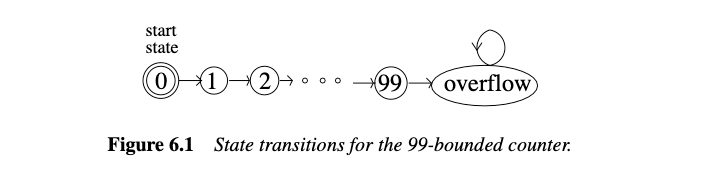
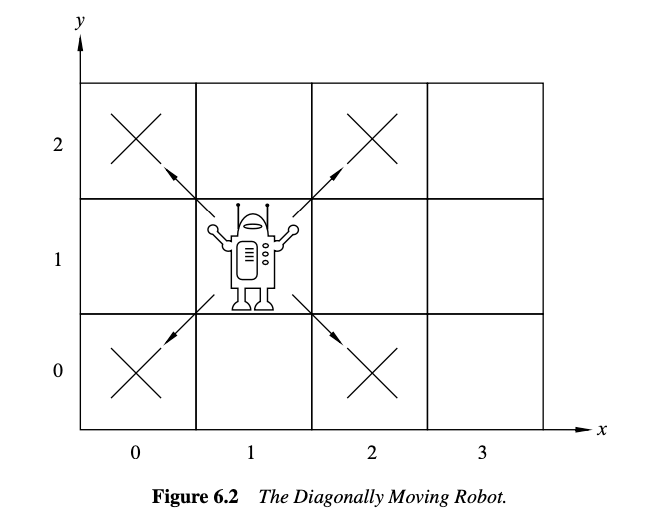
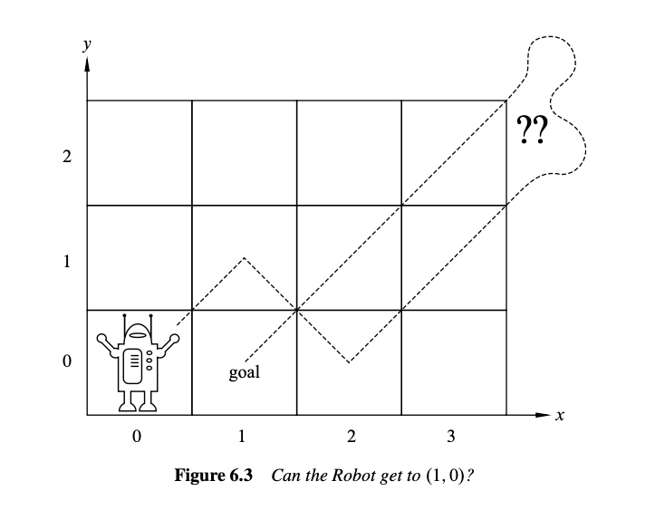
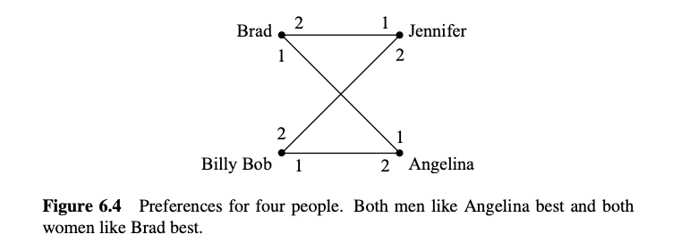

# 6 状态机

状态机是为逐步的过程建立的一种简单抽象模型. 由于在理解计算机程序的时候, 可以拆成一步一步的计算过程, 因此状态机在计算机科学中经常出现也就不足为奇了. 它们还出现在许多其他场景中, 例如设计数字电路和建模概率过程. 本节介绍 Floyd 的不变性原理, 这是一种证明状态机属性的"归纳法".

在计算机科学中, 归纳法最重要的用途之一是证明一个或多个期望的属性在过程的每一步都保持成立. 通过一系列操作或步骤保持的属性称为保持不变性.

期望的不变量的例子包括变量从不超过某个值、到飞机的高度从未低于 1000 英尺, 或者核反应堆的温度从未超过熔毁的临界值.

## 6.1 状态和转换

形式上, 状态机只不过是集合上的二元关系, 只不过集合的元素被称为“状态”, 关系被称为转换关系, 转换关系图中的箭头被称为转换. 从状态 $q$ 到状态 $r$ 的转换将写成 $q \rightarrow r$. 转换关系也被称为机器的状态图. 状态机还配备了一个指定的初始状态.

一个简单的例子是有界计数器, 它从 0 计数到 99 并溢出到 100. 该状态机如图 6.1 所示, 状态用圆圈表示, 转换用箭头表示, 初始状态 0 用双圆表示. 准确地说, 图示告诉我们这个有界计数器有以下状态：

$$
\begin{aligned}
 \text { states }&::=\{0,1, \ldots, 99, \text { overflow }\}, \\
 \text { start state }&::= 0, \\
 \text { transitions }&::=\{n \longrightarrow n+1 \mid 0 \leq n<99\}  \cup\{99 \longrightarrow \text { overflow, overflow } \longrightarrow \text { overflow }\} .
\end{aligned}
$$

一旦溢出, 这台机器就没什么用了, 因为它没有办法从溢出状态中退出.

数字电路和字符串模式匹配算法的状态机通常只有有限数量的状态. 而模型连续计算的机器通常有无限数量的状态. 例如, 代替 99 有界计数器, 我们可以轻松定义一个“无界”计数器, 它在不溢出的情况下继续计数. 无界计数器具有无限状态集, 即非负整数, 使其状态图更难绘制.

状态机通常在状态和/或转换上定义标签, 以指示诸如输入或输出值、成本、容量或概率等内容. 我们的状态机不包含任何此类标签, 因为我们不需要它们. 我们将状态命名, 如图 6.1 所示, 因此我们可以讨论它们, 但名称不是状态机的一部分.

## 6.2 不变性原理

### 6.2.1 斜向移动的机器人

假设我们有一个机器人从原点开始, 在无限二维整数网格上移动. 机器人的状态在任何时候都可以通过机器人当前位置的整数坐标 $(x, y)$ 来指定. 因此, 初始状态是 $(0, 0)$. 在每一步, 机器人可以移动到对角相邻的网格点, 如图 6.2 所示.

具体来说, 机器人的状态转移是：

$$ \{(m, n) \rightarrow (m \pm 1, n \pm 1) \mid m, n \in \mathbb{Z}\} $$

例如, 在第一步之后, 机器人可以处于状态 $(1, 1), (1, -1), (-1, 1)$ 或 $(-1, -1)$. 在两步之后, 机器人有 9 种可能的状态, 包括 $(0, 0)$. 问题是, 机器人能否到达位置 $(1, 0)$？

如果你稍微玩一下这个机器人, 你可能会注意到机器人只能到达 $(m, n)$ 的位置, 其中 $m + n$ 是偶数, 这当然意味着它不能到达 $(1, 0)$.

这可以解释为坐标和的偶性是由转换保持的属性. 这是一个保持不变性的例子.

这一次, 让我们仔细地通过这个保持不变性论证, 特别强调归纳法在其中的作用. 具体地, 定义状态的偶数和属性为：

$$ \text{Even-sum}((m, n)) ::= [m + n \text{ 是偶数}] $$

::: lem
#### 引理 6.2.1

对于斜向移动机器人的任何转换 $q \rightarrow r$, 如果 $\text{Even-sum}(q)$ 为真, 则 $\text{Even-sum}(r)$ 也为真.
:::

该引理直接从机器人的转移定义得出：

$$ (m, n) \rightarrow (m \pm 1, n \pm 1) $$

在转换后, 坐标和的变化是 $(\pm 1) + (\pm 1)$, 即 0, 2 或 -2. 当然, 将 0, 2 或 -2 加到一个偶数上得到一个偶数. 因此, 通过对转换次数的简单归纳法, 我们可以证明：

::: thm
#### 定理 6.2.2

斜向移动机器人可达的任何状态的坐标和是偶数.
:::

::: prf
证明是关于机器人所做的转换次数的归纳. 归纳假设是

$$ P(n) ::= \text{如果 } q \text{ 是 } n \text{ 步可达状态, 则 } \text{Even-sum}(q) $$

**归纳基础：** $P(0)$ 为真, 因为在 0 次转换中唯一可达的状态是初始状态 $(0, 0)$, 且 $0 + 0$ 是偶数.

**归纳步骤：** 假设 $P(n)$ 为真, 设 $r$ 是 $n + 1$ 步可达的任意状态. 我们需要证明 $\text{Even-sum}(r)$ 成立.

由于 $r$ 是在 $n + 1$ 次转换中可达的, 必须存在一个状态 $q$ 在 $n$ 次转换中可达, 使得 $q \rightarrow r$. 由于假设 $P(n)$ 为真, $\text{Even-sum}(q)$ 成立, 因此由引理 6.2.1, $\text{Even-sum}(r)$ 也成立. 这证明了 $P(n) \implies P(n + 1)$ 如所需, 完成归纳步骤的证明.

因此, 我们通过归纳得出, 对于所有 $n \geq 0$, 如果 $q$ 是在 $n$ 次转换中可达的状态, 则 $\text{Even-sum}(q)$ 成立. 这意味着每个可达状态都具有偶数和属性.
:::

::: cor
#### 推论 6.2.3

机器人永远无法到达位置 $(1, 0)$.
:::

::: prf
根据定理 6.2.2, 我们知道机器人只能到达坐标和为偶数的位置, 因此它不能到达 $(1, 0)$.
:::

### 6.2.2 不变性原理的陈述

使用偶数和不变量来理解斜向移动机器人是一个简单的示例, 说明了一种称为不变性原理的基本证明方法. 该原理总结了如何将到达状态的步骤数上的归纳应用于不变量.

状态机的执行描述了机器可能采取的步骤的可能序列.

::: def
#### 定义 6.2.4

状态机的执行是状态的（可能是无限的）序列, 具有以下属性：

-   以初始状态开始, 并且
-   如果 $q$ 和 $r$ 是序列中的连续状态, 则 $q \rightarrow r$.
:::

一个状态如果出现在某个执行中, 则称其为可达的.

::: def
#### 定义 6.2.5

状态机的保持不变性是对状态的谓词 $P$, 使得每当 $P(q)$ 对状态 $q$ 成立且 $q \rightarrow r$ 对某个状态 $r$ 成立时, $P(r)$ 也成立.
:::

::: prop
#### 不变性原理

如果状态机的保持不变性对初始状态成立, 那么它对所有可达状态也成立.
:::

不变性原理只不过是归纳原理在状态机中的便捷形式. 证明谓词在初始状态下为真是归纳的基准情况, 证明谓词是保持不变性对应于归纳步骤.

### 6.2.3 《虎胆龙威》示例

电影《虎胆龙威3》中包含了一个有趣的状态机示例. 由 Samuel L. Jackson 和 Bruce Willis 扮演的主角必须解除由邪恶的 Simon Gruber 安放的炸弹：

> **Simon:** 在喷泉上, 应该有两个水壶, 看到了吗？一个5加仑和一个3加仑的水壶. 用其中一个水壶装满4加仑的水并放在秤上, 计时器就会停止. 你必须精确；多一盎司或少一盎司都会导致爆炸. 如果你在5分钟内还活着, 我们再说.
>
> **Bruce:** 等等, 我不明白. 你明白吗？
>
> **Samuel:** 不明白.
>
> **Bruce:** 拿起水壶. 显然, 我们不能用3加仑的水壶装4加仑的水.
>
> **Samuel:** 显然.
>
> **Bruce:** 好的, 我知道了, 我们把3加仑的水壶装满, 对吧？
>
> **Samuel:** 嗯.
>
> **Bruce:** 好了, 现在我们把这3加仑倒进5加仑的水壶, 这样5加仑的水壶里正好有3加仑的水, 对吧？
>
> **Samuel:** 对, 然后呢？
>
> **Bruce:** 好了, 我们把3加仑的水壶装满三分之一...
>
> **Samuel:** 不！他说“要精确”. 正好4加仑.
>
> **Bruce:** 哎... 每个50英里内的警察都在忙着, 而我在这里玩儿童游戏.
>
> **Samuel:** 嘿, 你想专注于手头的问题吗？

幸运的是, 他们最终及时找到了解决方案. 你可以自己算出来.

#### 《虎胆龙威3》状态机

水壶填充场景可以用状态机建模, 该状态机跟踪大水壶中的水量 $b$ 和小水壶中的水量 $l$. 对于3加仑和5加仑的水壶, 状态形式上是实数对 $(b, l)$, 满足

$$ 0 \leq b \leq 5, 0 \leq l \leq 3 $$

（我们可以证明 $b$ 和 $l$ 的可达值将是非负整数, 但我们不做这个假设. ）初始状态是 $(0, 0)$, 因为两个水壶都是空的.

由于水壶中的水量必须精确知道, 我们只考虑完全装满或完全倒空的操作. 有几种类型的转换：

1.  填满小水壶：$(b, l) \rightarrow (b, 3)$ 对于 $l < 3$
2.  填满大水壶：$(b, l) \rightarrow (5, l)$ 对于 $b < 5$
3.  倒空小水壶：$(b, l) \rightarrow (b, 0)$ 对于 $l > 0$
4.  倒空大水壶：$(b, l) \rightarrow (0, l)$ 对于 $b > 0$
5.  从小水壶倒入大水壶：对于 $l > 0$, $$
    (b, l) \rightarrow \begin{cases} 
    (b + l, 0) & \text{如果 } b + l \leq 5, \\
    (5, l - (5 - b)) & \text{否则} 
    \end{cases}
    $$
6.  从大水壶倒入小水壶：对于 $b > 0$, $$
    (b, l) \rightarrow \begin{cases} 
    (0, b + l) & \text{如果 } b + l \leq 3, \\
    (b - (3 - l), 3) & \text{否则}
    \end{cases}
    $$

请注意, 与99计数器状态机不同, 上述机器中的状态有多种可能的转换. 具有每个状态最多一个转换的机器称为确定性状态机. 上述机器是非确定性的, 因为某些状态有多种转换到不同的状态.

Die Hard 3中的炸弹成功解除, 因为状态 $(4, 3)$ 是可达的.

#### 永远的《虎胆龙威》

Die Hard 系列已经让人疲惫, 所以我们提出一个最终的《虎胆龙威：永远》. 在这里, Simon 的兄弟回来为他报仇, 提出相同的挑战, 但用9加仑的水壶代替5加仑的水壶. 状态机与Die Hard 3版本相同, 只是所有出现的“5”都被替换为“9”.

现在, 到达 $(4, l)$ 状态是不可能的. 我们使用不变性原理证明这一点. 具体来说, 我们定义保持不变谓词 $P((b, l))$ 为 $b$ 和 $l$ 是3的非负整数倍.

要证明 $P$ 是Die-Hard-Once-and-For-All机器的保持不变性, 我们假设 $P(q)$ 对某状态 $q ::= (b, l)$ 成立, 并且 $q \rightarrow r$. 我们必须证明 $P(r)$ 成立. 证明根据使用的转换规则分成几种情况.

一种情况是“填满小水壶”转换. 这意味着 $r = (b, 3)$. 但 $P(q)$ 意味着 $b$ 是3的整数倍, 当然3也是3的整数倍, 因此 $P(r)$ 仍然成立.

另一种情况是“从大水壶倒入小水壶”转换. 对于小水壶不能装下所有水的子情况, 即当 $b + l > 3$ 时, 我们有 $r = (b - (3 - l), 3)$. 但 $P(q)$ 意味着 $b$ 和 $l$ 是3的整数倍, 这意味着 $b - (3 - l)$ 也是3的整数倍, 因此在这种情况下, $P(r)$ 也成立.

我们不会详细讨论剩余的情况, 它们同样容易验证. 根据不变性原理, 我们得出每个可达状态都满足 $P$. 但由于没有形式为 $(4, l)$ 的状态满足 $P$, 我们严格地证明了 Bruce 最终会死去！

顺便说一下, 注意到状态 $(1, 0)$ 满足 $\text{NOT}(P)$, 有一个转换到 $(0, 0)$ 满足 $P$. 所以, 保持不变性的否定可能不是保持不变性.

## 6.3 部分正确性和终止性

Floyd 区分了验证程序所需的两个属性. 第一个属性称为**部分正确性**；这是指过程的最终结果（如果有的话）必须满足系统要求.

你可能认为, 如果一个结果只是部分正确, 那么它可能也是部分不正确, 但这不是 Floyd 的意思. “部分”一词来源于将可能不会终止的过程视为计算部分关系. 部分正确性意味着**当有结果时**, 它是正确的, 但过程可能并不总是产生结果, 可能是因为它陷入了循环.

第二个正确性属性称为**终止性**, 即过程总是会产生某个最终值.

部分正确性通常可以使用不变性原理来证明. 终止性通常可以使用良序原理来证明. 我们将通过验证一个快速幂过程来说明这一点.

### 6.3.1 快速幂

最直接的计算一个数 $a$ 的 $b$ 次幂的方法是将 $a$ 自乘 $b - 1$ 次. 但使用一种称为快速幂的方法可以通过相当少的乘法次数找到解决方案. 下面的变量机器程序定义了快速幂算法. 字母 $x, y, z, r$ 表示存储数字的变量. 赋值语句的形式是“$z := a$”并具有将变量 $z$ 中的数字设置为 $a$ 的效果.

::: prop
#### 快速幂程序

给定输入 $a \in \mathbb{R}, b \in \mathbb{N}$, 将变量 $x, y, z$ 初始化为 $a, 1, b$ 分别, 并重复以下步骤直到终止：

-   如果 $z = 0$, 返回 $y$ 并终止
-   $r := \text{remainder}(z, 2)$
-   $z := \text{quotient}(z, 2)$
-   如果 $r = 1$, 那么 $y := xy$
-   $x := x^2$
:::

我们声称这个程序总是终止并使 $y = a^b$. 首先, 我们将用状态机对程序的行为进行建模：

1.  $\text{states} ::= \mathbb{R} \times \mathbb{R} \times \mathbb{N}$
2.  $\text{start state} ::= (a, 1, b)$
3.  转换由以下规则定义 $$
    (x, y, z) \rightarrow 
    \begin{cases} 
    (x^2, y, \text{quotient}(z, 2)) & \text{如果 } z \text{ 是非零偶数}, \\
    (x^2, xy, \text{quotient}(z, 2)) & \text{如果 } z \text{ 是非零奇数}
    \end{cases}
    $$

保持不变性 $P((x, y, z))$ 将是

$$ z \in \mathbb{N} \text{ 且 } y x^z = a^b \tag{6.1} $$

要证明 $P$ 被保持, 假设 $P((x, y, z))$ 成立, 并且 $(x, y, z) \rightarrow (x_t, y_t, z_t)$. 我们必须证明 $P((x_t, y_t, z_t))$ 成立, 即

$$ z_t \in \mathbb{N} \text{ 且 } y_t x_t^{z_t} = a^b \tag{6.2} $$

由于存在从 $(x, y, z)$ 到 $(x_t, y_t, z_t)$ 的转换, 我们有 $z \neq 0$, 并且由于 $z \in \mathbb{N}$ 根据 (6.1), 我们可以考虑两种情况：

如果 $z$ 是偶数, 那么我们有 $x_t = x^2, y_t = y, z_t = z / 2$. 因此, $z_t \in \mathbb{N}$ 并且

$$
\begin{aligned}
y_t x_t^{z_t} &= y (x^2)^{z/2} \\
&= y x^{2 \cdot z/2} \\
&= y x^z \\
&= a^b \quad \text{(由 (6.1))}
\end{aligned}
$$

如果 $z$ 是奇数, 那么我们有 $x_t = x^2, y_t = xy, z_t = (z - 1) / 2$. 因此, $z_t \in \mathbb{N}$ 并且

$$
\begin{aligned}
y_t x_t^{z_t} &= xy (x^2)^{(z - 1)/2} \\
&= xy x^{2 \cdot (z - 1)/2} \\
&= xy x^{z - 1} \\
&= y x^z \\
&= a^b \quad \text{(由 (6.1))}
\end{aligned}
$$

所以在这两种情况下, (6.2) 成立, 证明了 $P$ 是保持不变的.

现在很容易证明部分正确性：如果快速幂程序终止, 它在变量 $y$ 中留下 $a^b$. 这是成立的, 因为 $1 \cdot a^b = a^b$, 这意味着初始状态 $(a, 1, b)$ 满足 $P$. 根据不变性原理, $P$ 对所有可达状态成立. 但是程序仅在 $z = 0$ 时停止. 如果终止状态 $(x, y, 0)$ 是可达的, 那么 $y = y \cdot x^0 = a^b$ 如所需.

好的, 它是部分正确的, 但为什么说它快呢？答案是它计算 $a^b$ 的乘法次数大约是 $b$ 的二进制表示的长度. 即, 快速幂程序使用大约 $\log b$ 次方的乘法, 相比于通过 $a$ 总共乘 $b - 1$ 次的天真方法.

更确切地说, 快速幂算法计算 $a^b$ 的最多需要 $2(\lfloor \log b \rfloor + 1)$ 次乘法对于 $b > 1$. 原因是变量 $z$ 中的数字最初是 $b$, 并且每次转换至少减半一次. 因此, 在到达零之前不能超过 $\lfloor \log b \rfloor + 1$ 次. 因此对于 $b > 0$, 每次转换最多涉及两次乘法, 直到 $z = 0$ 的时候, 总乘法次数最多是 $2(\lfloor \log b \rfloor + 1)$ （见问题 6.6）.

### 6.3.2 导出变量

前面的终止证明涉及找到一个非负整数值度量来分配给状态. 我们可以称这个度量为状态的“大小”. 然后我们证明状态的大小随着每次状态转换而减小. 根据良序原理, 大小不能无限减小, 所以当达到最小大小状态时, 不可能有转换：过程终止.

更一般地, 将值分配给状态的技术——不一定是非负整数, 并且不一定在转换下减少——在算法分析中通常很有用. 势函数在物理中起着类似的作用. 在计算过程的背景下, 这种状态的值分配称为导出变量.

例如, 对于《虎胆龙威》机器, 我们可以引入一个导出变量 $f : \text{states} \rightarrow \mathbb{R}$, 表示两个水壶中的水量, 通过设置

$$ f((a, b)) ::= a + b $$

类似地, 在机器人问题中, 机器人沿 $x$ 轴的位置由导出变量 $x$-坐标给出, 其中

$$ x\text{-coord}((i, j)) ::= i $$

有几种标准属性的导出变量在分析状态机时很有用.

::: def
#### 定义 6.3.1

如果 $q \rightarrow q' \implies f(q') < f(q)$, 则导出变量 $f : \text{states} \rightarrow \mathbb{R}$ 严格递减.

如果 $q \rightarrow q' \implies f(q') \leq f(q)$, 则它是弱递减的.

严格递增和弱递增导出变量的定义类似.
:::

我们通过注意到导出变量 $z$ 是非负整数值和严格递减的, 证实了快速幂过程的终止性. 我们可以总结这种证明终止性的方法如下：

::: thm
#### 定理 6.3.2

如果 $f$ 是状态机的严格递减 ( $\mathbb{N}$ ) 值导出变量, 那么从状态 $q$ 开始的任何执行的长度最多为 $f(q)$.
:::

当然, 我们可以通过对 $f(q)$ 的值进行归纳证明定理 6.3.2, 但想想它的意义：**如果你从某个状态下降到某个非负整数值** $f(q)$, 那么你最多只能下降 $f(q)$ 次. 换句话说, 这显而易见.

### 6.3.3 使用良序集的终止性（可选）

定理 6.3.2 自然推广到取值于良序集的导出变量（见第2.4节）.

::: thm
定理 6.3.3 如果存在一个严格递减的导出变量, 其范围是良序集, 那么每个执行都终止.
:::

定理 6.3.3 立即得出一个数集是良序的观察结果, 即如果它没有无限递减序列（问题2.23）.

注意, 弱递减导出变量的存在并不保证每个执行都终止. 无限执行可能通过状态进行, 其中弱递减变量保持不变.

### 6.3.4 向东南跳跃的机器人（可选）

这是一个简单的、人为的终止性证明示例, 基于一个在良序集上严格递减的变量. 让我们考虑一个在非负整数象限 $\mathbb{N}^2$ 中旅行的机器人.

如果机器人在某个位置 $(x, y)$ 不同于原点 $(0, 0)$, 则机器人必须移动, 可以是

-   向西移动一个单位距离——即 $(x, y) \rightarrow (x - 1, y)$ 对于 $x > 0$, 或
-   向南移动一个单位距离, 结合任意向东跳跃——即 $(x, y) \rightarrow (z, y - 1)$ 对于 $z \geq x$,

前提是移动不离开第一象限.

::: prop
#### 命题 6.3.4 

机器人将总是卡在原点.
:::

如果我们将机器人视为一个非确定性状态机, 那么命题 6.3.4 是一个终止断言. 该命题看起来很明显, 但它确实与基于非负整数值变量的终止有很大不同. 这是因为, 即使知道机器人在位置 $(0, 1)$, 也无法限制机器人卡住所需的时间. 它可以延迟卡住, 只要它想把下一个移动到远东. 因此, 这排除了使用定理 6.3.2 证明终止性.

那么命题 6.3.4 仍然看起来明显吗？

如果你看到了诀窍, 那是显而易见的. 定义一个导出变量 $\nu$ 将机器人状态映射到引理 2.4.6 中的良序集 $\mathbb{N} + \mathbb{F}$. 具体地, 定义

$$ \nu(x, y) ::= y + \frac{x}{x + 1} $$

现在很容易检查, 如果 $(x, y) \rightarrow (x', y')$ 是一个合法的机器人移动, 那么 $\nu((x', y')) < \nu((x, y))$. 特别地, $\nu$ 是一个严格递减的导出变量, 所以定理 6.3.3 表明机器人总是会卡住——尽管我们不能说它会花多少步才能卡住.

### 6.4 稳定婚姻问题

假设我们有一群男人和女人, 每个人都有他们希望结婚的异性对象的偏好：每个男人都有所有女人的喜好列表, 每个女人也有所有男人的喜好列表.

这些偏好不必是对称的. 也就是说, Jennifer 可能最喜欢 Brad, 但 Brad 不一定最喜欢 Jennifer. 目标是让每个人都结婚：每个男人必须恰好娶一个女人, 反之亦然——没有一夫多妻制和异性婚姻. 此外, 我们希望找到一个男人和女人之间的匹配, 这种匹配是稳定的, 意味着没有一对人更喜欢彼此而不是他们的配偶.

例如, 假设 Brad 最喜欢 Angelina, Angelina 最喜欢 Brad, 但 Brad 和 Angelina 都与其他人结婚, 例如 Jennifer 和 Billy Bob. 现在 Brad 和 Angelina 更喜欢彼此而不是他们的配偶, 这使得他们的婚姻处于危险之中. 很快, 他们可能会开始在深夜一起工作问题集！

一般来说, 在任何匹配中, 一个男人和一个女人如果彼此喜欢对方超过他们的配偶, 则被称为“流氓夫妇”. 在图 6.4 中, Brad 和 Angelina 将是一个流氓夫妇.

拥有流氓夫妇不是一件好事, 因为它威胁到婚姻的稳定性. 另一方面, 如果没有流氓夫妇, 那么对于任何不相互结婚的男人和女人, 至少有一个人喜欢他们的配偶超过对方, 因此不会有任何相互诱惑去开始一段婚外情.

::: def
#### 定义 6.4.1

稳定匹配是没有流氓夫妇的匹配.
:::

问题是, 考虑到每个人的偏好, 你能找到一组稳定的婚姻吗？在仅由图 6.4 中的四个人组成的示例中, 我们可以让 Brad 和 Angelina 都拥有他们的第一选择, 彼此结婚. 现在, Brad 和 Angelina 都不喜欢其他人超过他们的配偶, 因此都不会成为流氓夫妇. 这使得 Jen 不那么高兴地嫁给 Billy Bob, 但 Jen 和 Billy Bob 都不能吸引其他人嫁给他们, 因此这是一个稳定的匹配.

事实证明, 总是存在一组男人和女人的稳定匹配. 我们不知道任何立即识别这种匹配的方法, 这看起来令人惊讶. 事实上, 在表面上类似的“朋友”匹配问题中, 稳定匹配可能并不总是可能的. 在问题 6.22 中给出了一个四个人的偏好示例, 其中没有稳定的朋友匹配. 但是, 当男人只能娶女人, 女人只能嫁给男人时, 有一个简单的程序可以生成稳定匹配, 并且保持不变性的概念提供了一种优雅的方式来理解和验证该程序.

### 6.4.1 求偶仪式

找到稳定匹配的过程可以通过一种令人难忘的方式描述为一个求偶仪式, 历时数天. 在开始的那天, 每个男人都有他所有女人的完整偏好列表, 同样每个女人也有她所有男人的完整偏好列表. 然后每天发生以下事件：

**早晨：** 每个男人站在他偏好列表顶部的女人的阳台下, 这是他在所有其他剩余女人中最喜欢的, 然后他为她唱小夜曲. 他被称为她的追求者. 如果一个男人没有剩下的女人可选, 他就呆在家里做数学作业.

**下午：** 每个有一个或多个追求者的女人对她们中最喜欢的一个说：“我们可能会订婚. 请留步. ” 对其他追求者, 她说：“不, 我永远不会嫁给你！滚开！”

**晚上：** 任何被女人拒绝的男人在他的偏好列表上划掉该女人.

**终止条件：** 当到达某天时, 每个女人最多只有一个追求者, 仪式结束, 每个女人与她的追求者结婚（如果她有的话）.

关于这个求偶仪式, 我们想证明的事实有很多：

-   仪式最终达到终止条件.
-   每个人最终都结婚了.
-   结果婚姻是稳定的.

为了证明这些事实, 认识到这个仪式是状态机的描述会很有帮助. 一天开始时的状态由知道每个男人在那一天将为其唱小夜曲的女人（如果有的话）确定——即他在前几天划掉所有拒绝他的女人后在其偏好列表顶部的女人.

### 6.4.2 婚礼日

很容易看出为什么求偶仪式有一个终止日, 当人们终于结婚的那一天. 每一天, 如果仪式没有终止, 至少有一个男人将一个女人从他的列表中划掉. （如果仪式没有终止, 必须有一个女人被至少两个男人追求, 且至少一个男人将不得不将她从他的列表中划掉）. 如果我们从 $n$ 个男人和 $n$ 个女人开始, 那么每个男人的列表最初有 $n$ 个女人, 总共有 $n^2$ 个列表条目. 由于没有女人会被添加到列表中, 所以列表上的总条目数每天都在减少, 因此仪式最多可以持续 $n^2$ 天.

### 6.4.3 他们从此幸福地生活下去…

我们将证明求偶仪式使每个人都婚姻稳定. 为此, 我们注意到仪式的一个非常有用的事实：如果某天早上一个女人有追求者, 那么她最喜欢的追求者明天早上仍然会为她唱小夜曲——他的列表不会改变. 因此, 她肯定会在明天的追求者中找到今天最喜欢的追求者. 这意味着她将能够在明天选择一个她喜欢的追求者, 而这个追求者今天同样对她有吸引力. 所以她每天的最爱都在变好或不变. 这听起来像是不变性, 所以我们将其形式化.

::: lem
#### 引理 6.4.2

对于每个女人 $w$ 和男人 $m$, 如果 $w$ 被划掉 $m$ 的列表, 那么 $w$ 有一个她喜欢的追求者胜过 $m$.
:::

::: prf
只有当女人 $w$ 有一个她更喜欢的追求者时, 女人 $w$ 才会从男人 $m$ 的列表中划掉. 从那时起, 她最喜欢的追求者不会改变, 直到出现一个她更喜欢的人. 所以如果她最喜欢的追求者胜过 $m$, 那么任何新的最喜欢的追求者也将胜过 $m$.
:::

注意, 开始时没有女人被划掉, 所以不变性 $P$ 在开始时是空洞成立的. 因此, 根据不变性原理, $P$ 在整个仪式过程中成立. 现在我们可以证明：

::: thm
#### 定理 6.4.3

在求偶仪式结束时每个人都结婚.
:::

::: prf
假设相反, 在求偶仪式的最后一天, 有某个男人——称他为 Bob——没有结婚. 这意味着 Bob 没有为任何女人唱小夜曲, 因此他的列表是空的. 所以每个女人必须已经从他的列表中划掉, 并且由于 $P$ 为真, 每个女人都有一个她更喜欢的追求者. 因此, 特别是每个女人都有追求者, 因为这是最后一天, 她们只有一个追求者, 而这正是她们嫁的人. 但有相同数量的男人和女人, 所以如果所有女人都结婚, 那么所有男人也都结婚, 这与假设 Bob 未婚相矛盾.
:::

::: thm
#### 定理 6.4.4

求偶仪式产生一个稳定的匹配.
:::

::: prf
证明. 假设 Brad 和 Jen 分别是任何一个男人和女人, 他们在求偶仪式的最后一天没有结婚. 我们将证明 Brad 和 Jen 不是流氓夫妇, 因此最后一天的所有婚姻都是稳定的. 有两种情况需要考虑.

**情况 1:** Jen 在最后没有出现在 Brad 的列表上. 那么根据不变性 $P$, 我们知道 Jen 有一个追求者（因此也是丈夫）, 她比 Brad 更喜欢. 因此她不会与 Brad 私奔——Brad 和 Jen 不能是流氓夫妇.

**情况 2:** Jen 出现在 Brad 的列表上. 由于 Brad 选择向女人唱小夜曲时是按列表顺序进行的, 他的妻子在他偏好列表中的位置一定比 Jen 高. 因此他不会与 Jen 私奔——Brad 和 Jen 不能是流氓夫妇.
:::

### 6.4.4 …特别是男人

求偶仪式偏向男人还是女人？女人似乎拥有所有的权力：每天她们选择最喜欢的追求者, 拒绝其他人. 更重要的是, 我们知道她们的追求者在仪式进行过程中只会变得越来越好. 类似地, 一个男人会一直为他最喜欢的女人唱小夜曲, 直到他必须将她划掉, 此时他会为他列表中下一个最喜欢的女人唱小夜曲. 从男人的角度来看, 他所追求的女人只会变得越来越差. 这对女人来说似乎是个好事.

但事实并非如此！我们将证明在求偶仪式中男人是最受偏爱的性别.

虽然求偶仪式产生一个稳定的匹配, 但稳定匹配可能不唯一. 例如, 颠倒男人和女人的角色通常会在他们之间产生不同的稳定匹配. 因此, 一个男人在不同的稳定婚姻中可能有不同的妻子. 在某些情况下, 一个男人可以稳定地娶到所有女人中的每一个, 但在大多数情况下, 有些女人不能成为男人在任何稳定婚姻中的妻子. 例如, 考虑图 6.4 中的偏好, Jennifer 不可能是 Brad 在任何稳定匹配中的妻子, 因为如果她与他结婚, 那么他和 Angelina 将是一个流氓夫妇.

::: def
#### 定义 6.4.5

给定男人和女人的偏好集, 当在一个稳定匹配中这两个人结婚时, 一个人是另一个人的可行配偶.
:::

::: def
#### 定义 6.4.6

令 $Q$ 为谓词：对于每个女人 $w$ 和男人 $m$, 如果 $w$ 被划掉 $m$ 的列表, 那么 $w$ 不是 $m$ 的可行配偶.
:::

::: lem
#### 引理 6.4.7

$Q$ 是求偶仪式的一个保持不变性.
:::

::: prf
假设 $Q$ 在仪式的某个时刻成立, 并且某个女人 Alice 正要被划掉某个男人 Bob 的列表. 我们声称 Alice 不能是 Bob 的可行配偶. 因此 $Q$ 在 Alice 被划掉后仍然成立, 证明了 $Q$ 是不变的.

为了验证这一点, 请注意当 Alice 被划掉 Bob 的列表时, 是因为 Alice 有一个她比 Bob 更喜欢的追求者. 更重要的是, 由于 $Q$ 成立, Ted 的所有可行配偶仍在他的列表上, 并且 Alice 排在顶部. 所以 Ted 比他所有其他可行配偶更喜欢 Alice. 现在, 如果 Alice 可以在某个稳定婚姻集中与 Bob 结婚, 那么 Ted 必须与一个他不如 Alice 喜欢的妻子结婚, 这使得 Alice 和 Ted 成为一个流氓夫妇, 违背了稳定性. 因此 Alice 不能与 Bob 结婚, 即 Alice 不是 Bob 的可行妻子.
:::

::: def
#### 定义 6.4.8

给定男人和女人的偏好集, 一个人的最优配偶是他们最喜欢的可行配偶. 一个人的最差配偶是他们最不喜欢的可行配偶.
:::

每个人都有一个最优和最差配偶, 因为我们知道至少有一个稳定匹配, 即由求偶仪式产生的那个. 引理 6.4.7 暗示了求偶仪式的一个关键属性：

::: thm
#### 定理 6.4.9

求偶仪式让每个男人都娶到了他的最优妻子.
:::

::: prf
如果 Bob 在仪式的最后一天与 Alice 结婚, 那么 Bob 的偏好列表上 Alice 以上的所有女人都被划掉了, 根据 $Q$ 性质, 这些被划掉的女人对 Bob 来说都是不可行的. 因此 Alice 是 Bob 排名最高的可行配偶, 即他的最优妻子.
:::

::: cor
#### 推论 6.4.11

求偶仪式让每个女人都嫁给了她的最差丈夫.
:::

### 6.4.5 应用

求偶仪式首次发表于 D. Gale 和 L.S. Shapley 的一篇论文中, 发表于1962年, 但在 Gale-Shapley 论文发表的十年前, 他们未知的是, 一个类似的算法正在被用于将住院医生分配到医院, 由国家住院医生匹配计划（NRMP）使用. 自20世纪初以来, NRMP每年将医学院毕业生分配到医院实习（通常称为“实习”）, 医院和毕业生扮演男人和女人的角色. 在采用类似仪式的算法之前, 为了保持不稳定的毕业生分配到实习, 存在长期的混乱和尴尬的对策. 仪式如此成功地解决了这些问题, 以至于在1989年之前, 几乎没有改变. 由于这项及相关工作, Shapley 在2012年获得了诺贝尔经济学奖.

不出所料, 求偶仪式也被至少一个大型在线约会机构使用. 当然, 没有小夜曲的表演——一切都由计算机处理.
