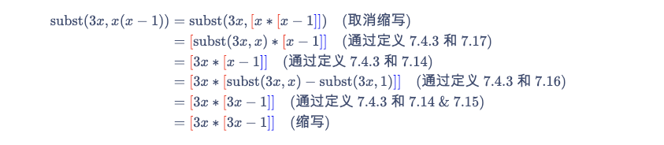
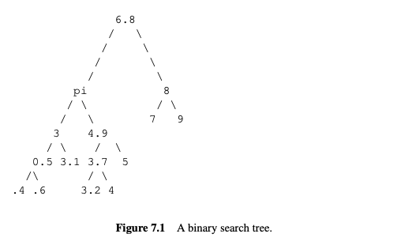

# 7 递归的数据类型

**递归数据类型** 在编程中起着核心作用, 归纳法也是如此.

递归数据类型由 *递归定义* 指定, 递归定义说明了如何从已有的数据元素构造新的数据元素. 对于每种递归数据类型, 都有该数据类型的属性或函数的递归定义. 更重要的是, 基于递归定义, 有一种 *结构归纳法* 来证明给定类型的所有数据都具有某种属性.

本章考察了一些递归数据类型的例子以及对它们进行递归定义的函数:

-   字符串,
-   “平衡”的括号字符串,
-   非负整数,
-   算术表达式,
-   完全信息的双人游戏.

## 7.1 递归定义和结构归纳法

我们将从使用字符字符串的例子来说明递归定义和证明开始. 通常, 我们会认为字符串是理所当然的, 但将它们视为递归数据类型是有益的. 特别是, 字符串是一个不错的第一个例子, 因为你将看到递归定义的东西很容易理解, 或者你已经知道了, 所以你可以专注于这些定义是如何工作的, 而不必弄清楚它们的含义.

递归数据类型的定义有两个部分:

-   *基本情况* 指定一些已知的数学元素在数据类型中, 和
-   *构造情况* 指定如何从已构造的元素或基本元素构造新的数据元素.

给定字符集 $A$ 上的字符串的定义遵循以下模式:

::: thm
#### 定义 7.1.1.

设 $A$ 为一个非空集合, 称为字母表, 其元素称为字符（也称为字母、符号或数字）. 字母表 $A$ 上的字符串的递归数据类型 $A^*$ 定义如下:

-   基本情况: 空字符串 $\lambda$ 在 $A^*$ 中.

-   构造情况: 如果 $a \in A$ 且 $s \in A^*$, 则对偶 $\langle a, s \rangle \in A^*$.
:::

所以 $\{0, 1\}^*$ 是二进制字符串.

通常将二进制字符串视为0和1的序列. 例如, 我们将长度为4的二进制字符串1011视为位的序列, 4元组(1, 0, 1, 1). 但根据递归定义 7.1.1, 该字符串将表示为嵌套对, 即

$$
\langle 1, \langle 0, \langle 1, \langle 1, \lambda \rangle \rangle \rangle \rangle. 
$$

这些嵌套对确实很繁琐, 也可能看起来很奇怪, 但它们实际上反映了诸如Scheme或Python等编程语言中字符列表的表示方式, 其中 $\langle a, s \rangle$ 对应于cons(a, s).

请注意, 我们并没有确切地说出空字符串是如何表示的. 这实际上并不重要, 只要我们能识别空字符串并且不与任何非空字符串混淆.

继续递归方法, 让我们定义字符串的长度.

::: thm
#### 定义 7.1.2.

字符串 $s$ 的长度 $|s|$ 基于定义 7.1.1 递归地定义如下:

-   基本情况: $|\lambda| ::= 0$.

-   构造情况: $|\langle a, s \rangle| ::= 1 + |s|$.
:::

这个长度的定义遵循一个标准模式: 递归数据类型上的函数可以使用与数据类型定义相同的情况递归定义. 具体来说, 要定义递归数据类型上的函数 $f$, 首先定义 $f$ 在数据类型定义的基本情况中的值, 然后定义 $f$ 在每个构造情况中的值作为 $f$ 在组件数据项上的值的函数.

让我们做另一个例子: 字符串 $s$ 和 $t$ 的连接 $s \cdot t$ 是由 $s$ 的字母后跟 $t$ 的字母组成的字符串. 这是一个完全清晰的连接的数学定义（除了如何处理空字符串的问题）, 并且在Scheme/Python列表的术语中, $s \cdot t$ 将是append(s, t). 这是一个连接的递归定义.

::: thm
**定义 7.1.3.** 字符串 $s$ 和 $t$ 的连接 $s \cdot t$ 在 $A^*$ 中基于定义 7.1.1 递归地定义如下:

-   基本情况: $\lambda \cdot t ::= t$.

-   构造情况: $\langle a, s \rangle \cdot t ::= \langle a, s \cdot t \rangle$.
:::

### 7.1.1 结构归纳法

结构归纳法是一种证明递归定义的数据类型的所有元素都具有某种属性的方法. 结构归纳法证明有两个部分对应于递归定义:

-   证明每个基本情况元素具有该属性.
-   证明当构造情况用于具有该属性的元素时, 每个构造情况元素也具有该属性.

例如, 在定义 7.1.3 的连接的基本情况下, 我们定义空字符串是“左单位”, 即 $\lambda \cdot s ::= s$. 我们还希望空字符串也是“右单位”, 即 $s \cdot \lambda = s$. 作为右单位不是定义 7.1.3 的一部分, 但我们可以通过结构归纳法轻松证明:

::: lem
#### 引理 7.1.4.

$$s \cdot \lambda = s $$

对于所有 $s \in A^*$.
:::

::: prf
证明通过基于定义 7.1.3 的连接的递归定义的结构归纳法进行. 归纳假设将是

$$
P(s) ::= [s \cdot \lambda = s]. 
$$

-   基本情况: （$s = \lambda$）

$$
\begin{align*}
\lambda \cdot \lambda &= \lambda \\
&= \lambda \quad (\lambda \text{是定义 7.1.3 的左单位})\\
&= s. 
\end{align*}
$$

-   构造情况: （$s = \langle a, t \rangle$）

$$
\begin{align*}
s \cdot \lambda &= (\langle a, t \rangle) \cdot \lambda\\
&= \langle a, t \cdot \lambda \rangle \quad (\text{定义 7.1.3 的构造情况})\\
&= \langle a, t \rangle \quad (\text{根据归纳假设 } P(t))\\
&= s. 
\end{align*}
$$

所以 $P(s)$ 成立. 这完成了构造情况的证明, 并且我们通过结构归纳法得出, 等式 $s \cdot \lambda = s$ 对于所有 $s \in A^*$ 成立.
:::

我们还可以通过结构归纳法验证递归函数的属性. 例如, 让我们验证两个字符串的连接的长度是它们长度的和:

::: lem
#### 引理 7.1.5.

$$|s \cdot t| = |s| + |t|$$

对于所有 $s, t \in A^*$.
:::

::: prf
通过基于 $s \in A^*$ 的定义的结构归纳法. 归纳假设是

$$P(s) ::= \forall t \in A^* . |s \cdot t| = |s| + |t|$$

-   基本情况: （$s = \lambda$）

$$
\begin{align*}
|s \cdot t| &= |\lambda \cdot t| \\
&= |t| \quad (\text{定义 7.1.3 的基本情况})\\
&= 0 + |t| \\
&= |s| + |t| \quad (\text{定义} \ |\lambda|). 
\end{align*}
$$

-   构造情况: （$s = \langle a, r \rangle$）

$$ 
\begin{align*}
|s \cdot t| &= |\langle a, r \rangle \cdot t| \\
&= |\langle a, r \cdot t \rangle| \quad (\text{定义 7.1.3 的构造情况})\\
&= 1 + |r \cdot t| \quad (\text{定义长度的构造情况})\\
&= 1 + (|r| + |t|) \quad (\text{归纳假设 } P(r))\\
&= (1 + |r|) + |t| \\
&=|\langle a, r \rangle| + |t| \quad (\text{定义长度的构造情况})\\
&= |s| + |t|. 
\end{align*} 
$$

这证明了 $P(s)$ 成立, 完成了构造情况的证明. 通过结构归纳法, 我们得出, 对于所有字符串 $s \in A^*$, 等式 $P(s)$ 成立.
:::

这些证明说明了一般原则:

::: thm
#### 结构归纳原理

设 $P$ 是递归定义的数据类型 $R$ 上的一个谓词. 如果

-   对于每个基本情况元素 $b \in R$, $P(b)$ 成立, 并且
-   对于所有二参数构造器 $c$,

$$
[P(r) \text{ 和 } P(s)] \Rightarrow P(c(r, s))
$$

对所有 $r, s \in R$ 成立, 并且对于所有具有其他参数数量的构造器同样成立,

那么 $P(r)$ 对所有 $r \in R$ 成立.
:::

## 7.2 配对括号的字符串

令 $\{ {{\color{blue}]}}, {{\color{red}[}} \}^*$ 为所有方括号字符串的集合. 例如, 以下两个字符串在 $\{ {{\color{blue}]}}, {{\color{red}[}} \}^*$ 中:

$$
{{\color{red}[}}{{\color{blue}]}}{{\color{blue}]}}{{\color{red}[}}{{\color{red}[}}{{\color{red}[}}{{\color{red}[}}{{\color{red}[}}{{\color{blue}]}}{{\color{blue}]}} \quad \text{和} \quad {{\color{red}[}}{{\color{red}[}}{{\color{red}[}}{{\color{blue}]}}{{\color{blue}]}}{{\color{red}[}}{{\color{blue}]}}{{\color{blue}]}}{{\color{red}[}}{{\color{blue}]}}
$$

字符串 $s \in \{ {{\color{blue}]}}, {{\color{red}[}} \}^*$ 被称为匹配字符串, 如果其括号以通常的方式“匹配”. 例如, 上面的左侧字符串不是匹配的, 因为其第二个右括号没有对应的左括号. 右侧的字符串是匹配的.

我们将研究几种不同的方法来定义和证明递归定义的集合和函数上的匹配字符串的性质. 这些性质非常简单明了, 你可能会想知道它们在计算机科学中是否具有特殊意义. 答案是“现在意义不大了”. 原因之一是计算机科学的一个重大成功, 如下方文本框所述.

### 表达式解析

在20世纪50年代和60年代计算机科学的早期发展过程中, 有效的编程语言编译器的创建是一个重要问题. 编译过程中一个关键方面是表达式解析. 一个重要的问题是如何将表达式如:

$$ x + y \ast z^2 \div y + 7 $$

插入括号以确定其计算顺序——应该是:

$$ [[x + y] \ast z^2 \div y] + 7 $$

还是:

$$ x + [y \ast z^2 \div [y + 7]] $$

还是:

$$ [x + [y \ast z^2]] \div [y + 7] $$

最终, 图灵奖（计算机科学的“诺贝尔奖”）授予了罗伯特·W·弗洛伊德, 部分原因是他发现了一些简单的插入括号的程序.

在70年代和80年代, 这种解析技术被打包成从表达式语法自动生成解析器的高级编译器. 这种解析自动化非常有效, 以至于该主题不再引起关注. 到90年代, 它在计算机科学课程中基本消失了.

匹配字符串可以很好地表述为递归数据类型:

::: thm
#### 定义 7.2.1.

递归定义字符串集合 RecMatch 如下:

-   基本情况: $\lambda \in \text{RecMatch}$.

-   构造情况: 如果 $s, t \in \text{RecMatch}$, 则 ${{\color{red}[}} s {{\color{blue}]}} t \in \text{RecMatch}$.
:::

这里 ${{\color{red}[}} s {{\color{blue}]}} t$ 指字符串的连接, 完整写作 ${{\color{red}[}}\cdot(s \cdot({{\color{blue}]}} \cdot t))$.

从现在起, 我们通常会省略“$\cdot$”.

使用此定义, $\lambda \in \text{RecMatch}$ 因为基本情况, 所以令 $s = t = \lambda$ 在构造情况下意味着:

$$
{{\color{red}[}} \lambda {{\color{blue}]}} \lambda = {{\color{red}[}} {{\color{blue}]}} \in \text{RecMatch}
$$

实际上,

$$
\begin{array}{rr}
{{{\color{red}[}}\lambda{{\color{blue}]}}{{\color{red}[}}{{\color{blue}]}}={{\color{red}[}}{{\color{blue}]}}\in \text { RecMatch }} & \text { (令 } s=\lambda, t={{\color{red}[}}{{\color{blue}]}} \text { ) } \\
{{{\color{red}[}}{{\color{red}[}}{{\color{blue}]}}{{\color{blue}]}} \lambda={{\color{red}[}}{{\color{red}[}}{{\color{blue}]}}{{\color{blue}]}} \in \text { RecMatch }} & \text { (令 } s={{\color{red}[}}{{\color{blue}]}}, t=\lambda \text { ) } \\
{{{\color{red}[}}{{\color{red}[}}{{\color{blue}]}}{{\color{blue}]}}{{\color{red}[}}{{\color{blue}]}} \in \text { RecMatch }} & \text { (令 } s={{\color{red}[}}{{\color{blue}]}}, t={{\color{red}[}}{{\color{blue}]}} \text { ) }
\end{array}
$$

很明显, 要使括号匹配, 左右括号的数量必须相等. 为了进一步练习, 让我们仔细证明这一点, 从递归定义开始, 首先定义字符串 $s$ 中字符 $c \in A$ 出现的次数 $\#_c(s)$ 的递归定义:

::: thm
#### 定义 7.2.2.

-   基本情况: $\#_c(\lambda) ::= 0$.

-   构造情况:

    $$
    \#_c(\langle a, s \rangle) ::= \begin{cases} 
    \#_c(s) & \text{如果 } a \ne c, \\
    1 + \#_c(s) & \text{如果 } a = c. 
    \end{cases}
    $$
:::

以下引理直接通过定义 7.2.2 的结构归纳法得到. 我们将证明留作练习（问题 7.9）:

::: lem
#### 引理 7.2.3.

$$
\#_c(s \cdot t) = \#_c(s) + \#_c(t)
$$

对所有 $s, t \in A^*$.
:::

::: lem
每个字符串在 RecMatch 中具有相等数量的左括号和右括号.
:::

::: prf
**证明:** 证明通过结构归纳法进行, 归纳假设为$P(s) ::= [ \#_{{{\color{red}[}}} (s) = \#_{{{\color{blue}]}}} (s) ]$.

-   基本情况: $P(\lambda)$ 成立, 因为

    $$
    \#_{{{\color{red}[}}} (\lambda) = 0 = \#_{{{\color{blue}]}}} (\lambda)
    $$

    根据定义 7.2.2 的基本情况.

-   构造情况: 根据结构归纳假设, 我们假设 $P(s)$ 和 $P(t)$ 并且必须证明 $P([ s ] t)$:

$$
\begin{align*}
\#_{{{\color{red}[}}} ({{\color{red}[}} s {{\color{blue}]}} t) &= \#_{{{\color{red}[}}} ({{\color{red}[}}) + \#_{{{\color{red}[}}} (s) + \#_{{{\color{red}[}}} ({{\color{blue}]}}) + \#_{{{\color{red}[}}} (t) \\
&= 1 + \#_{{{\color{red}[}}} (s) + 0 + \#_{{{\color{red}[}}} (t) \\
&= 1 + \#_{{{\color{red}[}}} (s) + 0 + \#_{{{\color{red}[}}} (t) \quad (\text{根据 } P(s) \text{ 和 } P(t))\\
&= 0 + \#_{{{\color{red}[}}} (s) + 1 + \#_{{{\color{red}[}}} (t) \\
&= \#_{{{\color{blue}]}}} ({{\color{red}[}}) + \#_{{{\color{red}[}}} (s) + \#_{{{\color{red}[}}} ({{\color{blue}]}}) + \#_{{{\color{blue}]}}} (t) \\
&= \#_{{{\color{blue}]}}} ({{\color{red}[}} s {{\color{blue}]}} t)
\end{align*}
$$

这完成了构造情况的证明. 我们通过结构归纳法得出 $P(s)$ 对所有 $s \in \text{RecMatch}$ 成立. ■
:::

::: warning
当数据类型的递归定义允许同一元素以多种方式构造时, 该定义被称为 *模棱两可* 的. 我们小心地选择了一个明确的 RecMatch 定义, 以确保基于其定义递归定义的函数总是定义良好的. 通常情况下, 在模棱两可的数据类型定义上递归定义函数将无法正常工作. 为了说明问题, 这里是匹配字符串的另一个定义.
:::

::: thm
#### 定义 7.2.4.

定义集合 AmbRecMatch $\subseteq \{{{\color{blue}]}},{{\color{red}[}} \}^*$ 递归如下:

-   基本情况: $\lambda \in \text{AmbRecMatch}$,

-   构造情况: 如果 $s, t \in \text{AmbRecMatch}$, 则字符串 ${{\color{red}[}} s {{\color{blue}]}}$ 和 $st$ 也在 $\text{AmbRecMatch}$ 中.
:::

很容易看出, AmbRecMatch 的定义只是另一种定义 RecMatch 的方式, 即 AmbRecMatch = RecMatch（见问题 7.19）. AmbRecMatch 的定义可以说更容易理解, 但我们没有使用它, 因为它是模棱两可的, 而 RecMatch 的更复杂的定义是明确的. 这就是为什么这很重要. 让我们根据 $s \in \text{AmbRecMatch}$ 的定义递归地定义构造匹配字符串 $s$ 的操作数 $f(s)$:

$$
f(\lambda) ::= 0,
$$

$$
f({{\color{red}[}} s {{\color{blue}]}}) ::= 1 + f(s),
$$

$$
f(st) ::= 1 + f(s) + f(t). 
$$

这个定义看起来没问题, 但事实并非如此: $f(\lambda)$ 最终有两个值, 因此:

$$
\begin{align*}
0 &= f(\lambda) \quad (\text{基本情况}) \\
  &= f(\lambda \cdot \lambda) \quad (\text{连接定义, 基本情况}) \\
  &= 1 + f(\lambda) + f(\lambda) \quad (\text{连接情况}) \\
  &= 1 + 0 + 0 = 1 \quad (\text{基本情况}). 
\end{align*}
$$

这绝对不是我们想要的情况！

## 7.3 非负整数上的递归函数

非负整数可以理解为一种递归数据类型.

::: thm
#### 定义 7.3.1.

集合 $\mathbb{N}$ 是一种递归定义的数据类型, 定义如下:

-   $0 \in \mathbb{N}$.

-   如果 $n \in \mathbb{N}$, 那么 $n + 1$ 的后继 $n + 1 \in \mathbb{N}$.
:::

这里的要点是要明确, 普通的归纳法只是基于递归定义 7.3.1 的结构归纳法的特例. 这也解释了为什么非负整数上的熟悉的递归函数定义是合理的.

### 7.3.1 一些标准的 $\mathbb{N}$ 上的递归函数

::: eg
#### 例 7.3.2.

阶乘函数. 这个函数通常写作“$n!$”. 在后面的章节中你会看到很多它的应用. 这里, 我们使用符号 $\text{fac}(n)$:

-   $\text{fac}(0) ::= 1$.

-   $\text{fac}(n + 1) ::= (n + 1) \cdot \text{fac}(n)$, 当 $n \geq 0$ 时.
:::

::: eg
#### 例 7.3.3.

求和符号. 令 “$S(n)$” 代表表达式 $\sum_{i=1}^{n} f(i)$. 我们可以用以下规则递归地定义 $S(n)$:

-   $S(0) ::= 0$.

-   $S(n + 1) ::= f(n + 1) + S(n)$, 当 $n \geq 0$ 时.
:::

### 7.3.2 定义不良的函数

在递归定义函数时, 还需要注意一些错误. 主要问题出现在递归定义不遵循底层数据类型的递归定义时. 下面是一些看起来像非负整数上函数的好定义, 但实际上并不是.

$$
f_1(n) ::= 2 + f_1(n - 1). 
$$

这个“定义”没有基本情况. 如果某个函数 $f_1$ 满足 (7.2), 那么在 $f_1$ 的值上加一个常数得到的函数也满足 (7.2). 因此, 方程 (7.2) 并不能唯一地定义 $f_1$.

$$
f_2(n) ::= \begin{cases} 
0, & \text{如果 } n = 0, \\
f_2(n + 1), & \text{否则}. 
\end{cases}
$$

这个“定义”有一个基本情况, 但仍然不能唯一确定 $f_2$. 任何在 $0$ 处为 $0$ 且在其他地方为常数的函数都满足这个规范, 因此 (7.3) 也没有唯一地定义任何东西.

在典型的编程语言中, $f_2(1)$ 的求值将从递归调用 $f_2(2)$ 开始, 这将导致递归调用 $f_2(3)$, ..., 递归调用不断继续, 没有结束. 这种“操作”方法将 (7.3) 解释为定义一个在 $0$ 处定义的部分函数 $f_2$.

$$
f_3(n) ::= \begin{cases} 
0, & \text{如果 } n 可以被2整除, \\
1, & \text{如果 } n 可以被3整除, \\
2, & \text{否则}. 
\end{cases}
$$

这个“定义”是不一致的: 它要求 $f_3(6) = 0$ 和 $f_3(6) = 1$, 所以 (7.4) 并没有定义任何东西.

数学家们对这个函数规范已经思考了一段时间, 这就是所谓的考拉兹猜想:

$$
f_4(n) ::= \begin{cases} 
1, & \text{如果 } n \leq 1, \\
f_4(n/2), & \text{如果 } n > 1 \text{ 且 } n \text{ 为偶数}, \\
f_4(3n + 1), & \text{如果 } n \text{ 为奇数}. 
\end{cases}
$$

例如, $f_4(3) = 1$, 因为

$$
f_4(3) ::= f_4(10) ::= f_4(5) ::= f_4(16) ::= f_4(8) ::= f_4(4) ::= f_4(2) ::= f_4(1) ::= 1. 
$$

常数函数等于1将满足 (7.5), 但还不清楚是否有其他函数也满足. (7.5) 的第三种情况以 $n$ 的函数形式指定了 $f_4$, 因此无法通过 $\mathbb{N}$ 上的归纳法证明它. 已知满足 (7.5) 的任何 $f_4$ 对于所有 $n$ 直到超过 $10^{18}$ 都等于1.

最后一个例子是 Ackermann 函数, 这是一个增长极快的两个非负参数的函数. 它的逆函数相应地增长缓慢——比 $\log n$, $\log \log n$, $\log \log \log n$ 等等都要慢, 但确实会增长. 这种逆函数实际上出现在分析一种有用的、高效的过程时, 称为联合-查找算法. 该算法被推测为在其输入大小的线性步数内运行, 但结果是“线性”的慢增长系数几乎等于逆 Ackermann 函数. 这意味着实际上, 联合-查找是线性的, 因为对任何可能出现的输入, 其理论增长系数小于5.

Ackermann 函数可以递归定义为函数 $A$, 给出以下规则:

$$
A(m, n) = 2n \quad \text{如果 } m = 0 \text{ 或 } n \leq 1,
$$

$$
A(m, n) = A(m - 1, A(m, n - 1)) \quad \text{否则}. 
$$

这些规则是不同寻常的, 因为 $A(m, n)$ 的定义涉及对可能比 $m$ 和 $n$ 大得多的参数的评估. 上面 $f_2$ 的定义显示了如何在较小的参数值上定义函数值会很容易导致不终止的求值. Ackermann 函数的定义实际上是可以的, 但证明这一点需要一些巧妙的方法（见问题 7.25）.

## 7.4 算术表达式

表达式求值是编程语言的一个关键特性, 识别表达式作为递归数据类型是理解如何处理它们的关键.

为了说明这种方法, 我们将使用一个玩具示例: 只涉及一个变量 “$x$” 的算术表达式, 例如 $3x^2 + 2x + 1$. 我们将这种表达式的数据类型称为 Aexp. 它的定义如下:

### 定义 7.4.1

-   **基本情况**:
    -   变量 $x$ 在 Aexp 中.
    -   任何非负整数 $k$ 的阿拉伯数字 $k$ 在 Aexp 中.
-   **构造情况**: 如果 $e, f \in$ Aexp, 那么
    -   ${{\color{red}[}} e + f {{\color{blue}]}} \in$ Aexp. 表达式 ${{\color{red}[}} e + f {{\color{blue}]}}$ 被称为和. Aexp 的 $e$ 和 $f$ 被称为和的组成部分；它们也被称为加数.
    -   ${{\color{red}[}} e * f {{\color{blue}]}} \in$ Aexp. 表达式 ${{\color{red}[}} e * f {{\color{blue}]}}$ 被称为积. Aexp 的 $e$ 和 $f$ 被称为积的组成部分；它们也被称为乘数和被乘数.
    -   ${{\color{red}[}} - e {{\color{blue}]}} \in$ Aexp. 表达式 ${{\color{red}[}} - e {{\color{blue}]}}$ 被称为负数.

注意, Aexp 是完全括起来的, 并且不允许指数. 因此, 多项式表达式 $3x^2 + 2x + 1$ 的 Aexp 版本将正式写作:

$$
{{\color{red}[}} {{\color{red}[}} 3 * {{\color{red}[}} x * x {{\color{blue}]}} {{\color{blue}]}} + {{\color{red}[}} {{\color{red}[}} 2 * x {{\color{blue}]}} + 1 {{\color{blue}]}} {{\color{blue}]}} \tag{7.8}
$$

这些括号和 \* 符号使得例子变得复杂, 所以我们通常会使用更简单的表达式, 例如“$3x^2 + 2x + 1$”而不是(7.8). 但重要的是要认识到 $3x^2 + 2x + 1$ 不是 Aexp, 它是 Aexp 的缩写.

### 7.4.1 使用 Aexp 的求值和替换

#### 求值 Aexp

由于 Aexp 中唯一的变量是 $x$, 因此 Aexp 的值由 $x$ 的值决定. 例如, 如果 $x$ 的值为 3, 那么 $3x^2 + 2x + 1$ 的值为 34. 通常, 给定任何 Aexp $e$ 和变量 $x$ 的整数值 $n$, 我们可以求值 $e$ 以找到它的值 $\text{eval}(e, n)$. 指定这个求值过程是简单且有用的, 可以使用递归定义.

::: thm **定义 7.4.2.** 求值函数 $\text{eval} : \text{Aexp} \times \mathbb{Z} \to \mathbb{Z}$ 递归地定义在表达式 $e \in$ Aexp 上, 如下. 令 $n$ 为任意整数.

-   **基本情况**: $$
    \text{eval}(x, n) ::= n \quad \text{（变量 } x \text{ 的值为 } n) \tag{7.9}
    $$ $$
    \text{eval}(k, n) ::= k \quad \text{（数值 } k \text{ 的值为 } k \text{, 无论 } x \text{ 是什么)} \tag{7.10}
    $$

-   **构造情况**: $$
    \text{eval}({{\color{red}[}} e_1 + e_2 {{\color{blue}]}}, n) ::= \text{eval}(e_1, n) + \text{eval}(e_2, n) \tag{7.11}
    $$ $$
    \text{eval}({{\color{red}[}} e_1 * e_2 {{\color{blue}]}}, n) ::= \text{eval}(e_1, n) \cdot \text{eval}(e_2, n) \tag{7.12}
    $$ $$
    \text{eval}({{\color{red}[}} - e_1 {{\color{blue}]}}, n) ::= - \text{eval}(e_1, n) \tag{7.13}
    $$

例如, 下面是求值函数的递归定义如何求得 $3 + x^2$ 在 $x = 2$ 时的值:

$$
\begin{align*}
\text{eval}({{\color{red}[}} 3 + {{\color{red}[}} x * x {{\color{blue}]}} {{\color{blue}]}}, 2) &= \text{eval}(3, 2) + \text{eval}({{\color{red}[}} x * x {{\color{blue}]}}, 2) \quad (\text{通过定义 7.4.2.7.11}) \\
&= 3 + \text{eval}({{\color{red}[}} x * x {{\color{blue}]}}, 2) \quad (\text{通过定义 7.4.2.7.10}) \\
&= 3 + (\text{eval}(x, 2) \cdot \text{eval}(x, 2)) \quad (\text{通过定义 7.4.2.7.12}) \\
&= 3 + (2 \cdot 2) \quad (\text{通过定义 7.4.2.7.9}) \\
&= 3 + 4 = 7. 
\end{align*}
$$

#### 在 Aexp 中替换

变量的表达式替换是编译器和代数系统常用的标准操作. 例如, 在表达式 $x(x - 1)$ 中将 $3x$ 替换为 $x$ 的结果将是 $3x(3x - 1)$. 我们将使用一般符号 $\text{subst}(f, e)$ 来表示在 Aexp $e$ 中用 Aexp $f$ 替换每个 $x$. 所以我们刚才解释为

$$
\text{subst}(3x, x(x - 1)) = 3x(3x - 1). 
$$

这个替换函数有一个简单的递归定义.

::: def
#### 定义 7.4.3.

替换函数 $\text{subst}$ 从 Aexp $\times$ Aexp 到 Aexp 递归地定义在表达式 $e \in$ Aexp 上, 如下. 令 $f$ 为任意 Aexp.
:::

-   **基本情况**:

    $$
    \text{subst}(f, x) ::= f \quad \text{（将 } f \text{ 替换为变量 } x \text{ 就是给出 } f) \tag{7.14}
    $$

    $$
    \text{subst}(f, k) ::= k \quad \text{（替换到数字中什么也不做）} \tag{7.15}
    $$

-   **构造情况**:

    $$
    \text{subst}(f, {{\color{red}[}} e_1 + e_2 {{\color{blue}]}}) ::= {{\color{red}[}} \text{subst}(f, e_1) + \text{subst}(f, e_2) {{\color{blue}]}} \tag{7.16}
    $$

    $$
    \text{subst}(f, {{\color{red}[}} e_1 * e_2 {{\color{blue}]}}) ::= {{\color{red}[}} \text{subst}(f, e_1) * \text{subst}(f, e_2) {{\color{blue}]}} \tag{7.17}
    $$

    $$
    \text{subst}(f, {{\color{red}[}} - e_1 {{\color{blue}]}}) ::= {{\color{red}[}} - \text{subst}(f, e_1) {{\color{blue}]}} \tag{7.18}
    $$

这里是替换函数的递归定义如何找到在表达式 $x(x - 1)$ 中将 $3x$ 替换为 $x$ 的结果:

现在假设我们必须在 $x = 2$ 时找到 $\text{subst}(3x, x(x - 1))$ 的值. 有两种方法. 首先, 我们实际上可以做上面的替换得到 $3x(3x - 1)$, 然后我们可以求 $3x(3x - 1)$ 在 $x = 2$ 时的值, 即我们可以递归地计算 $\text{eval}(3x(3x - 1), 2)$ 以获得最终值 30. 这种方法用以下表达式描述:

$$
\text{eval}(\text{subst}(3x, x(x - 1)), 2) \tag{7.19}
$$

在编程术语中, 这称为使用替换模型进行求值. 用这种方法, 公式 $3x$ 在替换后出现两次, 因此计算其值的乘法 $3 \cdot 2$ 被执行了两次.

第二种方法称为使用环境模型进行求值. 在这里, 为了计算 (7.19) 的值, 我们在 $x = 2$ 时求 $3x$ 只需一次乘法得到值 6. 然后当 $x$ 有这个值 6 时, 我们求 $x(x - 1)$ 得到值 $6 \cdot 5 = 30$. 这种方法用以下表达式描述:

$$
\text{eval}(x(x - 1), \text{eval}(3x, 2)) \tag{7.20}
$$

环境模型仅计算一次 $3x$ 的值, 因此计算 (7.20) 所需的乘法比替换模型少.

这是一个很好的地方停下来并亲自完成这个例子（问题 7.26）.

(7.19) 和 (7.20) 的最终整数值相同并不奇怪. 替换模型和环境模型将始终生成相同的最终值. 我们可以通过直接遵循两种方法的定义的结构归纳法证明这一点. 更确切地说, 我们要证明的是:

::: thm
### 定理 7.4.4.

对于所有表达式 $e, f \in \text{Aexp}$ 和 $n \in \mathbb{Z}$,

$$
\text{eval}(\text{subst}(f, e), n) = \text{eval}(e, \text{eval}(f, n)).  \tag{7.21}
$$
:::

::: prf
证明通过对 $e$ 的结构归纳法进行.

-   **基本情况**:
    -   情况 [$x$]: 方程 (7.21) 的左侧通过定义 7.4.3 的替换函数中的基本情况等于 $\text{eval}(f, n)$；右侧也通过定义 7.4.2 的求值函数中的基本情况等于 $\text{eval}(f, n)$.
    -   情况 [$k$]: 方程 (7.21) 的左侧通过定义 7.4.3 和 7.4.2 的替换和求值函数的基本情况等于 $k$. 同样, 右侧也通过定义 7.4.2 的基本情况等于 $k$.
-   **构造情况**:
    -   情况 ${{\color{red}[}} e_1 + e_2 {{\color{blue}]}}$: 根据结构归纳假设 (7.21), 我们可以假设对于所有 $f \in \text{Aexp}$ 和 $n \in \mathbb{Z}$,

        $$
        \text{eval}(\text{subst}(f, e_i), n) = \text{eval}(e_i, \text{eval}(f, n)) \tag{7.22}
        $$ 对于 $i = 1, 2$. 我们要证明

        $$
        \text{eval}(\text{subst}(f, {{\color{red}[}} e_1 + e_2 {{\color{blue}]}}), n) = \text{eval}({{\color{red}[}} e_1 + e_2 {{\color{blue}]}}, \text{eval}(f, n)).  \tag{7.23}
        $$

        (7.23) 的左侧等于

        $$
        \text{eval}({{\color{red}[}} \text{subst}(f, e_1) + \text{subst}(f, e_2) {{\color{blue}]}}, n)
        $$ 根据定义 7.4.3.7.16 对和表达式的替换. 但这等于

        $$
        \text{eval}(\text{subst}(f, e_1), n) + \text{eval}(\text{subst}(f, e_2), n)
        $$ 根据定义 7.4.2.(7.11) 对和表达式的求值. 根据归纳假设 (7.22), 这又等于

        $$
        \text{eval}(e_1, \text{eval}(f, n)) + \text{eval}(e_2, \text{eval}(f, n)). 
        $$

        最后, 这个表达式等于 (7.23) 的右侧, 根据定义 7.4.2.(7.11) 对和表达式的求值. 这证明了这种情况下的 (7.23).

    -   情况 ${{\color{red}[}} e_1 * e_2 {{\color{blue}]}}$ 类似.

    -   情况 ${{\color{red}[}} - e_1 {{\color{blue}]}}$ 更简单.

这涵盖了所有构造情况, 因此通过结构归纳法完成了证明.
:::

## 7.5 游戏作为递归数据类型

国际象棋、跳棋、围棋和尼姆游戏是 *完美信息的双人游戏* 的例子. 这些是两名玩家（玩家1和玩家2）交替移动的游戏, "完美信息" 意味着游戏中任何时刻的情况对双方玩家是完全可见的. 例如, 在国际象棋中, 棋盘上的棋子位置完全决定了游戏的其余部分可以由每个玩家如何进行. 而大多数纸牌游戏不是完美信息的游戏, 因为双方玩家都看不到对方的手牌.

在本节中, 我们将研究完美信息的双人输赢游戏, WL-2PerGm. 我们将定义 WL-2PerGm 作为递归数据类型, 然后通过结构归纳法证明这些游戏的获胜策略的基本定理. 递归定义的思想是认识到游戏过程中任何时候的情况本身可以视为新游戏的开始. 对于尼姆游戏, 这一点最清晰.

尼姆游戏从几堆石头开始. 游戏中的一步包括从一个堆中移除一些正数的石头. 玩家1和玩家2轮流移动, 谁拿到最后一块石头谁就赢. 所以如果只有一堆石头, 第一个移动的玩家通过拿走整堆石头获胜. 在其他情况下, 如果还有两堆石头, 每堆石头数量相同, 则第二个移动的玩家可以通过模仿第一个玩家的策略来保证获胜. 例如, 这意味着如果第一个玩家从一个堆中移除三块石头, 第二个玩家则从另一个堆中移除三块石头. 在这一点上, 值得稍作思考, 为什么模仿策略保证了第二个玩家的胜利.

我们可以将尼姆游戏中的第一次移动视为简单地选择一个不同的有待游戏的石头堆游戏. 例如, 对于初始堆为 3、4 和 5 块石头的尼姆游戏, 第一次玩家可以从第一个堆中移除一到三块石头, 导致三种可能的石头堆:

$$
\langle 2, 4, 5 \rangle, \langle 1, 4, 5 \rangle, \langle 4, 5 \rangle. 
$$

类似地, 第一次玩家有五种可能的方法从最后一个堆中移除石头, 导致五种可能的石头堆:

$$
\langle 3, 4, 4 \rangle, \langle 3, 4, 3 \rangle, \langle 3, 4, 2 \rangle, \langle 3, 4, 1 \rangle, \langle 3, 4 \rangle. 
$$

因此, 尼姆 (3, 4, 5) 的所有性质都由第一次移动可能产生的 3 + 4 + 5 = 12 个尼姆游戏的集合捕捉.

有了这个想法, 我们现在给出正式定义.

::: def
#### 定义 7.5.1.

完美信息的双人输赢游戏类 WL-2PerGm(Win Lose 2 Person Game) 递归地定义如下:

-   基本情况: win 和 lose 是 WL-2PerGm.
-   构造情况: 如果 $G$ 是 WL-2PerGm 的非空集合, 那么 $G$ 是 WL-2PerGm 游戏. 每个游戏 $M \in G$ 被称为 $G$ 的可能第一次移动.
:::

一个 WL-2PerGm 游戏的一个玩法是一个移动序列, 以玩家1的胜利或失败告终, 或永远继续而没有结果. 更正式地:

::: def
#### 定义

一个 WL-2PerGm 游戏 $G$ 的玩法及其结果根据 WL-2PerGm 的定义递归地定义如下:

-   基本情况: （$G = \text{win}$）长度为一的序列 $\langle \text{win} \rangle$ 是 $G$ 的玩法. 其结果是胜利.
-   基本情况: （$G = \text{lose}$）长度为一的序列 $\langle \text{lose} \rangle$ 是 $G$ 的玩法. 其结果是失败.
-   构造情况: （$G$ 是 WL-2PerGm 的非空集合）. $G$ 的玩法是一个序列, 从 $G$ 开始, 后跟某个游戏 $M \in G$ 的玩法 $P_M$. 如果有结果, 则玩法的结果是 $P_M$ 的结果.
:::

某些游戏的基本规则确实允许永远进行下去的玩法. 例如, 一个玩家可能只是不断移动同一个棋子, 如果他的对手也这么做, 玩法可能永远持续下去. 但 WL-2PerGm 游戏的递归定义实际上排除了无限玩法的可能性.

::: lem
#### 引理 7.5.2.

WL-2PerGm 游戏 $G$ 的每个玩法都有结果.
:::

::: prf
我们通过结构归纳法证明引理 7.5.2, 使用引理作为归纳假设.

-   基本情况: （$G = \text{win}$）. 只有一个 $G$ 的玩法, 即长度为一的玩法 $\langle \text{win} \rangle$, 其结果是胜利.
-   基本情况: （$G = \text{lose}$）. 同样, 结果为失败.
-   构造情况: （$G$ 是 WL-2PerGm 的非空集合）. $G$ 的玩法根据定义包含 $G$ 后跟某个 $M \in G$ 的玩法 $P_M$. 根据结构归纳法, $P_M$ 必须是某个长度为 $n$ 的有限序列, 以某个结果结束. 因此, $G$ 的玩法是长度为 $n + 1$ 的序列, 以相同的结果结束. ■
:::

在跳棋、国际象棋、围棋和尼姆游戏中, 只有尼姆是真正的输赢游戏, 其他游戏可能以平局（和棋、僵局、持平）结束. 然而, 通过将这些游戏中的平局视为玩家1的失败, 关于输赢游戏的结果也适用于有平局的游戏.

### 7.5.1 游戏策略

玩家的策略是一个规则, 告诉玩家在轮到他们时该做哪个移动. 更准确地说, 策略 $s$ 是从游戏到游戏的函数, 具有 $s(G) \in G$ 的属性, 适用于所有游戏 $G$. 两名玩家的一对策略准确地决定了玩家选择的移动, 因此决定了游戏的唯一玩法, 取决于谁先移动.

关于游戏的一个关键问题是, 哪种策略能确保玩家获胜. 玩家1 想要一个结果保证为胜利的策略, 玩家2 想要一个结果保证为玩家1 失败的策略.

### 7.5.2 输赢游戏的基本定理

WL-2PerGm 游戏的基本定理指出, 一名玩家总有一个固定的“获胜”策略, 保证对抗任何可能的对手策略都能获胜.

考虑国际象棋, 这似乎令人惊讶. 认真对待国际象棋的玩家通常对他们的意图进行保密, 相信对手可以利用知道他们的策略. 他们担心的是对手可以针对他们选择的任何策略量身定制一个策略来击败它.

但基本定理说的是不同的. 在理论上, 在任何输赢平局游戏中, 如国际象棋或跳棋, 每个玩家都有一个策略, 即使对手知道他们的策略也能保证获胜或平局.

即:

-   一名玩家有获胜策略, 或
-   两名玩家都有策略, 保证他们至多得到平局.

虽然基本定理揭示了关于游戏的深刻事实, 但它有一个非常简单的结构归纳法证明.

::: thm
#### 定理 7.5.3. [输赢游戏的基本定理]

对于任何 WL-2PerGm 游戏 $G$, 一名玩家有获胜策略.
:::

::: prf
证明通过对 $G \in \text{WL-2PerGm}$ 的定义的结构归纳法进行. 归纳假设是其中一名玩家有获胜策略.

-   基本情况: （$G = \text{win}$ 或 $\text{lose}$）. 那么对于每个玩家只有一种可能的策略, 即不做任何事并以结果 $G$ 结束.

-   构造情况: （$G$ 是 WL-2PerGm 的非空集合）. 通过结构归纳法我们可以假设对于每个 $M \in G$, 一名玩家有获胜策略. 注意, 由于玩家交替移动, $G$ 中的第一个玩家在 $M$ 中成为第二个玩家.

    现在, 如果有一个移动 $M_0 \in G$, 其中第二个玩家在 (

M_0) 中有获胜策略, 那么 $G$ 中的第一个玩家有一个简单的获胜策略: 选择 $M_0$ 作为第一次移动, 然后跟随第二个玩家在 $M_0$ 中的获胜策略.

另一方面, 如果 $G$ 中没有 $M \in G$ 对第二个玩家有获胜策略, 那么我们可以通过归纳得出每个 $M \in G$ 对 $M$ 中的第一个玩家有获胜策略. 现在 $G$ 中的第二个玩家有一个简单的获胜策略, 即如果 $G$ 中的第一个玩家移动 $M$, 那么 $G$ 中的第二个玩家应该遵循 $M$ 中的第一个玩家的获胜策略.
:::

### 无限游戏

那么我们何时会遇到有无限次首次移动的游戏呢？假设我们玩一个有 $n$ 场国际象棋比赛的锦标赛, 对于某个正整数 $n$. 如果我们同意一个规则, 将 $n$ 场国际象棋比赛的回报组合成整个锦标赛的最终回报, 那么这个锦标赛将是一个 WL-2PerGm.

在 $n$ 场国际象棋比赛的任何阶段, 只有有限数量的可能移动, 但我们可以定义一个元国际象棋锦标赛, 其首次移动是选择任何正整数 $n$, 然后我们玩一个 $n$ 场比赛的锦标赛. 现在, 元国际象棋锦标赛有无限次首次移动.

当然, 只有元国际象棋锦标赛的第一次移动是无限的, 但随后我们可以设置一个由 $n$ 个元国际象棋锦标赛组成的锦标赛. 这将是一个具有 $n$ 次可能无限移动的游戏. 然后我们可以有一个元-元国际象棋锦标赛, 其第一次移动是选择有多少个元国际象棋锦标赛来玩. 这个元-元国际象棋锦标赛将有无限次无限移动. 然后我们可以继续到元-元-元国际象棋锦标赛……

虽然这些元游戏可能看起来很荒谬或奇怪, 但它们的怪异性并不能使基本定理失效: 在每个这样的游戏中, 其中一个玩家将有获胜策略.

注意, 虽然定理 7.5.3 保证了获胜策略, 但其证明没有说明哪个玩家有这个策略. 对于问题 4.7 的子集取走游戏和最熟悉的 2PerGm 游戏, 如国际象棋、围棋等, 没有人知道哪个玩家有获胜策略.

## 7.6 查找树

通过数据查找可能是所有计算中最常见的一种，查找树是一种支持高效查找的广泛使用的数据结构。

查找树的基本思想很简单。假设要查找的数据具有某种顺序关系——例如数值顺序或字母顺序——数据被布置成一种分支“树”结构，如图7.1所示。在这个例子中，每个分支点有两个分支，左分支的所有值小于分支点的值，右分支的所有值大于分支点的值。这使得在树中查找给定值变得很容易：从顶部分支点开始，将给定值与分支点的值进行比较。如果给定值 $g$ 小于分支点的值 $b$，则继续在左分支中查找；如果 $g$ 大于 $b$，则继续在右分支中查找；如果 $g = b$，则找到了给定值，查找成功。最后，如果没有更多的分支可以查找，则 $g$ 不在树中，查找失败。

例如，要在图7.1中的树中查找3.7，我们将3.7与顶部分支点的值6.8进行比较。由于3.7 \< 6.8，我们进入左分支并将3.7与新的顶部值 $\pi$ 进行比较。由于3.7 \> $\pi$，我们进入右分支，将3.7与4.9进行比较，再次进入左分支，最后到达3.7。查找成功。

以这种方式组织数据意味着您可以查找值而无需扫描数据集中的所有值。实际上，如果从顶部到底部路径的长度差异不大，那么具有最大长度 $n$ 的树将包含最多 $2^n$ 个项目。由于每次查找简单地沿着某条路径进行，这意味着查找值将比在所有数据中查找快得多。这就是查找树的一个巨大优势。

当然，也有可能树的路径长度不同。一个极端例子如图7.2所示，其中路径包含一半的值。对于这棵树，查找值的平均搜索需要搜索路径的一半长度，二叉树带来的时间节省消失了。

通过将查找树视为递归数据类型，我们将能够描述简单的递归过程来管理树，我们还将拥有一个强大的归纳证明方法来证明这些树和过程的性质。这将允许对那些从顶部到底部路径接近相同的树进行简洁的形式定义，并且随着数据通过添加和删除值而演变，精确定义维护此属性的过程。

虽然我们将最终得到一个优雅而高效的查找和插入算法，但本节的重点在于它对基本数据类型和函数的简单递归定义的说明。由于对数据的数学定义本身还没有被数学定义，因此有很多数学定义在这一节。定义完成后，我们可以使用递归数据的基本方法，即结构归纳法，来证明数据属性和过程的正确性。

## 7.6.1 二元分支

示例中的树要么是单个“叶子”没有分支，要么是二元（双向）分支到左和右。允许多于两个分支在某些应用中很重要，但二元分支最常见，足以说明所有重要思想。

有很多方法来表示树作为计算机数据结构或数学集合，但我们将采取一种抽象方法，使我们能够在很大程度上理解二叉树，而不必担心它们的表示方式。

我们通过假设我们有一些表示二元分支树的东西 $BBTr$ 开始。二元分支树的一个重要属性是是否为叶子。在任何表示中，必须有一种方法来测试这一点。所以必须有一个叶谓词 leaf? 来完成这项工作。也就是说，二元分支树 $T \in BBTr$ 是叶子当且仅当 leaf?(T) 为真。叶子集定义为：

$$
Leaves ::= \{ T \in BBTr \mid leaf?(T) \}
$$

非叶树应该是那些实际上有左和右分支的树。在任何树的表示中，必须有一种方法来选择这些分支，即必须有选择函数 left 和 right，它们生成非叶元素的左分支和右分支。

定义如下：

$$
\begin{aligned}
Branching ::= BBTr \text{—Leaves 并规定有全函数 } \\
left : Branching \rightarrow BBTr, \\
right : Branching \rightarrow BBTr.
\end{aligned}
$$

因此，定义中， $T$ 的左分支是树 left(T)，右分支是树 right(T)。

### 子树

在我们开始的示例查找树中，如果您从顶部开始并沿某些路径下行，您会到达一个子树，该子树也是查找树。任何这样的路径都可以由您选择的左分支和右分支的序列来描述。例如，在图7.1给出的树中，序列 (right, left, left) 描述了一个从顶部树 $T_{6.8}$ 开始，标签为6.8的长度为三的路径。选择器按从右到左的顺序应用，所以我们首先去到左 $T_{6.8}$，这是标记为 $\pi$ 的子树。然后我们将左分支带到子树 left $T_{\pi}$，这是标记为3.1的子树 $T_3$，然后再右分支到结束子树 right $T_3$，标记为3.1。

也就是说，由(7.25)给出的路径末端的子树是：

$$
right(left(left(T_{6.8}))) = T_{3.1}
$$

更一般地，令 $\vec{P}$ 为一有限选择函数序列，假设 $T \in BBTr$。在由 $\vec{P}$ 描述的路径末端的子树的符号为 $subtree_T(\vec{P})$。例如，我们刚刚看到

$$
subtree_{T_{6.8}}((right, left, left)) = T_{3.1}
$$

请注意，如果路径 $\vec{P}$ 试图在 $T$ 的叶子上继续，末端不会有任何子树。例如， $subtree_{T_{6.8}}((left, right))$ 未定义，因为 $T_{6.8}$ 的左分支为 $\pi$ 的叶子没有左分支。

有一个技术细节值得注意，人们谈论树时，通常指的是图7.1和7.2中显示的整个树结构。在本节中，这不是我们所说的“树”。相反，树只是一个根点，即顶部的“根”节点。根节点以下的其余节点本身就是树，称为该树的子树。

为了形式化这一点，我们将通过路径长度给出子树 $subtree_T(\vec{P})$ 的定义。我们将使用符号 $f \cdot \vec{P}$ 表示以 $f$ 开头的序列，然后是 $\vec{P}$ 的连续元素。例如，如果 $\vec{P}$ 是（7.25）中的长度为3的序列，则

$$
right \cdot \vec{P}
$$

是长度为4的序列：

$$
(right, right, left, left)
$$

同样，对于 $\vec{P} \cdot f$，例如

$$
\vec{P} \cdot right
$$

将是长度为4的序列：

$$
(right, left, left, right)
$$

#### 定义 7.6.1

树子树 $subtree_T(\vec{P}) \in BBTr$ 将通过路径长度的归纳定义：

*基本情况*

令 $\vec{P} = \lambda$，则

$$
subtree_T(\vec{P}) ::= T.
$$

*构造情况*

令 $\vec{P} = f \cdot \vec{Q}$。如果 $subtree_T(\vec{Q})$ 已定义并等于分支中的树，则

$$
subtree_T(\vec{P}) ::= f(subtree_T(\vec{Q})).
$$

否则 $subtree_T(\vec{P})$ 未定义。

令 $Subtrs(T)$ 为通过从 $T$ 开始的路径到达的所有树。更准确地说：

#### 定义 7.6.2

$$
Subtrs(T) ::= \{ S \in BBTr \mid S = subtree_T(\vec{P}) \text{ 对某些选择序列 } \vec{P} \}.
$$

实际的子树 $PropSubtrs(T)$ 是那些实际上在 $T$ 以下的子树：

$$
PropSubtrs(T) ::= \{ S \in BBTr \mid S = subtree_T(\vec{P}) \text{ 对某些选择序列 } \vec{P} \neq \lambda \}.
$$

因此我们有定义

$$
Subtrs(T) = PropSubtrs(T) \cup \{ T \}. \tag{7.26}
$$

有一些显而易见的关于路径和子树的事实，我们认为值得一提：

#### 推论 7.6.3

对于 $T \in Leaves$，

$$
PropSubtrs(T) = \emptyset.
$$

对于 $T \in Branching$，

$$
PropSubtrs(T) = Subtrs(left(T)) \cup Subtrs(right(T)).
$$

因此，

$$
Subtrs(T) = \{ T \} \cup Subtrs(left(T)) \cup Subtrs(right(T)).\tag{7.27}
$$

#### 推论 7.6.4

如果 $S \in PropSubtrs(T)$ 且 $R \in Subtrs(S)$，则 $R \in PropSubtrs(T)$。

推论7.6.4是由于如果 $\vec{P}$ 是从 $T$ 到子树 $S$ 的路径，并且 $\vec{Q}$ 是从 $S$ 到子树 $R$ 的路径，如图7.3所示，则串联 $\vec{Q} \cdot \vec{P}$ 是从 $T$ 到子树 $R$ 的路径。

### 7.6.2 二叉树

虽然我们称BBTr中的元素为二元分支“树”，但我们抽象处理BBTr允许一些奇怪的事情发生。其中一个怪事是，根本没有禁止“循环”树，它们是自身的适当子树。即使我们禁止循环树，仍然有无限树。例如，假设我们选择左(left) 和右(right) 分支的路径长度递增并定义 left(π) := 2n + 1 和 right(π) := 2n + 2。现在我们获得图7.4中指示的无限二叉树。

循环结构和无限树的问题是它们会有无限路径，你可能需要不断向下搜索而不结束。通过禁止无限路径，我们确保查找将结束，我们也停止了所有循环和无限的怪异。

路径导致子树是有限的，所以我们需要明确无限路径的定义。

#### 定义 7.6.5

如果对于每个有限后缀 $\vec{P}$，无限路径 $\vec{P} \in BBTr$ 是选择函数的无限序列，使得

$$
subtree_T(\vec{P}) \in Branching
$$

但是仍有一个问题。即使没有无限路径，BBTr中的树可能会意外共享子树。例如，可能有一棵树，其左子树和右子树是相同的。

#### 定义 7.6.6

如果有两个选择函数序列 $\vec{P}$ 和 $\vec{Q}$，使得 $subtree_T(\vec{P})$ 和 $subtree_T(\vec{Q})$ 都已定义，并且

$$
subtree_T(\vec{P}) = subtree_T(\vec{Q})
$$

则树 $T \in BBTr$ 共享子树。

共享子树在获得紧凑表示时非常有用，但它在从查找树中添加或删除值时严重复杂化。因此，我们将共享也禁止。这引导我们进入 FinTr，熟悉的查找树。

#### 定义 7.6.7

$$
FinTr ::= \{ T \in BBTr \mid T 没有无限路径且不共享子树 \}.
$$

#### 定义 7.6.8

递归树集 RecTr 定义如下。对于 $T \in BBTr$，

*基本情况*

$T \in Leaves$，则 $T \in RecTr$。

*构造情况*

$T \in Branching$。如果 left(T)、right(T) $\in RecTr$，并且这两个树没有任何公共子树，即

$$
Subtrs(left(T)) \cap Subtrs(right(T)) = \emptyset
$$

则 $T \in RecTr$。

#### 定义 7.6.9

树 $T \in BBTr$ 的大小是它的子树的数量：

$$
size(T) ::= \|Subtrs(T)\|.
$$

#### 推论 7.6.10

每棵递归树都有有限的大小。

证明.

证明通过在 RecTr 的定义上进行结构归纳。

**基本情况**

$T \in Leaves$，它的唯一子树是它自己，所以

$$
size(T) = 1 < \infty.
$$

**构造情况**

$T \in Branching$。在这种情况下，令 $L ::= left(T)$ 和 $R ::= right(T)$ 被定义。根据归纳假设，我们可以假设 $L$ 和 $R$ 的大小是有限的，因此由(7.27)，

$$
size(T) \leq 1 + size(L) + size(R)
$$

也是有限的。

#### 定理 7.6.11 (递归树的基本定理)

$$
FinTr = RecTr.
$$

我们首先证明

$$
RecTr \subseteq FinTr,
$$

即，递归树 $T$ 没有无限路径或共享子树。

证明.

证明通过在 RecTr 的定义上进行结构归纳。

**基本情况**

$T \in Leaves$。它没有无限路径或共享子树，因为它没有适当的子树。

**构造情况**

$T \in Branching$。在这种情况下，left(T) 和 right(T) 已定义并且在 RecTr 中。通过归纳假设，left(T) 和 right(T) 没有无限路径或共享子树。既然如此，left(T) 和 right(T) 没有任何公共子树，因此根据 RecTr 的定义，T 本身没有无限路径或共享子树。因此 left(T) 和 right(T) 不能都在 RecTr。

### 7.6.3 递归树的性质

通过树的递归定义，我们可以递归地定义树上的一些重要的基本函数。我们从递归定义大小开始：

#### 定义 7.6.12

我们通过对RecTr的定义进行归纳，定义函数recsize：RecTr → Z+。

基本情况

$T \in Leaves$。

$$
recsize(T) ::= 1.
$$

构造情况

$T \in Branching$。

$$
recsize(T) ::= 1 + recsize(left(T)) + recsize(right(T)).
$$

一个简单的结构归纳证明确认了recsize的定义是正确的：

#### 引理 7.6.13

对于所有 $T \in RecTr$，有

$$
recsize(T) = size(T). \tag{7.36}
$$

证明

证明是通过对RecTr的定义进行结构归纳。

基本情况

$T \in Leaves$。根据推论 7.6.3, Subtrs(T) = {T}，所以

$$
recsize(T) ::= 1 = \|Subtrs(T)\| = size(T).
$$

构造情况

$T \in Branching$。我们有归纳假设

$$
size(T) = recsize(f(T)), \quad \text{对于 } f \in \{left, right\}. \tag{7.33}
$$

我们从 (7.27) 得到

$$
Subtrs(T) = \{T\} \cup Subtrs(left(T)) \cup Subtrs(right(T)),
$$

对于 $T \in BBTr$。现在如果 $T \in RecTr$，那么这三个集合是彼此独立的，所以

$$
size(T) = 1 + size(L) + size(R). \tag{7.34}
$$

我们现在有

$$
size(T) = 1 + recsize(left(T)) + recsize(right(T)) \quad \text{(通过 (7.33) 和 (7.34))} \\
= recsize(T) \quad \text{(recsize 的定义)}.
$$

同样，递归树的深度是其最长路径的长度。形式定义为：

$$
depth(T) ::= \max\{|\vec{P}| \mid subtree_T(\vec{P}) \text{是叶子}\}. \tag{7.35}
$$

以下是递归定义：

#### 定义 7.6.14

基本情况

$T \in Leaves$。

$$
recdepth(T) ::= 0.
$$

构造情况

$T \in Branching$。

$$
recdepth(T) ::= 1 + \max\{recdepth(left(T)), recdepth(right(T))\}.
$$

同样，通过结构归纳（问题 7.44）直接得出：

#### 引理 7.6.15

$$
recdepth(T) = depth(T). \tag{7.36}
$$

### 7.6.4 深度与大小

在查找树中排列值为多次重复查找提供了一种有效的方法。在这种情况下，最长查找路径将是到达叶子的最长路径，即树的深度。所以首先要解决的问题是，我们如何确保查找的短路径与要查找的集合的大小相比较？简单的答案是，如果要查找的集合中有 $n$ 个值，那么某些查找将不可避免地进行 $\log_2 n$ 次值比较；此外，有一种方法可以排列这些值，以使得任何查找所需的时间不超过这个最小量。以下两个定理证实了这一点。

我们首先证明递归树的大小和深度之间的基本关系：

#### 定理 7.6.16

对于所有 $T \in RecTr$，有

$$
size(T) \leq 2^{depth(T)+1} - 1. \tag{7.37}
$$

理解并证明这个不等式的一种简单方法是：如果有不同长度的路径以叶子结束，那么会有一个较大的树具有相同的深度——只需在较短路径的叶子末端附加两个新叶子即可。所以深度为 $d$ 的最大树将是深度为 $d$ 的完全树，其所有路径都有深度 $d$。在这棵树中，有两条长度为一的路径，然后分支为四条长度为二的路径，继续直到 $2^d$ 条长度为 $d$ 的路径。所以

$$
size(T) = 2^0 + 2^1 + 2^2 + \cdots + 2^d = 2^{d+1} - 1.
$$

也可以通过结构归纳证明。结构归纳对于了解正在发生的事情几乎没有提供任何见解，并且涉及一些枯燥的指数操作。但它例行地进行，不需要巧妙思考，可以由一个证明检查器——人或计算机程序——无须了解树的内部信息来完成。

证明

证明定理 7.6.16 的证明足以证明recsize和recdepth。证明是通过对RecTr的定义进行结构归纳。

基本情况

$T \in Leaves$。

$$
recsize(T) ::= 1 = 2^{0+1} - 1 = 2^{recdepth(T)+1} - 1.
$$

构造情况

$T \in Branching$。根据定义

$$
recsize(T) = 1 + recsize(left(T)) + recsize(right(T)). \tag{7.38}
$$

设

$$
\begin{aligned}
d_l ::= recdepth(left(T)), \\
d_r ::= recdepth(right(T)).
\end{aligned}
$$

那么根据归纳假设，右边的

$$
\begin{aligned}
\leq 1 + (2^{d_l+1} - 1) + (2^{d_r+1} - 1) \\
\leq 1 + (2^{\max\{d_l, d_r\}+1} - 1) + (2^{\max\{d_l, d_r\}+1} - 1) \\
= 2 \cdot 2^{\max\{d_l, d_r\}+1} - 1 \\
= 2^{recdepth(T)} - 1 \\
= 2^{recdepth(T)+1} - 1.
\end{aligned}
$$

Taking $\log_2$ of both sides of the inequality (7.37) confirms that the length of searches has to be at least one less than the log of the size of the data set to be searched:

#### 推论 7.6.17

对于任何递归树 $T \in RecTr$，有

$$
depth(T) \geq \log_2(size(T)) - 1. \tag{7.39}
$$

另一方面，查找不需要比所查找值集合大小的对数更长。也就是说，定义一棵树为完全平衡的，当且仅当所有路径的长度最多相差一个时。

#### 定理 7.6.18

如果 $B \in RecTr$ 是完全平衡的，深度至少为1，则

$$
size(B) \geq 2^{depth(B)} + 1. \tag{7.40}
$$

证明

深度 $d \geq 1$ 的最小完全平衡树将是一棵深度为 $d-1$ 的完全树，加上两个深度为 $d$ 的叶子，因此其大小为 $(2^d - 1) + 2 = 2^d + 1$。

#### 推论 7.6.19

对于任何正整数 $n$，都有一个递归二叉树——即完全平衡的大小为 $n$ 的树——其深度最多为 $\log_2 n$.

### 7.6.5 AVL 树

随着值集通过插入或删除值演变，维护完全平衡的树可能需要更改所有子树的分支——这种努力会淹没通过短查找节省的时间。“两全其美”的方法是放松完全平衡的要求，同时仍然保持对数级查找长度。

在AVL树中，完全平衡的性质被放宽，以使得左右分支深度允许相差一个。

#### 定义 7.6.20

当且仅当对于所有非叶子子树 $S \in Subtrs(T)$，有

$$
|depth(left(S)) - depth(right(S))| \leq 1
$$

则树 $T \in RecTr$ 是一棵AVL树。

#### 引理 7.6.21

如果 $T$ 是AVL树，则

$$
size(T) \geq \phi^{depth(T)}, \tag{7.40}
$$

其中 $\phi$ 是“黄金分割比”

$$
\frac{1 + \sqrt{5}}{2} \geq 1.6.
$$

证明

我们通过对深度

$d$ 进行强归纳证明：

归纳假设

$$
P(d) ::= \left[T \in RecTr \text{ 且 } recdepth(T) = d\right] \implies size(T) \geq a^d,
$$

其中 $a \in \mathbb{R}$，我们将在证明过程中推导出 $a$。

基本情况

$d = 0$。在这种情况下，$T \in Leaves$，所以

$$
recsize(T) ::= 1 = a^0,
$$

从而证明 $P(0)$。

归纳步骤

假设 $T$ 是深度 $d + 1$ 的AVL树，设 $L$ 和 $R$ 为 $T$ 的左、右子树。则左、右子树之一的深度必须为 $d$，另一棵树的深度必须至少为 $d-1$。根据 AVL 树的定义。通过强归纳假设，$L$ 和 $R$ 的大小分别至少为 $a^d$ 和 $a^{d-1}$。

$$
recsize(T) = 1 + recsize(L) + recsize(R) > a^d + a^{d-1}.
$$

现在 $P(d+1)$ 将跟随提供

$$
a^d + a^{d-1} \geq a^{d+1},
$$

这意味着

$$
1 + a \geq a^2. \tag{7.41}
$$

使用求解 (7.41) 的二次公式，我们发现

$$
a = \frac{-(1) + \sqrt{(1)^2 - 4 \cdot 1 \cdot (-1)}}{2 \cdot 1} = \frac{1 + \sqrt{5}}{2} = \phi
$$

满足 (7.41)，完成证明。

Taking $\log_2$ of both sides of (7.40), we conclude

#### 推论 7.6.22

如果 $T$ 是 AVL 树，则

$$
depth(T) \leq \frac{\log_2(size(T))}{\log_2 \phi} \leq 1.44 \log_2(size(T)). \tag{7.42}
$$

换句话说，AVL树中的查找最多将花费最佳查找时间的 1.44 倍，并且仍然将比数据集的大小指数级小得多。

### 7.6.6 数值标签

我们在本节开头描述了查找树的基本思想，并用它来解释树的大小和深度之间的联系为何重要。现在我们将正式定义查找树作为递归数据类型。这将允许我们递归地定义查找函数并通过结构归纳验证其性质。

查找树的每个子树上都有一个数值标签。从抽象上讲，这意味着存在一个全函数

$$
num: BBTr \to \mathbb{R}.
$$

令min(T) 为 $T$ 中的最小标签，max(T) 同样为最大标签。更正式地，

#### 定义 7.6.23

$$
\begin{align}
nums(T) ::= \{num(S) \mid S \in Subtrs(T)\}, \tag{7.42} \\
min(T) ::= \min nums(T), \tag{7.43} \\
max(T) ::= \max nums(T). \tag{7.44}
\end{align}
$$

对于任何有限树 $T$，最小值和最大值将存在。

#### 定义 7.6.24

查找树 $T \in BBTr$ 递归定义如下：

基本情况

$T \in Leaves$。$T$ 是查找树。

构造情况

$T \in Branching$。如果 left(T) 和 right(T) 都是查找树，并且

$$
max(left(T)) < num(T) < min(right(T)),
$$

则 $T$ 是查找树。

由于查找树根据定义不能有具有相同标签的子树，因此没有共享子树。因此，每个查找树都是 RecTr 中的递归树。

本节开头解释的在查找树中查找一个数值的简单过程现在可以描述为递归函数 srch。对于任意查找树 $T$ 和数值 $r$，srch(T, r) 的值将是查找 $r$ 的路径，假设 $r$ 出现在 $T$ 中。否则，该值将是一个到叶子的路径，后跟fail。

##### 定义 7.6.25

函数

$$
srch: ((\text{查找树}) \times \mathbb{R}) \to (\{left, right\}^* \cup \{fail\} : \{left, right\}^*))
$$

定义如下：

如果 $r = num(T)$，则

$$
srch(T, r) ::= \lambda.
$$

如果 $r \neq num(T)$，则 srch(T, r) 递归定义如下：

基本情况

$T \in Leaves$。

$$
srch(T, r) ::= fail.
$$

构造情况

$T \in Branching$。

$$
srch(T, r) ::= 
\begin{cases} 
srch(left(T), r) \cdot left & \text{if } r < num(T), \\
srch(right(T), r) \cdot right & \text{if } r > num(T).
\end{cases}
$$

我们现在可以严格证明 srch过程总是给出正确答案。

#### 定理 7.6.26

如果 $r \in nums(T)$，则 srch(T, r) 是选择器的序列并且

$$
num(subtree_T(srch(T, r))) = r.
$$

否则，srch(T, r) 将是形式 fail \cdot $\vec{P}$ 的序列，某个序列 $\vec{P}$。

定理 7.6.26 可以通过对查找树的递归定义 7.6.24 进行直接结构归纳证明。我们将其留作练习。

### 7.6.7 插入AVL树

将值 $r$ 插入AVL树 $T$ 的过程可以通过AVL树定义递归定义，类似于查找过程。如果 $r$ 已经是 $T$ 中的值，则查找将发现这一点，插入过程不需要执行任何操作。如果 $r$ 不是 $T$ 中的值，则必须根据 $r$ 与 num(T) 的比较递归地插入到 $T$ 的某个分支中。更准确地说，假设 $A$ 和 $B$ 是 $T$ 的分支，即 $\{A, B\} = \{left(T), right(T)\}$，而 $A$ 是将插入 $r$ 的子树。将 $r$ 插入 $A$ 的结果将是新的AVL树 $S$，其标签与 $A$ 相同并带有 $r$。即

$$
nums(S) = \{r\} \cup nums(A).
$$

此外，$S$ 的深度最多大于 $A$ 的深度一个，并且不少于 $A$ 的深度。

现在令 $N$ 为与 $T$ 具有相同标签的新树，其中 $N$ 的一个分支等于 $S$，另一个分支 $N$ 等于 $B$ 如图 7.5 所示。这使得 $N$ 成为查找树，其分支是AVL树，其标签是 $T$ 的标签以及 $r$。现在如果 $S$ 的深度最多大于 $B$ 的深度一个，那么 $N$ 将是所需的AVL树。

唯一的问题是 $S$ 的深度可能大于 $B$ 的深度两个。这一修正是应用“旋转操作”来重新排列顶部两个子树以平衡深度。

要解释旋转，我们需要识别一些将重新排列的子树。令 $d$ 为 $B$ 的深度。我们知道 $depth(S) = d + 2$。这意味着 $S$ 有分支 $R, U$，其深度为 $d$ 或 $d+1$，其中至少有一个具有深度 $d+1$。令 $U$ 为深度最大的分支，如图 7.5 所示。

$$
depth(U) = d + 1
$$

为此，我们在图 7.6 中显示了对 $T$ 中 $S$ 和 $B$ 的旋转。

这里 $X \in RecTr$ 是“新”树——即 $X \notin Subtrs(N)$——具有与 $S$ 相同的标签，而 $Y$ 是具有与 $N$ 相同标签的新树。$X$

的大小为 $nums(X) = nums(N)$。此外，根据 $R$ 的深度是否为 $d$ 或 $d + 1$，$Y$ 的深度为 $d + 1$ 或 $d + 2$，这在 $U$ 的深度范围内，$X$ 的深度为 $d + 2$ 或 $d + 3$，这在 $T$ 的深度范围内。因此，$X$ 和 $Y$ 的子树深度根据 AVL 规则适当平衡。很容易检查 $X$ 也是查找树，这使得它成为AVL查找树。此外，$X$ 的子树与 $N$ 几乎相同。具体来说，

$$
Subtrs(X) = \{X, Y\} \cup (Subtrs(N) - \{N, S\}).
$$

当深度 $U$ = $d$ 时，还有另一种子树重新排列方式，我们将其作为练习（问题7.40）。因此，我们有：

#### 引理 7.6.27 (旋转)

存在一个函数

$$
rotate: ((AVL树) \times \mathbb{R} \times (AVL树)) \to (AVL树),
$$

使得如果 $B$ 和 $S$ 是 AVL 树，$r \in \mathbb{R}$，则

$$
nums(rotate(B, r, S)) = nums(B) \cup \{r\} \cup nums(S),
$$

$$
depth(S) \leq depth(rotate(B, r, S)) \leq depth(S) + 1,
$$

并且有两个大小为三的集合 $S_{new}, S_{old}$ 为 AVL 树，使得

$$
Subtrs(rotate(B, r, S)) = (Subtrs(B) \cup Subtrs(S)) \cup S_{new} - S_{old}.
$$

在定义插入函数时，允许叶子带有一个或两个值并具有两个遵循查找树标签规则的值，结果证明是至关重要的（这可以视为在叶子级别放松二元分支的抽象。因此，叶节点的“父”仅需要有一个合适的子树而不是两个）。叶子具有这个额外标签充当缓冲区，允许推迟全面重新标记。没有这样的缓冲，一个插入或删除操作可能会迫使重新标记每个子树（问题7.42）。

#### 定义 7.6.28

函数

$$
insert: ((AVL 树) \times \mathbb{R}) \to (AVL 树)
$$

定义如下：

如果 $r = num(T)$，或如果 $T \in Leaves$ 带有两个标签并且 $r = num(T)$，则

$$
insert(T, r) ::= T,
$$

否则 $insert(T, r)$ 根据查找树的递归定义 7.6.24 定义如下：

基本情况

$T \in Leaves$。

子情况

$T \in Leaves$ 带有一个标签。然后

$$
insert(T, r) \) 将是带有值集合 \(\{r, num(T)\}\) 的叶子。
$$

子情况

$T \in Leaves$ 带有两个标签。然后

$$
insert(T, r) 被定义为深度为 1 的查找树，其标签为三个值集合 \(\{r, num(T)\}\)。
$$

构造情况

$T \in Branching$。然后insert(T, r) 按如下情况定义。

子情况

$r > num(T)$。令 $S ::= insert(right(T), r)$ 和 $B ::= left(T)$。 让 $N$ 成为“新”树，即

$$
N \notin Subtrs(S) \cup Subtrs(B),
$$

被选中满足

$$
num(N) = num(T), \tag{7.45}
$$

$$
right(N) = S, \tag{7.46}
$$

$$
left(N) = B. \tag{7.47}
$$

（见图 7.5）

子情况：（depth(S) $\leq$ depth(B) + 1）

$$
insert(T, r) ::= N.
$$

子情况：（depth(S) = depth(B) + 2）

$$
insert(T, r) ::= rotate(B, r, S).
$$

子情况：（r \< num(T)）

与 $r > num(T)$ 的情况相同，左右互换。

下面是证明 $insert(T, r)$ 正确的正式定理。此外，$T$ 和 $insert(T, r)$ 的子树基本相同，除了最多三个大小为查找长度子树的子树，反映了插入时间与查找时间一样，比数据集大小指数级小得多的事实。

#### 定理 7.6.29

假设 $T$ 是一棵AVL树且 $r \in \mathbb{R}$。则 $insert(T, r)$ 是一棵AVL树，且

$$
nums(insert(T, r)) = \{r\} \cup nums(T),
$$

$$
depth(T) \leq depth(insert(T, r)) \leq depth(T) + 1,
$$

并且有两个大小为 $(3 \cdot 1.44 \log_2 size(T))$ 的集合 $S_{new}, S_{old}$ 为AVL树，使得

$$
Subtrs(insert(T)) = (Subtrs(T) \cup S_{new}) - S_{old}.
$$

相同的方法导致了从AVL树中删除一个值的过程（问题7.43）。

## 7.7 计算机科学中的归纳法

归纳法是一种强大且应用广泛的证明技术, 这就是为什么我们将整整两章都专门介绍它的原因. 强归纳法及其普通归纳法的特例适用于任何具有非负整数大小的事物——这包括非常多的事物, 包括所有逐步的计算过程.

结构归纳法则超越了数字计数, 提供了一种简单、自然的方法来证明关于递归数据类型和递归计算的内容.

在许多情况下, 可以为递归定义的数据定义一个非负整数大小, 例如字符串的长度或 Aexp 中的操作次数. 然后, 可以通过对其大小进行普通归纳法来证明数据的性质. 但是这种方法通常比结构归纳法产生更繁琐的证明.

事实上, 结构归纳法在理论上比普通归纳法更强大. 然而, 它仅在处理关于无限数据类型（例如无限树）的推理时才更强大, 因此这种更大的力量在实践中并不重要. 重要的是, 对于递归定义的数据类型, 结构归纳法是一种简单而自然的方法. 这使得它成为每个计算机科学家都应采用的技术.
