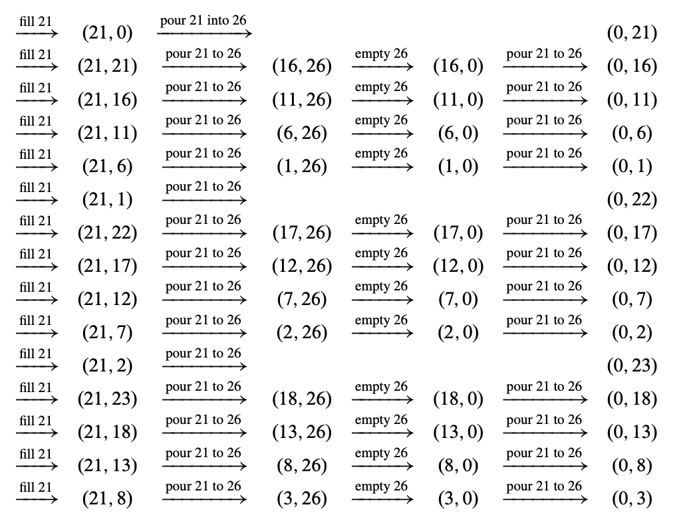
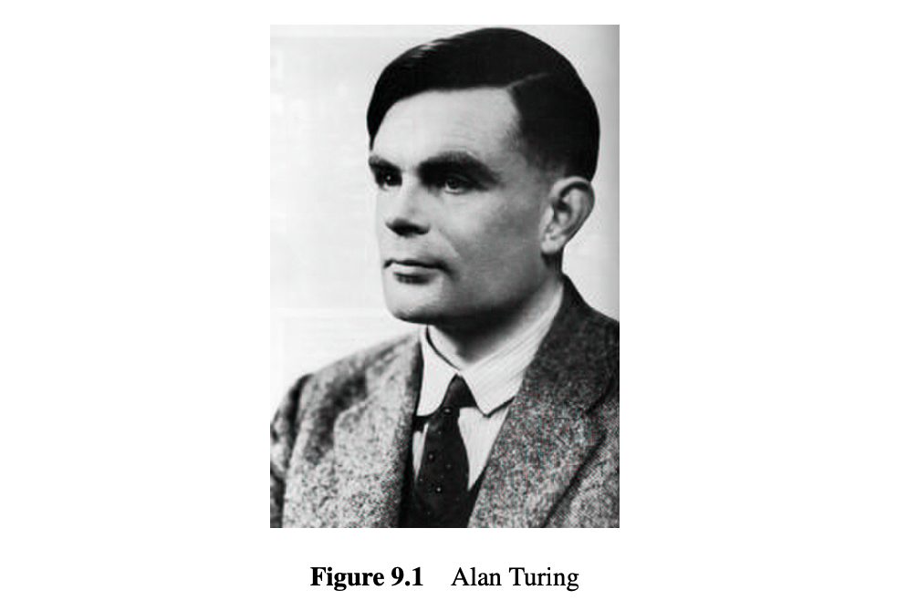

# 9 整除性

数论是研究整数的学问. 为什么有人会想研究整数可能并不明显. 首先, 有什么好研究的？有 $0$, 有 $1, 2, 3$, 等等, 还有, 哦对了, $-1, -2, \ldots$. 哪一个你不理解呢？它有什么实际价值呢？

数学家 G. H. Hardy 对其非实用性感到高兴. 他写道:

> [数论学者] 也许有理由为此感到高兴, 因为至少有一门科学, 其本身与普通人类活动的距离应该使其保持温和和纯洁.

Hardy 尤其担心数论被用于战争；他是一个和平主义者. 你可能会赞同他的观点, 但他错了: 数论是现代密码学的基础, 而密码学使得安全的在线通信成为可能. 当然, 在战争中安全通信至关重要——可怜的 Hardy 在坟墓里会感到无比痛苦. 数论同样也是在线商务的核心. 每当你从 Amazon 购买书籍, 使用证书访问网页, 或使用 PayPal 账户时, 你都在依赖数论算法.

数论还为我们提供了一个绝佳的环境来练习和应用我们在前几章中开发的证明技巧. 我们将研究最大公约数（gcd）的性质, 并用它们来证明整数唯一地分解为质数. 然后我们将介绍模运算, 并研究其足够多的性质来解释 RSA 公钥密码系统.

既然我们将专注于整数的性质, 我们将在本章中采用默认约定, 即变量在整数集 $\mathbb{Z}$ 上取值.

## 9.1 可整除性

数论的本质一旦我们考虑到除法关系就会显现出来.

::: def
#### 定义 9.1.1

$$
a \mid b
$$

当且仅当存在整数 $k$ 使得

$$
ak = b
$$
:::

上述符号关系频繁出现, 因此有许多同义词:

-   $a \mid b$,
-   $a$ 整除 $b$,
-   $a$ 是 $b$ 的因数,
-   $b$ 可以被 $a$ 整除,
-   $b$ 是 $a$ 的倍数.

从定义 9.1.1 中立刻推导出的结论是对于所有的 $n$

$$
n \mid 0, \quad n \mid n, \quad \text{and} \quad \pm 1 \mid n
$$

此外,

$$
0 \mid n \implies n = 0.
$$

除法看起来很简单, 但让我们利用这个定义来进行一些演算. 毕达哥拉斯学派, 一个古老的数学神秘教派, 认为一个数是完美的, 如果它等于其正整数因子之和, 不包括其自身. 例如, $6 = 1 + 2 + 3$ 和 $28 = 1 + 2 + 4 + 7 + 14$ 是完美数. 另一方面, $10$ 不是完美数, 因为 $1 + 2 + 5 = 8$, 而 $12$ 也不是完美数, 因为 $1 + 2 + 3 + 4 + 6 = 16$. 欧几里得在大约公元前 300 年（问题 9.2）描述了所有的偶完美数. 但是否存在奇完美数？两千多年过去了, 我们仍然不知道！大约 $10^{300}$ 以内的所有数都已被排除, 但没有人证明不存在一个奇完美数等待被发现.

所以, 虽然我们才讨论了半页内容, 但已经超越了人类知识的边界. 这是很典型的情况；数论充满了容易提出但难以回答的问题. 我们将在后面的章节中提到更多此类问题.

### 9.1.1 关于整除的事实

下面的引理收集了一些关于整除的基本事实.

::: lem
#### 引理 9.1.2

1.  如果 $a \mid b$ 且 $b \mid c$, 则 $a \mid c$.
2.  如果 $a \mid b$ 且 $a \mid c$, 则 $a \mid sb + tc$ 对于所有 $s$ 和 $t$ 成立.
3.  对于所有 $c \neq 0$, $a \mid b$ 当且仅当 $ca \mid cb$.
:::

::: prf
这些事实都直接从定义 9.1.1 推导出来. 为了说明这一点, 我们将仅证明第2点:

假设 $a \mid b$, 则存在某个 $k_1 \in \mathbb{Z}$ 使得 $ak_1 = b$. 同样地, $ak_2 = c$, 因此

$$
sb + tc = s(k_1a) + t(k_2a) = (sk_1 + tk_2)a.
$$

因此 $sb + tc = k_3a$ 其中 $k_3 ::= (sk_1 + tk_2)$, 这意味着

$$
a \mid sb + tc.
$$
:::

一个形如 $sb + tc$ 的数称为 $b$ 和 $c$ 的整数线性组合, 或者, 既然在本章中我们只讨论整数, 称为线性组合. 因此引理 9.1.2.2 可以改写为

如果 $a$ 可整除 $b$ 和 $c$, 那么 $a$ 可整除 $b$ 和 $c$ 的每一个线性组合.

我们将充分利用线性组合, 所以让我们记录下线性组合的通用定义:

::: def
#### 定义 9.1.3

一个整数 $n$ 是数 $b_0, \ldots, b_k$ 的线性组合当且仅当

$$
n = s_0b_0 + s_1b_1 + \cdots + s_kb_k
$$

对于一些整数 $s_0, \ldots, s_k$.
:::

### 9.1.2 当整除失效时

正如你在小学所学的, 如果一个数不能整除另一个数, 你会得到一个“商”和一个“余数”. 更准确地说:

::: thm
#### 定理 9.1.4 （除法定理）

设 $n$ 和 $d$ 为整数且 $d \neq 0$. 则存在一对唯一的整数 $q$ 和 $r$, 使得

$$
n = q \cdot d + r \quad \text{且} \quad 0 \leq r < |d|.
$$
:::

数 $q$ 称为商, 数 $r$ 称为 $n$ 除以 $d$ 的余数. 我们用记号 $\text{qc}nt(n, d)$ 表示商, 用 $\text{rem}(n, d)$ 表示余数.

上面的绝对值记号 $|d|$ 你可能在初等微积分中已经熟悉, 但为了记录在案, 我们定义它.

::: def
#### 定义 9.1.5

对于任何实数 $r$, 绝对值 $|r|$ 或 $r$ 定义为:

$$
|r| ::= 
\begin{cases} 
r & \text{if } r \geq 0,\\
-r & \text{if } r < 0.
\end{cases}
$$
:::

因此, 根据定义, 余数 $\text{rem}(n, d)$ 是非负的, 无论 $n$ 和 $d$ 的符号如何. 例如, $\text{rem}(-11, 7) = 3$, 因为 $-11 = (-2) \cdot 7 + 3$.

编程语言中的“余数”操作可能会引起混淆. 例如, 在 Java, C 和 C++ 中, 表达式 $"32 \% 5"$ 会求值为 $\text{rem}(32, 5) = 2$. 但在其他语言中, $"32 \% -5"$ 或 $"-32 \% 5"$ 可能会涉及负数的余数. 不要被你熟悉的编程语言中的余数行为所误导, 坚持数学上的余数非负的约定.

除以 $d$ 的余数在定义上是从 0 到 $|d| - 1$ 的数. 这种整数区间经常出现, 因此我们为它们定义一个简单的记号. 对于 $k \leq n \in \mathbb{Z}$,

$$
(k..n) ::= \{i \mid k < i < n\},
$$

$$
(k..n] ::= (k, n) \cup \{n\},
$$

$$
[k..n) ::= {k} \cup (k, n)
$$

$$
[k..n] ::= \{k\} \cup (k, n) \cup \{n\} = \{i \mid k \leq i \leq n\}.
$$

### 9.1.3 《**虎胆龙威**》

《**虎胆龙威**3》只是个B级动作电影, 但我们认为它有一个内在的信息: 每个人都应该至少学一点数论. 在第6.2.3节中, 我们形式化了一个名为虎胆龙威水壶问题的状态机, 其包含3加仑和5加仑的壶.

在电影中, 虎胆龙威试图用3加仑和9加仑的壶解决倒水问题, 并且看它能不能凑出来某个特定的值. 那么, 一般情况下会发生什么呢？例如, 能不能从12加仑和18加仑的壶中得到4加仑, 能不能用899加仑和1147加仑的壶得到32加仑, 或用21加仑和26加仑的壶得到3加仑？

如果我们能够一次性解决所有这些愚蠢的水壶问题, 那就太好了. 这就是数论的用武之地.

#### 水壶不变量

假设我们有容量分别为 $a$ 和 $b$ 的水壶, 且 $b \geq a$. 让我们进行一些状态机操作的示例, 看看会发生什么, 假设 $b$ 水壶足够大:

$$
\begin{align*}
(0, 0) &\rightarrow (a, 0) \quad \text{填满第一个水壶} \\
&\rightarrow (0, a) \quad \text{倒入第二个水壶} \\
&\rightarrow (a, a) \quad \text{填满第一个水壶} \\
&\rightarrow (2a - b, b) \quad \text{倒入第二个水壶（假设 2a \geq b）} \\
&\rightarrow (2a - b, 0) \quad \text{倒空第二个水壶} \\
&\rightarrow (0, 2a - b) \quad \text{倒入第二个水壶} \\
&\rightarrow (a, 2a - b) \quad \text{填满第一个水壶} \\
&\rightarrow (3a - 2b, b) \quad \text{倒入第二个水壶（假设 3a \geq 2b）}
\end{align*}
$$

显而易见, 每一步中, 每个水壶中的水量都是 $a$ 和 $b$ 的线性组合. 通过对转换次数进行归纳, 这很容易证明:

::: lem
#### 引理 9.1.6（水壶问题）

在第6.2.3节的虎胆龙威状态机中, 容量为 $a$ 和 $b$ 的水壶, 每个水壶中的水量始终是 $a$ 和 $b$ 的线性组合.
:::

::: prf
归纳假设 $P(n)$ 是在 $n$ 次转换后, 每个水壶中的水量是 $a$ 和 $b$ 的线性组合.

基例（$n = 0$）: $P(0)$ 是正确的, 因为两个水壶最初都是空的, 且 $0 \cdot a + 0 \cdot b = 0$.

归纳步: 假设状态机在 $n$ 步后处于状态 $(x, y)$, 即小水壶含有 $x$ 加仑, 大水壶含有 $y$ 加仑. 有两种情况:

-   如果我们从喷泉中填满一个水壶或将一个水壶倒入喷泉中, 那么该水壶为空或已满. 另一水壶中的水量仍然是 $a$ 和 $b$ 的线性组合. 因此 $P(n + 1)$ 成立.
-   否则, 我们将水从一个水壶倒入另一个水壶, 直到一个水壶空了或另一个水壶满了. 根据我们的假设, 在开始倒水之前, 每个水壶中的水量 $x$ 和 $y$ 是 $a$ 和 $b$ 的线性组合. 倒水之后, 一个水壶要么空了（含有 0 加仑）, 要么满了（含有 $a$ 或 $b$ 加仑）. 因此, 另一个水壶含有 $x + y$, $x + y - a$ 或 $x + y - b$ 加仑, 这些都是 $a$ 和 $b$ 的线性组合, 因为 $x$ 和 $y$ 是线性组合. 所以 $P(n + 1)$ 在这种情况下也成立.

由于 $P(n+1)$ 也满足分类讨论的情况, 我们可以使用归纳法成功证明.
:::

::: lem
#### 引理

尝试用 12 加仑和 18 加仑的水壶得到 4 加仑, 以及用 899 加仑和 1147 加仑的水壶得到 32 加仑时, 布鲁斯将会失败！
:::

::: prf
根据水壶引理 9.1.6, 使用 12 加仑和 18 加仑的水壶时, 任何水壶中的水量都是 12 和 18 的线性组合. 根据引理 9.1.2.2, 这总是 6 的倍数, 所以布鲁斯无法得到 4 加仑. 同样地, 使用 899 加仑和 1147 加仑的水壶时, 任何水壶中的水量都是 31 的倍数, 所以他也无法得到 32 加仑.
:::

但水壶引理并不能告诉我们完整的故事. 例如, 它没有回答用 21 加仑和 26 加仑的水壶得到 3 加仑的问题: 21 和 26 的唯一正因子是 1, 当然 1 能整除 3, 所以该引理既不排除也不确认能得到 3 加仑的可能性.

更大的问题是, 我们刚刚设法将一个相当容易理解的关于水壶的问题重新描述成一个关于线性组合的问题. 这似乎进展不大. 幸运的是, 线性组合与更为熟悉的最大公约数密切相关, 这将帮助我们解决一般的水壶问题.

## 9.2 最大公约数

$a$ 和 $b$ 的公约数是同时整除它们的数. $a$ 和 $b$ 的最大公约数记作 $\text{gcd}(a, b)$. 例如, $\text{gcd}(18, 24) = 6$. 只要 $a$ 和 $b$ 不同时为 0, 它们就有一个最大公约数. 最大公约数在推理 $a$ 和 $b$ 之间的关系以及一般整数之间的关系时非常有价值. 我们将在后续内容中大量使用最大公约数.

根据最大公约数的定义, 立刻可以得出以下结果:

$$
\text{gcd}(n, 1) = 1
$$

$$
\text{gcd}(n, n) = \text{gcd}(n, 0) = |n| \quad \text{对于} \quad n \neq 0
$$

其中最后一个等式来自于一切数都是 0 的约数这一事实.

### 9.2.1 欧几里得算法

首先需要弄清楚的是如何找到最大公约数. 一种被称为欧几里得算法的好方法已经存在了几千年. 它基于以下简单的观察.

::: lem
#### 引理 9.2.1

对于 $b \neq 0$,

$$
\text{gcd}(a, b) = \text{gcd}(b, \text{rem}(a, b))
$$
:::

::: prf
根据除法定理 9.1.4,

$$
a = qb + r \quad \tag{9.2}
$$

其中 $r = \text{rem}(a, b)$. 因此 $a$ 是 $b$ 和 $r$ 的线性组合, 这意味着根据引理 9.1.2.2, $b$ 和 $r$ 的任何约数都是 $a$ 的约数. 同样地, $r$ 是 $a$ 和 $b$ 的线性组合, 因此 $a$ 和 $b$ 的任何约数都是 $r$ 的约数. 这意味着 $a$ 和 $b$ 与 $b$ 和 $r$ 有相同的公约数, 因此它们有相同的最大公约数.
:::

引理 9.2.1 对于快速计算两个数的最大公约数非常有用. 例如, 我们可以通过反复应用它来计算 1147 和 899 的最大公约数:

$$
\begin{aligned}
&\text{gcd}(1147, 899) \\
&= \text{gcd}(899, \text{rem}(1147, 899)) \\
&= \text{gcd}(899, 248) \\
&= \text{gcd}(248, \text{rem}(899, 248)) \\
&= \text{gcd}(248, 155) \\
&= \text{gcd}(155, \text{rem}(248, 155)) \\
&= \text{gcd}(155, 93) \\
&= \text{gcd}(93, \text{rem}(155, 93)) \\
&= \text{gcd}(93, 62) \\
&= \text{gcd}(62, \text{rem}(93, 62)) \\
&= \text{gcd}(62, 31) \\
&= \text{gcd}(31, \text{rem}(62, 31)) \\
&= \text{gcd}(31, 0) \\
&= 31
\end{aligned}
$$

计算得知 $\gcd(1147, 899) = 31$, 因此我们确定用1147和899大小的水壶, 布鲁斯在试图得到32加仑水时会失败.

另一方面, 应用欧几里得算法到26和21, 得到 $\gcd(26, 21) = \gcd(21, 5) = \gcd(5, 1) = 1$； 因此我们不能用上述推理来排除布鲁斯将3加仑水倒入大水壶的可能性. 事实上, 由于这里的gcd是1, 布鲁斯将能够将任意数量的水倒入大水壶, 直到其容量. 要解释这一点, 我们需要更多的数论知识.

#### 欧几里得算法作为状态机

欧几里得算法可以很容易地形式化为状态机. 状态集合是N², 并且只有一个转移规则:

$$
(x, y) \rightarrow (y, \text{rem}(x, y)); \quad \text{对于 } y > 0.  \tag{9.3}
$$

根据引理9.2.1, 从一个状态到下一个状态, gcd保持不变. 这意味着谓词

$$
\text{gcd}(x, y) = \text{gcd}(a, b)
$$

在状态$(x, y)$上是一个保持的不变量. 当然, 这在开始状态$(a, b)$中是真实的. 所以根据不变量原则, 如果$y$变为0, 则不变量仍然成立, 因此

$$
x = \text{gcd}(x, 0) = \text{gcd}(a, b). 
$$

即$x$的值将是所需的gcd.

而且$x$和$y$很快会变为0. 要了解原因, 注意从$(x, y)$开始, 两次转移会导致第一个坐标为$\text{rem}(x, y)$的状态, 这最多是$x$的一半. 因为$x$起始时等于$a$, 并且每两步减半或更少, 因此在最多$2\log a$次转移后, 它将达到最小值——即$\text{gcd}(a, b)$. 之后, 算法最多再进行一次转移就会终止. 换句话说, 欧几里得算法最多在$1 + 2\log a$次转移后终止.

### 9.2.2 碎石机

我们将从以下关键事实中受益良多:

::: thm
#### 定理 9.2.2

$a$ 和 $b$ 的最大公约数是 $a$ 和 $b$ 的线性组合. 即:

$$
\text{gcd}(a, b) = sa + tb,
$$

其中 $s$ 和 $t$ 是一些整数.
:::

我们已经从引理 9.1.2.2 知道 $a$ 和 $b$ 的每个线性组合都可以被 $a$ 和 $b$ 的任何公因数整除, 所以它当然可以被这些公因数中最大的整除. 由于线性组合的任何常数倍也是线性组合, 定理 9.2.2 表明 gcd 的任何倍数都是线性组合, 从而得出:

::: cor
#### 推论 9.2.3

整数是 $a$ 和 $b$ 的线性组合当且仅当它是 $\text{gcd}(a, b)$ 的倍数.
:::

我们将通过解释如何找到 $s$ 和 $t$ 来直接证明定理 9.2.2. 这项任务由一个数学工具完成, 该工具可以追溯到公元六世纪的印度, 当时它被称为 kuttaka, 意思是“碎石机”. 今天, 碎石机更常被称为“扩展欧几里得算法”, 因为它与欧几里得算法非常接近.

例如, 按照欧几里得算法, 我们可以如下计算259和70的gcd:

$$
\text{gcd}(259, 70) = \text{gcd}(70, 49) = \text{gcd}(49, 21) = \text{gcd}(21, 7) = \text{gcd}(7, 0) = 7;
$$

其中, $\text{rem}(259, 70) = 49$, $\text{rem}(70, 49) = 21$, $\text{rem}(49, 21) = 7$, $\text{rem}(21, 7) = 0$.

碎石机也经过相同的步骤, 但在此过程中需要一些额外的记录: 当我们计算 $\text{gcd}(a, b)$ 时, 我们要记录如何将每个余数（在此例中是49、21和7）写成$a$和$b$的线性组合. 这是值得的, 因为我们的目标是写出最后一个非零余数.

即将最后一个非零余数, 即 gcd, 写成 $a$ 和 $b$ 的线性组合. 对于我们的例子, 以下是额外的记录过程:

$$
\begin{array}{ccrl}
x & y & (\operatorname{rem}(x, y)) & =x-q \cdot y \\
\hline 259 & 70 & 49 & =a-3 \cdot b \\
70 & 49 & 21 & =b-1 \cdot 49 \\
& & & =b-1 \cdot(a-3 \cdot b) \\
49 & 21 & 7 & =-1 \cdot a+4 \cdot b \\
& & & =(a-3 \cdot b)-2 \cdot(-1 \cdot a+4 \cdot b) \\
21 & 7 & & =3 \cdot a-11 \cdot b
\end{array}
$$

我们开始时初始化了两个变量, $x = a$ 和 $y = b$. 在上面的前两列中, 我们执行了欧几里得算法. 在每一步中, 我们计算 $\text{rem}(x, y)$, 其等于 $x - \left\lfloor \frac{x}{y} \right\rfloor \cdot y$. 然后, 在这个 $x$ 和 $y$ 的线性组合中, 我们用我们已经计算出的等价于 $a$ 和 $b$ 的线性组合来替换 $x$ 和 $y$. 简化后, 我们得到了一个等于 $\text{rem}(x, y)$ 的 $a$ 和 $b$ 的线性组合. 最终的解决方案被框起来.

这应该很清楚地表明了碎石机是如何工作的以及为何有效. 如果你有疑问, 可以参考问题 9.13, 其中将碎石机形式化为状态机, 然后使用欧几里得算法中使用的不变量的扩展进行验证.

由于碎石机只需要比欧几里得算法多一点计算量, 你可以使用这个算法非常快速地“粉碎”非常大的数字. 正如我们很快将看到的, 它的速度使得碎石机在密码学领域成为一个非常有用的工具.

现在我们可以根据最大公约数重新表述水壶引理 9.1.6:

::: cor
#### 推论 9.2.4

假设我们有容量为 $a$ 和 $b$ 的水壶. 那么每个水壶中的水量总是 $\text{gcd}(a, b)$ 的倍数.
:::

例如, 使用3加仑和6加仑的水壶无法得到4加仑, 因为4不是 $\text{gcd}(3, 6) = 3$ 的倍数.

### 9.2.3 解决所有水壶问题的一种方法

推论 9.2.3 表明, 3 可以写成 21 和 26 的线性组合, 因为 3 是 $\text{gcd}(21, 26) = 1$ 的倍数. 所以碎石机会给我们整数 $s$ 和 $t$, 使得

$$
3 = s \cdot 21 + t \cdot 26 \tag{9.5}
$$

系数 $s$ 可以是正数也可以是负数. 然而, 我们可以很容易地将这个线性组合转换为等价的线性组合

$$
3 = s' \cdot 21 + t' \cdot 26 \tag{9.6}
$$

其中系数 $s'$ 为正. 诀窍是注意到, 如果在方程 (9.5) 中增加 $s$ 的值（每次增加 26）并减少 $t$ 的值（每次减少 21）, 则表达式 $s \cdot 21 + t \cdot 26$ 的值总体上保持不变. 因此, 通过反复增加 $s$ 的值（每次增加 26）并减少 $t$ 的值（每次减少 21）, 我们得到线性组合 $s' \cdot 21 + t' \cdot 26 = 3$, 其中系数 $s'$ 为正. （当然 $t'$ 必须为负；否则, 该表达式的值将大于 3. ）

现在我们可以使用容量为 21 和 26 的水壶来得到 3 加仑的水: 我们只需重复以下步骤 $s'$ 次:

1\. 装满 21 加仑的水壶.

2\. 将 21 加仑水壶中的所有水倒入 26 加仑的水壶中. 如果 26 加仑水壶在任何时候变满了, 则将其倒空, 并继续将 21 加仑水壶中的水倒入 26 加仑水壶中.

在这个过程结束时, 我们必须正好倒空 26 加仑的水壶 $-t'$ 次. 原因如下: 我们从水源中取了 $s' \cdot 21$ 加仑的水, 并且倒出了若干倍的 26 加仑. 如果我们倒空的次数少于 $-t'$ 次, 那么根据 (9.6), 大水壶中将至少剩下 $3 + 26$ 加仑的水, 这超过了它的容量；如果我们倒空的次数更多, 大水壶中将最多剩下 $3 - 26$ 加仑的水, 这是不合理的. 但一旦我们正好倒空 26 加仑的水壶 $-t'$ 次, 方程 (9.6) 表明正好剩下 3 加仑的水.

显然, 我们甚至不需要知道系数 $s'$ 和 $t'$ 就可以使用这种策略！我们可以重复上述步骤, 直到得到 3 加仑的水, 因为这必然会发生. 当然, 我们必须跟踪两个水壶中的水量, 以便知道什么时候完成. 下面是使用这种方法的解决方案, 从空水壶开始, 即 $(0, 0)$:

同样的方法无论在水壶的容量上还是我们试图得到的水量上都适用！只需重复以下两个步骤, 直到得到所需的水量:

1.  装满较小的水壶.
2.  将较小水壶中的所有水倒入较大的水壶中. 如果较大的水壶在任何时候满了, 则将其倒空, 并继续将较小水壶中的水倒入较大的水壶中.

根据之前的推理, 这种方法最终会生成水壶容量最大公约数的每一个倍数——直到较大水壶的容量——所有我们可能得到的数量. 这完全不需要任何技巧！

所以现在我们有了完整的水壶问题解决方案:

::: thm
#### 定理 9.2.5

假设我们有容量为 $a$ 和 $b$ 的水壶. 对于任何 $c \in [0, a]$, 如果且仅如果 $c$ 是 $\text{gcd}(a, b)$ 的倍数, 那么可以在容量为 $a$ 的水壶中得到 $c$ 加仑的水.
:::

### 9.2.4 最大公约数的性质

了解一些基本的最大公约数性质是很有帮助的:

::: lem
#### 引理 9.2.6

a)  $\text{gcd}(ka, kb) = k \cdot \text{gcd}(a, b)$ 对所有 $k > 0$ 都成立.\
b)  $d \mid a$ 且 $d \mid b$ 当且仅当 $d \mid \text{gcd}(a, b)$.\
c)  如果 $\text{gcd}(a, b) = 1$ 且 $\text{gcd}(a, c) = 1$, 则 $\text{gcd}(a, bc) = 1$.\
d)  如果 $a \mid bc$ 且 $\text{gcd}(a, b) = 1$, 则 $a \mid c$.
:::

展示所有这些事实如何从定理 9.2.2（即 gcd 是线性组合）推导出来是一个很好的练习（问题 9.11）.

这些性质也是整数以唯一方式分解为素数的简单结果（定理 9.4.1）. 但我们需要这些事实来证明在第9.4节中的唯一分解性, 因此通过唯一分解性来证明它们会是循环论证.

## 9.3 素数之谜

在数论中, 一些最大的谜团和见解涉及到素数的性质:

::: def
### 定义 9.3.1

素数是指大于1且仅能被1和它自身整除的数. 除了0、1和-1以外的非素数称为合数.
:::

以下是三个著名的谜团:

#### 双素数猜想

存在无限多的素数 $p$, 使得 $p + 2$ 也是素数.

在1966年, 陈景润证明了存在无限多的素数 $p$, 使得 $p + 2$ 是至多两个素数的乘积. 因此, 这个猜想被认为几乎是正确的！

#### 因数分解的推测低效性

给定两个大素数的乘积 $n = pq$, 没有高效的程序能够恢复素数 $p$ 和 $q$. 也就是说, 没有多项式时间程序（参见3.5节）能够在以 $n$ 的二进制表示长度（而不是 $n$ 本身）的多项式范围内找到 $p$ 和 $q$. 二进制表示的长度至多是 $1 + \log_2 n$.

已知最好的算法是“数域筛法”, 其运行时间与以下表达式成正比:

$$
e^{1.9 (\ln n)^{1/3} (\ln \ln n)^{2/3}}. 
$$

这个数增长的速度比 $\log n$ 的任何多项式都要快, 当 $n$ 有300位数字或更多时是不可行的.

高效的因数分解在计算机科学中具有特别重要的意义, 我们将在本章后面详细解释.

#### 哥德巴赫猜想

我们已经多次提到哥德巴赫猜想1.1.6: 每个大于2的偶数都等于两个素数的和. 例如, 4 = 2 + 2, 6 = 3 + 3, 8 = 3 + 5, 等等.

在1939年, 施尼勒曼证明了每个偶数都可以写成不超过300,000个素数的和, 这是一个开始. 今天, 我们知道每个偶数最多可以写成6个素数的和.

素数在整数序列中出现得很不规律. 事实上, 它们的分布看起来几乎是随机的: $$
2, 3, 5, 7, 11, 13, 17, 19, 23, 29, 31, 37, 41, 43, \ldots
$$

关于素数的一个重要见解是, 它们在整数中的密度有一个精确的极限. 即, 设 $\pi(n)$ 表示不超过 $n$ 的素数的数量:

::: def
#### 定义 9.3.2

$$
\pi(n) = |\{p \in [2, n] \mid p \text{ 是素数}\}|
$$
:::

例如, $\pi(1) = 0$, $\pi(2) = 1$ 和 $\pi(10) = 4$, 因为2、3、5和7是小于或等于10的素数. $\pi$ 的增长是按照连续素数之间的不规则间隔不规则地增长的, 但它的总体增长率已知会平滑到与函数 $n/\ln n$ 的增长相同:

::: thm
#### 定理 9.3.3 （素数定理）

$$
\lim_{n \to \infty} \frac{\pi(n)}{n / \ln n} = 1
$$
:::

因此, 素数逐渐减少. 经验法则是, 在 $n$ 附近, 每 $\ln n$ 个整数中大约有1个素数.

素数定理由勒让德在1798年提出, 并在一个世纪后由德拉瓦莱普桑和阿达玛在1896年证明. 然而, 在高斯去世后发现, 他的一个笔记本中包含了相同的猜想, 他显然在1791年15岁时就已经提出了这个猜想. （你不得不同情所有那些与高斯同时代的“伟大”数学家, 他们不幸地遇到了高斯. ）

素数定理的证明超出了本文的范围, 但有一个相关结果的可管理证明（见问题9.22）, 该结果对于我们的应用是足够的:

::: thm
#### 定理 9.3.4 （切比雪夫的素数密度定理）

对于 $n > 1$, $$
\pi(n) > \frac{n}{3 \ln n}
$$
:::

## 9.4 算术基本定理

关于素数有一个重要的事实, 你可能已经知道: 每个正整数都有唯一的素数分解. 因此, 每个正整数都可以通过唯一的一种方式由素数组成. 这些古怪的素数是整数的构建块.

由于数的乘积的值在数字出现的顺序不同的情况下是相同的, 所以通常没有唯一的方法将一个数表示为素数的乘积. 例如, 有三种方法可以将12写成素数的乘积:

$$
12 = 2 \cdot 2 \cdot 3 = 2 \cdot 3 \cdot 2 = 3 \cdot 2 \cdot 2. 
$$

关于12的素数分解的独特之处在于, 任何等于12的素数乘积将有且仅有一个3和两个2. 这意味着如果我们按大小排序这些素数, 那么这个乘积确实是唯一的.

让我们更仔细地描述这一点. 当序列中的每个数字至少与它之后的数字一样大时, 这个序列就是弱递减的. 注意, 仅包含一个数字的序列以及不包含数字的序列（即空序列）按照这个定义都是弱递减的.

::: thm
#### 定理 9.4.1（算术基本定理）

每个正整数都是唯一的弱递减素数序列的乘积.
:::

例如, 75237393 是以下弱递减素数序列的乘积:

$$
23, 17, 17, 11, 7, 7, 7, 3;
$$

且没有其他弱递减素数序列可以生成75237393.

注意, 如果1被视为素数, 这个定理将是错误的. 例如, 15 可以写成 $5 \cdot 3$, 或者 $5 \cdot 3 \cdot 1$, 或者 $5 \cdot 3 \cdot 1 \cdot 1$, ...

在唯一分解性中有一种奇妙的感觉, 特别是考虑到我们已经提到的素数之谜. 即使你从小就知道这个事实, 也不要认为这是理所当然的. 事实上, 对于许多类似整数的数集, 唯一分解实际上是失效的, 例如形如 $n + m\sqrt{-5}$ 的复数（其中 $n, m \in \mathbb{Z}$, 见问题 9.25）.

算术基本定理也被称为唯一分解定理, 这是一个更具描述性且不那么矫饰的名字——但我们真的希望引起你对唯一分解性的重要性和非显而易见性的关注.

### 9.4.1 证明唯一分解性

算术基本定理不难证明, 但我们需要一些初步的事实.

::: lem
#### 引理 9.4.2

如果 $p$ 是素数且 $p \mid ab$, 则 $p \mid a$ 或 $p \mid b$.
:::

引理 9.4.2 可以直接从唯一分解性中得到: 乘积 $ab$ 中的素数恰好是 $a$ 和 $b$ 中的素数. 但这样证明引理是作弊的: 我们需要用这个引理来证明唯一分解性, 所以假设它成立将是循环论证. 相反, 我们将使用最大公约数和线性组合的性质来提供一个简单且非循环的证明方法.

::: prf
一种情况是如果 $\text{gcd}(a, p) = p$. 那么命题成立, 因为 $a$ 是 $p$ 的倍数.

否则, $\text{gcd}(a, p) \neq p$. 在这种情况下, $\text{gcd}(a, p)$ 必须是 1, 因为 1 和 $p$ 是 $p$ 的唯一正除数. 现在 $\text{gcd}(a, p)$ 是 $a$ 和 $p$ 的线性组合, 所以我们有 $1 = sa + tp$, 其中 $s, t$ 是一些整数. 那么 $b = s(ab) + (tb)p$, 也就是说, $b$ 是 $ab$ 和 $p$ 的线性组合. 由于 $p$ 同时整除 $ab$ 和 $p$, 它也整除它们的线性组合 $b$.
:::

通过常规的归纳论证可以扩展这一陈述:

::: lem
#### 引理 9.4.3

设 $p$ 是素数. 如果 $p \mid a_1a_2 \cdots a_n$, 则 $p$ 整除某个 $a_i$.
:::

现在我们准备证明算术基本定理.

::: prf
定理 2.3.1 使用良序原则表明每个正整数都可以表示为素数的乘积. 所以我们只需要证明这种表示是唯一的. 我们将使用良序原则来证明这一点.

证明通过反证法进行: 假设与命题相反, 存在可以以不止一种方式写成素数乘积的正整数. 根据良序原则, 存在具有这种性质的最小整数. 称这个整数为 $n$, 并且令

$$
n = p_1 \cdot p_2 \cdot \cdots \cdot p_j = q_1 \cdot q_2 \cdots q_k,
$$

其中两个乘积都是弱递减顺序, 并且 $p_1 \leq q_1$.

如果 $q_1 = p_1$, 那么 $n / q_1$ 也将是不同弱递减素数序列的乘积, 即

$$
p_2 \cdots p_j \quad 和 \quad q_2 \cdots q_k. 
$$

由于 $n / q_1 < n$, 这是不可能的, 所以我们得出结论 $p_1 < q_1$.

由于 $p_i$ 是弱递减的, 所以所有 $p_i$ 都小于 $q_1$. 但

$$
q_1 \mid n = p_1 \cdot p_2 \cdots p_j, 
$$

所以引理 9.4.3 表明 $q_1$ 整除某个 $p_i$, 这与 $q_1$ 大于所有 $p_i$ 的事实相矛盾.
:::

## 9.5 Alan Turing

图9.1中的人物是艾伦·图灵（Alan Turing）, 计算机科学史上最重要的人物. 几十年来, 他那迷人的生活故事被政府的秘密、社会的禁忌, 甚至他自己的欺瞒所掩盖.

在24岁时, 图灵撰写了一篇题为《论可计算数及其在判定问题上的应用》的论文. 论文的关键在于用数学术语来建模计算机的优雅方法. 这是一个突破, 因为它允许将数学工具用于计算问题. 例如, 凭借他的模型, 图灵立即证明了存在一些问题, 无论程序员多么聪明, 任何计算机都无法解决. 图灵的论文更加令人惊叹, 因为他在1936年写这篇论文, 而那时电子计算机还没有出现.

论文标题中的“Entscheidungsproblem”指的是大卫·希尔伯特（David Hilbert）在1900年提出的28个数学问题之一, 作为对20世纪数学家的挑战. 图灵在同一篇论文中解决了这个问题. 你或许听说过“丘奇-图灵论题”？也是在这篇论文中提出的. 所以图灵是一个才华横溢的人, 他提出了许多令人惊叹的想法. 但这次讲座涉及的是图灵的一个不那么惊人的想法. 它涉及编码, 涉及数论, 并且有点愚蠢.

让我们回到1937年秋天. 纳粹德国在阿道夫·希特勒的领导下重新武装, 世界大战看起来迫在眉睫, 艾伦·图灵也在思考数论的用处. 他预见到在即将到来的冲突中, 保守军事机密将至关重要, 并提出了一种使用数论来加密通信的方法. 这是一个跨时代的想法. 今天, 数论是众多公钥密码系统、数字签名方案、加密哈希函数和电子支付系统的基础. 此外, 军事资助机构是加密研究的最大投资者之一. 对不起, 哈代（Hardy）！

在设计出他的编码系统后不久, 图灵从公众视野中消失了, 半个世纪后, 世界才知道他去了哪里以及在那里做了什么. 我们稍后会回到图灵的生活；现在, 让我们来探讨图灵留下的代码. 由于他从未正式发表过这个想法, 细节尚不确定, 所以我们将考虑几种可能性.

### 9.5.1 图灵密码（版本1.0）

第一个挑战是将文本消息转换为整数, 以便我们可以对其执行数学操作. 此步骤并不打算使消息更难以阅读, 因此细节并不太重要. 这里有一种方法: 用两位数字替换消息中的每个字母（A = 01, B = 02, C = 03, 等等）, 并将所有数字串在一起形成一个巨大的数字. 例如, 消息“victory”可以这样翻译:

$$
\begin{aligned}
&v \quad &i \quad &c \quad &t \quad &o \quad &r \quad &y \\
&22 \quad &09 \quad &03 \quad &20 \quad &15 \quad &18 \quad &25
\end{aligned}
$$

图灵的密码要求消息是一个素数, 因此我们可能需要用一些更多的数字来填充结果以使其成为素数. 素数定理表明, 用相对较少的数字填充就可以. 比如, 在数字13后面加上数字“2209032015182513”即是素数.

以下是加密过程的工作原理. 在下面的描述中, $m$ 是未编码的消息（我们想要保密的）, $\hat{m}$ 是加密后的消息（纳粹可能截获）, $k$ 是密钥.

**预先准备**: 发送者和接收者同意一个密钥, 这是一个大素数 $k$.

**加密**: 发送者通过计算 $\hat{m} = m \cdot k$ 加密消息 $m$.

**解密**: 接收者通过计算 $\frac{\hat{m}}{k} = m$ 解密 $\hat{m}$.

例如, 假设密钥是素数 $k = 22801763489$, 消息 $m$ 是“victory”. 则加密消息为:

$$
\hat{m} = m \cdot k \\
= 2209032015182513 \cdot 22801763489 \\
= 50369825549820718594667857
$$

关于图灵密码, 有几个基本问题需要回答:

1.  **发送者和接收者如何确保** $m$ 和 $k$ 是素数, 如要求的那样？

    确定一个大数是否为素数或合数的问题已经研究了几个世纪, 在实践中使用的素数测试在图灵的时代就已知. 在过去的几十年里, 发现了非常快速的素数测试方法, 如下所述.

> **素数测试**
>
> 很容易看出, 整数 $n$ 是素数当且仅当它不能被从 $2$ 到 $\lfloor \sqrt{n} \rfloor$ 之间的任何数整除（参见问题 1.14）. 当然, 这种测试 $n$ 是否为素数的简单方法需要超过 $\sqrt{n}$ 步, 这是以 $n$ 的大小（以 $n$ 的十进制或二进制表示的数字位数来衡量）呈指数增长的步骤. 在1970年代初期之前, 没有已知的素数测试程序不会出现这样的问题.
>
> 1974年, 沃尔克·斯特拉森发明了一种简单、快速的概率素数测试. 斯特拉森的测试在应用于任何素数时给出正确答案, 但在非素数上有一定概率给出错误答案. 然而, 给定数字上给出错误答案的概率如此之小, 以至于依赖该答案是你能做的最好的选择.
>
> 即使如此, 错误答案的理论可能性也是令人困扰的——即使错误的概率远低于计算机硬件错误导致错误答案的概率.
>
> 最终在2002年, 在一篇以引用高斯强调素数测试的重要性和古老性的论文中, Manindra Agrawal、Neeraj Kayal 和 Nitin Saxena 提出了一个惊人的十三行描述的多项式时间素数测试.
>
> 这最终将素数测试大大低于显然需要的SAT和类似问题的指数努力. Agrawal 等人的测试的多项式上界为12, 随后研究将次数减少到5, 但这仍然太大而不切实际, 概率素数测试仍然是今天使用的方法. 可能次数上界还可以再减少一些, 但匹配已知的概率测试的速度仍然是一个令人生畏的挑战.

2.  **图灵密码是否安全？**

    纳粹只能看到加密消息 $\hat{m} = m \cdot k$, 因此恢复原始消息 $m$ 需要因式分解 $\hat{m}$. 尽管有无数次尝试, 但还没有发现真正高效的因式分解算法. 看来这是一个根本上困难的问题. 因此, 尽管某天可能会有突破, 但普遍接受的猜想是没有高效的方法来进行因式分解. 实际上, 图灵的密码将他的发现付诸实践, 即计算能力是有限的. 因此, 只要 $m$ 和 $k$ 足够大, 纳粹似乎就没有希望了！

这些听起来都很有前途, 但图灵的密码有一个重大缺陷.

### 9.5.2 破解图灵的密码（版本1.0）

让我们考虑当发送者使用图灵的密码和相同的密钥发送第二条消息时会发生什么. 这给了纳粹两个加密消息:

$$
\hat{m}_1 = m_1 \cdot k \quad \text{和} \quad \hat{m}_2 = m_2 \cdot k
$$

两个加密消息 $\hat{m}_1$ 和 $\hat{m}_2$ 的最大公约数是密钥 $k$. 正如我们所见, 两个数的最大公约数可以非常高效地计算. 所以在发送第二条消息后, 纳粹可以恢复密钥并读取每条消息！

像图灵这样才华横溢的数学家不太可能忽视这样一个明显的问题, 我们可以猜测他考虑了一个稍有不同的系统, 基于模运算的系统.

## 9.6 模运算

在他关于数论的名著《算术研究》的第一页, 高斯引入了“同余”的概念. 高斯是另一个总能时不时提出一个不错的想法的人, 所以让我们来看看这个. 高斯说, 如果 $n \mid (a - b)$, 那么 $a$ 同余于 $b$ 模 $n$. 这写作

$$
a \equiv b \pmod{n}. 
$$

例如:

$$
29 \equiv 15 \pmod{7}, 因为 7 \mid (29 - 15). 
$$

不允许模数 $n \leq 0$ 是没有用的, 所以我们将假设从现在起模数是正数.

同余与余数之间有紧密的联系:

::: lem
#### 引理 9.6.1 （余数）

$$
a \equiv b \pmod{n} \iff \text{rem}(a, n) = \text{rem}(b, n). 
$$
:::

::: prf
根据除法定理 9.1.4, 存在唯一的整数对 $q_1, r_1$ 和 $q_2, r_2$, 使得:

$$
a = q_1 n + r_1 \\
b = q_2 n + r_2, 
$$

其中 $r_1, r_2 \in [0, n)$. 从第一个等式减去第二个等式得:

$$
a - b = (q_1 - q_2)n + (r_1 - r_2), 
$$

其中 $r_1 - r_2$ 在区间 $(-n, n)$ 内. 现在 $a \equiv b \pmod{n}$ 当且仅当 $n$ 整除此等式的左侧. 这仅当且仅当 $r_1 - r_2$ 是 $n$ 的倍数时成立. 但是在 $(-n, n)$ 内的唯一 $n$ 的倍数是 0, 所以 $r_1 - r_2$ 必须事实上等于 0, 即当 $r_1 = \text{rem}(a, n) = r_2 = \text{rem}(b, n)$ 时.
:::

因此我们也可以看到

$$
29 \equiv 15 \pmod{7} 因为 \text{rem}(29, 7) = 1 = \text{rem}(15, 7). 
$$

注意, 即使“$\pmod{7}$”出现在末尾, $\equiv$ 符号与29的关联并不比与15的强. 这可能更清楚地写成 $29 \equiv_{7} 15$, 例如, 但带有模数的符号在末尾的表示法已牢固确立, 我们就这样吧.

余数引理 9.6.1 解释了为什么同余关系具有类似于等式关系的性质. 特别是, 以下性质立即成立:

::: lem
#### 引理 9.6.2

$$
\begin{aligned}
&a \equiv a \pmod{n} \quad &\text{（自反性）} \\
&a \equiv b \iff b \equiv a \pmod{n} \quad &\text{（对称性）} \\
&(a \equiv b \text{ 且 } b \equiv c) \implies a \equiv c \pmod{n} \quad &\text{（传递性）}
\end{aligned}
$$
:::

我们将经常使用余数引理 9.6.1 的另一个直接推论:

::: cor
#### 推论 9.6.3

$$
a \equiv \text{rem}(a, n) \pmod{n}
$$
:::

考虑同余模 $n$ 的另一种方法是, 它将整数划分为 $n$ 个集合, 使得同余的数都在同一个集合中. 例如, 假设我们以模3工作. 然后我们可以将整数划分为3个集合如下:

$$
\begin{aligned}
&\{ \ldots, -6, -3, 0, 3, 6, 9, \ldots \} \\
&\{ \ldots, -5, -2, 1, 4, 7, 10, \ldots \} \\
&\{ \ldots, -4, -1, 2, 5, 8, 11, \ldots \}
\end{aligned}
$$

根据它们除以3的余数是0、1或2. 这意味着当算术在模 $n$ 下进行时, 实际上只有 $n$ 种不同类型的数要担心, 因为只有 $n$ 个可能的余数. 从这个意义上说, 模运算是普通算术的简化.

关于同余的下一个最有用的事实是它们在加法和乘法下是保持的:

::: lem
#### 引理 9.6.4 （同余）

如果 $a \equiv b \pmod{n}$ 和 $c \equiv d \pmod{n}$, 则

$$
a + c \equiv b + d \pmod{n}, \\
ac \equiv bd \pmod{n}. 
$$
:::

::: prf
我们从 9.7 开始. 因为 $a \equiv b \pmod{n}$, 根据定义有

$$
n \mid (b - a) = (b + c) - (a + c), 
$$

所以

$$
a + c \equiv b + d \pmod{n}. 
$$

因为 $c \equiv d \pmod{n}$, 同样的推理导致

$$
b + c \equiv b + d \pmod{n}. 
$$

现在, 传递性（引理 9.6.2）给出

$$
a + c \equiv b + d \pmod{n}. 
$$

9.8 的证明几乎是相同的, 利用的事实是, 如果 $n \mid (b - a)$, 则它当然也整除 $(bc - ac)$.
:::

## 9.7 余数算术

同余引理 9.6.1 表明, 当且仅当两个数的余数相等时, 它们是同余的, 所以我们可以通过处理余数的算术来理解同余. 如果我们只想要某些数进行一系列加法、乘法、减法后的模 $n$ 的余数, 我们可以在每一步都取余数, 这样整个计算只涉及范围 $[0..n)$ 内的数.

### 余数算术的一般原则

要找到某些整数进行一系列加法和乘法运算后除以 $n$ 的余数: - 用每个整数操作数除以 $n$ 的余数替换它. - 通过立即用除以 $n$ 的余数替换范围外的任何结果, 将每次加法或乘法的结果保持在 $[0..n)$ 的范围内.

例如, 假设我们想找到

$$
\text{rem}((44427^{3456789} + 15555858^{5555})^{4036666666}, 36).  \tag{9.9}
$$

如果你考虑计算这些大幂次然后取余数, 这看起来非常令人畏惧. 例如, $44427^{3456789}$ 的十进制表示约有2000万位, 所以我们当然不想走这条路. 但记住整数指数指定了一系列乘法, 我们遵循一般原则并用乘数的余数替换它们. 由于 $\text{rem}(44427, 36) = 3$, $\text{rem}(15555858, 36) = 6$, $\text{rem}(403, 36) = 7$, 我们发现 (9.9) 等于

$$
\text{rem}((3^{3456789} + 6^{5555})7^{6666666}, 36).  \tag{9.10}
$$

这稍微好一些, 但 $3^{3456789}$ 的十进制表示约有一百万位, 所以我们仍然不想计算它. 但让我们看看3的前几次幂的余数:

$$
\text{rem}(3, 36) = 3 \\
\text{rem}(3^2, 36) = 9 \\
\text{rem}(3^3, 36) = 27 \\
\text{rem}(3^4, 36) = 9. 
$$

在仅仅两步之后我们得到了第二步的重复, $\text{rem}(3^2, 36)$, 这意味着从 $3^2$ 开始, 连续幂的余数序列每两步重复一次. 因此, 至少三个3的幂的乘积在模36时将具有与仅三个3的乘积相同的余数. 因此,

$$
\text{rem}(3^{3456789}, 36) = \text{rem}(3^3, 36) = 27. 
$$

注意, 将指数替换为其余数将是一个灾难性的错误. 一般原则适用于作为加法和乘法操作数的数字, 而指数是控制执行多少次乘法的数字. 注意这一点.

### 9.7.1 整数环$\mathbb Z_n$

现在是更准确地解释一般原则及其工作原理的时候了. 首先, 让我们引入符号 $+_n$表示加法后立即对 $n$ 取余数, 如一般原则所规定的; 同样, 乘法用 $\cdot n$ 表示:

$$
\begin{aligned}
i+{ }_n j & :=\operatorname{rem}(i+j, n), \\
i \cdot{ }_n j & :=\operatorname{rem}(i j, n)
\end{aligned}
$$

现在, 一般原则只是以下引理的重复应用.

::: lem
#### 引理 9.7.1

$$
\begin{align}
\text{rem}(i + j, n) = \text{rem}(i, n) +_n \text{rem}(j, n),  \tag{9.11} \\
\text{rem}(ij, n) = \text{rem}(i, n) \cdot_n \text{rem}(j, n).  \tag{9.12}
\end{align}
$$
:::

::: prf
根据推论 9.6.3, $i \equiv \text{rem}(i, n)$ 和 $j \equiv \text{rem}(j, n)$, 因此根据同余引理 9.6.4,

$$
i + j \equiv \text{rem}(i, n) + \text{rem}(j, n) \pmod{n}. 
$$

根据推论 9.6.3, 再次, 余数等式两边的余数相等, 这立即给出 (9.11). 类似的证明适用于 (9.12).
:::

在范围 $[0..n)$ 内的整数集合及运算 $+_n$ 和 $\cdot_n$ 被称为 $Z_n$, 即模 $n$ 的整数环. 作为引理 9.7.1 的结果, 熟悉的算术规则在 $Z_n$ 中成立, 例如:

$$
(i \cdot_n j) \cdot_n k = i \cdot_n (j \cdot_n k). 
$$

这些下标的 $n$ 在算术操作中确实使事情变得复杂, 因此我们将在一旁写“$(Z_n)$”来得到看起来更简洁的方程:

$$
(i \cdot j) \cdot k = i \cdot (j \cdot k) \quad (Z_n). 
$$

特别是, 以下所有等式在 $Z_n$ 中成立:

$$
\begin{aligned}
&(i \cdot j) \cdot k = i \cdot (j \cdot k) \quad &\text{（乘法的结合律）} \\
&(i + j) + k = i + (j + k) \quad &\text{（加法的结合律）} \\
&1 \cdot k = k \quad &\text{（乘法的恒等性）} \\
&0 + k = k \quad &\text{（加法的恒等性）} \\
&k + (-k) = 0 \quad &\text{（加法的逆元）} \\
&i + j = j + i \quad &\text{（加法的交换律）} \\
&i \cdot (j + k) = (i \cdot j) + (i \cdot k) \quad &\text{（分配律）} \\
&i \cdot j = j \cdot i \quad &\text{（乘法的交换律）}
\end{aligned}
$$

结合律表明, 省略乘积中的括号是安全的:

$$
k_1 \cdot k_2 \cdot \cdots \cdot k_m
$$

无论如何加括号, 在 $Z_n$ 中结果都是相同的.

总体主题是, 余数算术与普通算术非常相似. 但有一些例外情况需要我们进行探讨.

## 9.8 图灵的密码（版本2.0）

1940年, 法国在希特勒的军队面前沦陷, 英国独自对抗西欧的纳粹. 英国的抵抗依赖于从美国通过船队横跨北大西洋运来的稳定供应. 这些船队与德国“U型潜艇”玩猫捉老鼠的游戏, 潜艇在大西洋徘徊, 试图击沉补给船, 使英国在饥饿中屈服. 这场斗争的结果取决于信息的平衡: 德国人能否比盟军更好地定位船队, 还是相反？德国输了.

德国失败的一个关键原因直到1974年才公之于众: 德国的海军密码Enigma被波兰密码局破译, 并在1939年波兰被纳粹入侵前几周移交给英国. 在战争的大部分时间里, 盟军通过监听德国通信绕过德国潜艇. 英国政府直到1996年才解释Enigma是如何被破译的. 当这个故事最终被（由美国）公布时, 揭示了艾伦·图灵于1939年加入了布莱切利公园的秘密英国破译工作, 在那里他成为快速、大规模解密德国Enigma信息的方法的主要开发者. 图灵对Enigma的解密对盟军战胜希特勒做出了不可估量的贡献.

各国政府对密码学总是守口如瓶, 但战后半个世纪关于图灵在破译Enigma和拯救英国方面的作用的官方沉默可能与一些令人不安的事件有关——稍后再说. 让我们回到数论, 考虑对图灵密码的一种替代解释. 也许我们的基本思路是对的（将消息乘以密钥）, 但错误在于使用了常规算术而不是模运算. 也许这就是图灵的意思:

**预先准备**: 发送者和接收者同意一个大数 $n$, 这可以公开. （这将是我们所有算术运算的模数. ）如同版本1.0, 他们还同意一些素数 $k < n$ 将是秘密密钥.

**加密**: 如同版本1.0, 消息 $m$ 应该是另一个在 $[0..n)$ 中的素数. 发送者通过计算 $mk$ 生成加密消息, 但这次取模 $n$:

$$
\hat{m} := m \cdot k \pmod{n} \tag{9.13}
$$

**解密**: 解密步骤是一个问题. 我们可能希望通过将加密消息 $\hat{m}$ 除以密钥 $k$ 来解密消息. 问题在于 $\hat{m}$ 是 $mk$ 除以 $n$ 的余数. 因此, 将 $\hat{m}$ 除以 $k$ 可能甚至不会给我们一个整数！

这个解码难题可以通过更好地理解在模运算中何时可以除以 $k$ 来解决.

## 9.9 乘法逆元和消去

一个数 $x$ 的乘法逆元是另一个数 $x^{-1}$, 使得

$$
x^{-1} \cdot x = 1. 
$$

从现在起, 当我们说“逆元”时, 我们指的是乘法逆元（不是关系逆元）.

例如, 在有理数中, 1/3 当然是3的逆元, 因为

$$
\frac{1}{3} \cdot 3 = 1. 
$$

事实上, 除了0之外, 每个有理数 $n/m$ 都有一个逆元, 即 $m/n$. 另一方面, 在整数中, 只有1和-1有逆元. 在环 $Z_n$ 中, 情况变得有点复杂. 例如, 2 是 $Z_{15}$ 中 8 的乘法逆元, 因为

$$
2 \cdot 8 = 1 \quad (Z_{15}). 
$$

另一方面, 3 在 $Z_{15}$ 中没有乘法逆元. 我们可以通过反证法证明这一点: 假设存在一个 3 的逆元 $j$, 即

$$
1 = 3 \cdot j \quad (Z_{15}). 
$$

然后两边乘以 5 会直接导致矛盾

$$
\begin{align}
5 &= 5 \cdot (3 \cdot j) \\
&= (5 \cdot 3) \cdot j \\
&= 0 \cdot j = 0 \quad (Z_{15}). 
\end{align}
$$

因此不可能有这样的逆元 $j$.

因此, 一些数在模 15 下有逆元, 而其他数没有. 这可能让人感到有点不安, 但有一个简单的解释.

### 9.9.1 互素

没有公因数（素数或非素数）的整数称为互素. 这与没有大于1的公因数（素数或非素数）相同. 也等价于说 $\text{gcd}(a, b) = 1$.

例如, 8和15是互素的, 因为 $\text{gcd}(8, 15) = 1$. 另一方面, 3和15不是互素的, 因为 $\text{gcd}(3, 15) = 3 \neq 1$. 这解释了为什么8在 $Z_{15}$ 中有逆元, 而3没有.

::: lem
#### 引理 9.9.1

如果 $k \in [0..n)$ 与 $n$ 互素, 则 $k$ 在 $Z_n$ 中有逆元.
:::

::: prf
如果 $k$ 与 $n$ 互素, 则 $\text{gcd}(n, k) = 1$ 根据最大公约数的定义. 这意味着我们可以使用 9.2.2 节中的碎石机找到 $n$ 和 $k$ 的线性组合等于1:

$$
sn + tk = 1. 
$$

因此应用余数算术的一般原则（引理 9.7.1）, 我们得到

$$
\text{rem}(s, n) \cdot \text{rem}(n, n) + (\text{rem}(t, n) \cdot \text{rem}(k, n)) = 1 \quad (Z_n). 
$$

但 $\text{rem}(n, n) = 0$, 并且 $\text{rem}(k, n) = k$ 因为 $k \in [0..n)$, 因此我们得到

$$
\text{rem}(t, n) \cdot k = 1 \quad (Z_n). 
$$

因此, $\text{rem}(t, n)$ 是 $k$ 的乘法逆元.
:::

顺便说一句, 知道逆元存在时它们是唯一的也很好. 也就是说,

::: lem
#### 引理 9.9.2

如果 $i$ 和 $j$ 都是 $Z_n$ 中 $k$ 的逆元, 则 $i = j$.
:::

::: prf
$$
i = i \cdot 1 = i \cdot (k \cdot j) = (i \cdot k) \cdot j = 1 \cdot j = j \quad (Z_n). 
$$
:::

所以引理 9.9.1 的证明表明, 对于任何与 $n$ 互素的 $k$, $Z_n$ 中 $k$ 的逆元只是我们可以使用碎石机轻松找到的系数的余数.

在这里使用素数模数是有吸引力的, 因为与有理数和实数类似, 当 $p$ 是素数时, 每个非零数在 $Z_p$ 中都有逆元. 但模合数的算术运算实际上只是比模素数运算稍微麻烦一点——虽然你可能认为这就像医生说的, “这只会痛一点”, 在他把一根大针头扎进你的手臂之前.

## 9.9.2 消去

另一个实数的优点是可以消去公因数. 换句话说, 如果我们知道对于实数 $r, s, t$, 有 $tr = ts$, 那么只要 $t \neq 0$, 我们就可以消去 $t$, 得出 $r = s$. 一般来说, 在 $Z_n$ 中, 消去是不成立的. 例如,

$$
3 \cdot 10 = 3 \cdot 5 \quad (Z_{15}),  \quad (9.14)
$$

但消去3会导致荒谬的结论: 10等于5.

乘法项不能消去这一事实是 $Z_n$ 算术与普通整数算术不同的最显著方式.

::: def
#### 定义 9.9.3

如果 $k \cdot a = k \cdot b$ 意味着 $a = b$ $(Z_n)$, 则数 $k$ 在 $Z_n$ 中是可消去的, 对所有 $a, b \in [0..n)$ 成立.
:::

如果一个数与15是互素的, 则可以通过乘以它的逆元来消去. 因此, 消去适用于具有逆元的数:

::: lem
#### 引理 9.9.4

如果 $k$ 在 $Z_n$ 中有逆元, 那么它是可消去的.
:::

但3不是与15互素的, 这就是为什么它不可消去. 更一般地说, 如果 $k$ 不与 $n$ 互素, 那么我们可以像在 (9.14) 中展示的那样证明它在 $Z_n$ 中不可消去.

总结如下:

::: thm
#### 定理 9.9.5

对于 $k \in [0..n)$, 以下条件是等价的:

$$
\begin{align}
&\text{gcd}(k, n) = 1,  \\
&k \text{ 在 } Z_n \text{ 中有逆元, } \\
&k \text{ 在 } Z_n \text{ 中是可消去的. }
\end{align}
$$
:::

### 9.9.3 解密（版本2.0）

乘法逆元是图灵密码解密的关键. 具体来说, 我们可以通过将编码消息乘以密钥的 $Z_n$ 逆元来恢复原始消息:

$$
\hat{m} \cdot j = (m \cdot k) \cdot j = m \cdot (k \cdot j) = m \cdot 1 = m \quad (Z_n). 
$$

因此, 我们只需要找到秘密密钥 $k$ 的逆元, 这对于我们来说将很容易使用碎石机——前提是 $k$ 有逆元. 但 $k$ 是正数且小于模数 $n$, 因此确保 $k$ 与模数 $n$ 互素的一种简单方法是让 $n$ 为一个素数.

### 9.9.4 破解图灵密码（版本2.0）

德国人没有费心使用高度安全的Enigma系统来加密天气预报. 毕竟, 如果盟军知道冰岛南海岸有雨, 又如何呢？但令人惊讶的是, 这种做法在1941年的大西洋海战中为英国提供了一个关键的优势.

问题在于一些天气报告最初是通过Enigma从大西洋上的U型潜艇传输的. 因此, 英国获得了未加密的报告和使用Enigma加密的相同报告. 通过比较两者, 英国人能够确定德国人那天使用的密钥, 并可以读取所有其他Enigma编码的通信. 今天, 这将被称为已知明文攻击.

让我们看看已知明文攻击如何对图灵的密码起作用. 假设纳粹知道明文 $m$ 及其

$$
\hat{m} = m \cdot k \quad (Z_n). 
$$

由于 $m$ 是正数且小于素数 $n$, 纳粹可以使用碎石机找到 $m$ 的 $Z_n$ 逆元 $j$. 现在

$$
j \cdot \hat{m} = j \cdot (m \cdot k) = (j \cdot m) \cdot k = 1 \cdot k = k \quad (Z_n). 
$$

因此, 通过计算 $j \cdot \hat{m} \quad (Z_n)$, 纳粹获得秘密密钥并可以解密任何消息！

这是一个巨大的漏洞, 因此图灵的假想版本2.0密码没有实际价值. 幸运的是, 在设计这个密码后, 图灵在密码学方面取得了更大的进步；他随后对Enigma消息的解密无疑挽救了数千人的生命, 如果不是整个英国.

## 9.9.5 图灵后记

战争结束几年后, 图灵的家被抢劫. 侦探很快确定, 图灵的一位前同性恋人密谋参与了抢劫. 因此, 他们逮捕了图灵——也就是说, 他们逮捕了艾伦·图灵——因为在当时的英国, 同性恋是一种可判处最多两年监禁的罪行. 图灵因同性恋被判处激素“治疗”: 他被注射雌激素. 他开始出现乳房发育.

三年后, 计算机科学的创始人艾伦·图灵去世了. 他的母亲在自己儿子的传记中解释了发生了什么事. 尽管她多次警告, 图灵在自己的家中进行化学实验. 显然, 她最担心的事情发生了: 图灵在吃苹果时用氰化钾自杀了.

## 9.10 欧拉定理

我们将在下一节讨论的 RSA 密码系统和其他当前用于编码秘密消息的方案, 涉及计算大幂次数除以模数的余数. 关于幂次余数的一个基本事实来自欧拉关于同余的定理.

::: def
#### 定义 9.10.1

对于 $n > 0$, 定义

$$
\phi(n) := 在 [0..n) 内与 n 互素的整数个数. 
$$

此函数 $\phi$ 称为欧拉 $\phi$ 函数.
:::

例如, $\phi(7) = 6$, 因为 [0..7) 内的所有6个正整数都与素数7互素. 只有0与7不互素. 此外, $\phi(12) = 4$, 因为1、5、7和11是 [0..12) 内唯一与12互素的数.

更一般地, 如果 $p$ 是素数, 则 $\phi(p) = p - 1$, 因为 [0..p) 内的每个正数都与 $p$ 互素. 但是当 $n$ 是合数时, $\phi$ 函数变得有点复杂. 我们将在下一节回到这个问题.

欧拉定理传统上以同余的形式表述:

::: thm
#### 定理（欧拉定理）

如果 $n$ 和 $k$ 是互素的, 则

$$
k^{\phi(n)} \equiv 1 \pmod{n}.  \quad (9.15)
$$
:::

当我们用 $Z_n$ 中的术语重新表述欧拉定理时, 事情变得更简单.

::: def
#### 定义 9.10.2

令 $Z^*_n$ 为 [0..n) 内与 $n$ 互素的整数集合:

$$
Z^*_n := \{ k \in [0..n) \mid \text{gcd}(k, n) = 1 \}.  \quad (9.16)
$$
:::

因此,

$$
\phi(n) = |Z^*_n|. 
$$

::: thm
#### 定理 9.10.3 （$Z_n$ 中的欧拉定理）

对于所有 $k \in Z^*_n$,

$$
k^{\phi(n)} = 1 \quad (Z_n).  \quad (9.17)
$$
:::

定理 9.10.3 将从两个非常简单的引理得出. 首先让我们观察到 $Z^*_n$ 在 $Z_n$ 中在乘法下是封闭的:

::: lem
#### 引理 9.10.4

如果 $j, k \in Z^*_n$, 则 $j \cdot_n k \in Z^*_n$.

证明的方法有很多种（见问题 9.69）.
:::

::: def
#### 定义 9.10.5

对于 $Z_n$ 中的任何元素 $k$ 和子集 $S$, 令

$$
kS := \{ k \cdot_n s \mid s \in S \}. 
$$
:::

::: lem
#### 引理 9.10.6

如果 $k \in Z^*_n$ 且 $S \subseteq Z_n$, 则

$$
|kS| = |S|. 
$$
:::

::: prf
由于 $k \in Z^*_n$, 根据定理 9.9.5, 它是可消去的. 因此,

$$
[k \cdot s = k \cdot t \quad (Z_n)] \implies s = t. 
$$
:::

因此, 在 $Z_n$ 中乘以 $k$ 将 $S$ 的所有元素映射到 $kS$ 的不同元素, 这意味着 $S$ 和 $kS$ 是相同的大小.

::: cor
#### 推论 9.10.7

如果 $k \in Z^*_n$, 则

$$
kZ^*_n = Z^*_n. 
$$
:::

::: prf
由于 $Z^*_n$ 中元素的乘积仍在 $Z^*_n$ 中, 根据引理 9.10.4. 所以如果 $k \in Z^*_n$, 则 $kZ^*_n \subseteq Z^*_n$. 但根据引理 9.10.6, $kZ^*_n$ 和 $Z^*_n$ 大小相同, 所以它们必须相等.
:::

现在我们可以查看欧拉定理的完整证明了.

::: prf
令

$$
P := k_1 \cdot k_2 \cdot \cdots \cdot k_{\phi(n)} \quad (Z_n)
$$

为 $Z^*_n$ 中所有数在 $Z_n$ 中的乘积. 令

$$
Q := (k \cdot k_1) \cdot (k \cdot k_2) \cdot \cdots \cdot (k \cdot k_{\phi(n)}) \quad (Z_n)
$$

对于某些 $k \in Z^*_n$. 将 $k$ 提取出来立即得到

$$
Q = k^{\phi(n)} P \quad (Z_n). 
$$

但是 $Q$ 与在 $kZ^*_n$ 中的数的乘积相同, 而 $kZ^*_n = Z^*_n$, 因此我们意识到 $Q$ 是与 $P$ 相同的数的乘积, 只是顺序不同. 总之, 我们有

$$
P = Q = k^{\phi(n)} P \quad (Z_n). 
$$

此外, 根据引理 9.10.4, $P \in Z^*_n$, 因此可以从等式的两边消去, 得到

$$
1 = k^{\phi(n)} \quad (Z_n). 
$$
:::

欧拉定理提供了另一种方法来找到模 $n$ 的逆元: 如果 $k$ 与 $n$ 互素, 则 $k^{\phi(n)-1}$ 是 $k$ 的 $Z_n$ 逆元, 并且我们可以使用快速求幂高效地计算这个 $k$ 幂. 然而, 这种方法需要计算 $\phi(n)$. 在下一节中, 我们将展示如果知道 $n$ 的素数因子分解, 计算 $\phi(n)$ 是容易的. 但我们知道, 找到 $n$ 的因子分解在 $n$ 很大时通常很难, 所以碎石机仍然是计算模 $n$ 逆元的最佳方法.

::: cor
#### 推论 9.10.8 （费马小定理）

假设 $p$ 是一个素数, 且 $k$ 不是 $p$ 的倍数, 则

$$
k^{p-1} \equiv 1 \pmod{p}. 
$$
:::

## 9.10.1 计算欧拉 $\phi$ 函数

RSA 使用模两个大素数乘积的算术运算, 因此我们从一个基本解释开始, 解释如何计算素数 $p$ 和 $q$ 的乘积 $\phi(pq)$:

::: lem
#### 引理 9.10.9

对于素数 $p \neq q$,

$$
\phi(pq) = (p-1)(q-1). 
$$
:::

::: prf
由于 $p$ 和 $q$ 是素数, 任何与 $pq$ 不互素的数必须是 $p$ 的倍数或 $q$ 的倍数. 在 [0..pq) 内的 $pq$ 个数中, 有 $p$ 个是 $p$ 的倍数, 有 $q$ 个是 $q$ 的倍数. 由于 $p$ 和 $q$ 互素, 唯一同时是 $p$ 和 $q$ 的倍数的数是 0. 因此, 在 [0..pq) 内, 有 $p + q - 1$ 个数不是 $n$ 的倍数. 这意味着

$$
\phi(pq) = pq - (p + q - 1) \\
= (p-1)(q-1), 
$$

如所述.
:::

以下定理提供了一种计算任意 $n$ 的 $\phi(n)$ 的方法:

::: thm
#### 定理 9.10.10

(a) 如果 $p$ 是素数, 则 $\phi(p^k) = p^k - p^{k-1}$ 对于 $k \geq 1$.
(b) 如果 $a$ 和 $b$ 是互素的, 则 $\phi(ab) = \phi(a) \phi(b)$.
:::

这是使用定理 9.10.10 计算 $\phi(300)$ 的 一个例子:

$$
\begin{align}
&\phi(300) = \phi(2^2 \cdot 3 \cdot 5^2) \\
&= \phi(2^2) \cdot \phi(3) \cdot \phi(5^2) \quad &(\text{by Theorem 9.10.10.(b)}) \\
&= (2^2 - 2^1)(3^1 - 3^0)(5^2 - 5^1) \quad &(\text{by Theorem 9.10.10.(a)}) \\
&= (4 - 2)(3 - 1)(25 - 5) \\
&= 2 \cdot 2 \cdot 20 \\
&= 80. 
\end{align}
$$

注意, 引理 9.10.9 也是定理 9.10.10.(b) 的一个特例, 因为我们知道对于任何素数 $p$, $\phi(p) = p - 1$.

::: cor
#### 推论 9.10.11

对于任意数 $n$, 如果 $p_1, p_2, \ldots, p_j$ 是 $n$ 的不同素数因子, 则

$$
\phi(n) = n \left(1 - \frac{1}{p_1}\right) \left(1 - \frac{1}{p_2}\right) \cdots \left(1 - \frac{1}{p_j}\right). 
$$
:::

我们将在15.9.5节中根据计数规则给出推论9.10.11的另一个证明.

## 9.11 RSA 公钥加密

图灵的密码没有如他所希望的那样工作. 然而, 他使用数论作为密码学基础的基本思想在他去世后几十年里取得了辉煌的成功.

1977年, Ronald Rivest、Adi Shamir 和 Leonard Adleman 在麻省理工学院提出了一种高度安全的密码系统, 称为 RSA, 基于数论. RSA 方案的目的是通过公共通信渠道传输秘密消息. 与图灵的密码一样, 传输的消息是固定大小的非负整数.

此外, RSA 相较于传统密码有一个主要优势: 加密消息的发送者和接收者不需要事先同意一个秘密密钥. 相反, 接收者有一个私钥, 他们严密保护该私钥, 还有一个他们尽可能广泛分发的公钥. 希望向接收者传送秘密消息的发送者使用接收者广泛分发的公钥加密他们的消息. 接收者然后可以使用他们严密保护的私钥解密接收到的消息. 公钥密码系统的使用允许你和亚马逊, 例如, 在安全交易中进行加密, 而无需事先在黑暗小巷里交换密钥.

有趣的是, RSA 并不在模素数下运作, 如图灵假设的版本2.0, 而是在两个大素数的乘积下运作——通常是数百位长的素数. 此外, RSA 不是通过与密钥相乘来加密, 而是通过对密钥进行幂运算, 这就是为什么欧拉定理对于理解RSA至关重要.

RSA 公钥加密方案见下框.

### RSA 加密系统

一个希望能够接收秘密数字消息的接收者创建一个他们保密的私钥和一个他们公开的公钥. 任何拥有公钥的人都可以成为发送者, 他们可以公开向接收者发送秘密消息——即使他们从未共享过除公钥以外的任何信息.

他们的做法如下:

#### 预先准备

接收者创建一个公钥和一个私钥, 如下所示. 1. 生成两个不同的素数 $p$ 和 $q$. 这些用于生成私钥, 必须保密. （在当前实践中, $p$ 和 $q$ 选择为数百位长的数字. ） 2. 令 $n := pq$. 3. 选择一个整数 $e \in [0..n)$, 使得 $\text{gcd}(e, (p-1)(q-1)) = 1$. 公钥是对 $(e, n)$. 这应该广泛分发. 4. 令私钥 $d \in [0..n)$ 为环 $Z_{(p-1)(q-1)}$ 中 $e$ 的逆元. 可以使用碎石机找到这个私钥. 私钥 $d$ 应该保密！

#### 编码

要传送消息 $m \in [0..n)$ 给接收者, 发送者使用公钥加密消息 $m$ 成一个数字消息

$$
\hat{m} := m^e \quad (Z_n). 
$$

发送者然后可以公开传送 $\hat{m}$ 给接收者.

#### 解码

接收者使用私钥解密消息 $\hat{m}$ 回到消息 $m$:

$$
m = \hat{m}^d \quad (Z_n). 
$$

为什么 RSA 被认为是安全的？如果你知道 $p$ 和 $q$, 你可以通过使用碎石机轻松计算出私钥 $d$. 但假设将一个由数百位素数组成的乘积 $n$ 因式分解是极其困难的, 那么努力因式分解 $n$ 将不会破坏 RSA.

是否有另一种方法从公钥反向工程私钥 $d$ 而不涉及因式分解 $n$？实际上没有. 事实证明, 仅给定私钥和公钥, 很容易因式分解 $n$（对此的证明在问题 9.86 中略述）. 因此, 如果我们有信心因式分解极其困难, 那么我们也可以同样有信心仅从公钥找到私钥将毫无希望.

即使我们相信不会找到 RSA 私钥, 这也不能排除通过绕过私钥的方式解码 RSA 消息的可能性. 这是密码学中的一个重要未证明的猜想, 即破解 RSA 的任何方式——不仅仅是找到密钥——都意味着能够因式分解. 这将是对 RSA 安全性比目前已知的更强的理论保证.

但真正的信心来自于 RSA 几乎四十年来经受住了世界上最复杂的密码学家的所有攻击. 尽管几十年来这些攻击不断, 没有发现重大漏洞. 这就是为什么数学、金融和情报界都在赌 RSA 加密的安全性.

你可以希望通过更多地研究数论, 你将成为第一个弄清楚如何快速因式分解的人, 进而破坏 RSA. 但也有警告, 即使是高斯也在因式分解方面工作了多年, 却没有很多成效——如果你真的搞明白了, 可能会在安全部门的负责人面前与一些缺乏幽默感的家伙共度时光.

## 9.12 SAT 与此有何关系？

那么, 如果存在一个高效的可满足性（SAT）测试, 社会——或者至少是每个人的秘密代码——为什么会崩溃呢？正如我们在第 3.5 节中所说的那样. 为了解释这一点, 请记住, RSA 可以在计算上管理, 因为两个素数的乘法是快速的, 但分解两个素数的乘积似乎极其困难.

让我们从第 3.2 节的观察开始, 即数字电路可以通过一堆命题公式来描述, 其总规模与电路的规模大致相同. 因此, 测试电路的可满足性相当于该电路的 SAT 问题（参见问题 3.22）.

现在设计数字乘法电路是完全常规的. 我们可以轻松地用 AND、OR 和 NOT 门以及 1 个输出线和 $4n$ 个数字输入线来构建一个数字“乘积检查器”电路. 前 $n$ 个输入用于整数 $i$ 的二进制表示, 接下来的 $n$ 个输入用于整数 $j$ 的二进制表示, 剩下的 $2n$ 个输入用于整数 $k$ 的二进制表示. 电路的输出为 1 当且仅当 $ij = k$ 且 $i, j > 1$. 这种乘积检查器的直观设计使用的门数与 $n^2$ 成正比.

现在, 这里是如何使用 SAT 求解器分解任何长度为 $2n$ 的二进制表示的数的方法. 首先, 固定最后的 2n 个数字输入——用于 $k$ 的二进制表示——使得 $k = m$.

接下来, 将表示 $i$ 的第一个 $n$ 数字输入设为 1. 进行 SAT 测试, 查看是否存在一个满足 $i$ 和 $j$ 表示的其余 $2n - 1$ 个输入值的赋值. 也就是说, 查看 $i$ 和 $j$ 的剩余输入是否可以被填充以使电路输出 1. 如果存在这样的赋值, 则将第一个 $i$-输入固定为 1, 否则将其固定为 0. 现在我们已将第一个 $i$-输入设置为满足 $ij = m$ 的某个 $i$ 的二进制表示的第一个数字.

现在对 $i$ 的表示的第二个 $n$ 输入执行相同操作, 然后第三个, 依此类推, 通过所有的 $n$ 输入为数字 1. 此时, 我们有 $i > 1$ 的完整 n 位二进制表示, 其 $ij = m$ 对于某个 $j > 1$ 成立. 换句话说, 我们找到一个整数 $i$, 它是 $m$ 的因数. 现在我们可以通过将 $m$ 除以 $i$ 来找到 $j$.

因此, 在进行 $n$ 次 SAT 测试后, 我们已经分解了 $m$. 这意味着, 如果可以通过一个步骤数上界为 $n$ 次, 确定具有 $4n$ 个输入和大约 $n^2$ 个门的数字电路的 SAT, 步骤数由一个 $n$ 的多项式的 $d$ 次幂界定, 那么长度为 $2n$ 的数字可以在 $n$ 次这个多项式的步骤数内分解. 也就是说, 步骤数由一个 $n$ 的 $d + 1$ 次幂的多项式界定. 所以如果 SAT 可以在多项式时间内解决, 那么分解也是如此, 因而 RSA 将很“容易”被破解.
