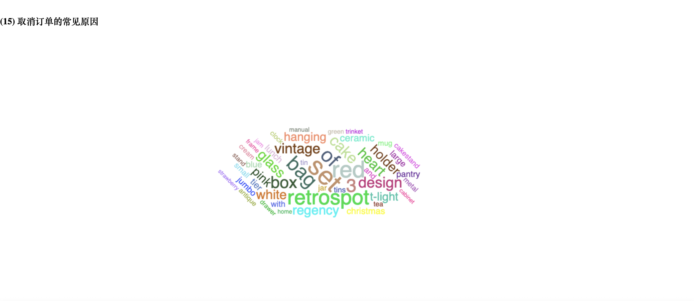

# 一、基于零售交易数据的Spark数据处理与分析

## 选题意义

-   可视化数据分析实战
-   熟悉使用大数据平台读取文件
-   使用 HTML 可视化数据

## 关键问题

-   基础: 环境的配置
    -   ARM 架构, 资料相对较少
    -   环境变量
-   后端: Spark SQL查询操作
-   前端: echarts 数据可视化
    -   `Access-Control-Allow-Origin`
    -   `JS`读取变量

## 解决方案

预处理阶段

-   上传数据到 HDFS
-   对数据进行清洗
    -   处理缺失值, 直接删除有缺失值的项

数据分析

-   Spark SQL 操作

结果打印

-   使用 `json` 文件存储数据
-   调用 `echarts` API 进行浏览

## Spark 使用

基础

-   分组操作 (Group By): 对数据集中的记录按一个或多个列进行分类汇总
-   唯一计数 (Count Distinct): 计算指定列中不重复值的数量
-   排序 (Order By): 按一列或多列的值对结果进行升序或降序排列
-   限制结果数量 (Limit): 限制查询结果返回的记录数，常用于获取顶部或底部的记录
-   求和 (Sum): 计算某列的数值总和

## Spark 使用 II

-   转换和聚合 (Map, ReduceByKey): 将数据从一种格式转换为另一种格式，并进行聚合运算（如求和、计数）
-   数据连接 (Join): 将两个或多个表的数据根据共同的字段连接起来
-   平均值计算 (Average, Avg): 计算数值列的平均值。
-   字段提取 (Substring): 从文本字段中提取部分字符串，如日期的年、月份等

## 可视化

使用bottles

-   直接读取目录下的 `json` 文件
-   每个 `charts` 作为嵌入的网页进行展示
-   调试: F12 的控制台信息可以显示错误(如果有)

## 实验结果展示

-   参看[本地](http://localhost:9999)

## 问题讨论与分析

-   HTML是硬编码的
    -   可以考虑用模板来实现
-   Spark SQL API还是容易出错
    -   可以现在一个Spark shell里面写SQL, 成功了再写到主函数里面去
