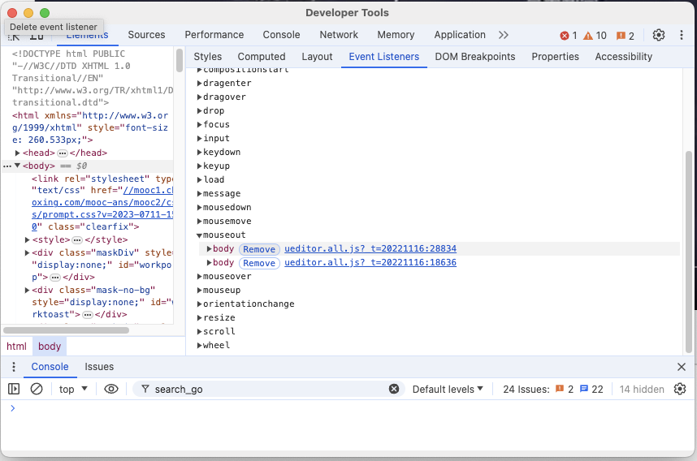
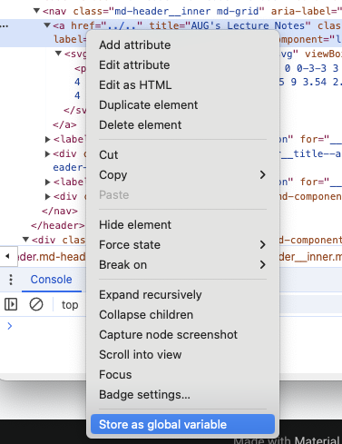

# 1. 认识计算机 {#认识计算机}

<iframe markdown="1" src="../slides/1-intro.html" class="slidesshow">
</iframe>

## JS部分示例代码 {#js部分示例代码}

### 破解防复制代码 {#破解防复制代码}

在一些防止复制的网站上，可能会使用 JavaScript
脚本来禁用右键菜单、文本选择、复制粘贴等功能。通过输入`$={}`，你实际上是覆盖了网站上可能用于实现这些防复制功能的
JavaScript 库或函数。下面是详细的解释：

1.  **覆盖 jQuery**: 在许多网站中，jQuery
    库被使用来实现这些防复制功能。`$`是 jQuery
    库的默认别名，通过输入`$={}`，你将`$`重新定义为一个空对象。这会导致依赖`$`的所有
    jQuery 代码失效，因为它们再也不能访问 jQuery 提供的功能。

2.  **破坏自定义函数**: 有些网站可能使用自定义的 JavaScript
    函数来实现防复制功能。如果这些函数也使用`$`作为变量名或者函数名，输入`$={}`会将其覆盖，导致这些函数失效。

#### 示例 {#示例}

假设某网站的防复制代码如下：

~~~ javascript
$(document).ready(function() {
    $(document).on('contextmenu', function(e) {
        e.preventDefault();
    });
    $(document).on('selectstart', function(e) {
        e.preventDefault();
    });
});
~~~

通过输入`$={}`，你将覆盖`$`，使得上面的代码无法运行，因为`$`不再指向
jQuery。

#### 操作步骤 {#操作步骤}

1.  打开开发者工具（通常按`F12`或`Ctrl+Shift+I`）。
2.  切换到“控制台”选项卡。
3.  输入`$={}`并按下回车键。

完成这些步骤后，页面中的防复制功能可能会被禁用，你就可以正常地复制文本了。

需要注意的是，这种方法仅在某些情况下有效，并且可能会破坏页面的其他功能。只能使用一次。

### 破解鼠标移出视频自动暂停 {#破解鼠标移出视频自动暂停}

要破解鼠标移出视频时自动暂停的现象，可以通过以下步骤移除相关的
`mouseout` 事件侦听器：

1.  **打开浏览器的开发者工具**：
    -   按下 `F12` 或右键点击网页并选择“检查”或“Inspect”。
2.  **查看事件侦听器**：
    -   在开发者工具中，切换到 “Event Listeners” 或 “事件侦听器” 面板。
    -   展开 “mouseout”
        事件，查看绑定在视频元素或其父级元素上的事件处理函数。
    -   点击旁边的移出按钮。

### 如何通过Console隔100ms点击一个按钮? {#如何通过console隔100ms点击一个按钮}

要通过浏览器的控制台每隔100毫秒点击一次按钮，可以使用 `setInterval`
函数。以下是具体步骤和代码：

-   **打开浏览器的控制台**：
    -   按下 `F12` 或右键点击网页并选择“检查”或“Inspect”。
    -   切换到 “Console” 面板。
-   **获取按钮元素**：
    -   找到你想要点击的按钮，然后把这个按钮存储为一个全局变量可供JS操作.

-   **使用 `setInterval` 每隔100毫秒点击一次按钮**：

~~~ javascript
temp1

// 设置一个定时器，每隔100毫秒点击一次按钮
let intervalId = setInterval(() => {
    temp1.click();
}, 100);

// 如果需要停止点击，可以使用 clearInterval(intervalId);
~~~

运行以上代码后，每隔100毫秒按钮将被点击一次。若要停止自动点击，可以在控制台输入
`clearInterval(intervalId);` 以停止定时器。

你可以用下面的这个来测试: 点一点试试看吧!

<button markdown="1" id="myButton" onclick="incrementCounter()">

Click me! 0

</button>

## 命令行部分 {#命令行部分}

### 文件和目录操作 {#文件和目录操作}

#### 创建文件夹 {#创建文件夹}

-   **GUI**: 右键点击文件夹 &gt; 新建 &gt; 文件夹
-   **命令行**: `mkdir <foldername>`

#### 删除文件夹 {#删除文件夹}

-   **GUI**: 右键点击文件夹 &gt; 删除
-   **命令行**: `rmdir <foldername>` 或
    `rmdir /s <foldername>`（删除非空文件夹）

#### 列出目录内容 {#列出目录内容}

-   **GUI**: 打开文件资源管理器
-   **命令行**: `dir`

#### 删除文件 {#删除文件}

-   **GUI**: 右键点击文件 &gt; 删除
-   **命令行**: `del <filename>`

### 文件操作 {#文件操作}

#### 复制文件 {#复制文件}

-   **GUI**: 右键点击文件 &gt; 复制，然后在目标文件夹中右键点击 &gt;
    粘贴
-   **命令行**: `copy <source> <destination>`

#### 移动文件 {#移动文件}

-   **GUI**: 右键点击文件 &gt; 剪切，然后在目标文件夹中右键点击 &gt;
    粘贴
-   **命令行**: `move <source> <destination>`

#### 重命名文件 {#重命名文件}

-   **GUI**: 右键点击文件 &gt; 重命名
-   **命令行**: `ren <oldname> <newname>`

### 系统信息和管理 {#系统信息和管理}

#### 查看IP地址 {#查看ip地址}

-   **GUI**: 打开网络和共享中心 &gt; 更改适配器设置 &gt; 双击网络连接
    &gt; 详细信息
-   **命令行**: `ipconfig`

#### 查看系统信息 {#查看系统信息}

-   **GUI**: 右键点击“此电脑” &gt; 属性
-   **命令行**: `systeminfo`

#### 任务管理器 {#任务管理器}

-   **GUI**: 右键点击任务栏 &gt; 任务管理器
-   **命令行**: `tasklist` (显示正在运行的进程)

#### 结束任务 {#结束任务}

-   **GUI**: 在任务管理器中选择任务 &gt; 结束任务
-   **命令行**: `taskkill /IM <imagename>` 或 `taskkill /PID <pid>`

### 程序管理 {#程序管理}

#### 打开程序 {#打开程序}

-   **GUI**: 双击程序图标
-   **命令行**: 直接输入程序名称，例如 `notepad`
    打开记事本(注意当前路径!)

### 网络管理 {#网络管理}

#### 测试网络连接 {#测试网络连接}

-   **GUI**: 打开网络和共享中心，查看连接状态
-   **命令行**: `ping <hostname>` 或 `tracert <hostname>`
