# 实验 1: 在 U 盘上安装 Linux

你是否留意过, 在按下电源键之后, 电脑需要一段时间才可以启动完成. 那么, 在这一会儿过程中, 到底发生了什么? 这个实验的过程中, 我们会简单介绍. 最后, 我们会带领大家做一个可以直接从USB启动的系统. 理解机械的计算机世界, 很多时候可以采用类比的方法. 实际上, 这些系统在某些大的原则和设计上和人类世界很相似. 如果你还没有对它有最基本的印象, 可以参考[Computer Science Crash Course](https://www.bilibili.com/video/BV1et411y7cH?p=3)的头几分钟. 作为复习, 我们强调:

-   电脑有输入(如键盘, 鼠标)和输出设备(如屏幕), 可以与外界交互.
-   CPU是电脑的 "大脑".
-   电脑运行过程中, CPU只能操作内存中的数据. 通常程序的数据会保存在内存中. 内存存储速度非常快, 远远超过硬盘. 但是在没有电的时候内存中的数据会全部消失.

如果类比做一个人的日常的话, 人的输入是五官感受到的, 输出是嘴巴说出来、行动做出来的. 但是更恰当的描述是, 这人每天早上起来就会忘记自己记住的所有的东西. 为了弥补这一点, 他有一本《每天早上醒来请读这个》的笔记. 于是在醒来之后他会阅读这个文档, 来完成一些基础的认知操作, 并且在一天中把有趣的事情记录下来. 这样后面就可以知道发生了什么了.

我们本次主要做的事情是看一看《每天早上醒来请读这个》写了什么. 对于一个人来讲, 这需要首先知道一些基本信息, 然后搞明白自己接下来要干什么. 比如, 把这份笔记通读一遍, 然后按照"对目标的要求"继续行事.

::: gossip
这里直接偷了 **白石定規** 对于《魔女の旅々》第四卷[艾姆妮西亚](https://zh.moegirl.org.cn/%E8%89%BE%E5%A7%86%E5%A6%AE%E8%A5%BF%E4%BA%9A)(アムネシア)的设定. 有时候会发现有些艺术创作还是可以取材于实际生活的更加抽象的部分的.
:::

在计算机的世界里面, 这《每天早上醒来请读这个》有一个专门的名字, 通常叫做"固件(firmware)". 这是因为早些时候, 这一小段指令会写死在这本书(一个特定的芯片)里面, 不能修改. 如果想要升级必须要换芯片. 固件的功能大体上来说有两个

-   我是谁? 我在哪? (运行程序前进行计算机系统配置): CPU电压 ...
-   接下来该干啥? (不严格地说, 加载操作系统)

第一个主要部分现在还太过琐碎. 这个实验里面我们主要来看第二个部分.

对于计算机而言, 接下来可以干的事情是把控制权交给一个更大的程序 -- 通常装在硬盘里面. 通常, 有这样更大的程序的硬盘的头部有一些特殊的标记. 这样, 固件接下来就知道应该交给谁管理了. 问题是, 要是有多个可以启动的设备应该如何办? 实际上, 在固件的设置中可以指定启动的顺序. 系统会从第一个设备开始启动, 如果失败了, 就到第二个, 以此类推. 也就是说, 只要我们的U盘的某些字节被标记为一些特定的样式, 我们当然可以从U盘启动. 实际上, 你新买了一个U盘之后, 里面真的什么都没有吗? 我们可以使用工具Disk Genius来查看这个U盘里面到底有什么.

显然, 只要把这种硬盘的所有的位都写成每一个特定值, 那这U盘肯定可以被操作系统识别, 从而启动了. 但是一个\~64GiB的U盘一共有158456325028528675187087900672个bit, 手写肯定是办不到的! 于是, 我们总是可以使用一个操作系统的安装程序来帮助我们写这个U盘, 填入给定的值.

如果大家经历过装系统的话, 会记得操作系统的安装程序是在计算机开机之前启动的 – 连操作系统都没有, 自然没有办法在已经有操作系统的条件下运行... 未必! 天才程序员[Fabrice Bellard](https://en.wikipedia.org/wiki/Fabrice_Bellard)发明的QEMU让我们可以在计算机上面模拟另一个计算机硬件执行. 因此, 如果让虚拟机的硬盘部件连接到实体机外接的U盘, 剩下的还是接上虚拟的硬件, 那不就好了吗? 确实是这样! 计算机系统没有魔法.实际上, 计算机科学是人造的科学, 可以用于建模/仿真各种物理的东西. 自然, 它也可以模拟它自己. 这是一个很重要的信息, 在后续和计算机打交道的过程中会体会得更深刻.

## 1.2 实验要求

本次实验的原材料如下

-   x86-64体系结构的Windows操作系统真机, 至少8GB内存.
-   U盘一个, 要求使用USB3.0协议, $\geq 64GB$存储空间.

## 1.3 实验步骤

首先, 在计算机中插入U盘, 以管理员身份启动VMware Workstation. 紧接着, 要配置上面说的新建一个虚拟机. 这就相当于在几十年前的时候购买了新的电脑硬件, 然后把他们组装起来, 形成一台裸机(bare metal). 中由于把硬盘选到物理的USB的行为不是虚拟机制造者的一个很常见的动作, 所以我们选择自定义安装. 如下图所示.

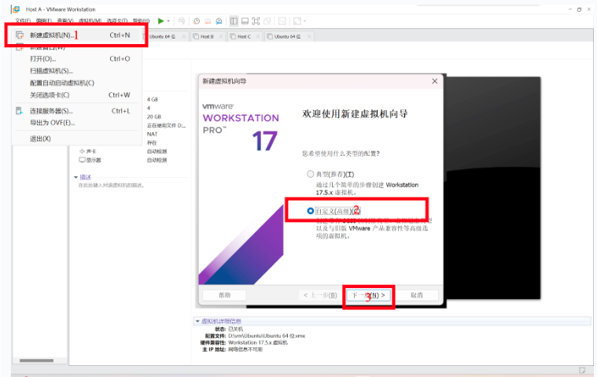

由于现在模拟的是把所有的电脑配件买回来 – 即配置一个架子, 那么除了 “安装客户机操作系统” 选项中选择 “稍后安装操作系统”, 以及选对要安装的系统类型(Ubuntu 64位)之外, 一路继续点下一步, 直到设置内存和磁盘的步骤. 具体操作流程如下图所示.

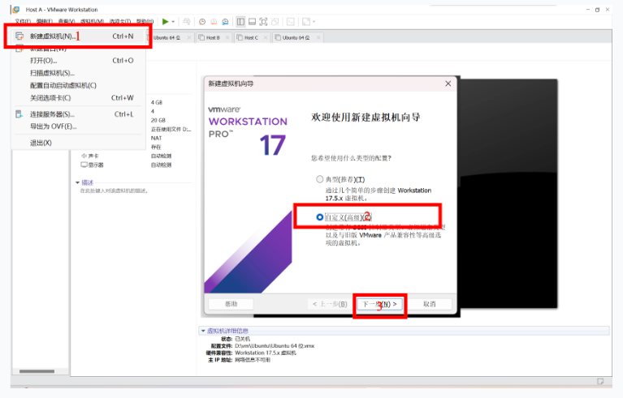

设置内存之后, 立刻会让设置虚拟机的网络, I/O(输入/输出)设备的控制器类型的选项. 我们保持默认问题不大. 如下图所示.

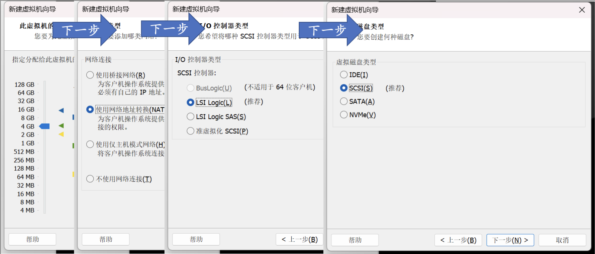 重点在于, 我们要选择物理插入的USB盘. 因此, 选择使用物理磁盘, 然后使用整个磁盘, 如下图. 一般而言, 新插入的USB设备往往是设备列表的最后一项.

::: warn
一定要再三确定这个设备就是你要选择安装的设备. 由于要安装系统, U盘上面的所有文件都要被删除(因为U盘要格式化). 若选错了盘将会造成几乎不可逆的数据损失!
:::

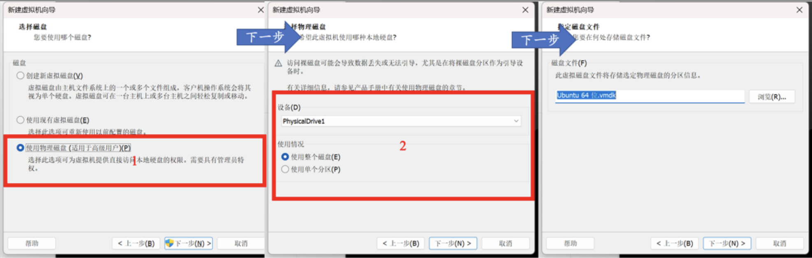

如果不放心, 可以先把U盘拔出来, 重新重复上面的步骤, 看一看列表中缺少了哪一个Device. 这时候再把它插回来, 就选刚刚缺失的那一个Device就可以了.

再次下一步之后, 我们就把虚拟机的架子搭好了. VMWare Workstation会给出一个总结画面. 如下图.

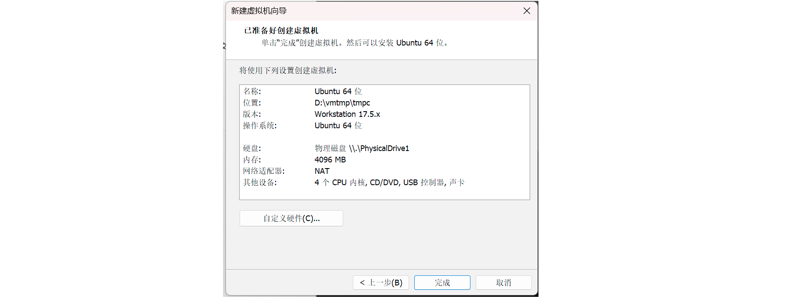

现在, 我们就相当于把所有的硬件"买回来了", 接下来需要在上面安装操作系统, 我们的电脑才可以正常工作. 为什么要操作系统?

想象一下, 你家里有各种各样的电器——冰箱、电视、微波炉、洗衣机等等. 每个电器都有自己不同的插头和电压要求. 如果没有一个统一的电力系统, 你就得为每个电器单独设置电源, 实在是太麻烦了！这时候, 操作系统就像是家里的电力总控系统. 它可以屏蔽掉所有电器的不同需求, 把复杂的电力管理简化为一个标准化的接口. 你只需要把电器插到电源插座上, 电力总控系统就会处理好一切, 让所有电器都能正常工作.

在计算机世界里, 硬件设备就像这些各种各样的电器. 每个硬件都有不同的接口和要求. 如果没有操作系统, 软件需要直接和每个硬件打交道, 编写程序的人会被复杂的硬件细节搞得头昏眼花. 操作系统的作用就是为这些硬件做一个屏蔽, 就像电力总控系统一样. 它提供了一个统一的接口, 让软件开发者不需要关心底层的硬件细节, 只需通过操作系统提供的接口来使用硬件. 所以, 操作系统不仅仅是安装在硬件上的系统, 它实际上也是硬件和软件之间的桥梁, 简化了操作, 提升了效率. 有了操作系统, 我们的电脑才能高效、稳定地运行, 就像家里的电力总控系统让所有电器都能方便地使用一样. 这一次区别于传统的Windows操作系统, 我们采用Linux操作系统. 其原因是

-   Linux操作系统的前身Unix是开源操作系统, 其设计简单, 保留了命令行的很多文化. 如Keep it simple and Stupid; Do one thing at a time, but do well等. 熟悉了命令行工具会让你的效率变高很多.

-   Linux几乎所有的内容你都可以进行深入探究 – 大不了把源码翻出来看看(当然需要相当多的训练), 而Windows操作系统就没有这么幸运了.

要安装系统, 首先决定要装哪个Linux版本, 就像选择你要装的电力系统品牌. Ubuntu、Fedora、Debian等等, 就像不同品牌的电力系统, 各有优点. 新手可以选择用户友好的Ubuntu, 这就像选择一个易于使用、支持全面的电力系统. 去官网下载你选择的Linux版本的镜像文件（ISO文件）, 就像去电器店买回电力系统的安装包. 我们可以通过清华大学的镜像站下载这个iso安装包, 这会让我们的下载速度变得很快.

如果是在以前安装系统, iso文件就像我们的装系统的盘片. 现在, 我们往虚拟机里面塞入这个盘片. 如下图.

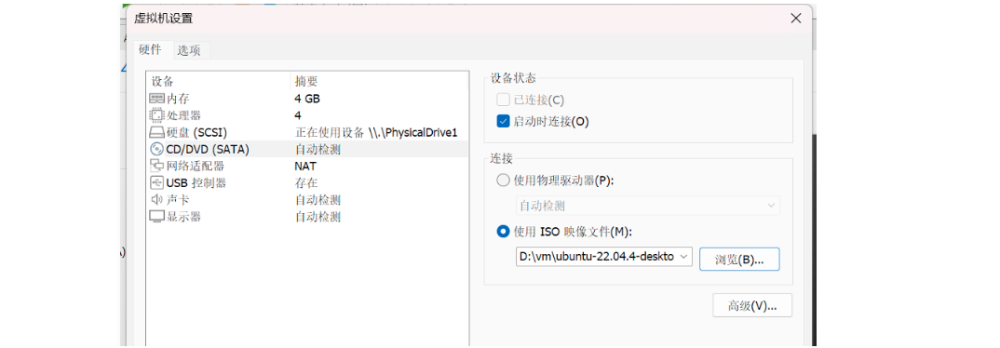

打开虚拟机, 你应该能够看到Linux的安装程序的启动界面了. 如下图.

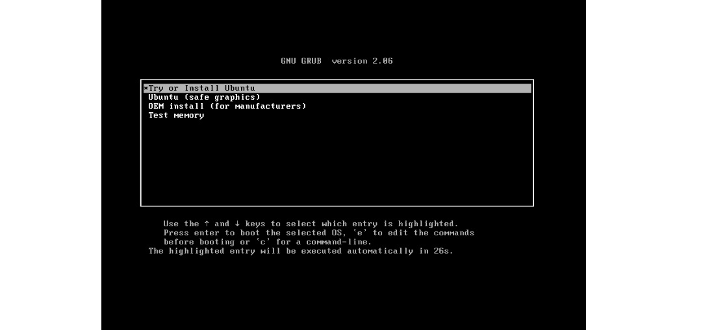

如果没有的话, 就要在开机的时候按下F2, 把光驱的启动顺序放在第一位. 这就相当于我们在《每天起床请读这个》的书里面修改了应该交给谁这一个选项. 如果你看到排名第一的是硬盘(Hard Drive), 由于现在我们的硬盘中没有任何东西, 自然无法硬盘启动了. 然后, 作法是选中CD-ROM Drive然后使用+键让它出现在第一位. 如下图.

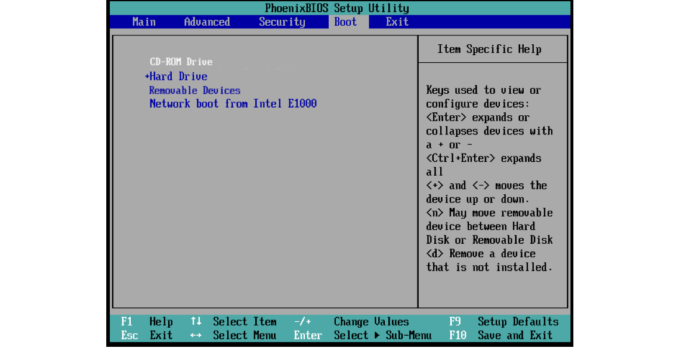

在启动界面中选择Try or install Ubuntu. 然后进行一些最基础的设置. 为了减少U盘的读写负担, 在安装的时候要选择Minimal Installation, 并且把install updates的选项去掉. 我们推荐大家不修改系统的语言设置. 因为英文的报错信息更全面, 网络上关于这些问题的回答也更多. 你应该已经发现了, 实际上这上面的英语都是小学初中水平, 完全不需要特别厉害的英语水平就可以阅读明白.

如果你对于计算机才刚刚了解, 在Installation Type中我们建议使用Erase disk and install Ubuntu. 这些步骤如下图所示. 这样子安装程序会自动帮助我们完成分区操作, 并且就可以跳过下一个可选的部分. 如果你对于计算机已经有了一些了解, 自己试着分区也不错.

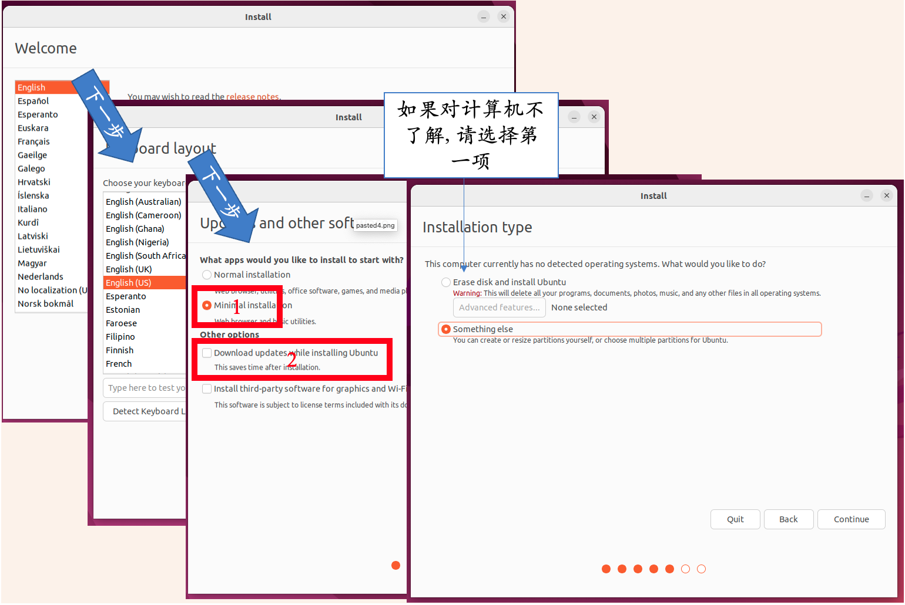

### 1.3.1 如果你选了 Something Else, 请阅读下文

如果你选择了安装过程中那神秘的第二项——手动分区, 那么恭喜你, 你要亲自当一回“硬盘规划师”了！手动分区就像是在你的硬盘上画地图, 把整个硬盘地盘合理分配给不同的区域, 确保信息能快速找到自己该呆的地方.

分区的目的是让硬盘上的数据井井有条, 效率高效. 就像把一个大仓库分成不同的小房间, 每个房间都有特定的用途和功能.

首先, 你得预留不少于1MB的空间给BIOS GRUB, 这相当于在仓库门口设立一个门房, 让它来管理和引导所有进入的东西. 这1MB可不是随便给的, 它是启动界面的大门守护者.

接着, 记得给EFI预留约512MB的空间, 这就是仓库的“电控室”. EFI负责管理电源和启动顺序, 让你的系统一开机就能顺利运转.

然后, 剩下的大部分空间就可以留给系统使用了. 这就像给仓库中的各个部门分配具体的办公区域. 大部分空间会成为“主办公区”, 也就是我们的根目录（/）, 它是系统的大本营, 所有重要数据都在这里处理.

Linux系统通常使用ext4文件系统, 就像仓库里使用的特定储存系统, 确保数据高效、安全地存储和读取. 当你添加这个分区时, 挂载点（mount point）需要设置为/, 相当于标记出这个区域是核心办公区.

所以, 手动分区虽然听起来有点复杂, 但其实就是为你的硬盘画好地图, 让数据能井井有条地存放和管理. 只要按步骤来, 你的“硬盘仓库”就能高效运转, 信息快速找到自己的位置, 让系统运行得更加顺畅！最后的结果如图所示.

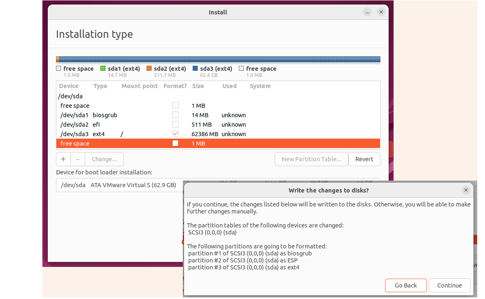

你可能会问：“我怎么知道我的分区对不对? ”实际上, Ubuntu非常贴心, 如果你的分区不正确, 它会像一个细心的保姆一样, 不厌其烦地弹出警告(图), 提醒你修正错误. 如图[fig:setup-1-1-2-1-1-1-1-1-1].

想象一下, 你在为新房子布置电力系统. 如果你忘记给电控室（EFI）预留空间, 或者忘记给房门（BIOS GRUB）留位置, Ubuntu就会跳出来, 说：“嘿！你家房门呢? 没有门房怎么能让人进出呢? ”

这些警告信息就像你的专属电力专家, 确保你不会因为小失误而让整个系统瘫痪. Ubuntu会细心地提醒你：“哎哟, EFI的512MB空间忘了留啦！赶紧调整一下, 不然系统启动不起来啊！”

所以, 即使你不是硬盘分区的专家, 也不用担心. Ubuntu会一路陪伴, 提供及时的提示和警告, 确保你能正确完成分区. 就像在你装修房子时, 有一位专业的监工随时提醒你, 确保每一个细节都做到位, 最终让你的房子（硬盘）装修完美, 电力系统（操作系统）顺利运行.

这样一来, 即使你是第一次手动分区, 也能在Ubuntu的帮助下, 顺利完成每一步. 放心大胆地去试吧, Ubuntu是你最可靠的小助手！

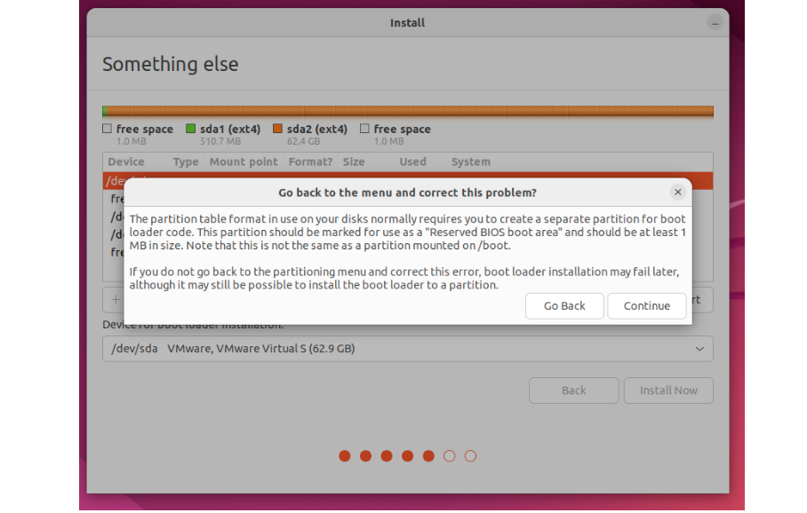

### 1.3.2 安装系统: 回顾

然后接着一路下一步, 完成一些必要的设置, 我们就可以进入安装界面了. 安装界面如下所示.

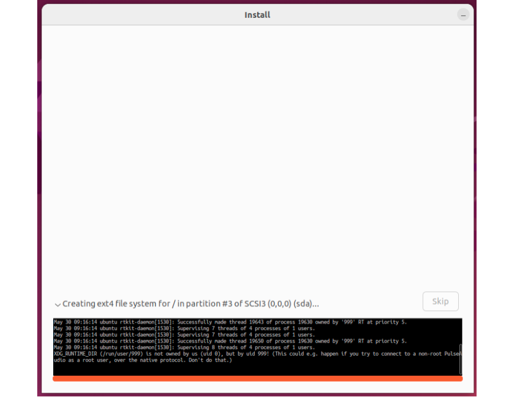

这是一个不算短的过程. 自然你可能会感到无聊. 下面推荐几个有趣的教程, 来自神秘的21世纪初. 我们今天截止现在的内容就是重新走了这一个过程.

-   [分区与格式化是什么?](https://www.bilibili.com/video/BV1QC4y1d7KR/?vd_source=92e33b8be0a9fcd124e9c9cb80f446f0)
-   [启动时CMOS/BIOS怎么设置?](https://www.bilibili.com/video/BV1et411y7cH/?vd_source=92e33b8be0a9fcd124e9c9cb80f446f0)
-   [在Windows XP的时代, 大家怎么装电脑?](https://www.bilibili.com/video/BV1ru4y1s7jt/?vd_source=92e33b8be0a9fcd124e9c9cb80f446f0)

在安装完成之后, 会提示移除安装介质(也就是安装程序在的那光盘)并且重启电脑. 这是因为如果安装的CD光盘不移除, 下一次电脑启动的时候还是会把控制权交给安装程序! 这时候安装完成的硬盘上已经可以启动了, 因此, 我们需要把它移除. 在虚拟机的设置里面取消连接CD光盘, 然后按下Enter键.

如果你的虚拟机成功进入了Linux的主界面, 那么恭喜你, 接下来就可以试着在真机上面启动这一个U盘了! 只不过, 我们这次在BIOS中调整启动顺序的时候, 应该把USB调整到第一位(如下图).

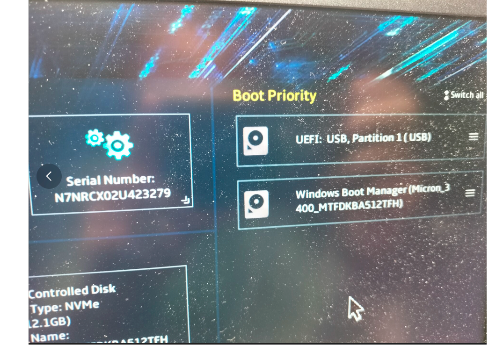

这样一来, 我们就成功制作了一个Linux启动盘.

## 1.4 安装完之后

我们提供一些小的建议, 帮助大家定制化自己的Linux.

-   设置快捷键: 在桌面环境的设置中, 可以自定义键盘快捷键来提高工作效率. 例如, 在GNOME中, 通过Settings -\> Keyboard -\> Shortcuts进行设置.
-   根据需求安装开发工具, 如Vim、VS Code、Git等.
-   终端: zsh是一个功能强大的shell, Oh My Zsh是一个zsh的配置管理工具, 可以大大提高命令行体验. 或者fish也是一个不错的选择, 但是和传统的shell语法有些轻微的出入.

此外, 我们还希望大家来看一看Linux的手册. 使用man命令就可以看到某一个命令的所有用法. 比如, man man(看看man是干啥的).

当然, 如果你觉得man的输出太长了, 你可以装一个tldr工具. tldr的意思是too long don't read. 看! 只要你敢想, 很多工具都是有更加人性化的版本的.

## 1.5 遇见错误

遇见错误是很正常的. 一般而言, 你可以把带有[ERROR]的内容复制上网搜一搜. 开始的时候肯定比较困难, 但是经过你一次一次的推理, 搜索, 询问的过程之后, 这些内容大多数都可以解决. 如果遇见了一个特别难以理解的问题, 可以发送问题询问.
