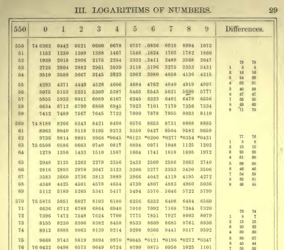
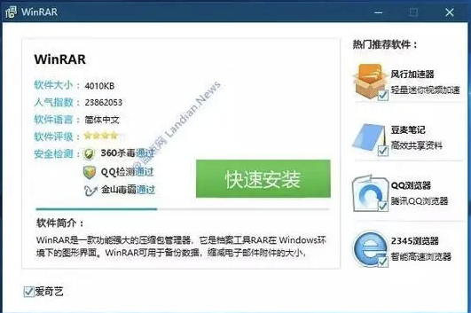
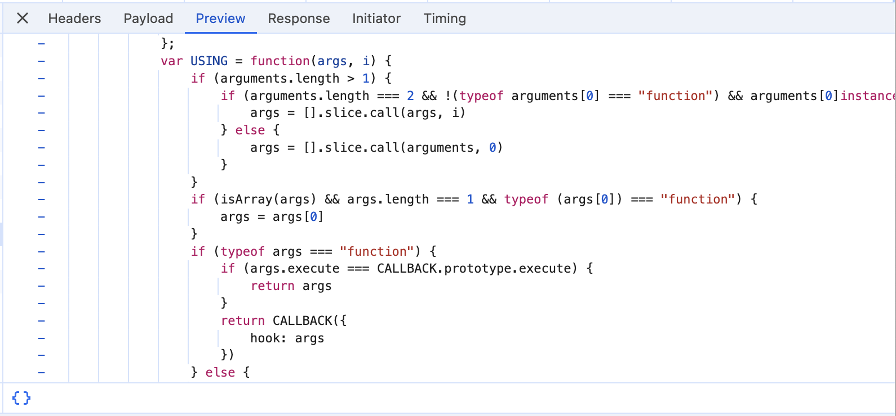
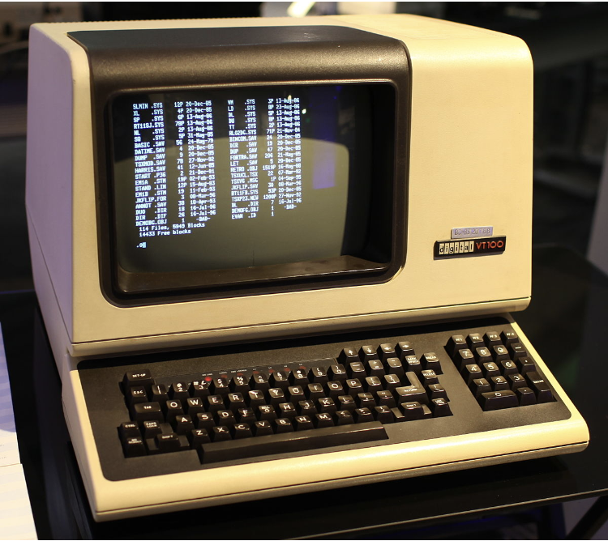

# 简介

## 课程目标

整个课程

-   让大家玩得开心 ←重要
-   初探编程世界: 学习 “做抽象” ← 到结束就知道了
-   让大家发展自学(新语言)的能力

联系

-   疑问/问题/建议/闲聊可以通过email, B站私信
    -   Email: gwzhang\@cug.edu.cn
    -   Bilibili: AUGPath

## 安排

1.  **认识计算机**
2.  二进制与Scratch
3.  程序的逻辑
4.  一些简单的算法

## 今天: 简单认识计算机

-   计算的机器: 概念的产生
-   搜索与获取信息
    -   下载软件. 日常生活. 学术知识
    -   骚操作: F12与HTML, JS
-   命令行
    -   称为Power user的第一步

# 计算的机器

## 生活中问题好多! 

有一些相当乏味的:

-   算一算 $486×27=$?
-   直径为 20cm 的圆的面积多少?
-   (古代的)天文学家: 这数太大了, 算一下要命!
    -   ~~对数的出现极大地提高了天文学家的平均寿命~~

还有一些不那么乏味的:

-   从家到学校的最短路程是多少?
-   怎样合理地安排写作业时间?
    -   ~~强化版(高中): (作业写不完)怎样写作业才能挨老师骂次数最少?~~
-   植物大战僵尸如何最高效地安排植物

## 大家应该一直思考的

-   如何自学?
    -   相当重要! 不会自学$\approx$大学白上了
-   抓住 "不变量"!

## 从计算器到计算机

> 让优秀的人浪费时间计算简直是侮辱尊严 – 就算是农民有一台机器辅助都可以算得一样准.
>
> --- Gottfried Wilhelm Von Leibniz, 1694

-   最简单的计算: 自然数递增(计数器)
-   加法=做若干次递增; 减法=反过来
-   乘法=做若干次加法; 除法=做若干次减法(记录减法的次数), 剩下余数

{.float-right data-external="1" width="152"}

问题: 太慢了

-   解决方法: 打小抄(计算表)

## 那时候人们的计算表

{.center data-external="1" width="45%"}

-   想算数=查表格
-   许多苦力事先算好

## 希望: 不止加减乘除

-   (例如)开平方根, 计算盈利, …
-   给 “说明书” 和 “数据”, 可以自动完成计算

实际上这是一个非常先进的模型

-   屏幕 = 一堆像素点$(R,G,B)$
    -   获取输入
    -   只要知道每一个位置$R,G,B$分别是多少就好啦!
    -   想办法输出到屏幕上

## 认识计算机(迫真)

> 把计算机想象成人.

-   输入: 键盘鼠标... (视觉, 听觉,...)
-   输出: 屏幕, 音响... (说的话, 做的动作)
-   CPU(中央处理器): 大脑
-   内存: 短时记忆
    -   没电数据全都丢失了
-   磁盘: 长时记忆
    -   没电照样记
    -   但是速度很慢(练习你们背诵课文的时候...)

## 旁注: 令我想到了一部作品

{data-external="1"}

一位角色[艾姆妮西亚](https://zh.moegirl.org.cn/%E8%89%BE%E5%A7%86%E5%A6%AE%E8%A5%BF%E4%BA%9A)(アムネシア)

-   每天醒来之后会把所有的记忆忘光
-   解决方法: 每天会把见闻记到本子上, 起来的时候读一读

## 然后尽情网上冲浪吧!

下载软件相关

-   不要使用XX软件园的快速下载
-   最好官网下载
-   安装的时候看看有没有捆绑软件

{.float-right data-external="1"}

## 搜索知识

拿一个耳熟能详的知识点: 容斥原理, 然后对比

-   奇怪的搜索引擎中文关键字
-   不错的搜索引擎中文关键字
-   不错的搜索引擎英文关键字

使用英文关键字得到的答案更加全面

-   教材编者在每个名词后面加了英文对应的~~良苦用心~~

强烈建议不包含的网站!!!

-   www.baidu.com
-   www.csdn.com

# 审查元素(F12)与HTML: 简介

{data-external="1" width="539"}

## 按下 F12

害怕: 这是什么?

惊喜: 所有的网页上的文字都在这里

{data-external="1" width="518"}

## HTML标签

-   像是大括号一样
    -   左括号(开启): `<xxx>` (xxx是这个标签的名字)
    -   右括号(关闭): `</xxx>` (xxx是这个标签的名字)
-   缩写: `<xxx/>`

中间: xxx的具体信息

-   `<xxx width=200px> contents </xxx>`: 宽度为200px的xxx

可以的xxx

-   h1: heading of 1(一级标题)
-   div: 一个"容器"
-   input: 输入框
-   ...

## 实战: 修改页面

-   HTML只负责呈现画面
-   刷新一下就复原了

## 烦人的情况之一

-   不登录不让复制

{data-external="1" width="448"}

## 烦人的情况之二

-   鼠标移出视频视频自动暂停

问题: 不属于渲染页面的范围了

-   关于**页面如何响应我们的输入**

# 使用JS做交互

{data-external="1"}

## 事件

Knock, knock, who's there?

-   有人敲门, 我去**开门.**
    -   敲门: 事件; 开门: 事件的响应(一段JS代码)
-   事件: 点击; 鼠标移动到窗口外; ...
-   网页版本的连点器
    -   只要一直"响应"就好啦!
-   移出鼠标不再暂停的视频
    -   干脆别响应这个事件了!
        -   移出鼠标
        -   解绑函数

## 控制台(Console)

-   JS的游乐场
-   对/错/结果立刻显示

常见操作

-   获取网页上的元素到JS
-   点击它
-   隔一段时间就点一下它

## 能不能自动化?

-   每次都要自动输入
-   扩展
    -   油猴脚本

> 让你感到不舒服的事情, 总是有办法做的!

-   到处都可以自动化!

# 使用命令行

## 今天的交互

{data-external="1"}

## 计算机的交互历史 (cont'd)

(1980s)一个黑框框

{data-external="1" width="300"}

就算回到 1980s，该干的事情还得干啊

-   管理文件; 编代码; 写作业; 排版杂志; 上网……

今天: 假设在 1980 年, 如何完成一日常规

-   管理文件开始

## 为什么"舍近求远"?

> 上面这些事情不是点点鼠标就能搞定的吗？

主动接受

-   对系统更强的控制力

    -   应用程序通常无法满足 power user 的全部需求

-   生产系统编程的事实标准

    -   Linux, macOS, Windows, ...运维基本都靠命令行工具

-   来自开源社区的一份礼物

    -   非常丰富、可定制、看得见源码的软件栈

## 最基础的命令

命令`cd`: change directory

-   `cd dir`在当前目录下双击`dir` 文件夹
-   `cd .` 到当前目录
-   `cd ..` 到上一层目录

往文件里面写入文本: 重定向`>`

-   `echo hi`: 把`hi`输出到黑框
-   `echo hi > a.txt`: 输出到当前目录下`a.txt`
    -   追加写入: `echo hi >> a.txt`

## 文件的移动, 删除

-   命令`copy`(Windows), `cp`(Linux)
-   命令`del`(Windows), `rm`(Linux)

我是咋知道的?

-   帮助文档!

```         
$ cp -h
usage: cp [-R [-H | -L | -P]] [-fi | -n] [-aclpSsvXx] source_file target_file
       cp [-R [-H | -L | -P]] [-fi | -n] [-aclpSsvXx] source_file ... target_directory
```

## 用命令行启动游戏吧!

启动应用程序

-   "双击启动一个 game.exe" $\rightarrow$ `.\game.exe` (Linux `./game.exe`)

如果启动不存在的应用...

-   会报错 "找不到文件或目录".

但是...

-   输入`calc`(Linux输入`bc`)
-   可我当前目录下没有`calc`啊!

## 环境变量

-   Linux: 除非加上`./`只在环境变量里面找有没有可执行文件
-   Windows: 当前目录, 环境变量
    -   在`C:\Windows\System32`里面找到了`calc.exe` !

## 实际的例子: 启动Minecraft

问题: 为什么电脑版MC要用启动器启动

-   因为MC是用Java写的
    -   Java是一个模拟器, 怎么告诉它我要模拟minecraft
-   我们能不能看一看用的什么命令行参数启动的Minecraft?
-   命令参数真不少!

怪不得需要用启动器启动!

## 彩蛋: 用cmd写的Tik-Tak-Toe

-   代码
-   粘贴到一个记事本里面, 后缀改成.bat
-   就可以游玩

<https://github.com/Psi505/Tic-Tac-Toe-Game/blob/main/Tic%20Tac%20Toe.bat>

# 总结

## 认识计算机

目标从不是机械地记忆, 而是理解.

Takeaway messages

-   任何感到繁琐的事情都有人试图简化
-   令人感到巨大惊吓的背后是惊喜
-   感到难以下手的时候, 同学, **手册(帮助文档)**, 互联网是你的好帮手

警告!

-   不要运行不明的`cmd`程序!
