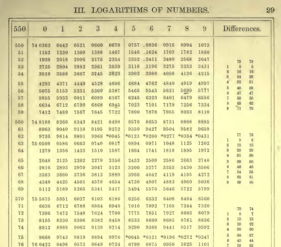
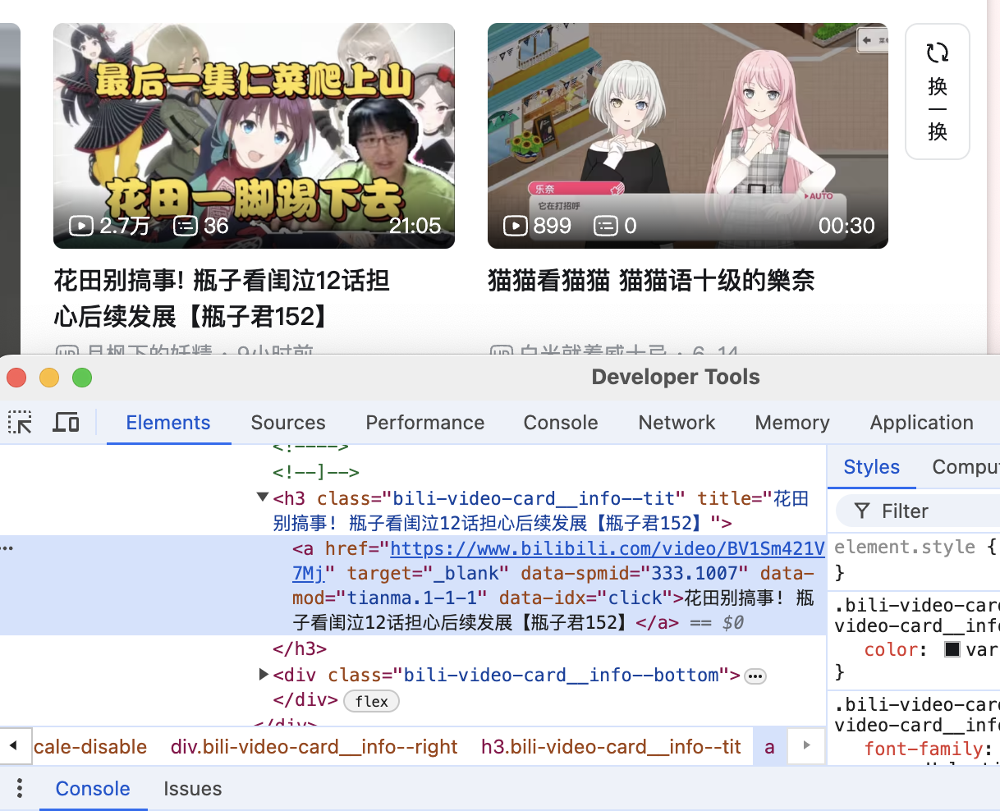
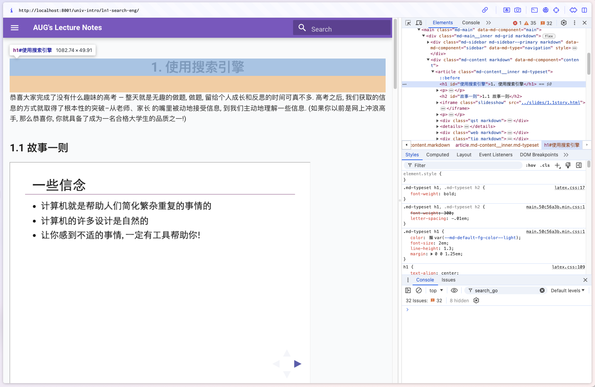
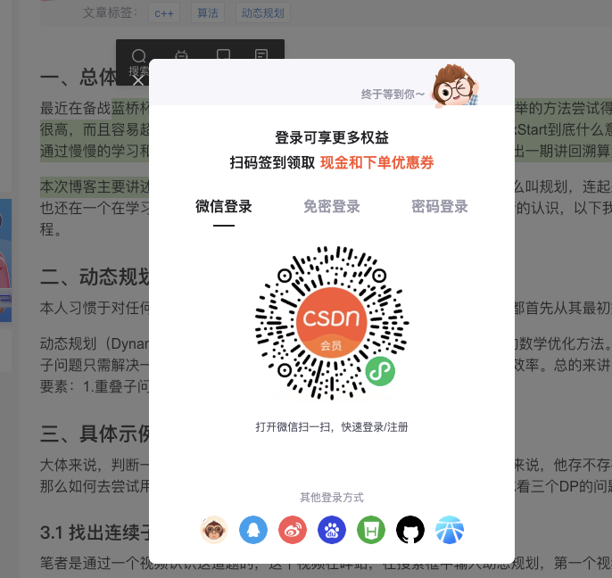
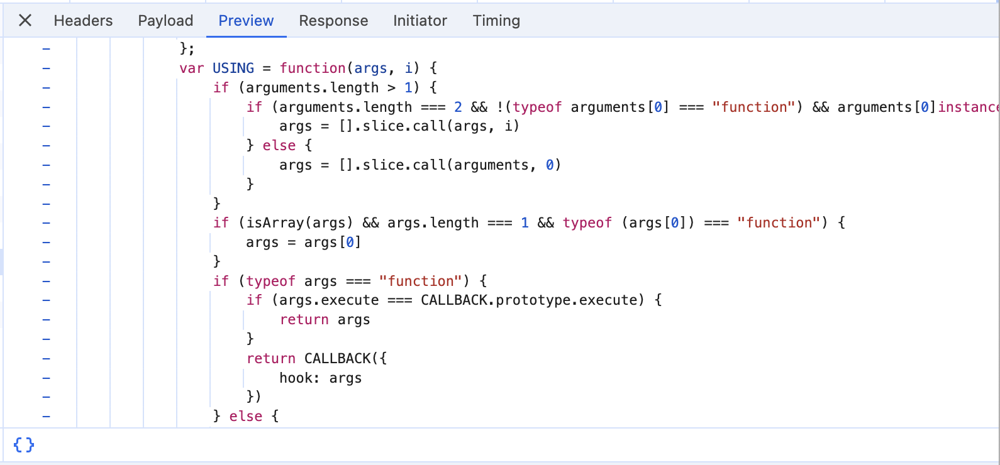

---
format:
  html:
    embed-resources: false
output: 
  revealjs::revealjs_presentation:
    css: "/Users/zgw/research/lecture/intro-oi/docs/css/slides.css"
    transition: slide
    preview-links: true
---

# 简介

## 课程目标

整个课程

-   让大家玩得开心 ←重要
-   初探编程世界: 学习 “做抽象” ← 到结束就知道了
-   让大家发展自学(新语言)的能力

联系

-   疑问/问题/建议/闲聊可以通过email, B站私信
    -   Email: gwzhang\@cug.edu.cn
    -   Bilibili: AUGPath

## 安排

1.  **认识计算机**
2.  二进制与Scratch
3.  程序的逻辑
4.  一些简单的算法

## 今天: 简单认识计算机

-   计算的机器: 概念的产生
-   搜索与获取信息
    -   下载软件. 日常生活. 学术知识
    -   骚操作: F12与HTML, JS
-   命令行
    -   称为Power user的第一步

# 计算的机器

## 生活中问题好多! 

有一些相当乏味的:

-   算一算 $486×27=$?
-   直径为 20cm 的圆的面积多少?
-   (古代的)天文学家: 这数太大了, 算一下要命!
    -   ~~对数的出现极大地提高了天文学家的平均寿命~~

还有一些不那么乏味的:

-   从家到学校的最短路程是多少?
-   怎样合理地安排写作业时间?
    -   ~~强化版(高中): (作业写不完)怎样写作业才能挨老师骂次数最少?~~
-   植物大战僵尸如何最高效地安排植物

## 大家应该一直思考的

-   如何自学?
    -   相当重要! 不会自学$\approx$大学白上了
-   抓住 "不变量"!

## 从计算器到计算机

> 让优秀的人浪费时间计算简直是侮辱尊严 – 就算是农民有一台机器辅助都可以算得一样准.
>
> --- Gottfried Wilhelm Von Leibniz, 1694

-   最简单的计算: 自然数递增(计数器)
-   加法=做若干次递增; 减法=反过来
-   乘法=做若干次加法; 除法=做若干次减法(记录减法的次数), 剩下余数

{.float-right width="152"}

问题: 太慢了

-   解决方法: 打小抄(计算表)

## 那时候人们的计算表

{.center width="45%"}

-   想算数=查表格
-   许多苦力事先算好

## 希望: 不止加减乘除

-   (例如)开平方根, 计算盈利, …
-   给 “说明书” 和 “数据”, 可以自动完成计算

实际上这是一个非常先进的模型

-   屏幕 = 一堆像素点$(R,G,B)$
    -   获取输入
    -   只要知道每一个位置$R,G,B$分别是多少就好啦!
    -   想办法输出到屏幕上

## 认识计算机(迫真)

> 把计算机想象成人.

-   输入: 键盘鼠标... (视觉, 听觉,...)
-   输出: 屏幕, 音响... (说的话, 做的动作)
-   CPU(中央处理器): 大脑
-   内存: 短时记忆
    -   没电数据全都丢失了
-   磁盘: 长时记忆
    -   没电照样记
    -   但是速度很慢(练习你们背诵课文的时候...)

## 旁注: 令我想到了一部作品

一位角色[艾姆妮西亚](https://zh.moegirl.org.cn/%E8%89%BE%E5%A7%86%E5%A6%AE%E8%A5%BF%E4%BA%9A)(アムネシア)

-   每天醒来之后会把所有的记忆忘光
-   解决方法: 每天会把见闻记到本子上, 起来的时候读一读

## 然后尽情网上冲浪吧!

下载软件相关

-   不要使用XX软件园的快速下载
-   最好官网下载
-   安装的时候看看有没有捆绑软件

{.float-right}

## 搜索知识

拿一个耳熟能详的知识点: 容斥原理, 然后对比

-   奇怪的搜索引擎中文关键字
-   不错的搜索引擎中文关键字
-   不错的搜索引擎英文关键字

使用英文关键字得到的答案更加全面

-   教材编者在每个名词后面加了英文对应的~~良苦用心~~

强烈建议不包含的网站!!!

-   www.baidu.com
-   www.csdn.com

# 审查元素(F12)与HTML: 简介

{width="539"}

## 按下 F12

害怕: 这是什么?

惊喜: 所有的网页上的文字都在这里

{width="518"}

## HTML标签

-   像是大括号一样
    -   左括号(开启): `<xxx>` (xxx是这个标签的名字)
    -   右括号(关闭): `</xxx>` (xxx是这个标签的名字)
-   缩写: `<xxx/>`

中间: xxx的具体信息

-   `<xxx width=200px> contents </xxx>`: 宽度为200px的xxx

可以的xxx

-   h1: heading of 1(一级标题)
-   div: 一个"容器"
-   input: 输入框
-   ...

## 实战: 修改页面

-   HTML只负责呈现画面
-   刷新一下就复原了

## 烦人的情况之一

-   不登录不让复制

{width="448"}

## 烦人的情况之二

-   鼠标移出视频视频自动暂停

问题: 不属于渲染页面的范围了

-   关于**页面如何响应我们的输入**

# 使用JS做交互

## 事件

Knock, knock, who's there?

-   有人敲门, 我去**开门.**
    -   敲门: 事件; 开门: 事件的响应(一段JS代码)
-   事件: 点击; 鼠标移动到窗口外; ...
-   网页版本的连点器
    -   只要一直"响应"就好啦!
-   移出鼠标不再暂停的视频
    -   干脆别响应这个事件了!
        -   移出鼠标
        -   解绑函数

## 控制台(Console)

-   JS的游乐场
-   对/错/结果立刻显示

常见操作

-   获取网页上的元素到JS
-   点击它
-   隔一段时间就点一下它

## 能不能自动化?

-   每次都要自动输入
-   扩展
    -   油猴脚本

> 让你感到不舒服的事情, 总是有办法做的!

-   到处都可以自动化!

# 使用命令行
