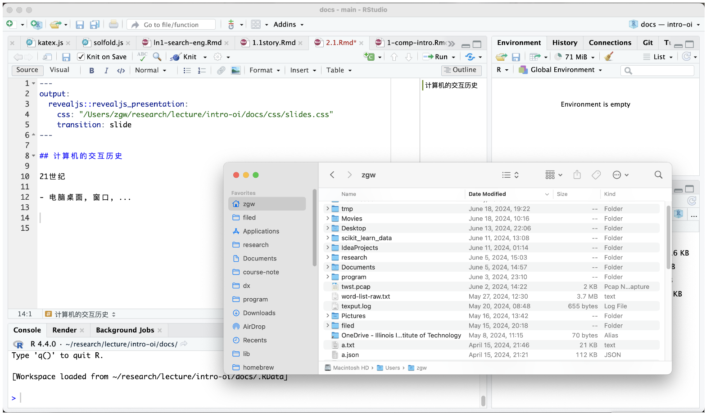

## 计算机的交互历史

21世纪

## 计算机的交互历史 (cont'd)

(1980s)一个黑框框

{width="300"}

就算回到 1980s，该干的事情还得干啊

-   管理文件; 编代码; 写作业; 排版杂志; 上网……

今天: 假设在 1980 年, 如何完成一日常规

-   管理文件开始

## 为什么

> 上面这些事情不是点点鼠标就能搞定的吗？

主动接受

-   对系统更强的控制力

    -   应用程序通常无法满足 power user 的全部需求

-   生产系统编程的事实标准

    -   Linux, macOS, Windows, ...运维基本都靠命令行工具

-   来自开源社区的一份礼物

    -   非常丰富、可定制、看得见源码的软件栈
