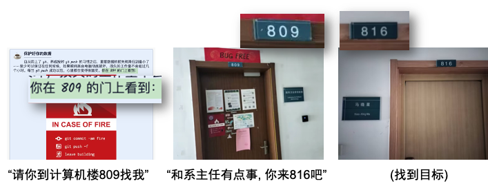
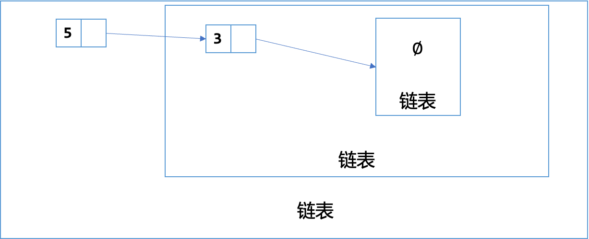
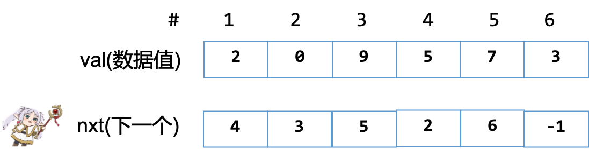

# 线性的数据结构 {.center}

::: author-block
张桄玮
:::

::: author-affiliation
郑州一中(Legacy)
:::

## 本节概述

回顾: 程序=算法+数据结构

-   拿着说明书操作某些东西

今天上午: 基本的数据结构

-   链表(到处都是)
-   栈
-   队列

遵循的逻辑

-   先手写
-   然后再使用STL库写

# 链表 {.center}

## 考虑如下场景

{data-external="1"}

## 思考: 什么是链表?

-   那个把一堆东西串成一个链的东西

. . .

神经的定义说: 链表是

-   什么都没有算是一个链表
-   一个链表, 它的下一个元素指向一个链表的东西是链表

实际上是链表的递归定义(DP的时候很有用)

{data-external="1"}

## 如何表示同一类的东西?

想法1: 把它们放到 "隔间" 里面, 对隔间(内存池)编号.

-   单开一个数组, $nxt[i]:=第i个元素的下一个是第几号?$

. . .

很好的想法!

问题: 如果下一个没有了, 怎么办?

. . .

-   设置一个正常数据不可出现的特殊值(如-1)
-   额外开设一个 $hasnxt[i]:=i是否有下一个元素$

疑问: 这不还是数组吗?

-   答案: 这样更快!
-   计算机内存就是一个大数组 $2^{64}$ 的寻址空间

## 结构的定义之一

``` cpp
int head,       // 这个链表的头是哪个节点
    idx,        // 当前链表里面有几个节点  
    val[MAXN],  // val[i]:=编号为i的格子里的数据
    nxt[MAXN];  // nxt[i]:=编号为i的格子的下一个格子编号
```

{data-external="1"}

快速问答: 构成的链表是什么?

. . .

-   $2 \to 5 \to 0 \to 9 \to 7 \to 3$

## 操作A: 初始化(init)

初始状态: 链表中没有任何元素

维护一个数据结构 = 让所有的数据和指针恢复正确的位置

-   没有数据 $\to$ 头部不存在(用-1)代替
-   当前分配的内存池还没有用(有0个节点)

. . .

``` cpp
void init(){
  head = -1; idx = 0;
}
```

## 操作B: 在头部添加一个节点(prepend)

哪些需要改变?

-   新插入了节点, 顶多新插入的和当前的头需要改变
-   链表可以看做递归的结构

``` cpp
void prep(int x){
  val[idx] = x, nxt[idx] = head, head = idx++;
}
```

## 操作B2: 在内存池的第 $k$ 位置后面增加一个节点(add)

哪些需要改变?

-   插入节点的`nxt`
-   新建节点的`nxt`
-   当前的内存池的使用的top

``` cpp
void add(int k, int x){
  val[idx] = x;
  nxt[idx] = nxt[k];
  nxt[k] = idx++;
}
```

## 操作C: 删除内存池的节点 $k$ 后面的元素

-   直接修改当前节点的`next`指向`next`的`next`
    -   `nxt[k] = nxt[nxt[k]];`
-   问题: 当前使用内存池`idx`要`idx-=1`吗?

. . .

-   不用! 分配出去就不管了...

. . .

问题! 要删除头咋办? 特殊判定

``` cpp
void rem(int k){
  if(k==-1) {
    head = nxt[head];
    return;
  }
  nxt[k] = nxt[nxt[k]];
  
}
```

## 单链表插入和删除的思考

为什么我们总是说插入/删除格子的后面的元素?

-   如果要插入/删除格子的第 $k$ 个元素, 怎么做?

. . .

需要知道我前面是谁

-   但是我只记录了后面的信息, 就需要从头把链表扫描一遍!

解决方法

-   可以维护两个结构
    -   $nxt[i]:=第i个格子的下一个是谁$
    -   $prv[i]:=第i个格子的前一个是谁$
-   好处: 可以之间删除当前节点 / 坏处: 维护的节点多了

## 双向链表介绍

结构

``` cpp
int val[N], // val[i]:=表示结点i存储的数值
    prv[N], // prv[i]:=节点i的前一个节点是哪个节点
    nxt[N], // nxt[i]:=节点i的下一个节点是哪个节点
    idx;    // 内存池现在用了几个节点
```

问题: 怎么初始化?

-   第一个节点的左边
-   第二个节点的右边

. . .

是不是可以加一个 "空白" 节点, 表示这是结束?

-   在头部和尾部分别加入一个节点作为空白节点
-   甚至可以把第一个的prv和最后一个的nxt都指向这个空白节点
    -   循环起来了!

## 操作A: 初始化(dll-init)

-   让0,1节点做开头和结尾的空白节点

``` cpp
void init() {
    nxt[0] = 1;
    prv[1] = 0;
    idx = 2;// 此时, 内存池已经有2个元素了. 分别是0和1
}
```

## 操作B: 在内存池 $k$ 的位置右边插入一个节点(dll-add)

画一个草图

-   注意边界情况: 插入第一个/最后一个

``` cpp
//在内存池中编号为k的节点插入的点的右边插入x
void add(int k, int x) {
    val[idx] = x;
    nxt[idx] = nxt[k];
    prv[idx] = k;
    prv[nxt[k]] = idx;
    nxt[k] = idx++;
}
```

## 操作C: 删除内存池 $k$ 的节点(dll-remove)

还是, 画一个草图

-   注意边界情况: 删除第一个/最后一个

``` cpp
//删除内存池里面编号为k的点
void remove(int k) {
    //就是将k的左端点和右端点相互连接
    prv[nxt[k]] = prv[k];
    nxt[prv[k]] = nxt[k];
}
```

-   奇怪的边界情况都消失了, 为什么?
    -   我们规定死了0号节点永远是头!

## 使用struct管理数组元素

``` cpp
struct DLL{
  int prv, nxt;
  int val;
}dlls[MAXN];
```

其中

-   `prv[i]`变为了`dlls[i].prv`, 看上去变得清楚一些, 但是打的字长一点

习题: [P1160 队列安排](https://www.luogu.com.cn/problem/P1160)

## 指针简介

回顾刚刚的内存池带来的 "隐患"(不太可能在OI发生, 但是提一下)

-   我真的不想让已经删除的节点占据空间, 怎么办?
    -   维护两个链表, 一个是`active`, 一个是`free`
    -   添加一个节点=从`free`里面薅一个加到`active`里面
    -   移除一个节点=从`active`里面把它断掉加到`free`里面
-   如果我移除了第 $k$ 个节点之后, 不小心又移除了怎么办? (double free)
    -   肯定是你的逻辑写错了!
    -   上面的写法: 有可能free一个已经被占用的列表项 $\to$ 程序出现非预期的行为

马上: 介绍指针

## 什么是指针

关注变量的: 类型/里面存的值/地址

变量存在哪? 内存的 "单元" 里面

-   有门牌号: 用&获取其值, 类型是`Type *` (pointer to type)

指针: A pointer is a variable that contains the address of a variable

-   指针解引用: 把当前变量的值当做地址, 操纵在那个地址的变量的值
    -   在lvalue处会使用\*表示指针解引用, 其效果就和直接操纵变量一样

## 指针与数组

-   在表达式中, 数组的名字和它第一个元素的地址是同义词
-   但是数组名不是变量, 数组和指针是两个不同的类别

🌶[C语言设计者是怎么设计数组和指针的?](https://www.bilibili.com/video/BV1HT421Y7H3/?vd_source=92e33b8be0a9fcd124e9c9cb80f446f0)

-   推荐二周目学习C语言观看
-   这甚至还不是C++! 谁知道C++里面有什么诡异的特性...
-   但是用好大部分就好了...

## 结构体与指针

``` c
struct A{
  int x, y;
};

// 比如一个引用
A *a = &...;
// 现在要得到修改A引用的x元素?
// *a.x = 3;  错! 因为*的优先级低一些, 要写(*a).x = 3;
// 简写为
a->x = 3;
```

## 用指针写一个循环链表

链表结构体

``` c
typedef struct __tasks_lst{
  struct task dummy; // 第一个节点
  int nr_node;       // 总共节点的个数
} TSKLST;
```

``` c
struct task{
    struct task *nxt, *prv;
    char name[20];
    // .... 别的什么东西 ....
};
```

## 操作A: 初始化(cdll-init)

``` c
void init_tsklst(TSKLST *tsklst){
  tsklst->nr_node = 0;
  // 初始的内容让空白节点的前后都指着自己
  tsklst->dummy.prv = tsklst->dummy.nxt = &(tsklst->dummy);
}
```

## 操作B: 前插一个值(cdll-prepend)

``` c
void prepend_tnode(TSKLST *bd, task_t *tsk){
  if(bd->nr_node == 0){
    bd->dummy.nxt = bd->dummy.prv = tsk;
    tsk->nxt = tsk->prv = &bd->dummy;
    bd->nr_node++;
    return ;
  }

  task_t *u = tsk;
  task_t *w = bd->dummy.nxt;
  u->prv = w->prv;
  u->nxt = w;
  u->nxt->prv = u;
  u->prv->nxt = u;

  bd->nr_node++;
}
```

## 操作C: 删除某一个节点(cdll-del)

``` cpp
void remove_tnode(TSKLST *bd, task_t *bitmap){
  task_t *w = bitmap;
  w->prv->nxt = w->nxt;
  w->nxt->prv = w->prv;
  bd->nr_node--;
  panic_on(bd->nr_node < 0, "Linked list count is lower than 0!");
}
```

## 检查: 输出链表的形态

``` c
void __attribute__((unused)) inspect_tnode(TSKLST *bd){
  task_t *start = &bd->dummy;
  // Log("%p\n", start);
  int count = 0;
  start = start->nxt;
  while(start != &bd->dummy){
    panic_on(start->prv->nxt != start, "Did not maintain the llist well.");
    printf("[%s]->", start->name);
    count++;
    start = start->nxt;
  }
  printf("NIL\n");
  panic_on(count != bd->nr_node, "Did not maintain size well.");
}
```

## 平时调试的时候保护自己不受伤害

-   `panic_on`是啥?
    -   在`xxx`的条件下恐慌(退出程序)
-   为什么? 程序在不对的状态的时候今早退出!!
    -   越早暴露问题, 就越好调试

怎么实现?

. . .

空指针解引用的时候会引发`SIGSEGV`(段错误)

``` c
void panic_on(bool cond){
  if(cond) *((void *)0);
}
```

-   正式交上去的时候不用加, 有一定几率~~程序靠bug通过测试~~
-   但是开O2就有可能出问题了...[为什么?](https://www.bilibili.com/video/BV1qa4y1j7xk?t=3410.0&p=5)

## STL中的链表: `list`

参看`stl-list.cpp`

-   [文档](https://cplusplus.com/reference/list/list/)

``` cpp
mylist.push_back(30);
mylist.push_front(5);
for (const auto& elem : mylist) {
    std::cout << elem << " ";
}
std::cout << std::endl;
```

## 练习链表

-   P1996 约瑟夫问题
-   Uva11988 破碎的键盘
-   Uva12657

如果有2个或者多个链表, 将他们组成结构体是个好主意

# 栈 {.center}

## 栈是后进先出的数据结构

栈: stack: 一叠/堆叠

生活中的实例

-   羽毛球桶

模拟方式: 使用数组, 追踪栈顶是谁

练习: B3614 栈

## 你们可能会的

-   P1739 表达式括号匹配

## Uva 514 铁轨

题目大意: 判定一个序列是否可以由栈构成另一个序列?

栈的操作:

-   只要输入还没有处理完
    -   把某一长度的东西放进去, 然后反序输出

另一种观点

-   一步决策不是弹出就是再压一个东西进去

## P1449 后缀表达式

-   这类似一道模拟题

## P1175 表达式转换A

-   中缀表达式 $\to$ 后缀表达式

词法分析: 简单(数字只有一位!)

总体思路:

-   先抑制符号的输出, 等到两个操作数输出完了后输出符号
    -   当前字符0-9, 直接输出
-   多步运算, 后面来的先算: 使用栈

## P1175 表达式转换(继续)B

第一个问题: 优先级

-   最先算乘方, 先算乘除, 再算加减
-   见到高优先级进来就等一等(先算这个子部分); 低优先级就一直弹出到和当前的优先级持平的位置
-   甚至适用括号
    -   括号的优先级是0.

第二个问题: 结合律

-   `+-*/`是左结合的: $2+3+4=((2+3)+4)$
-   乘方是右结合的: $2^{3^4}={2^{(3^4)}}\neq2^{12}$.
-   特殊: 设定最高的优先级; 当`^`与`^`相同的时候要入栈

## P1175 表达式转换(继续)C

细节: 我怎么输出?

-   还是因为这里只有0-9, 因此不能输出大于10的数. 如果是就是符号

好麻烦!

-   实际上这模拟的是 [LR语法分析算法](https://www.bilibili.com/video/BV1TJ4m1g7xn/).

有一类稍微简单一点的, 考虑表达式的递归特性

## P1175 表达式转换(继续)D

每次选出优先级最低的那个节点, 并且在两边分裂!

-   大学: \~2hr就可以写完的 [编程实验的一部分](https://nju-projectn.github.io/ics-pa-gitbook/ics2022/1.5.html).

练习题

-   P1981 表达式括号匹配

## 将递归的过程改写为非递归

练习: 将下面的函数改写为非递归的形式

``` cpp
void hanoi(int n, char from, char to, char via) {
  if (n == 1) printf("%c -> %c\n", from, to);
  else {
    hanoi(n - 1, from, via, to);
    hanoi(1,     from, to,  via);
    hanoi(n - 1, via,  to,  from);
  }
  return;
}
```

-   这样你们就理解了递归的语义

## STL中的`stack`

只能访问最顶上的元素

`push`和`pop`

-   文档

``` cpp
mystack.push(10);
mystack.top();
mystack.pop();
while (!mystack.empty()) {
    std::cout << mystack.top() << " ";
    mystack.pop();
}
```

# 队列 {.center}

## 队列是先进先出的数据结构

使用链表模拟队列:

头 $\to$ 尾

-   插入: 在头部插入一个
-   移除: 在尾部移除

练习: B3616

## 循环队列

如果要用数组模拟

-   开两个指针, 头和尾
-   如果进一个出一个, 进一个出一个, 一会儿就会好像"满了"

处理办法:

-   tail满了的时候从头来
-   head和tail相遇才是真的满了

## 操作A: 结构定义(cqueue-init)

-   front: 队头的那个元素, rear: 队尾的那个元素后面的那个空位

``` cpp
    int data[NR_DAT];
    int front, rear;
    bool init(){
        front = rear = 0;
        return 1;
    } 
```

-   一个模队列长度的运算系统

## 属性B: 大小, 长度(cqueue-size)

``` cpp
    int size(){
        return (rear - front + NR_DAT) % NR_DAT;
    }
    bool isempty(){
        return (size() == 0);
    }
```

## 属性C: 推入, 弹出

``` cpp
    bool push(int e){
        if((rear+1)%NR_DAT==front) return false; // full!
        data[rear] = e;
        rear = (rear+1)%NR_DAT;
        return true;
    }
    bool pop(int &e){ 
        //       ^ Using reference will make the argument change
        // equivalent to int *eptr
        if(front == rear) return false;
        e = data[front];
        // *etpr = data[front];
        front = (front + 1)%NR_DAT;
        return true;
    }
```

## STL的`queue`

尾部入队, 头部出队

``` cpp
myqueue.push(10);
myqueue.front();
myqueue.back();
myqueue.pop();
```

## 双端队列

-   要求两边既可以插入, 也可以删除

链表: 这我熟!

数组: (长度为 $n$ )不考虑溢出的话就是一个带着head和tail的栈

-   `INC(x) -> (x+1)%NR_DAT`
-   `DEC(X) -> (x-1+NR_DAT)%NR_DAT`

STL: `deque`(读音deck, /dēˈkyo͞o/是dequeue, 出队的意思)

-   马上介绍STL的时候讲解

## STL中双端队列`deque`

内部实现还是使用的数组

``` cpp
mydeque.push_back(10);
mydeque.push_front(5);
for (const auto& elem : mydeque) {
    std::cout << elem << " ";
}
mydeque.pop_back();
mydeque.pop_front();
```

## 单调队列与滑动窗口

求一个窗口里面的最大值/最小值

|      |      |       |       |      |      |      |      | 最小值 | 最大值 |
|-----:|-----:|------:|------:|-----:|-----:|-----:|-----:|:------:|:------:|
| $[1$ |    3 | $-1]$ |    -3 |    5 |    3 |    6 |    7 |   -1   |   3    |
|    1 | $[3$ |    -1 | $-3]$ |    5 |    3 |    6 |    7 |   -3   |   3    |
|    1 |    3 | $[-1$ |    -3 | $5]$ |    3 |    6 |    7 |   -3   |   5    |
|    1 |    3 |    -1 | $[-3$ |    5 | $3]$ |    6 |    7 |   -3   |   5    |
|    1 |    3 |    -1 |    -3 | $[5$ |    3 | $6]$ |    7 |   3    |   6    |
|    1 |    3 |    -1 |    -3 |    5 | $[3$ |    6 | $7]$ |   3    |   7    |

## 考虑食堂打饭的情景

-   打饭的时候, 总是希望前面的同学比自己矮, 就可以看到菜
-   维护队伍的单调性
-   窗口大小有限! 有时候大小超限需要把队头弹掉

核心操作

-   掐头: 队头的元素不在窗口的范围内就从队头弹出
-   去尾: 维持队列的单调性(既可以进又可以出)

## P1886 滑动窗口/单调队列

最小的队列如上所示;

最大的队列就是把某个符号反过来.

-   问题: 把哪个符号反过来?

练习: P1440 求 $m$ 区间的最小值
