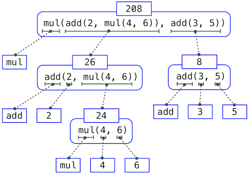
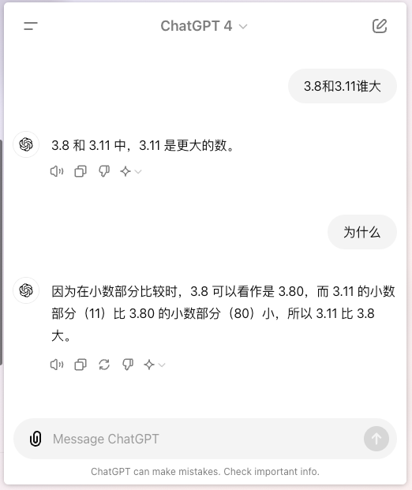
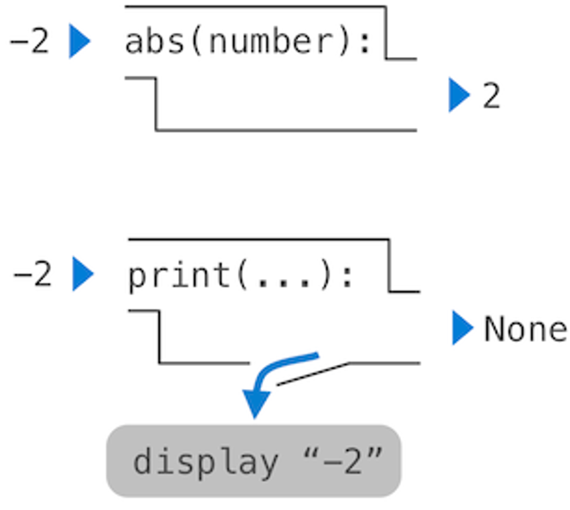

# 3. 程序运行的逻辑 {.center}

::: author-block
张桄玮
:::

::: author-affiliation
中国地质大学(武汉)
:::

# 一个大号计算器 {.center}

## 表达式和调用()

打开交互式的窗口

-   大号计算器
    -   计算 $1+1$?
    -   计算$2^{64}$, $2\times 255$;
    -   `+, -, *, /, ()`
    -   括号可以嵌套, 中括号/大括号有完全不同的含义
-   函数一样的符号
    -   做什么操作? 怎么做?
    -   参数的顺序很重要

$$
\underbrace{\max}_{\text{operator}}(\underbrace{7.5}_{\text{operand}}, \underbrace{2.5}_{\text{operand}})
$$

## 调用(继续)

``` py
>>> pow(100, 2)
10000
>>> pow(2, 100)
1267650600228229401496703205376
```

数学的运算也是 "函数": $\text{add}(x,y):=x+y$

使用$f(\cdot)$:

-   要多少参数都可以:`max(1,2,3,4)`
-   没有优先级的冲突

``` py
>>> max(min(1, -2), min(pow(3, 5), -4))
-2
```

## 更多的函数: 标准库中

平方根: math库

``` py
>>> from math import sqrt # 从math库把sqrt函数拿过来
>>> sqrt(256)
16.0
```

更多的函数: [Python 文档](https://docs.python.org/3/library/index.html)

## 名字和环境

-   关键: 用名字指示计算对象

``` py
radius = 10
2 * radius
```

-   `=` 赋值(assignment): 用简单的名字指示复合计算过程

电脑要 "记住" 做了怎样的指示: 环境

-   计算对象: 数字, 函数, ...

## 如何阅读复杂的表达式?

当然是 "分而治之" 啦!

{.float-right data-external="1" width="451"}

模式:

-   函数名字 `(` 一堆参数 `,` ...`)`

从最里面的往外读就可以啦!

## 到此为止, 可以写作业啦!

(初中作业)

-   解方程: $ax^2+bx+c=0$ 的求根公式是 $x_{1,2}=\frac{-b \pm \sqrt{b^2-4ac}}{2a}$
-   计算: $\sqrt{4}-\left(\frac{1}{\sqrt{5}+2}\right)^0+(-2)^3 \div 3^{-1}$\

看上去在作弊?

-   回到初衷和目的: 做作业 = 巩固熟练度
-   科技总是有两面性的
    -   另一个好处: 能不能生成合法的表达式, 然后用来自我训练?

## AI的时代: 借AI一臂之力

我是一个希望训练数学计算能力的中学生, 请你给我写一个程序使得我可以训练我的计算能力. 范围包括整数和分数的加减乘除, 带有未知数的字母计算加减乘除, 乘方和除法. 请你写出一个Python程序可以生成这样的习题并给出答案. 注意一定要难一点的. 我要有像 $\sqrt{4}-\left(\frac{1}{\sqrt{5}+2}\right)^0+(-2)^3 \div 3^{-1}$这样比较复杂的式子, 也要有一些一次方程, 二次方程, 带括号的方程的解答.

-   哇, 好神奇
-   但是并不实用: 奇怪的输出, 巨大的数字
    -   甚至它自己都解不出来
-   思考题: 如何让它变实用? (揣摩出题人的意图)

## 警告: AI会产生错误的答案

-   再三验证它给的答案(尤其是数学运算)
-   问 3.8 和 3.11 谁大?



## 纯粹的函数和不纯粹的函数

回顾数学函数:

-   通俗: 把一堆东西(集合$X$)对应到另一堆东西(集合$Y$).
-   对应到谁只由输入的参数决定

往屏幕上面打印东西: 产生了副作用

{.float-right data-external="1" width="31%"}

``` py
print(print(1), print(2))
```

-   会输出什么?

# 定义新函数 {.center}

## 与一般计算器的相同和不同之处

-   数字和算数运算是内置的、"一等公民"
-   可以嵌套, 把基础的运算**组合**起来
-   可以给一个过程一个**名字** (做抽象)

更近一步: 要把一个数$x$**平方**, 就是$x$乘$x$.

. . .

``` py
def square(x):
    return x * x  # 必须要有"缩进"(前面的空格)
```

-   def: definition(定义)
-   return: 经过管道得出来的结果

## 函数定义(暂时)

``` def
def 函数名(传进去的参数, 多个用逗号分隔开):
    return 要得到什么
```

比如求二次函数就再也不用改变量了:

``` py
def solve_quadratic_1(a, b, c):
    return (-b + (b**2-4*a*c)**0.5)/2*a
```

问题

-   并没有检查无解的情况$\Delta=b^2-4ac>?0$ → 控制流语句
-   只能返回第一个解 → 把几个基础数据合成大的

## 问题: 新定义的函数存到哪了?

还是环境里面

``` py
from math import pi
tau = 2 * pi
```

-   要是新定义的函数和旧的函数一个名字咋办?([演示](https://pythontutor.com/render.html#code=f%20%3D%20max%0Amax%20%3D%203%0Aresult%20%3D%20f%282,%203,%204%29%0Amax%281,%202%29&cumulative=false&curInstr=1&heapPrimitives=nevernest&mode=display&origin=opt-frontend.js&py=3&rawInputLstJSON=%5B%5D&textReferences=false))

``` py
f = max
max = 3
result = f(2, 3, 4)
max(1, 2)
```

## 函数里面再调用函数

``` py
def mul(x, y):
    return x * y

def square(x):
    return mul(x, x)

square(30)
```

-   疑惑: "mul"里面没有y啊!([演示](https://pythontutor.com/render.html#code=def%20mul%28x,%20y%29%3A%0A%20%20%20%20return%20x%20*%20y%0A%0Adef%20square%28x%29%3A%0A%20%20%20%20return%20mul%28x,%20x%29%0A%0Asquare%2830%29&cumulative=false&curInstr=0&heapPrimitives=nevernest&mode=display&origin=opt-frontend.js&py=3&rawInputLstJSON=%5B%5D&textReferences=false))

函数的参数只是占位符(虚指)

-   开辟局部的环境, 只在这个函数里面有用
-   把原来的参数名字和值复制到新的帧里面
-   然后开始执行函数的身体, 以这一帧开始

## 查找名字

查找名字: 从近处往远处找第一个对得上的([演示](https://pythontutor.com/render.html#code=from%20operator%20import%20add,%20mul%0Adef%20square%28x%29%3A%0A%20%20%20%20return%20mul%28x,%20x%29%0A%20%20%0Adef%20sum_squares%28x,%20y%29%3A%0A%20%20%20%20return%20add%28square%28x%29,%20square%28y%29%29%0A%20%20%20%20%0Aresult%20%3D%20sum_squares%285,%2012%29&cumulative=false&curInstr=13&heapPrimitives=nevernest&mode=display&origin=opt-frontend.js&py=3&rawInputLstJSON=%5B%5D&textReferences=false))

``` py
from operator import add, mul
def square(x):
    return mul(x, x)
  
def sum_squares(x, y):
    return add(square(x), square(y))
    
result = sum_squares(5, 12)
```

# 控制流 {.center}

## 我们目前只学了三件事

-   把一个东西绑定到一个名字上面: 使用等号`=`
-   函数定义`def ...`
-   函数返回`return`

下一步: 构成 "说明书" – 考虑语句(statement)

-   表达式只要求值就行了
-   语句是被执行的, 不关心返回值
    -   关心的是对于当前环境产生的 "影响"

马上:

-   语句
-   控制流

## 刚刚的程序看着啥样的?

``` py
<header>:
    <statement>
    <statement>
    ...
<separating header>:
    <statement>
    <statement>
    ...
...
```

-   表达式, 返回`return`, 赋值`=`都是语句
-   `def`是一个复合语句: 可以在里面定义新的语句

## 程序的执行

-   要执行一系列的语句, 首先执行第一条语句
-   如果这条语句不修改控制流, 只需要执行下面的语句就行了(如果有的话)

所以就有了刚刚没什么事情从上往下执行的局面...

-   问题: 什么东西会修改控制流?
    -   破坏了从上往下执行?

. . .

-   函数调用!

## 再次回到函数调用 – 更多内容

``` py
def percent_difference(x, y):
    difference = abs(x-y) # 我可以在这里面写更多的语句了!
    return 100 * difference / x
result = percent_difference(40, 50)
```

-   注意这里面`difference`被创建的环境 – 只是在内部!
    -   不会 "污染" 外部的同名的值
-   马上: 更多的语句
    -   只要知道他们怎么~~劫持~~修改控制流就好!

## 做判断: `if`语句

-   如果是红灯, 我就不走了

. . .

``` py
if <expression>:
    <suite>
elif <expression>:
    <suite>
else:
    <suite>
```

-   求一求(`el`)`if`后面的`expression`是不是真的
    -   是真的: 执行后面的`<suite>`, 跳出整个`if`块
    -   是假的: 继续进入下一个`elif`块做判断(另一个机会)
        -   如果已经到了`else`: 直接执行`else`里面的`<suite>` (没救了)

## 例子: 求绝对值

``` py
def absolute_value(x):
    result = None
    if x > 0:
        result = x
    elif x == 0:
        result = 0
    else:
        result = -x
    return result

result = absolute_value(103)
result = absolute_value(-2)
result = absolute_value(0)
```

-   [演示](https://pythontutor.com/render.html#code=def%20absolute_value%28x%29%3A%0A%20%20%20%20result%20%3D%20None%0A%20%20%20%20if%20x%20%3E%200%3A%0A%20%20%20%20%20%20%20%20result%20%3D%20x%0A%20%20%20%20elif%20x%20%3D%3D%200%3A%0A%20%20%20%20%20%20%20%20result%20%3D%200%0A%20%20%20%20else%3A%0A%20%20%20%20%20%20%20%20result%20%3D%20-x%0A%20%20%20%20return%20result%0A%0Aresult%20%3D%20absolute_value%28103%29%0Aresult%20%3D%20absolute_value%28-2%29%0Aresult%20%3D%20absolute_value%280%29&cumulative=false&curInstr=24&heapPrimitives=nevernest&mode=display&origin=opt-frontend.js&py=3&rawInputLstJSON=%5B%5D&textReferences=false)

## 判断真与假

欢迎来到布尔变量的世界!

-   最基础地, 真: `True`; 假: `False`.
-   比较运算符: `> < >= <= == !=`
-   连接: `and or not`

求值过程

-   `<left> and <right>` : 看左边: 如果真, 直接返回右边; 如果假, 返回假
-   `<left> or <right>`: 看左边: 如果真, 返回真; 如果假, 返回右边
-   `not <op>`: 是真返回假; 是假返回真.

## 警告: `if...elif`还是`if...if...`?

-   关键区别: 判定了一个之后就走了, 但是`if...if`判定了之后还会去看下一个

## 循环: 唯一真神

-   上面的好像顶多能判断一下
-   下面的: 解决重复劳动

``` py
while <expression>:
    <suite>
```

while的工作:

-   (1)看一看`while`后面的`<expression>` 的真假性
    -   是真的: 执行一遍`<suite>`, 然后回到第一步
    -   是假的: 继续执行下一条语句

死循环: 比如`while True`

-   按下`Ctrl-C`终止程序的执行

## 警告: 能力越大, 责任越大

-   刚开始经常写出来死循环 → 很正常!
-   调试: 在脑子里想一想哪一点和预期的不一样, 然后改正

例子: 画屏幕的图形(两重循环)

# 数据抽象 {.center}

## 刚才的进度

-   固定多个变量, 以及为他们编写说明书
-   "任意多个变量"...?

分门别类: 内置函数 `type`

## 之一: 列表

基本的元素`list`

-   长度
-   取出第 $i$ 位置的元素

例子: 拿到了全班的成绩单, 90分以上的有几个? ([演示](https://pythontutor.com/render.html#code=def%20count%28s,%20value%29%3A%0A%20%20%20%20total%20%3D%200%0A%20%20%20%20index%20%3D%200%0A%20%20%20%20while%20index%20%3C%20len%28s%29%3A%0A%20%20%20%20%20%20%20%20if%20s%5Bindex%5D%20%3E%3D%20value%3A%0A%20%20%20%20%20%20%20%20%20%20%20%20total%20%3D%20total%20%2B%201%0A%20%20%20%20%20%20%20%20index%20%3D%20index%20%2B%201%0A%20%20%20%20return%20total%0A%0Ascore%3D%5B90,%2095,%2087,%2010,%2099,%2020,%2069,%20100%5D%0Anr_merit%20%3D%20count%28score,%2090%29&cumulative=false&curInstr=13&heapPrimitives=nevernest&mode=display&origin=opt-frontend.js&py=3&rawInputLstJSON=%5B%5D&textReferences=false))

``` py
def count(s, value):
    total = 0
    index = 0
    while index < len(s):
        if s[index] >= value:
            total = total + 1
        index = index + 1
    return total
score=[90, 95, 87, 10, 99, 20, 69, 100]
nr_merit = count(score, 90)
```

## 更多的列表方法

假设`a=[]`

-   `a.append(1)` : 列表`a`, 请你给我追加一个叫`1`的元素
-   ...

## ⚠️可变对象作为参数的时候一定要小心

-   可能在不经意间改变状态([演示](https://pythontutor.com/render.html#code=chinese%20%3D%20%5B'coin',%20'string',%20'myriad'%5D%0Asuits%20%3D%20chinese%0Asuits.pop%28%29%0Asuits.remove%28'string'%29%0Asuits.append%28'cup'%29%0Asuits%5B1%5D%20%3D%20'spade'&cumulative=false&curInstr=0&heapPrimitives=nevernest&mode=display&origin=opt-frontend.js&py=3&rawInputLstJSON=%5B%5D&textReferences=false))
-   我想要复制一份列表怎么办?

``` py
chinese = ['coin', 'string', 'myriad']
suits = chinese
suits.pop()
suits.remove('string')
suits.append('cup')
suits[2] = 'spade'
```

-   没有成功... 共享了一个列表

要复制的话: list(xxx)构造一个新的对象.

## 可迭代的对象

需求: 一个一个地看列表里面的元素

-   可迭代(iteratable)的

``` py
for <name> in <expression>:
    <suite>
```

1.  求一求`<expression>`是个啥(必须是可迭代类型的)
2.  对于每一个里面的元素
    1.  在当前的帧里面把名字`<name>`绑定到当前查看的元素
    2.  执行`<suite>`的过程

-   `range`迭代

## 之二: 字典

字典: 英文到中文

-   抽象: key(英文), value(中文)
-   key → value 会很快

## 之三: 元组(不可变)

-   和列表有点像...

## 之四: 字符串(不可变)

-   用来表示字符...
